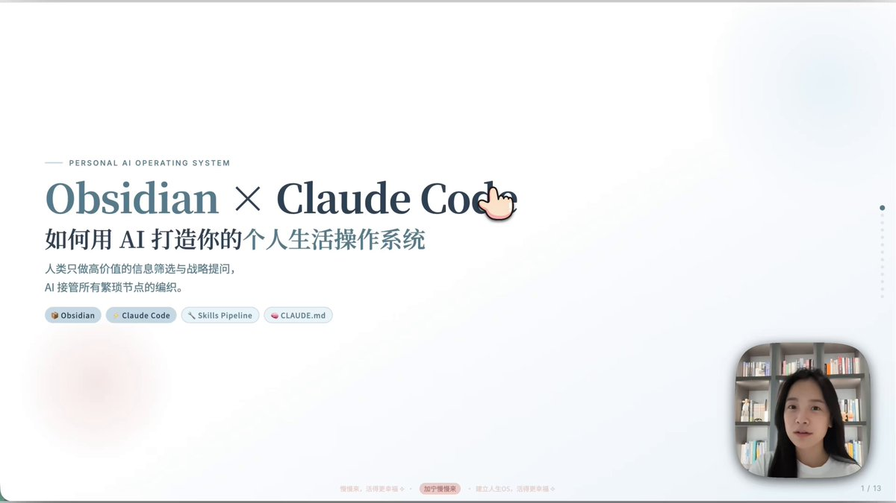

Obsidian + Claude Code = 你的个人生活操作系统 
收藏夹吃灰？笔记太乱？
想拥有 Andrej Karpathy 同款知识管理系统？
这套 Obsidian + Claude Code 的“第二大脑”搭建指南，帮你把死知识变活！👇

1️⃣ 核心架构：三层大脑回路
底层 (Obsidian): 本地存储，Markdown格式，数据主权在你手里。
中层 (Claude Code): AI 思考与行动引擎。它读取 Obsidian 的内容，帮你分析、提取、执行。
顶层 (Skills): 自动化工作流。从 GitHub 下载现成的 Skill，让 AI 自动跑任务。
👉 以前 Obsidian 是静态笔记本，现在它变成了会思考的助手。
2️⃣ 工作流第一步：信息摄入 (Input)
别手动复制粘贴了！
Web Clipper: 浏览器插件，一键保存网页、YouTube 视频（含字幕）、公众号文章到 Obsidian Inbox。
Daily Note: 每天自动生成日记模板，记录睡眠、运动、灵感。
Podwise: 播客转文字，无缝接入知识库。
3️⃣ 工作流第二步：AI 分析与处理 (Process)
这是 Claude Code 发威的地方！
/todo 命令: AI 扫描你的日记和上下文，自动生成“艾森豪威尔矩阵”（重要/紧急），帮你排好今日任务。
/weekly learning: 每周复盘。AI 分析你一周的笔记，提取认知改变、盲点和新想法。
/summary: 和 AI 聊完天，一键总结对话精华，存入知识库，不浪费任何灵感。
4️⃣ 工作流第三步：整理与检查 (Organize)
/lint 命令: 定期给知识库做体检。AI 检查概念定义是否冲突、有没有孤岛笔记（没链接的笔记），生成健康报告。
知识沉淀: AI 自动把 Inbox 里的碎片信息，整理成 Concepts（概念）和 Summary（摘要），形成结构化知识网。
5️⃣ 一人 IP 创作系统 (Bonus)
这套逻辑同样适用于做自媒体！
Step 1: 全网选题扫描，收集 Input。
Step 2: Claude 分析创作库，发现读者真正需要的内容（笔记数据分析）。
Step 3: AI 辅助 SOP，自动生成初稿，你只做精修和判断。
6️⃣ 高手心得 (Key Takeaways)
一个入口 (Inbox)，多个终点。
结构够用就行，别追求完美分类。
AI 建议，你拍板。
对话也是知识，记得用 /summary 保存。
不绑定任何工具，AGENTS.md 兼容多种 Agent。

Obsidian 负责“记”，Claude Code 负责“想”和“做”。
人类只做高价值的筛选与决策，AI 接管所有繁琐节点的编织。

### 🖼️ Attached Media

## 💬 Replies

### 1 @AdrianPunk115 (Adrian Punk)

*Sun Apr 26 10:55:24 +0000 2026*

@VincentLogic 之前觉得Obsidian只是一个存储知识的数据库，现在连上Claude code，加上合适的Skiils，知识便可以进去激活。
输入、整理、复盘、输出整理成一个完整的闭环，对内容创作者来说太好用了

### 2 @Rolexyekc (Rolex)

*Sun Apr 26 03:00:47 +0000 2026*

@VincentLogic 这个笔记系统也可以用simplenote来实现,这个简单

### 3 @Vincent_AINotes (Vincent) (Author)

*Sun Apr 26 07:35:17 +0000 2026*

@Rolexyekc 👍

### 4 @huoshan007 (火山哥🕊️)

*Sun Apr 26 09:48:01 +0000 2026*

@VincentLogic 这套方案看着是真的爽，但到我手上估计连Inbox都填不满。

### 5 @ysongtwitt (Yang Song 🤖)

*Wed Apr 29 10:52:33 +0000 2026*

@VincentLogic the original vid did not mention but useful community plugin on #obsidian: [github.com/YishenTu/claud…](https://github.com/YishenTu/claudian#)

### 6 @Zingo927 (Zing)

*Sun Apr 26 08:18:55 +0000 2026*

@VincentLogic @grok 以上提到哪些obsidian插件，列给我

### 7 @kanazawadeaga (じげん@金沢のハゲ破局🦲 AGA治療5年目)

*Sun Apr 26 18:24:35 +0000 2026*

@VincentLogic @grok 日本語で分かりやすくたのむ！

### 8 @leohxj (leohxj)

*Sun Apr 26 05:15:09 +0000 2026*

@VincentLogic 这套方案在移动端怎么解决？

