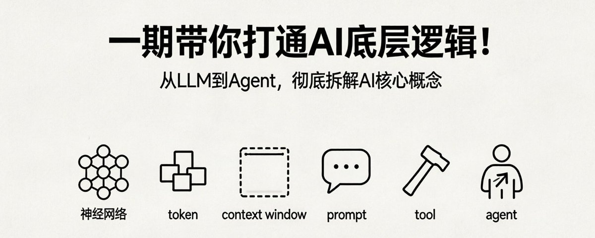

# 📰 一文彻底打通AI底层逻辑：从LLM到Agent，所有核心概念拆解透彻

> 导语：AI圈每天都在冒新名词——LLM、token、context、prompts、tool、mcp、agents、agent skill... 你真的能准确说出每个概念的确切含义吗？这是一篇从工程视角出发的硬核解析，没有虚头巴脑的商业概念，只有最底层的技术真相。看完这篇，你对AI的理解将上升一个台阶。

## 一、最底层：LLM大语言模型

LLM（Large Language Model），即大语言模型，是当前所有AI技术的核心引擎。市面上几乎所有大模型都基于Transformer架构训练而成。

- 历史脉络：Transformer架构由Google团队在2017年提出（论文《Attention Is All You Need》），但真正引爆全球的是OpenAI。

- 里程碑事件：2022年底：GPT-3.5横空出世，首个真正达到可用级别的大模型
2023年3月：GPT-4发布，将AI能力天花板拉到新高度
如今：GPT家族仍是标杆，但Claude、Gemini等后起之秀已在各自领域同台竞技

大模型的本质是什么？
极其朴素：一个文字接龙游戏。
举例：当问"马克的视频怎么样？"，模型会：

1. 预测下一个概率最高的词："特别"

1. 将"特别"追加到输入后，再预测下个词："得"

1. 继续追加，预测："棒"

1. 最终输出完整回答："特别的棒"

这就是为什么大模型一个词一个词地输出答案——这是它最底层的运作机制。

## 二、大模型的"翻译官"：Token与Tokenizer

大模型本质是数学函数，只认数字不认文字。Tokenizer就是人类与模型间的翻译官，负责编码（文字→数字）和解码（数字→文字）。

Token切分过程：

1. 切分：将文本拆成最小片段（token）

1. 映射：将每个token对应到数字（token ID）

关键认知：Token ≠ 词语

- 中文例子："程序员"被拆成"程序"+"员"两个token

- 英文例子："helpful"被拆成"help"+"ful"两个token

- 极端情况：一个特殊字符可能需要3个token表示

经验值：

- 1个token ≈ 0.75个英文单词

- 1个token ≈ 1.5\~2个汉字

- 40万token ≈ 60\~80万汉字（相当于一本厚书）

## 三、临时记忆体：Context与Context Window

Context（上下文） = 大模型每次处理任务时接收到的信息总和，包括：

- 用户当前问题

- 对话历史

- 正在输出的token

- 工具列表

- System prompt等

Context Window = Context能容纳的最大token数量

- GPT-4.5：105万token

- Claude 3.1 Pro：100万token

- Cloudopus 4.6：100万token

100万token ≈ 150万汉字，足以装下《哈利波特》全集。

实战问题：如何处理超长文档？

当面对上千页的产品手册时，不可能全塞给模型。解决方案：RAG技术（Retrieval-Augmented Generation）

- 从文档中抽取与问题最匹配的片段

- 只将相关片段发给模型

- 既突破context window限制，又控制成本

## 四、指令的艺术：Prompt工程

Prompt = 给大模型的具体问题或指令

- User Prompt：用户输入的问题（如"帮我写一首诗"）

- System Prompt：开发者配置的人设和规则（用户不可见）

案例对比：

模糊Prompt："帮我写一首诗"
→ 可能生成现代诗、打油诗，不符合预期

精准Prompt："请帮我写一首五言绝句，主题是秋天的落叶，风格要明亮一点"
→ 生成内容精准符合需求

System Prompt的力量：
配置："你是一个耐心的数学老师，不要直接给出答案，要引导学生思考"
当学生问"3+5=几？"，模型会回答：
"可以这样想：你手里有3个苹果，又拿了5个，现在一共有多少个？可以数一数。"
而非直接说"8"。

> 行业真相：Prompt Engineering曾很火，但现在提的人越来越少。原因有二：门槛太低：本质就是"把话说清楚"
模型变强：即使提示模糊，也能猜出意图

## 五、感知世界的钥匙：Tool与MCP

大模型的致命弱点：无法感知外界环境
问"今天上海天气如何？"，模型会回答："抱歉，我无法获取实时天气信息"

解决方案：Tool（工具）

- Tool本质是一个函数：输入参数 → 执行操作 → 返回结果

- 例如天气查询工具：输入（城市+日期） → 调用气象接口 → 返回天气数据

完整工作流程：

1. 用户问题发给平台（传话筒）

1. 平台将问题+可用工具列表发给大模型

1. 大模型分析后生成工具调用指令

1. 平台调用对应工具

1. 工具返回结果给平台

1. 平台将结果发给大模型

1. 大模型整理成自然语言回答用户

角色分工：

- 大模型：选择工具 + 汇总结果

- 工具：执行具体操作

- 平台：串联整个流程

痛点：每个平台工具规范不同

- ChatGPT需按OpenAI规范接入

- Claude需按Anthropic规范接入

- Gemini需按Google规范接入
→ 同一个工具要写三遍代码

终极解决方案：MCP（Model Context Protocol）

- 全称：模型上下文协议

- 本质：统一的工具接入标准

- 价值：工具开发者只需按MCP规范写一次代码，即可在所有支持MCP的平台使用
→ 类似手机统一用Type-C接口

## 六、自主智能体：Agent与Agent Skill

Agent = 能自主规划、调用工具、持续工作直至完成任务的系统
复杂任务示例："今天我这里天气怎么样？帮我查附近有没有卖雨伞的店"

Agent工作流程：

1. 调用定位工具获取经纬度

1. 调用天气工具查询天气

1. 根据天气结果（如下雨），调用店铺工具搜索雨伞店

1. 综合所有信息给出最终答案

痛点：每次都要重复输入个人规则
例如出门助手场景：

- 下雨带伞、光照强戴帽子、空气差戴口罩...

- 要求回答格式："先总结，再列带原因的物品清单"

解决方案：Agent Skill

- 本质：提前写好给Agent看的说明文档（Markdown格式）

- 结构：元数据层：名称(name)+描述(description)
指令层：目标、执行步骤、判断规则、输出格式、示例

创建Agent Skill实操：

1. 在.cloudskills目录新建文件夹（名称=skill名）

1. 文件夹内创建SKILL.md文件（注意：必须大写）

1. 写入完整指令内容

1. Agent在匹配时自动加载执行

案例效果：
输入"我要出门了，告诉我要带什么"
Agent自动：

- 调用定位工具

- 调用天气工具

- 按预设规则判断需带物品

- 按指定格式输出结果

## 七、完整知识体系

核心概念关系：

- LLM = 核心引擎

- Token = 数据处理基本单元

- Context = 临时记忆体（内容单位是token）

- Context Window = 记忆体容量上限

- Prompt = 具体指令（分User/System两类）

- Tool = 感知外部世界的函数

- MCP = 统一工具接入标准

- Agent = 自主规划+工具调用的系统

- Agent Skill = Agent的说明书

## 结语：理解底层，才能驾驭未来

当你真正理解这些底层逻辑，AI圈的新产品、新技术将不再神秘：

- Cloud Code、Codex、Gemini CLI... 本质都是在这个框架下运作

- 无论技术如何迭代，核心原理不变

最后思考：
你之前对哪些AI概念存在误解？看完这篇后，是否对"大模型为什么这样工作"有了更深的理解？欢迎在评论区分享你的认知升级时刻。

> #AI技术 #大模型 #深度学习 #人工智能 #技术解析
原创内容，转载请注明出处。技术细节经实践验证，适合有一定基础的读者深入研读。

### 🖼️ Attached Media

## 💬 Replies

### 1 @chandlerjokerr (chandler X AI | 🔶BNB)

*Tue Apr 07 04:26:20 +0000 2026*

@VincentLogic 马克的技术工坊

### 2 @crypto_fyy (加密魔导师)

*Mon Apr 06 04:44:09 +0000 2026*

@VincentLogic curious what broke first in practice here — infra, incentives, 还是 distribution?

