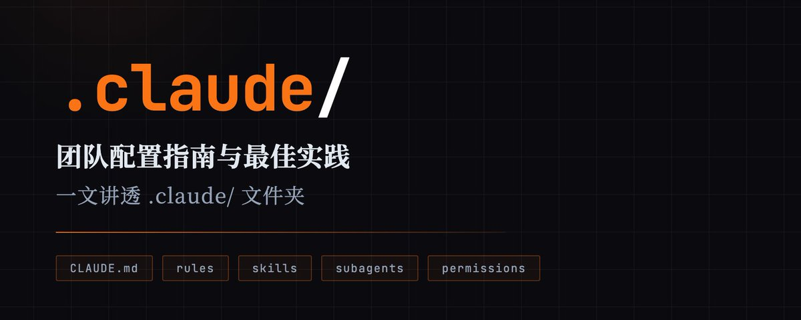

# 📰 一文讲透.claude/文件夹：Claude Code团队配置指南和最佳实践(2026年3月)

有不少的文章把.claude/ 文件夹拆开讲了个遍：CLAUDE.md、规则拆分、斜杠命令、Skills、Subagents、权限边界，该有的都有。

但文章看完，真正落地的时候还是一头雾水：哪些东西应该提交 Git，哪些只能留本机？哪些是"提示词层面的期望"，哪些是"客户端层面的强制"？几个配置叠在一起，优先级到底怎么算？

这篇文章想把这些问题说清楚，但有一点要先说明：Claude Code 迭代很快，具体字段名和语法以 [docs.claude.com](https://docs.claude.com/) 为准，这里讲的是思路和框架。

# 不同目录下的 .claude/

很多人以为 Claude Code 的配置就一个地方，其实它有一套完整的作用域体系，从内到外分四层：组织（policy）、用户（user）、项目（project）、本地覆盖（local）。

实际工作中最常用的是这三个：

项目级（团队共享）：项目目录里的 .claude/——settings.json、rules/、skills/、agents/ 都放这，提交 Git，协作成员行为一致。

用户级（个人全局）：根目录的 \~/.claude/——你的个人偏好和跨项目复用的资产放这，不会影响别人。

本地覆盖（同仓库，仅本机）：.claude/settings.local.json——这个文件默认被 gitignore，用来做个人实验或临时调整权限，不会污染团队配置。

还有一个经常被忽视的区别：\~/.claude.json 和 settings.json 是两个完全不同的东西。前者存的是 UI 状态、会话缓存、登录信息，后者才是行为配置。排查"配置怎么没生效"的时候，先把这两个分清楚。

用文件结构表示的话大概长这样：

\`\`\`bash
your-repo/
├── CLAUDE.md                  # ✅ 团队共享
├── CLAUDE.local.md            # 🟡 本地有效（gitignored）
└── .claude/
    ├── settings.json          # ✅ 团队共享
    ├── settings.local.json    # 🟡 本地有效（gitignored）
    ├── rules/                 # ✅ 团队共享
    ├── skills/                # ✅ 团队共享
    └── agents/                # ✅ 团队共享
\`\`\`

CLAUDE.md：把"每次都要重复说的话"固化下来

用 Claude Code 用得顺了之后会发现，能让 AI 稳定按你期望工作的，不是提示词技巧，而是把"这个项目默认怎么运转"写进一个长期存在的文件。这就是 CLAUDE.md 的用途：每次会话开始时自动注入，承载编码规范、工作流、架构边界。

CLAUDE.md 也有作用域：系统目录（组织级）、./CLAUDE.md 或 ./.claude/CLAUDE.md（项目级）、\~/.claude/CLAUDE.md（用户级）。Claude Code 从你启动会话的目录开始往上遍历，沿途的 CLAUDE.md 全部纳入。

写多长合适

一个实用的经验值：控制在 200 行以内。文件一旦过长，有效信息被稀释，Claude 的遵循度会明显下降。内容膨胀了就拆到 rules 里，或者用 @path/to/import 导入独立文件。

CLAUDE.md 只留"必备命令 + 关键约定 + 容易踩的坑"，长文档按需导入，不要每次会话都背着整本手册跑。

排查

CLAUDE.md 是上下文注入，不是硬性约束。指令含糊或相互冲突时，Claude 未必完全遵循。排查第一步是用 /memory 确认这些文件到底有没有被加载进来。

---

rules：把规范拆成可维护的模块

CLAUDE.md 开始变成"团队 wiki"的时候，把内容迁到 .claude/rules/。一个主题一份 markdown，递归发现，多人维护互不干扰。

rules 有两种加载模式：

没有 paths 的规则：启动时加载，和 CLAUDE.md 类似。

带 paths frontmatter 的规则：只在 Claude 处理匹配路径的文件时触发。比如 API 约定只在 src/api/\*\* 生效，前端组件规范只在 src/components/\*\* 生效，减少无关噪音。

用户级 rules（\~/.claude/rules/）在项目 rules 之前加载，所以项目规则优先级更高，不会被个人偏好覆盖。

---

skills：把重复工作流变成一条命令

CLAUDE.md / rules 解决"Claude 一直知道什么"，skills 解决"Claude 能快速干什么"。创建一个 SKILL.md，就能用 /&lt;skill-name&gt; 手动调用，也可以由模型在任务匹配时自动选择。

几个值得用好的能力：

frontmatter 配置：description 控制自动触发时机；disable-model-invocation 禁止模型自动选用（带副作用的操作建议开启）；allowed-tools 限制这个技能能用哪些工具。

参数化：支持 $ARGUMENTS 等占位符，/fix-issue 123 这类工作流就是这么实现的。

动态上下文注入：技能内容里写 !\`command\`，Claude Code 会先执行这条 shell 命令，把输出插进 prompt 再交给 Claude。/review 直接把 git diff 注入进去，团队几乎零额外操作。

---

subagents：让"重活"在隔离窗口里跑

任务复杂到需要大量检索、阅读、比对的时候，主对话上下文很容易被塞满。subagents 跑在独立上下文里，有独立系统提示词，可以指定工具集，可以单独选模型，结果摘要回传主线程。

文件放在 .claude/agents/（项目级）或 \~/.claude/agents/（用户级）。

适合交给 subagent 的三类任务：

大量文件检索：让 research agent 读文件、跑 grep/glob，只把要点带回主线程。

强约束审查：比如"安全审计 agent 只允许 Read/Grep/Glob，禁止 Write/Edit"，工具权限写在配置里，不依赖 Claude 自觉。

成本控制：可并行、可概括的任务下沉到更快更便宜的模型，主线程留给关键决策。

---

settings.json：安全边界不要靠"希望 Claude 记得"

settings.json 把"能做什么"从提示词期望提升为客户端强制规则。

建议加上 $schema，VS Code、Cursor 这类编辑器会给自动补全和校验。权限规则写错了比代码写错更难察觉。

一个必须知道的安全盲区

Read(./.env) 可以阻止 Read 工具读 .env，但如果同时允许了 Bash，cat .env 照样能读到。Read/Edit 的 deny 规则只约束内置文件工具，不约束 Bash 子进程。真要做路径隔离，需要启用 sandbox。

hooks

某些流程不想靠"希望 Claude 记得"，比如每次 Edit 后强制跑 format，或在执行前拦截危险命令，hooks 在模型循环之外以脚本形式运行，是确定性的。

整体分层思路：

- CLAUDE.md / rules：行为建议与规范引导

- settings.json + sandbox + hooks：安全边界与确定性自动化

- skills / subagents：可复用工作流与上下文隔离

---

一套可以直接用的最小配置

CLAUDE.md

\`\`\`bash
\# 项目说明

\## 常用命令
pnpm dev      # 启动开发
pnpm test     # 跑测试
pnpm lint     # lint/format
pnpm build    # 构建

\## 关键结构
\- 后端：src/server/
\- 前端：src/web/
\- 通用：src/shared/

\## 约定
\- 改动要补测试（明确说明可以不补的除外）
\- 错误处理走 src/shared/logger，禁止随手 console.log
\- 优先修补，不要动不动大重构

\## 容易踩的坑
\- 严格类型检查默认开启
\- 本地测试依赖 Redis（见 docs/dev.md）
\`\`\`

.claude/settings.json

\`\`\`bash
{
  "$schema": "https://json.schemastore.org/claude-code-settings.json",
  "permissions": {
    "allow": \[
      "Bash(pnpm \*)",
      "Bash(git status)",
      "Bash(git diff \*)",
      "Read", "Edit", "Write", "Grep", "Glob"
    \],
    "deny": \[
      "Bash(rm -rf \*)",
      "Bash(curl \*)",
      "Read(./.env)",
      "Read(./.env.\*)",
      "Read(./secrets/\*\*)"
    \]
  }
}
\`\`\`

对网络访问敏感的话，curl/wget 全部 deny，同时配合 sandbox，否则 Bash 里照样能发网络请求。

.claude/rules/api.md

\`\`\`bash
\---
paths:
  \- "src/server/api/\*\*/\*.ts"
\---

\# API 约定
\- 所有 handler 必须做输入校验
\- 对外错误返回统一结构 { data, error }
\- 禁止把内部堆栈直接返回给客户端
\`\`\`

.claude/skills/review-pr/SKILL.md

\`\`\`bash
\---
name: review-pr
description: 审查当前分支相对 main 的改动，输出按文件分组的可执行建议
disable-model-invocation: true
allowed-tools: Bash(git diff \*), Bash(git status), Read, Grep, Glob
\---

\## 变更文件
!\`git diff --name-only main...HEAD\`

\## 详细 diff
!\`git diff main...HEAD\`

请按文件输出：
\- 潜在 bug / 边界条件
\- 安全风险
\- 测试缺口
\- 可维护性建议（只提必要的）
\`\`\`

.claude/agents/code-reviewer.md

\`\`\`bash
\---
name: code-reviewer
description: 专职代码审查员，适合合并前、自测失败、或重构后稳定性检查
tools: Read, Glob, Grep
model: sonnet
\---

你是资深 code reviewer，重点看：
\- 逻辑正确性和边界
\- 可读性、命名、复杂度
\- 并发、权限、注入、资源泄露等风险点

输出要具体到文件和行范围，给出可以直接动手改的建议。
\`\`\`

配置做好之后，你会发现 Claude Code 和团队成员的感觉越来越像。

### 🖼️ Attached Media

## 💬 Replies

### 1 @atodx1 (Antonio)

*Sun Mar 22 15:40:01 +0000 2026*

@akokoi1 给点个赞。另外，我觉得可以出一个小白能看懂的版本。

### 2 @akokoi1 (WY) (Author)

*Sun Mar 22 15:48:32 +0000 2026*

@OpsZywo 😳好的

### 3 @milicajova92072 (milica jovanovic)

*Sun Mar 22 14:39:26 +0000 2026*

@akokoi1 插眼

### 4 @gymnofghj (yunoshima)

*Sun Mar 22 23:48:00 +0000 2026*

@akokoi1 @readwise save thread

### 5 @uu_bruce (Bruce_uu)

*Sun Mar 22 15:29:16 +0000 2026*

@akokoi1 👍👍

### 6 @hooray90848513 (hooray)

*Mon Mar 23 10:49:46 +0000 2026*

@akokoi1 @readwise save thread

### 7 @jumppshot (jumpshot)

*Mon Mar 23 02:09:01 +0000 2026*

@akokoi1 @readwise save thread

