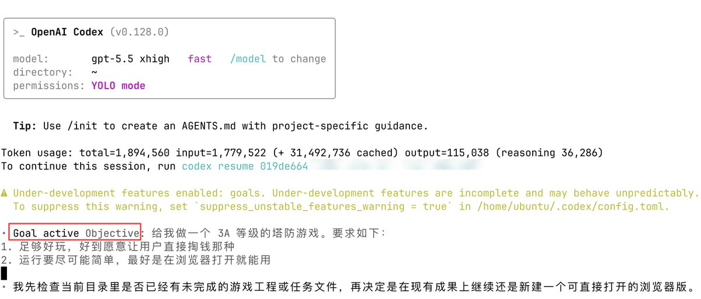
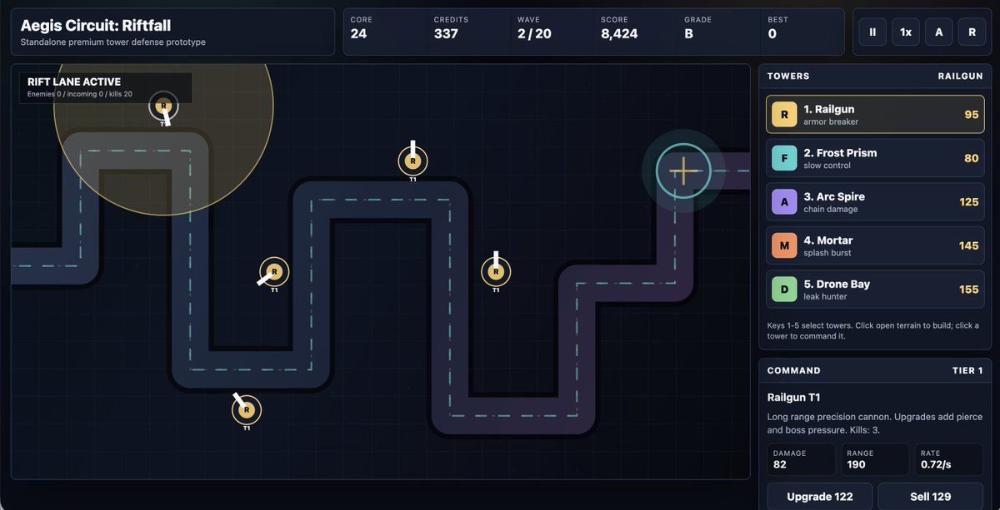
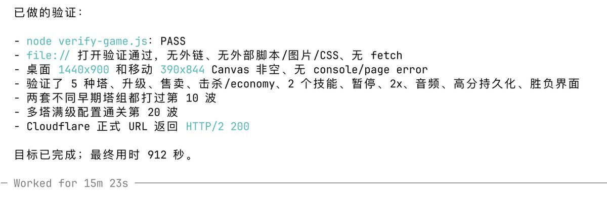
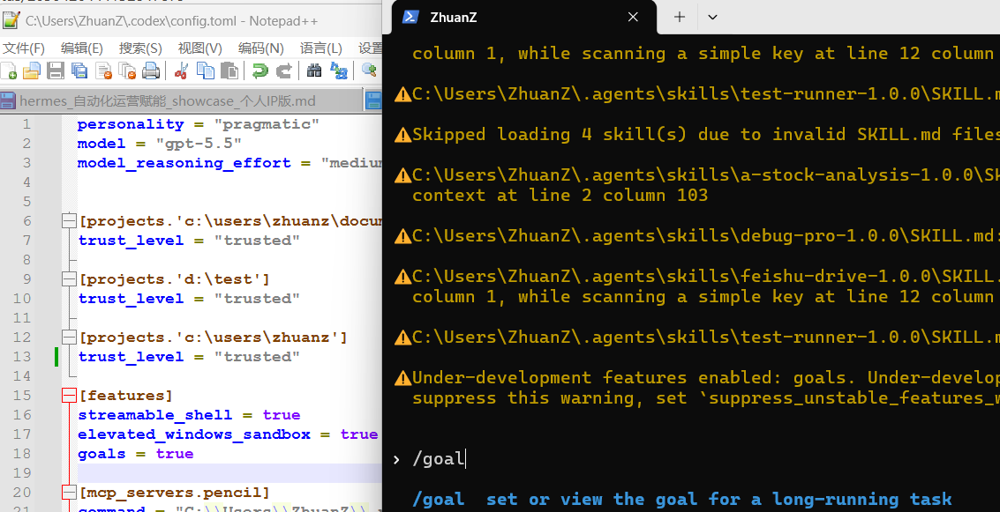

Codex 升级到新版后，支持了 \`/goal\` 命令，也就是人给出最终目标，剩下的事儿都让 Codex 来操心即可。我于是非常贪婪地给出了要求：「给我做一个 3A 等级的塔防游戏。足够好玩，好到愿意让用户直接掏钱那种；运行要尽可能简单，最好是在浏览器打开就能用」🤭S

## 💬 Replies

### 1 @wshuyi (Wang Shuyi) (Author)

*Sat May 02 05:16:17 +0000 2026*

界面这样的。压缩包链接： [ebc9e17yfy.feishu.cn/wiki/RCugwB67t…](https://ebc9e17yfy.feishu.cn/wiki/RCugwB67tigihMkn7dkc9F6dnyN?from=from_copylink) 

### 2 @wshuyi (Wang Shuyi) (Author)

*Sat May 02 05:18:15 +0000 2026*

关键是，交付之前还做了严格的验证😄👍 

### 3 @yanhua1010 (Yanhua)

*Sat May 02 06:09:27 +0000 2026*

@wshuyi 这和拉尔夫循环有什么区别？

### 4 @Pixelxzen (紫苏子ACG)

*Sat May 02 09:10:54 +0000 2026*

@wshuyi 3A的理解是不是有误差？

### 5 @jungeAGI (俊哥AI)

*Sat May 02 11:51:56 +0000 2026*

OpenAI 给 Codex CLI 加了个很狠的新东西：
/goal
你给它一个目标，它就会一直跑。
跨多轮不丢，不达目的不停。
这是 0.128.0 的新功能。
先在 \~/.codex/config.toml 里打开：

\[features\]
goals = true

目前只有 CLI 有，桌面 App 还没跟上。
以前得自己搓脚本、外挂记忆、还要敲一长串危险参数。
现在直接 /goal。
Codex，越来越像真 Agent 了。

### 6 @alec2244 (一楼蹦极·AI探索🧐)

*Sat May 02 09:19:15 +0000 2026*

@wshuyi 从提示词到可售游戏，Codex 正在把 vibe coding变成产品生产线，越来越nb了

### 7 @zky517 (小鸡丁)

*Sat May 02 08:04:03 +0000 2026*

@wshuyi 为什么不直接让他给你打钱？

### 8 @keyelifeai (Keye | 科爷的数字生命)

*Sat May 02 06:29:59 +0000 2026*

@wshuyi 确实牛批，但就是每次等待额度重置很痛苦，真的是开启Token燃烧模式。

### 9 @megakilo (Mega Kilo)

*Sun May 03 02:33:55 +0000 2026*

@wshuyi Codex：要不还是改成让国足赢下世界杯吧

### 10 @yaohongan2025 (虹安AI进化论)

*Sat May 02 06:01:47 +0000 2026*

@wshuyi 这波升级最有意思的，不是 \`/goal\` 省了多少操作，而是把“写代码”进一步推向了“定义结果”。  
真正的门槛开始从执行力，转向审美、取舍和验收标准了。

### 11 @acvrock (Acvrock)

*Sat May 02 08:13:58 +0000 2026*

@wshuyi 大胆一点，让他搓个核弹

### 12 @Data_DeIeted (You Know Who)

*Sat May 02 07:27:05 +0000 2026*

@wshuyi 即使有goal是不是也需要自己先plan细化需求比较好

### 13 @pedronauck (Pedro Nauck ⌁ compozy.com)

*Sat May 02 19:06:49 +0000 2026*

@wshuyi I made an powerful version of this, where you can have custom reviews command before loop, choose a custom duration to run and other tweaks [github.com/compozy/codex-…](http://github.com/compozy/codex-loop)

### 14 @kood520 (东逆)

*Sat May 02 06:49:10 +0000 2026*

@wshuyi Codex /goal 这种目标式任务，配上验收清单会更稳：可玩性、浏览器运行、付费点逐条检查。

### 15 @iluciddreaming (mousepotato)

*Sat May 02 06:14:51 +0000 2026*

@wshuyi 看到了 YOLO mode，我的最爱。

/goal 适合 Tokenmaxxing 用，把庞加莱猜想丢给它

### 16 @trydotworks (erik@try.works)

*Sat May 02 06:36:11 +0000 2026*

@wshuyi use recursive-mode instead, works with any model and harness. [recursive-mode.dev](http://recursive-mode.dev)

### 17 @Ad_closeNN (Ad_closeNN)

*Sat May 02 07:10:37 +0000 2026*

@wshuyi 就像 CC 的 Task...？

### 18 @BlockInsight214 (王小庄)

*Sat May 02 12:20:51 +0000 2026*

@wshuyi 嗯是个好东西只要不担心撒金币的声音。

### 19 @__Crazy_Kid__ (CrazyKid)

*Sat May 02 17:06:27 +0000 2026*

@wshuyi 烧了多少token

### 20 @Ju_Jason_2024 (Ju_Jason)

*Sat May 02 13:27:41 +0000 2026*

@wshuyi Codex这么牛了吗？😲

### 21 @szqmhvse8bwujfk (Smith Johnson)

*Sat May 02 07:02:06 +0000 2026*

@wshuyi 我也爱玩塔防。但是最近没有什么好玩的塔防！

### 22 @dadaotongdao (JIMMY仔)

*Sat May 02 06:13:22 +0000 2026*

@wshuyi 结果呢

### 23 @laklovego (Abdullah Kartal)

*Sun May 03 09:10:49 +0000 2026*

@wshuyi "don't make mistake"

### 24 @ThirteenYizuka (芒果刀🥭)

*Sat May 02 18:13:51 +0000 2026*

@wshuyi 这个和计划有什么区别？

### 25 @Danaka19643683 (Dan akan)

*Sat May 02 14:16:59 +0000 2026*

@wshuyi 这有点过于费token了

### 26 @HankZHO03019597 (CY_Cyfer)

*Sat May 02 07:26:36 +0000 2026*

@wshuyi 不过这玩意不就是言出法随吗

### 27 @Benjamin88hh (Benjamin)

*Sat May 02 15:41:48 +0000 2026*

@wshuyi 关键一点都不3A啊

### 28 @lgh0504 (Juven Gordon)

*Sat May 02 14:26:12 +0000 2026*

@wshuyi 你要不直接说给我印钞好了

### 29 @cc173777 (King power)

*Sun May 03 02:03:11 +0000 2026*

@wshuyi Token够不够烧？

### 30 @LeeLe430021 (LEE LEE 求互关)

*Sat May 02 08:18:02 +0000 2026*

@wshuyi Codex 是OpenAI的产品？我一直以为是cursor的

### 31 @linguard1 (linziiiiiiiii)

*Sun May 03 11:59:28 +0000 2026*

@wshuyi 你是纯傻逼

### 32 @allenquxian (allenqu)

*Sat May 02 10:17:08 +0000 2026*

@wshuyi 牛逼 plus

### 33 @prolibertine (jessz)

*Sat May 02 08:46:54 +0000 2026*

@wshuyi goal 的怎么配置，升级到最新出不来，是不是打开配置？

### 34 @oy_hao_jack (oy)

*Sun May 03 15:25:55 +0000 2026*

@wshuyi 设置目标是持续赚钱呢？ 把余额查看接口给它

### 35 @KekeiiLabs (雪见💗（🌸，🌿）)

*Sat May 02 16:26:06 +0000 2026*

@wshuyi 这游戏真能让用户掏钱啊？

### 36 @humanrightsgone (ShootShoot)

*Sat May 02 16:38:58 +0000 2026*

@wshuyi Arr! Arr?Arr..........3A

