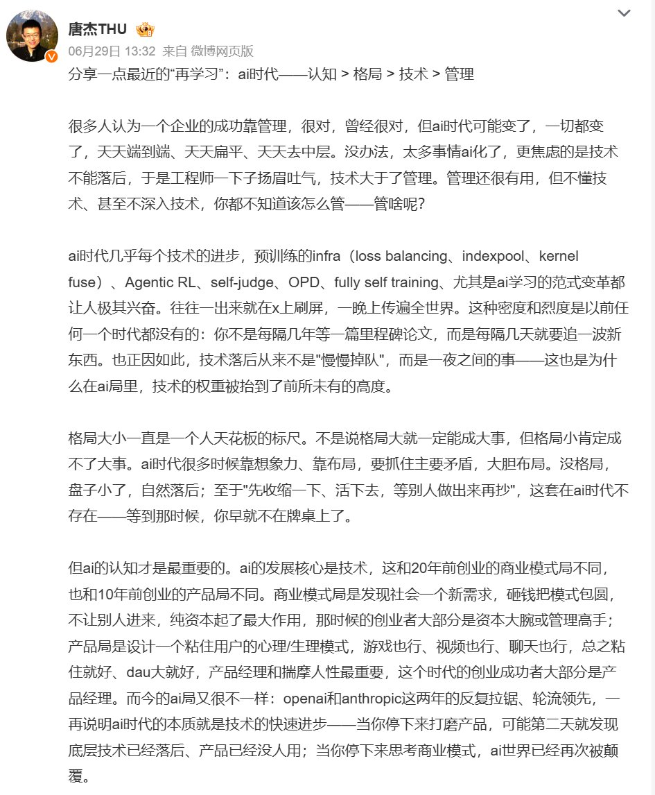
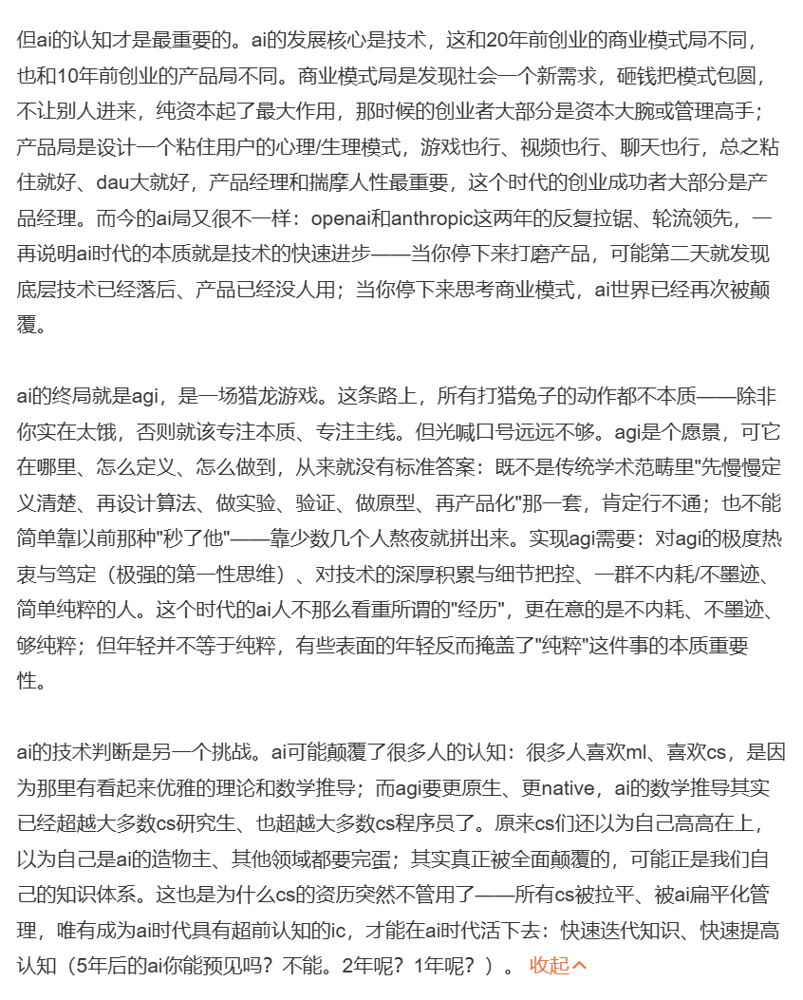

分享一下智谱创始人唐杰老师 @jietang  昨天刚在WB上发的文章吧

AI 时代：认知 &gt; 格局 &gt; 技术 &gt; 管理 

## 💬 Replies

### 1 @Fenng (Fenng)

*Wed Jul 01 08:06:46 +0000 2026*

@Xudong07452910 @jietang 一看就是手写的，都没有用 AI 润色。要不，小写的 ai 应该改成大写才是 😂

### 2 @Xudong07452910 (Xudong Han) (Author)

*Wed Jul 01 08:23:07 +0000 2026*

@Fenng @jietang 哈哈，刚才又通读了一遍，确实都是手敲，真情流露了。

### 3 @haizhong_zheng (Haizhong Zheng)

*Tue Jun 30 15:27:52 +0000 2026*

@Xudong07452910 @jietang 其实挺惊讶管理被排到最后，😂感觉很多公司/team不是没有人才是因为管理问题才崩的

### 4 @Xudong07452910 (Xudong Han) (Author)

*Tue Jun 30 17:51:45 +0000 2026*

@haizhong\_zheng @jietang 我第一反应也是这个。不过仔细想想，可能不是管理不重要，而是看对方向的价值被突然放大了。

### 5 @cuisitekp (卡牌大师崔斯特)

*Tue Jun 30 14:50:45 +0000 2026*

@Xudong07452910 @jietang 认知排第一，这个排序有意思。技术反而是最容易被追赶的

### 6 @Xudong07452910 (Xudong Han) (Author)

*Tue Jun 30 14:57:39 +0000 2026*

@cuisitekp @jietang 技术的半衰期越来越短，今天的优势很可能几个月后就被抹平，认知反而决定了你看见什么、学习什么、下注什么

### 7 @Guluhehe (李简AI)

*Wed Jul 01 05:00:50 +0000 2026*

@Xudong07452910 @jietang 内容很干 管理这个排序倒是很新奇 🤔 有机会应该可以后验看下

### 8 @Xudong07452910 (Xudong Han) (Author)

*Wed Jul 01 07:16:05 +0000 2026*

@Guluhehe @jietang 看看后续智谱的表现，是不是知行合一。

### 9 @myanTokenGeek (孟岩-Mike Meng)

*Wed Jul 01 00:25:43 +0000 2026*

@Xudong07452910 @jietang 这个文章，如果是一家在硅谷的公司创始人写的，我会钦佩他的认知，但一家在国内正在狂吃新三线建设红利、市值泡沫水漫金山的公司的创始人这个时候想这些问题，那就未免太轻飘飘了。他还是要多考虑政治问题：你现在被抬到这么高，又面对那么一个刻薄寡恩、翻脸无情的体制，你将来打算怎么平安落地？

### 10 @WEEXAILabs (WEEX AI Labs)

*Wed Jul 01 02:42:52 +0000 2026*

@Xudong07452910 @jietang 一针见血的…认知决定上限

### 11 @pan_tokenpocket (pan🦇🔊)

*Wed Jul 01 04:38:16 +0000 2026*

@Xudong07452910 @jietang 非AI时代就不是这样吗🤣

### 12 @agiwebsite (Vibe Monkey 😂)

*Wed Jul 01 01:11:19 +0000 2026*

@Xudong07452910 @jietang 我觉得这篇文章不是写给我看的

### 13 @rickZho84524258 (瑞克爱投)

*Wed Jul 01 14:41:56 +0000 2026*

@Xudong07452910 @jietang "技术不是慢慢掉队，是一夜落后"这句最扎心。

传统行业里落后有缓冲期，AI 里没有——你停下来打磨的那一刻，底层范式可能已经换了。

所以认知排第一是对的：技术会过时，但持续升级认知的能力不会。管理者不下场碰技术，迟早会变成"不知道自己该管什么"的那批人。

### 14 @AgiRay1015 (AI磊叔)

*Wed Jul 01 00:52:14 +0000 2026*

@Xudong07452910 @jietang 不必惊讶为啥管理放在最后，代入上下文和背景就合乎逻辑了：

唐杰老师首先是一位科学家，其次才是企业家。

科学家和企业家的思维方式是完全不同的。

### 15 @wenjzsxx (Wen j)

*Wed Jul 01 03:20:15 +0000 2026*

@Xudong07452910 @jietang 现实的变革，举步维艰进展缓慢，再高的认知也换不来2X的倍速，认知走进实际，实际调整认知，企业个人转型都是按需索取，AI就像是供水系统，进入末端有人烧茶水，有人洗衣水，有人洗澡水...

### 16 @XYeal_W (XYeal)

*Wed Jul 01 04:26:08 +0000 2026*

@Xudong07452910 @jietang 给我看乐了，mark一下，等几年才来看

### 17 @freedom21166 (福瑞德木)

*Wed Jul 01 01:49:57 +0000 2026*

@Xudong07452910 @jietang 现在又开始追着别人的屁问问香臭了

### 18 @coldsake_ (一盏寒清 Linote 🎃🍷🥃🍸🍹🍶)

*Tue Jun 30 20:31:07 +0000 2026*

@Xudong07452910 @jietang 管理大概不该被纳入这个排序里，它和其他三个不在一个维度里。前三者都能一定程度的影响管理，最终通过管理映射在组织的净收益上。

但是没有技术和格局，又何来认知呢？

### 19 @YuGao75474144 (Garyc Gao)

*Wed Jul 01 05:07:35 +0000 2026*

@Xudong07452910 @jietang “管理还是很有用的，但是不深入技术、不了解技术，你都不知道怎么管———管啥呢？”

### 20 @yyz81681981 (鱼小圈 YuLoop)

*Wed Jul 01 03:01:23 +0000 2026*

@Xudong07452910 @jietang CS 人其实也不一定安全。AI 不是只去改造别的行业，它第一个重写的可能就是 CS 自己的知识体系。能不能快速更新认知，反而比“我原来学过什么”更重要。

### 21 @fengzi2016China (AI Product Observer)

*Wed Jul 01 06:50:44 +0000 2026*

@Xudong07452910 @jietang 感觉还是有点抽象了，什么是纯粹

### 22 @stargazer2022_ (stargazer)

*Thu Jul 02 03:09:21 +0000 2026*

@Xudong07452910 @jietang 没有政府背书+国家队的基础，认知、格局、技术、管理不值一提。

### 23 @No_Body_Know123 (Marco Wang)

*Wed Jul 01 06:53:28 +0000 2026*

@Xudong07452910 @jietang 想起那句老话，胆识第一，见识第二，学识第三。

### 24 @shekf5 (shekf)

*Wed Jul 01 02:04:29 +0000 2026*

@Xudong07452910 @jietang 认知第一位，AI好比贤臣，只有遇到明君才能发挥最大功效

### 25 @HuangF15075 (Kudomick)

*Wed Jul 01 05:58:28 +0000 2026*

@Xudong07452910 @jietang 我认为共产主义才是人类的终局，诸位觉得我格局如何？

### 26 @suenleon1 (Suenleon)

*Wed Jul 01 08:15:11 +0000 2026*

@Xudong07452910 @jietang 唐老师竟然是我十年前就关注的人！

### 27 @cjtong_X (cjtong)

*Wed Jul 01 00:02:06 +0000 2026*

@Xudong07452910 @jietang 资金为何没在里面？

### 28 @Michaeltnns (Michael)

*Wed Jul 01 07:25:00 +0000 2026*

@Xudong07452910 @jietang AI时代一切已知的知识变得不再有壁垒

### 29 @davidsouza676 (来用兵-纸上用兵)

*Wed Jul 01 08:30:03 +0000 2026*

@Xudong07452910 @jietang 互关提效别只靠手动，试试X互关互动神器SoPilot插件，找同频、促互动更顺手：[effectivecpmnetwork.com/p0a95n7zih?key…](https://www.effectivecpmnetwork.com/p0a95n7zih?key=edbfa7ed53f73cc98b472c4d82fe00fc)

### 30 @SmithYoholo (SmithYo)

*Wed Jul 01 03:18:56 +0000 2026*

@Xudong07452910 @jietang 拜读了 一起加油 互关

### 31 @DavisNc9527 (Davis.AI.Explorer)

*Wed Jul 01 02:34:22 +0000 2026*

@Xudong07452910 @jietang 唐老师的文章值得多次阅读，有个疑问，如何提高认知和打开格局呢？有大佬解答下吗

### 32 @zuopiezi (Pan's)

*Wed Jul 01 00:59:36 +0000 2026*

@Xudong07452910 @jietang 他有没有提及 冰川例子

### 33 @NovatoJun (Allonsy-鬼鬼)

*Thu Jul 02 09:06:33 +0000 2026*

@Xudong07452910 @jietang 认知决定努力的方向，格局判定方向大小

### 34 @sh_fathead_fish (要饭党的天敌)

*Wed Jul 01 04:54:24 +0000 2026*

@Xudong07452910 @jietang 又开始吹牛了

### 35 @Air10YK (Air10Y)

*Wed Jul 01 04:34:09 +0000 2026*

@Xudong07452910 @jietang 这种帖子，AI能给我写出来十份，写的比他还好

### 36 @zhaojl (David Zhao)

*Thu Jul 02 06:13:59 +0000 2026*

@Xudong07452910 @jietang 说实话，我没看出这个“认知 &gt; 格局 &gt; 技术 &gt; 管理”的逻辑在哪里。AI是一个工具不是哲学，就象互联网一样，AI可能改变生活工作的方式，但大可不必把它神话。

