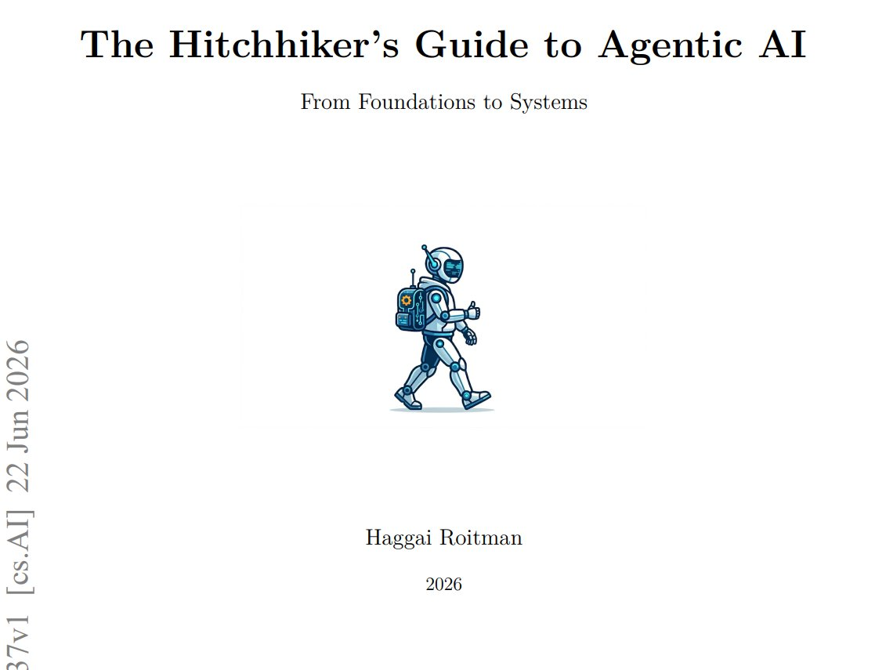

推荐一本免费的 AI 书：《Agentic AI 漫游指南》。

我刚开始读，感觉它和很多「AI 入门指南」不太一样。

虽然也有基础知识，但作者明显没有把主要篇幅放在那些已经被反复讲过的概念上，而是一路讲到强化学习 RL、推理 Reasoning、评测 Evaluation，最后才进入 Agentic AI。

所以它更像一本帮你理解 AI 工作机制的书，而不是一本教你「怎么用 AI 工具」的操作手册。

如果你已经不满足于只会用 ChatGPT、Claude、Cursor，想进一步理解 AI 为什么能推理、怎么被训练、如何被评测，以及 Agent 到底是怎么跑起来的，这本书挺值得收藏。

[arxiv.org/pdf/2606.24937](https://arxiv.org/pdf/2606.24937)

### 🖼️ Attached Media

## 💬 Replies

### 1 @suen_gpt (CreatAlpha)

*Tue Jun 30 08:50:22 +0000 2026*

@Xudong07452910 英文版的看着好麻烦对英文不好的人来说，有没有一种办法能改成中文版

### 2 @Xudong07452910 (Xudong Han) (Author)

*Tue Jun 30 09:00:13 +0000 2026*

@suen\_gpt 这个书太新了，出来没几天，得等等一段时间看有哪个好心人把它翻译了

### 3 @godhatesloser (evil white guy)

*Tue Jun 30 04:56:07 +0000 2026*

@Xudong07452910 你看完了吗

### 4 @Xudong07452910 (Xudong Han) (Author)

*Tue Jun 30 07:29:36 +0000 2026*

@godhatesloser 我还在看哈，书非常新

### 5 @WanWu70 (万物)

*Tue Jun 30 03:00:11 +0000 2026*

@Xudong07452910 终于有人把 RL 和 Reasoning 讲进来了，不想只当 ChatGPT 的提线木偶。

### 6 @GYLQ520 (孤桜ETH)

*Thu Jul 02 11:23:58 +0000 2026*

@Xudong07452910 免费AI书mark了马上看

### 7 @yangjoker1 (Bob Chan)

*Wed Jul 01 14:29:51 +0000 2026*

@Xudong07452910 以前我可能会害怕看全英文，但是我现在有一点英语基础再加上ai辅助我挑战一下

### 8 @clarence_spark (小简)

*Wed Jul 01 05:15:39 +0000 2026*

@Xudong07452910 巧了，我前天翻译了这本。晚上回去发上来

### 9 @dashinash1 (dashinash)

*Tue Jun 30 03:52:20 +0000 2026*

@Xudong07452910 @grok 这本书怎么样？

