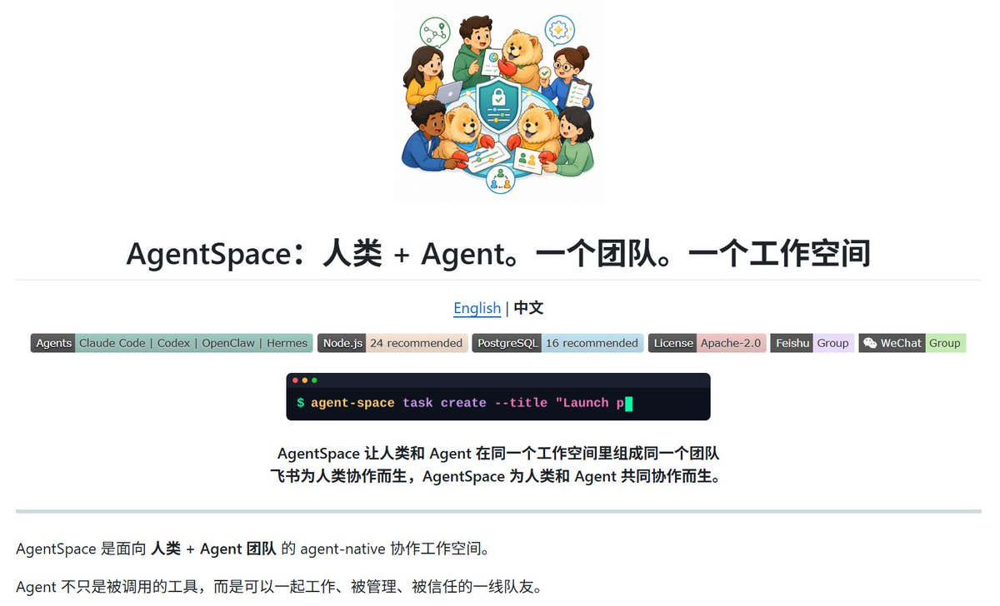

🤝 开源项目推荐：AgentSpace —— 人机共创，一站式协作工作空间

AgentSpace 是香港大学出品的开源框架，核心理念是 “Human + Agents. One Team. One Workspace”。它将 AI 智能体从“个人工具”升级为“数字员工”，与人类共同协作，支持角色定义、权限审批、审计追踪，实现企业级治理。

✨ 核心亮点：
1\. 数字员工看板：展示角色、技能、归属，可借用、共享
2\. 权限控制中心：资源/角色/审批一览，支持 Google Workspace 授权委托
3\. 多智能体协作：任务分解、审批流、输出持久化
4\. AgentRouter 统一调度：自动选择 Claude Code、Codex、OpenClaw、Hermes 等运行时，保持上下文一致
5\. 支持飞书、Slack 等外部渠道集成，远程守护进程（daemon）支持本地/云端部署
6.. 提供简体中文 README，兼容 OpenAgent 标准导出智能体身份卡

该项目是把人机协作提升到“共享工作空间 + 企业级治理”层面，特别适合初创团队、研发组织和需要 AI 辅助但保留人工控制的场景。
[github.com/HKUDS/AgentSpa…](https://github.com/HKUDS/AgentSpace)h
#AIAgent #多智能体 #codex #ClaudeCode #开源项目

### 🖼️ Attached Media

## 💬 Replies

### 1 @ajs6888 (安叫兽|Bird🕊️ 🔶 BNB)

*Thu Jul 23 07:21:24 +0000 2026*

@Xudong07452910 权限审批和审计这块挺适合团队场景了

### 2 @Xudong07452910 (Xudong Han) (Author)

*Thu Jul 23 09:55:04 +0000 2026*

@ajs6888 是的，非常适合

### 3 @QCodecc (QCode)

*Thu Jul 23 00:40:49 +0000 2026*

@Xudong07452910 企业场景卡多agent的往往不是能力，是审批留痕——出了问题得说清楚是哪个agent在哪一步、谁点头放行的，这条链条补不上，再强的能力也上不了生产环境。

### 4 @Xudong07452910 (Xudong Han) (Author)

*Thu Jul 23 09:54:46 +0000 2026*

@QCodecc 赞成你的说法，所以项目中的权限控制中心这个流量我很喜欢

### 5 @php_martin (Martin)

*Thu Jul 23 06:38:00 +0000 2026*

@Xudong07452910 数字员工不是多几个代理，审批、审计和责任归属才决定能否进企业

### 6 @Xudong07452910 (Xudong Han) (Author)

*Thu Jul 23 08:21:02 +0000 2026*

@php\_martin 是的，这方面很多企业已经在推进数字员工这件事了

