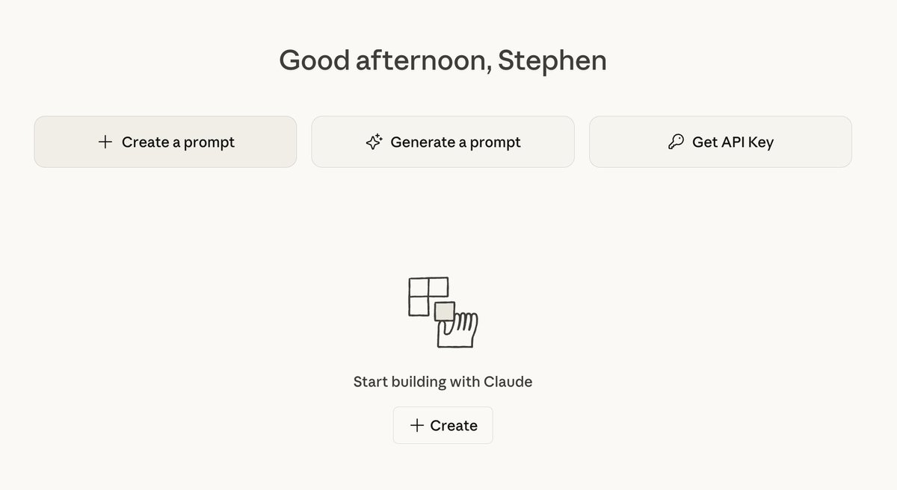

今天才发现 #claude 提供了官方的生成提示词的工具，非常好用。
[platform.claude.com](https://platform.claude.com/) 

## 💬 Replies

### 1 @BTC__Sunny (🌞Sunny哥)

*Tue Dec 09 21:28:42 +0000 2025*

@AIPMLogi 这么方便……

### 2 @yahaclass (YAHA學堂) (Author)

*Wed Dec 10 00:21:11 +0000 2025*

@BTC\_\_Sunny 是的 生成的提示此很专业

### 3 @lambdawins (Lambda)

*Tue Dec 09 04:42:53 +0000 2025*

@AIPMLogi 有空试试看，Claude出品应该会很棒

### 4 @yahaclass (YAHA學堂) (Author)

*Tue Dec 09 07:14:20 +0000 2025*

@lambdawins 是的 从输出看 比我的提示词质量好

### 5 @lee1221ee (lee1221ee)

*Tue Dec 09 20:09:30 +0000 2025*

@AIPMLogi 已經用一年以上了🤣好用

### 6 @yahaclass (YAHA學堂) (Author)

*Wed Dec 10 00:20:51 +0000 2025*

@lee1221ee 我浪费了一年的好时光

### 7 @MrGafish (Mr Gafish | 鱼哥)

*Tue Dec 09 04:32:52 +0000 2025*

@AIPMLogi 满足你的情绪价值

### 8 @chengchuan123 (chengchuan)

*Sun Dec 14 11:28:38 +0000 2025*

@AIPMLogi 请问您的API怎么充值的呢

### 9 @lwh677893857884 (lwh)

*Tue Dec 09 08:41:03 +0000 2025*

@AIPMLogi 发现这个功能好像要付费才可以使用

