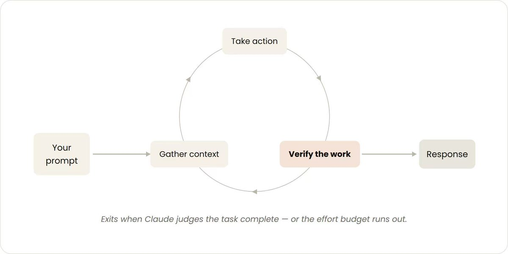
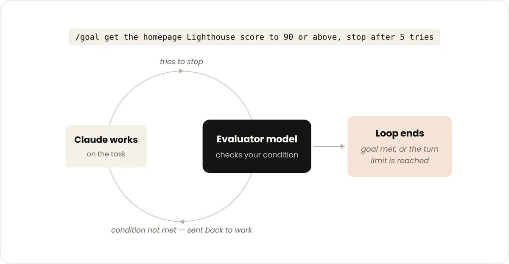
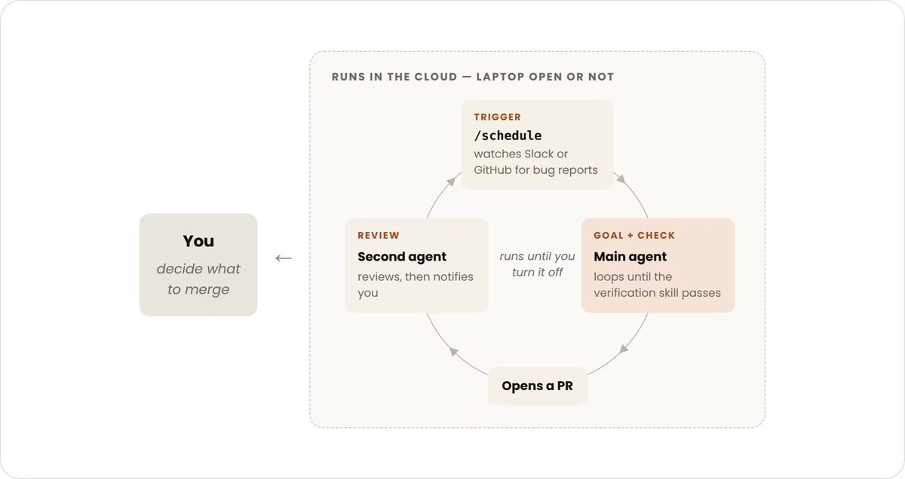
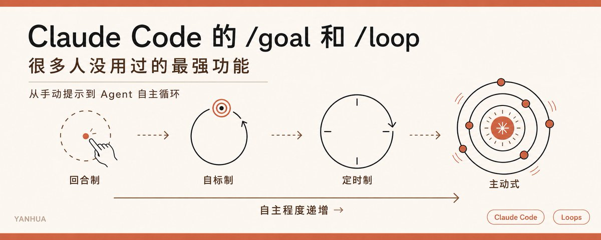

# 📰 Claude Code 的 /goal 和 /loop，很多人没用过的最强功能

Claude Code 团队刚发了一篇博客，标题很不起眼，叫“Getting started with loops”。

我完整看完了，发现里面藏着一个我认为被严重低估的信号：AI 编程的核心操作单元，正在从“一次对话”变成“一个循环”。

什么叫 loop？Claude Code 团队给了一个干净的定义：

Agent 重复执行工作循环，直到满足停止条件。

听起来平平无奇，但仔细想，这和你平时用 Claude 的方式完全不同。你现在的用法大概率是：写 prompt，等回复，看结果，不满意就再写一条，每一步都是你在驱动。

Loop 的意思是：你不再逐步驱动，你设计一个循环结构，定义好触发条件和退出条件，然后 Agent 自己跑。

这不是微调，这是一种操作范式的切换。

## 四种循环，四种放手程度

Claude Code 团队把 loop 分成四类。我觉得最有意思的不是分类本身，而是它们背后暗含的一条线：你愿意把多少控制权交给 Agent。

1\. Turn-based Loop（回合制）

你发一条 prompt，Claude 读代码、改代码、跑测试、返回结果，然后你检查，再发下一条。

这就是大多数人现在的用法。

严格来说它也是 loop，因为 Claude 内部确实在"读取-行动-验证"地循环，但触发和停止都由你控制。

提效关键：别让 Claude 改完代码就报告“完成了”，用 SKILL.md 把你的验证步骤编码进去。比如：改了前端组件，必须启动 dev server、截图前后对比、检查控制台零报错，现在是Claude 自己跑完这些检查再交活。

这一步很多人跳过了，但它是后面所有高级 loop 的基础，因为如果 Claude 连自我验证都做不好，你给它再多自主权也没用。

2\. Goal-based Loop（目标制）

用 /goal 命令定义成功标准，Claude 会反复迭代，直到达标或者达到你设的轮次上限。

比如：

\`\`\`
/goal 把首页 Lighthouse 分数提到 90 以上，最多试 5 次
\`\`\`

关键区别在哪？在回合制里，Claude 每做完一步就会停下来等你。因为它不确定什么算“够好”，所以倾向于提前交差。

/goal 解决的就是这个问题：你把“什么算完成”说清楚了，Claude 就不用猜了。每次它试图停下来，一个评估模型会检查目标是否达成，没达成就打回去继续。

做过开发的应该秒懂，这就是 retry with backoff，只不过退出条件从 HTTP 200 变成了"Lighthouse 90 分"。

这里有个很实际的经验：目标越量化，loop 越高效。 “优化一下性能”是模糊目标，Claude 跑两圈就会停。“LCP 降到 2.5 秒以下”是精确目标，Claude 会持续迭代直到命中。

3\. Time-based Loop（定时制）

/loop 按时间间隔重复执行同一个 prompt，/schedule 把它搬到云端，你关机也照跑。

比如这样：

\`\`\`
/loop 5m 检查我的 PR，处理 review 评论，修复失败的 CI
\`\`\`

这类 loop 解决的问题是：有些工作是重复的，只是输入在变。

每天早上总结 Slack 消息，每隔五分钟检查 CI 状态，每周生成依赖更新报告。

人做这些事的方式是"想起来就去看一眼"，效率极低，定时 loop 把它变成了 cron job。

4\. Proactive Loop（主动式）

这是最激进的形态，没有人类实时参与，Agent 自己监听事件、自己决定行动、自己验证结果。

Claude Code 团队给了一个组合例子：

- /schedule 设定每小时检查反馈渠道

- /goal 定义每个 bug report 必须被分类、修复、回复

- Dynamic Workflows 并行派出多个 Agent 探索不同修复方案

- Auto mode 全程无需人工审批

说白了就是一条流水线：触发、执行、验证、交付，全自动。

## 我的判断：Loop 是 Harness Engineering 的执行层

如果你看过我之前写的 Harness Engineering 那篇，会发现一个对应关系：

Harness Engineering 讲的是"设计赛道"。围栏怎么装，弯道怎么设，刹车放在哪。但它没回答一个问题：赛道设计好了，Agent 具体怎么跑？

Loop 就是这个答案。

- SKILL.md 是围栏（做什么、不做什么的规则）

- Loop 类型 是赛道结构（直道还是弯道、单圈还是多圈）

- Stop criteria 是终点线（什么时候算跑完）

Prompt Engineering 管你说什么，Context Engineering 管 Agent 知道什么，Harness Engineering 管 Agent 在什么环境里做事，Loop Design 管 Agent 怎么反复做事直到做对。

这四层叠在一起，才是完整的 AI 编程工作流。

## 实操建议：别从 Proactive 开始

文章最后有一张表，我帮你翻译成决策逻辑：

1. 你在探索或试验？ 用回合制，重点投入写好验证 Skill。

1. 你知道"做完"长什么样？ 用 /goal，把退出条件量化。

1. 这件事你每天/每周都在重复做？ 用 /loop 或 /schedule。

1. 这件事完全可以标准化，输入输出都确定？ 上 Proactive，全自动。

顺序很重要，跳过前面的基础直接上 Proactive，大概率翻车。原因很简单：如果你连回合制的验证 Skill 都没写好，自动循环只会更快地产出垃圾。

还有一条容易忽略的：Token 成本会随 loop 复杂度指数级上升。 

Dynamic Workflows 可以并行派出几百个 Agent，如果你没在小规模上先验证过，一次 run 烧掉的 Token 会让你心痛。Claude Code 提供了 /usage 和 /workflows 来监控消耗，但最好的策略是：先跑一个小切片，确认成本和质量都可控，再放大。

从 prompt 到 loop，本质上是一个权力转移的过程。

你把越来越多的判断权和执行权交给 Agent，自己退到更上游：设计循环结构、定义成功标准、构建验证机制。

不是每个任务都需要 loop，但如果你还在逐条 prompt 驱动一个重复性的工作流，你正在做一件 cron job 该做的事。

值得想一下：你手上哪个任务，可以从"你驱动"变成"循环驱动"？

原文：[https://claude.com/blog/getting-started-with-loops](https://claude.com/blog/getting-started-with-loops)

---

我是Yanhua，持续分享AI Agent最新进展，实操，欢迎关注 --&gt; @yanhua1010

### 🖼️ Attached Media

## 💬 Replies

### 1 @mryuanlab (Mr. Yuan)

*Wed Jul 01 06:53:08 +0000 2026*

@yanhua1010 感觉现在普通人的课题不是不想用循环，而是循环不起😂

### 2 @yanhua1010 (Yanhua) (Author)

*Wed Jul 01 07:05:41 +0000 2026*

@mryuanlab 用GLM 5.2 或者deepseek v4 pro来循环呀

### 3 @cjtong_X (cjtong)

*Thu Jul 02 15:09:47 +0000 2026*

@yanhua1010 根本学不完呀。

### 4 @slgxmf (Archer Sun)

*Wed Jul 01 16:27:04 +0000 2026*

@yanhua1010 loop

### 5 @oneviske (0x403)

*Mon Jul 13 08:55:03 +0000 2026*

@yanhua1010 完全用不起

### 6 @ddny09 (Evan.Z)

*Wed Jul 01 09:48:02 +0000 2026*

@yanhua1010 你把 Loop 和 Harness Engineering 对应起来特别清晰。SKILL.md 是围栏，Loop 类型是赛道结构，Stop criteria 是终点线。这四层（Prompt + Context + Harness + Loop）叠加，才是完整工作流，之前我只想到前两层，受益了。

### 7 @zench4n (z3n)

*Wed Jul 01 09:06:39 +0000 2026*

@yanhua1010 这篇写到了点子上。多数人把 Claude Code 当“智能补全”用，真正的拐点是从arg-passing prompt 变为 loop。我们 Zenda 里面所有 CrewAI/OpenClaw agent 都是用 goal + exit-condition + budget cap 的模式跑的。/loop 本质就是把人从click循环里抽局。

### 8 @lixxofr (lix)

*Wed Jul 01 12:46:13 +0000 2026*

@yanhua1010 claude Proactive 怎么用？

