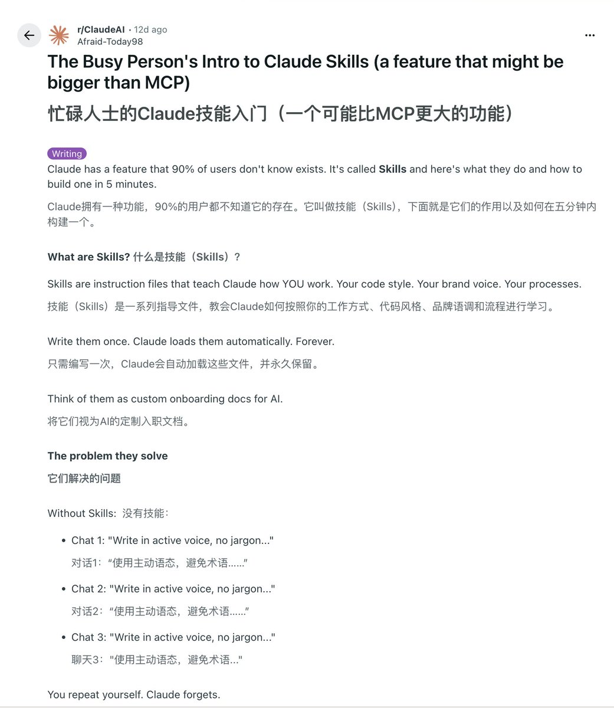

忙碌人士的Claude Skills入门（一个可能比MCP更大的功能）😎

为什么说“比MCP更强大”?

MCP将Claude与数据连接起来。
Skills教会Claude如何使用这些数据。R

## 💬 Replies

### 1 @yanhua1010 (Yanhua) (Author)

*Wed Dec 31 10:39:43 +0000 2025*

嗯 我感觉老外对一些概念的解释要清晰一些

### 2 @hazelwong_ (Hazel紫苏)

*Wed Dec 31 10:20:32 +0000 2025*

@yanhua1010 终于看懂了skills是做什么的

### 3 @ljhspurs (JimmyJacy)

*Wed Dec 31 22:58:59 +0000 2025*

@yanhua1010 skills像对应职位的员工手册
HR skills - HR员工手册
运营 skills - 运营员工手册
后端开发 skills = 后端开发员工手册

