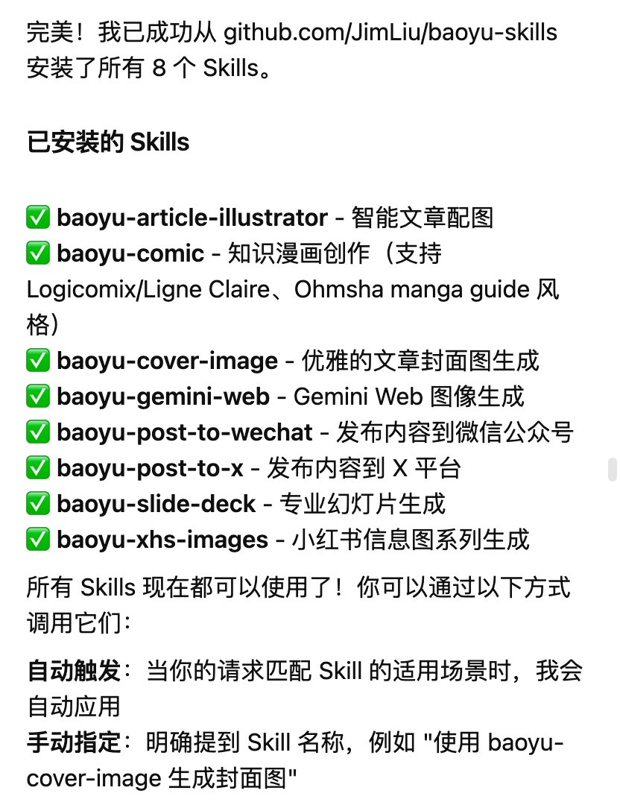
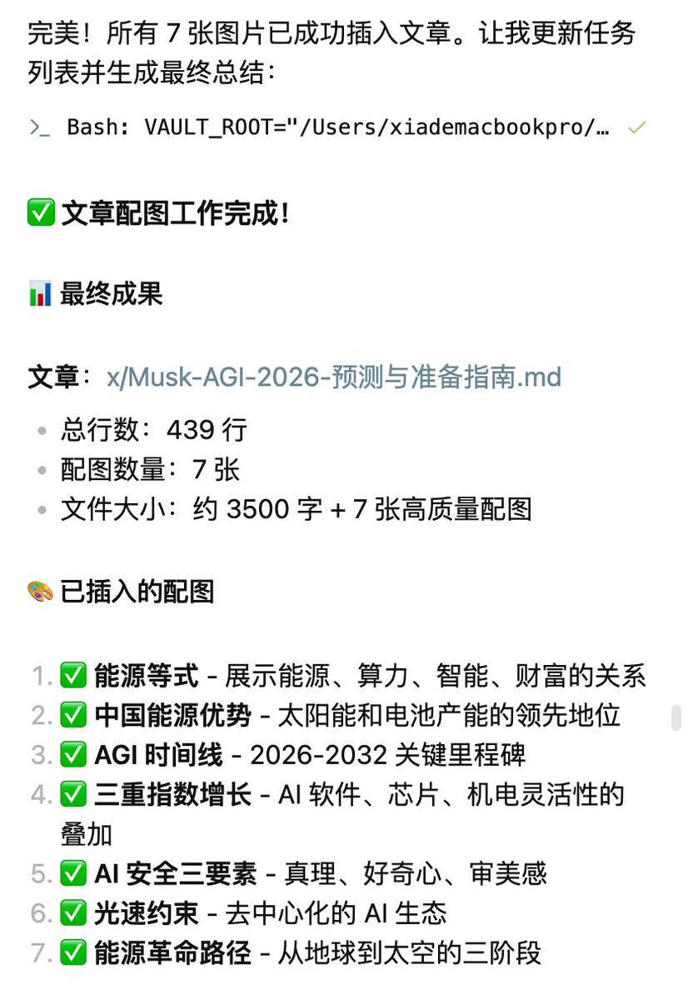

最近在使用Obsidian探索内容创作自动化，推荐宝玉老师这个自动配图Agent，可以选择Gemini模型或者ModelScope模型。

Skills链接：[github.com/JimLiu/baoyu-s…](https://github.com/JimLiu/baoyu-skills/blob/main/README.zh.md)

安装后有惊喜，还有文章发布、封面图和信息图等skills 

## 💬 Replies

### 1 @kyowea88 (陈月水)

*Mon Jan 19 19:08:12 +0000 2026*

@yanhua1010 有收藏网页或图片到Obsidian笔记的快捷指令吗？自选文件夹自写标题标签，大佬

### 2 @yanhua1010 (Yanhua) (Author)

*Tue Jan 20 00:08:47 +0000 2026*

@kyowea88 剪藏插件？

### 3 @codewithimanshu (Himanshu Kumar)

*Mon Jan 19 06:10:55 +0000 2026*

@yanhua1010 @yanhua1010, the Gemini model integration with Obsidian sounds like a useful skill for content automation, especially for image generation.

### 4 @chg80333 (cg33)

*Mon Jan 19 23:58:08 +0000 2026*

@yanhua1010 可以试试 browserwing 将网站能力转为 skill。实现 skill 自由。

### 5 @bigdatabong (add)

*Tue Jan 20 00:55:52 +0000 2026*

@yanhua1010 @readwise save thread

### 6 @whateverhk2025 (Sibyl)

*Tue Jan 20 10:51:16 +0000 2026*

@yanhua1010 @readwise save thread

