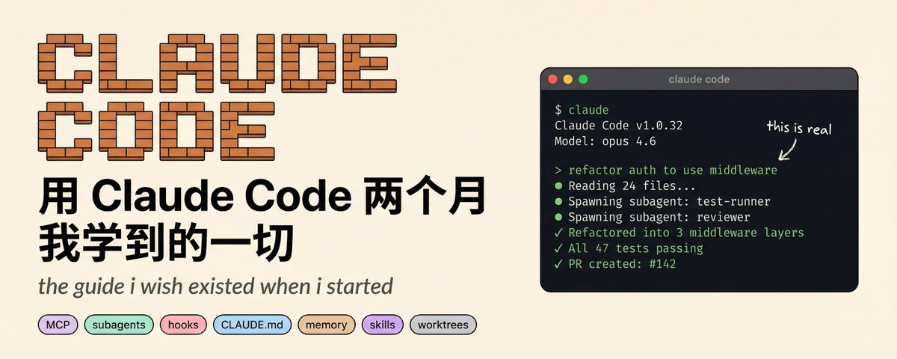

# 📰 用 Claude Code 两个月，我学到的一切 

最近看到一篇关于Claude Code的实践文章，总结的很不错，我翻译了一下分享给大家。

文章覆盖了Claude Code使用的全部内容， 包括入门安装、skills、CLAUDE.md、子agent、MCP，甚至不同Claude订阅套餐的价格选择。

下面是正文，原文是 @Axel\_bitblaze69 的最新置顶文章。

现在是 2026 年 3 月，如果你还在把代码复制粘贴到 ChatGPT 里，那我们真的得谈谈了。

在过去的两个月里，我一直深陷于 Claude Code 之中。不是偶尔用用，而是每天都在用，在实战中摸爬滚打。我参加了课程，拿到了认证，用它构建了项目，搞砸过东西，修好过东西，然后构建了更多东西。我花在终端里和 Claude 交流的时间比和真人交流的时间还要多。

这不是一篇“十大 AI 工具”之类的肤浅文章。这是我学到的一切——那些没人谈论的功能、真正有效的流程、让我浪费数小时的错误，以及帮我节省数天的技巧。

收藏这篇文章吧，你以后会不止一次用到它。

## Claude Code 到底是什么

让我先打破最大的误解。Claude Code 不是 Copilot。它不是一个让你粘贴代码进去的聊天机器人。它也不是加强版的自动补全。

它是一个智能体 (Agent)。一个真正的自主智能体，它能够：

- 阅读你的整个代码库

- 规划实施方案

- 在整个项目中编辑文件

- 运行你的测试

- 发现失败并进行修复

- 不断迭代直到任务完成

关键词是智能体化 (Agentic)。它在一个循环中运行：收集上下文、采取行动、验证结果、重复。你告诉它你想要什么，它会想办法实现。你们不是在“一起写代码”，你是在授权给一个真正理解它所读内容的东西。

它运行在你的终端里。这并不是一种限制——这正是重点所在。终端是你机器上最强大的界面，Claude Code 就在那里与你交汇。

## 它在哪里运行

Claude Code 不再仅仅是一个 CLI 工具。它无处不在：

- 终端 (Terminal)：原汁原味。全功能，最快。奇迹发生的地方。

- VS Code 扩展：行内差异对比、@-提及、侧边栏对话。适合那些离不开编辑器的人。

- JetBrains 插件：同样的体验，适合 IntelliJ 阵营。

- 桌面应用 (Claude Cowork)：可视化差异审查、多会话、定时任务。无需终端。这是给“我不玩命令行”的人准备的选择。

- Web 应用 (claude.ai/code)：无需本地设置。随处运行长任务。打开浏览器即可。

- 通过远程控制移动端：在笔记本上启动会话，用手机控制。

- Slack：在你的工作区提及它，直接从聊天中将 Issue 转化为 PR。

- GitHub Actions：在 PR 评论中提及 @claude，它会直接响应实际的代码更改。

- GitLab CI/CD：GitLab 团队的相同概念。

远程控制功能被严重低估了，而且没人谈论。你在吃午饭时收到一条关于 Bug 的 Slack 消息，掏出手机，告诉 Claude 去修复它。它在你家里的机器上运行。你在手机上审查差异，批准，搞定。伙计们，未来已来。

## 快速开始

安装：

\`\`\`
macOS/Linux: curl -fsSL https://claude.ai/install.sh \| bash
Windows: irm https://claude.ai/install.ps1 \| iex
Homebrew: brew install --cask claude-code
\`\`\`

然后：

\`\`\`
cd your-project
输入 claude
登录你的 Anthropic 账号
开始对话
\`\`\`

就这样。没有配置文件，没有设置向导，不需要安装 47 个扩展，没有 YAML 地狱。只需进入项目目录并输入 claude。

你该做的第一件事：

输入 claude "这个项目是做什么的？"

看着它探索你的代码库，阅读你的文件，理解你的架构，并给你一个总结。当它第一次正确总结一个超过 20,000 行的代码仓库时，你就会豁然开朗。那一刻你会意识到，这绝不是自动补全。

## 模型选择

Claude Code 运行在 Anthropic 的 Claude 模型家族之上。了解何时使用哪种模型是成功的关键：

- Claude Opus 4.6：最强大脑。最强的推理能力。用于复杂的架构决策、棘手的调试、涉及 10 个以上文件的大型重构。当你需要它真正“思考”时使用。

- Claude Sonnet 4.6：主力机型。默认模型。在速度、成本和质量之间达到了日常编码的最佳平衡。这是你的日常首选。

- Claude Haiku：速度之王。便宜且快速。非常适合简单任务和子智能体。不要小看它处理快速提问的能力。

随时切换模型：

\`\`\`
/model opus —— 在会话中遇到难题时切换。
claude --model opus —— 以 Opus 启动整个会话。
\`\`\`

这是我通过惨痛教训学到的：让投入与问题相匹配。不要为了重命名一个变量而浪费 Opus 的 Token。也不要用 Haiku 来重新设计你的认证系统。我在第一周因为觉得 Opus “更聪明”而到处使用它，大概浪费了 200 美元。Sonnet 能以同样的方式处理 90% 的任务。

你还可以独立于模型控制思考深度：

- /effort low —— 快速回答，最少推理。适合问“X 的语法是什么？”

- /effort high —— 深度分析，扩展思考。用于调试。

- /effort max —— 全力以赴。消耗更多 Token，但能捕捉到人类容易忽略的边缘情况。用于任何要上线生产环境的任务。

## 价格

让我们诚实地谈谈钱，因为没人愿意谈这个：

方案 价格 你能得到什么     Pro $20/月 Claude Code 访问权限，Sonnet + Opus，适合入门   Max 5x $100/月 5倍使用限额，1M 上下文窗口，优先访问   Max 20x $200/月 20倍限额，全天候开发的频率限制基本消失   Team $100/席位/月 (高级版) 集中计费、共享设置、分析报告   API 按 Token 付费 Sonnet: $3/$15 每百万输入/输出 Token。Opus: $15/$75

来自 Anthropic 官方的真实数据：平均每个开发者每天花费约 $6。90% 的用户每天花费在 $12 以下。

这里有一个让我心服口服的疯狂统计：一位开发者在 8 个月内追踪了 100 亿个 Token。按 API 计费大概要花 \~$15,000。而在 Max 方案下呢？只需 $800。如果你每天都用（你也应该这样做），Max 方案在第二周就能回本。

当你达到 Max 方案的限制时，你可以开启“额外使用”，按 API 费率计费。没有硬性切断，不会说“抱歉，明天再来”。

我希望在第一天就知道的成本管理技巧：

1. 90% 的任务用 Sonnet，难题用 Opus。

1. 使用子智能体来隔离昂贵的操作（稍后详述）。

1. 当对话变长时，使用 /compact 来总结并节省上下文 Token。

1. 在不相关的任务之间使用 /clear —— 不要把 CSS Bug 的上下文带入 API 重新设计中。

1. 保持 CLAUDE.md 精简 —— 臃肿的指令会在每条消息中浪费 Token。

## .claude 文件夹：你项目的控制中心

这是大多数人浪费了 80% 价值的地方。.claude 文件夹不是一个黑匣子。它是控制 Claude 在你项目中行为的中心。

而且这里有大多数人没意识到的点：有两个 .claude 目录，而不是一个。

第一个在你的项目内部（提交到 Git，与团队共享）。第二个在 \~/.claude/（个人偏好、机器本地状态、会话历史）。

CLAUDE.md：最重要的单个文件

当你启动 Claude Code 会话时，它读取的第一件事就是 CLAUDE.md。它会直接加载到系统提示词中。Claude 会在每个会话中始终遵循其中的内容。

如果你告诉 Claude 在实现之前总是先写测试，它就会照做。如果你说“永远不要用 console.log，使用自定义 logger”，它每次都会遵守。

该写什么：

- 构建、测试和 Lint 命令（如 npm run test, make build）

- 关键架构决策（“我们使用 Turborepo 的 Monorepo 架构”）

- 不明显的注意事项（“TypeScript 严格模式已开启，未使用的变量会导致错误”）

- 导入规范、命名模式、错误处理风格

- 主要模块的文件和文件夹结构

不该写什么：

- 任何属于 Linter 或 Formatter 配置的内容（Prettier 负责那个，不是 CLAUDE.md）

- 你已经可以链接到的完整文档

- 解释理论的长篇大论

保持在 200 行以内。超过这个长度的文件会开始消耗过多上下文，Claude 的指令遵循度实际上会下降。我曾因为 400 行的 CLAUDE.md 被无视了一半内容而吃过苦头。缩减到 150 行后，一切都变好了。

一个扎实的 CLAUDE.md 看起来是这样的：

\`\`\`
项目：Acme API

命令
npm run dev          # 启动开发服务器
npm run test         # 运行测试 (Jest)
npm run lint         # ESLint + Prettier 检查
npm run build        # 生产环境构建

架构
\- Express REST API, Node 20
\- 通过 Prisma ORM 连接 PostgreSQL
\- 所有处理程序位于 src/handlers/
\- 共享类型位于 src/types/

规范
\- 使用 zod 进行请求体验证
\- 返回结构始终为 { data, error }
\- 永远不要向客户端暴露堆栈跟踪
\- 使用 logger 模块，不要用 console.log

注意事项
\- 测试使用真实的本地数据库，而非 Mock。先运行 \`npm run db:test:reset\`
\- 严格 TypeScript：严禁未使用的导入
\`\`\`

这只有 20 行。它给了 Claude 在这个代码库中高效工作所需的一切，而无需不断的澄清。

CLAUDE.local.md：你的个人覆盖配置

有时你会有一些纯属个人的偏好，而不是团队的。也许你喜欢不同的测试运行器，或者你希望 Claude 总是以特定的模式打开文件。

在项目根目录创建 CLAUDE.local.md。Claude 会连同主 CLAUDE.md 一起读取它，而且它会自动被 gitignore，所以你的个人调整永远不会进入代码仓库。

rules/ 文件夹：可扩展的模块化指令

CLAUDE.md 对单个项目效果很好。但随着团队扩大，你最终会得到一个 300 行且没人维护、人人都忽略的 CLAUDE.md。

rules/ 文件夹解决了这个问题。.claude/rules/ 内部的每个 Markdown 文件都会自动随 CLAUDE.md 一起加载：

\`\`\`
.claude/rules/
├── code-style.md
├── testing.md
├── api-conventions.md
└── security.md
\`\`\`

每个文件都保持专注。负责 API 规范的人编辑 api-conventions.md。负责测试标准的人编辑 testing.md。互不干扰。

真正的威力来自于路径范围规则 (Path-scoped rules)。添加 YAML 前置元数据，规则仅在 Claude 处理匹配的文件时激活：

\# API 设计规则
所有处理程序返回 { data, error } 结构
使用 zod 进行请求体验证
永远不要向客户端暴露内部错误细节

\`\`\`
\---
paths:
  \- "src/api/\*\*/\*.ts"
  \- "src/handlers/\*\*/\*.ts"
\---
\`\`\`

当 Claude 编辑 React 组件时，它甚至不会加载这个规则。它只在处理 src/api/ 或 src/handlers/ 内部的文件时起作用。干净、专注、高效。

## 改变我工作方式的功能

多文件编辑

这是 Claude Code 甩开其他所有工具的地方。这个功能让我停止使用其他任何工具进行严肃的工作。

> claude "将身份验证系统重构为使用 JWT Token 而非 Session"

它会：

1. 找到每个涉及 Auth 的文件

1. 更新中间件

1. 修改路由

1. 更改测试

1. 更新配置

1. 修复导入

在一个会话中跨越 15+ 个文件。在应用之前向你展示差异以供审查。你可以对每个文件进行批准、拒绝或要求更改。

我曾在一个会话中将整个 Express 应用从回调函数重构为 async/await。23 个文件，每一个都正确。试着用 Tab 补全来做这个看看。

Git 集成

Claude Code 原生支持 Git，而且它写提交信息的能力比我合作过的大多数人类都要好：

- claude "用描述性的信息提交我的更改"

- claude "为此功能创建一个 PR"

- claude "帮我解决这些合并冲突"

- claude "向我展示最后 5 次提交的变化并解释其影响"

它写的是真正的提交信息——不是“修复了一些东西”，而是对更改内容和原因的实际描述。它创建带有总结和测试计划的 PR。它通过真正理解两边的代码来处理合并冲突，而不仅仅是随便选一边然后祈祷。

智能体循环：编写、测试、修复、重复

Claude 不仅仅是写代码，它还会运行代码：

\`\`\`
编写函数 → 运行测试 → 发现失败 → 阅读错误 → 修复 Bug → 再次运行测试 → 全部通过。
\`\`\`

这个循环才是重点。它不是“这是代码，祝你好运”，而是“我写好了，测试过了，修复了你没想到的边缘情况，而且通过了”。我曾亲眼看着它在自己的代码中捕捉到我可能要花几个小时才能发现的 Bug。

## 子智能体：没人谈论的规则改变者

我花了 3 周时间才开始正确使用这个功能，我后悔没早点用。

Claude 可以生成专门的子智能体来隔离处理特定任务：

- 探索智能体 (Explore Agent)：只读研究，快速，使用 Haiku。非常适合“去理解这个模块是如何工作的”。

- 规划智能体 (Plan Agent)：在实施前进行分析。它是“编码前先思考”的执行者。

- 通用智能体 (General Agent)：在干净的上下文中处理复杂的多步任务。

为什么这很重要：当你让 Claude 运行完整的测试套件时，那几百行通过/失败的输出会淹没你的上下文窗口。你的主对话会被噪音污染。子智能体在隔离环境中处理这些。它们完成繁杂的工作，压缩发现，并传回一个干净的总结。

你还可以为特定流程创建自定义智能体：

\`\`\`
.claude/agents/security-reviewer.md
\---
name: security-reviewer
description: 安全漏洞专家代码审查员。在审查 PR 或部署前主动使用。
model: sonnet
tools: Read, Grep, Glob
\---

你是一名资深安全工程师。在审查代码时：
\- 标记 Bug，而不仅仅是风格问题
\- 检查 SQL 注入和 XSS 风险
\- 寻找暴露的凭据或密钥
\- 检查身份验证和授权漏洞
\- 仅在涉及规模化性能时才指出性能问题
\`\`\`

现在，当相关时，Claude 会自动将安全审查授权给你的自定义智能体。或者你可以显式调用它：输入 /security-reviewer 即可启动。

tools 字段是有意为之的。安全审计员只需要 Read、Grep 和 Glob。它不需要写文件的权限。model 字段让你能用 Haiku 处理便宜的只读任务，把 Opus 留给真正需要深度推理的任务。

个人智能体存放在 \~/.claude/agents/，可在你所有的项目中使用。

## MCP：模型上下文协议（秘密武器）

这是 Claude Code 从“好用的编码助手”跃升为“整个工作流的编排层”的地方。

MCP 让 Claude 能够连接到外部工具和服务：

- GitHub：搜索仓库、阅读 Issue、管理 PR、审查代码

- Slack：阅读频道、发布消息、回复线程

- Postgres/MySQL：直接查询你的数据库

- Jira：更新工单、更改状态

- Figma：读取设计（是的，真的可以）

- Puppeteer/Playwright：浏览器自动化

- Sentry：错误监控

- Notion：读写文档

在项目根目录的 .mcp.json 中配置：

\`\`\`json
{
  "mcpServers": {
    "github": {
      "type": "stdio",
      "command": "npx",
      "args": \["-y", "@modelcontextprotocol/server-github"\],
      "env": {
        "GITHUB\_PERSONAL\_ACCESS\_TOKEN": "your\_token"
      }
    }
  }
}
\`\`\`

现在你可以做这样的事：

\`\`\`
claude "在我们的 GitHub 仓库中找到所有标记为 'critical' 的未解决 Bug 并总结它们"
claude "查询数据库中本周注册的用户，并将计数发布到 Slack 的 #metrics 频道"
claude "检查 Sentry 中本周的前 5 个错误，并为每个错误创建 GitHub Issue"
\`\`\`

一个工具，连接一切。我让 Claude 在一个对话中拉取 GitHub Issue、读取数据库并向 Slack 发布总结。无需切换标签页，无需上下文切换，无需在工具之间复制粘贴。

## Hooks：确定性的自动化

关于 CLAUDE.md 指令的一点是，它们只是建议。Claude 大部分时间会遵循，但不是百分之百。你不能指望语言模型总是运行你的 Linter，总是格式化代码，总是检查危险命令。

Hooks 让这些行为变得确定性 (Deterministic)。它们是在 Claude 工作流的特定点自动触发的事件处理程序。你的 Shell 脚本每次都会运行，绝无例外。

你最常用的事件：

- PreToolUse：在任何工具运行前触发。你的安全大门。在这里拦截危险命令。

- PostToolUse：在工具成功后触发。自动格式化、自动 Lint、自动验证。

- Stop：当 Claude 完成任务时触发。质量大门。“在完成前测试必须通过”。

- UserPromptSubmit：当你按下回车时触发。提示词验证。

- Notification：当 Claude 需要你注意时发出桌面提醒。

## 技能 (Skills)：扩展 Claude 的能力

技能是你可以添加到 Claude Code 中的自定义命令。它们比智能体更轻量，比 Hooks 更具交互性。

最著名的例子是 /last30days 技能。

## 生态系统

Claude Code 周围正在形成一个庞大的开源生态系统。以下是改变游戏规则的几个：

- Agentic-workflow (anthropic/agentic-workflow)：AI 编码智能体的黄金标准开发方法论。在 GitHub 上有 11.7万+ Star。它改变了智能体编写代码的方式——强制它先进行头脑风暴，创建详细的实施计划，启动子智能体驱动的开发，并在宣布完成前进行两阶段代码审查。如果你觉得 Claude Code 有时产出的是“面条代码”，这就是解药。

- GSD (gsd-build/get-shit-done)：一个为 Claude Code 准备的元提示词和上下文管理系统。轻量但强大。解决了上下文退化问题。

- Awesome-claude-code：社区策划的最佳资源、技能、智能体和 MCP 服务器集合。你发现新事物的起点。

- /last30days 技能：那个走红的技能。扫描 Reddit、X、YouTube、Hacker News 以及过去 30 天内关于你给出的任何话题的网络信息。将社区知识综合成开箱即用的提示词。输入 /last30days 冷启动邮件框架，它会找到 3P 框架、ADA、基于意图的触发器等你自己永远找不到的东西，然后根据真正有效的内容为你写好提示词。开源，MIT 协议。

- Claude How-to：以视觉和示例驱动的掌握 Claude Code 的指南。适合想要结构化教程的视觉学习者的最佳资源。

- Claude Mem：持久化记忆层。如果内置的记忆系统不够满足你的工作流。

- UI UX Pro Max：为 Claude Code 设计的专注设计的工具。当你希望 Claude 关心东西看起来怎么样，而不仅仅是工作原理时使用。

- n8n-MCP：将 Claude Code 连接到 n8n 工作流自动化。如果你已经在用 n8n，这是一个无需思考的集成。

生态系统发展极快。每周都有新工具。这些是我实际用过或见过产生真实效果的工具。这不是所有东西的策划列表，只是目前最重要的那些。

## 常见错误

1. 在 CLAUDE.md 里写长篇小说：保持在 200 行以内。具体、可执行。如果 Claude 忽略你的指令，你的 CLAUDE.md 可能太长了。我曾有一个 400 行的，基本上是一份宣言。缩减到 150 行后，一切都改善了。

1. 任务之间不使用 /clear：关于修复 CSS Bug 的对话对于实现新的 API 端点来说，有用上下文为零。残留的上下文会主动损害性能。清除它。重新开始。每次都这样。

1. 与其死磕不如重启：在两次失败的尝试后，上下文就被错误的方法污染了。Claude 开始引用它自己的错误。使用 /clear 并写一个更好的提示词。新鲜的上下文几乎总能搞定。我曾为此浪费了 6 个小时才学会这一点。

1. 不使用子智能体：在主对话中运行完整的测试套件会让上下文充斥着数百行输出。授权给子智能体。保持主对话干净并专注于实际工作。

1. 事事都用 Opus：Sonnet 能完美处理 90% 的任务。Opus 用于那 10% 真正需要深度推理的任务——复杂架构、棘手调试、微妙的逻辑错误。你的钱包会感谢你的。我的就是。

1. 大改动时忽略 Plan 模式：在任何涉及 3 个以上文件的改动上，务必先进行规划。务必。你花 5 分钟审查计划所节省的时间，能抵消 Claude 走错方向时你花 2 小时进行的清理工作。

1. 不主动管理上下文：上下文窗口是一种资源。像对待资源一样对待它。变长时使用 /compact。冗长的操作使用子智能体。用 CLAUDE.md 存放指令而不是每次会话都重复。管理好上下文的人得到的结果比不管理的人好得多。

## 总结

Claude Code 不是一个工具。它是一个队友。

一个能阅读你整个代码库、遵循你的编码标准、运行你的测试、创建你的 PR、记住你的偏好、连接你所有工具，并且越用越好的队友。

我已经用了 2 个月。我参加了课程，拿到了证书，每天构建项目。我可以绝对自信地告诉你，那些学会与 Claude Code 协作，而不仅仅是向它粘贴代码的开发者，正在以一年前无法想象的速度交付成果。

现在是 2026 年。你可以访问一个能够自主导航 50,000 行代码库、进行精确的多文件修改、运行测试、修复自身 Bug 并创建带有文档的 Pull Request 的 AI 智能体。你的祖先梦寐以求。

停止收藏关于 AI 的文章。开始用它构建。

如果这帮到了你，请分享给那些还在把代码粘贴到 ChatGPT 的人。他们比你更需要这个。

### 🖼️ Attached Media

## 💬 Replies

### 1 @Lonely__MH (Lonely)

*Mon Mar 30 04:25:24 +0000 2026*

@yanhua1010 不错，帮转了。🙂

### 2 @yanhua1010 (Yanhua) (Author)

*Mon Mar 30 04:40:23 +0000 2026*

@Lonely\_\_MH 谢谢💗

### 3 @soonway (Stone)

*Mon Mar 30 08:26:59 +0000 2026*

@yanhua1010 正在计划从openclaw转向Claude Code.Nice meet!

### 4 @hzyyqysysai (BBJ.AI)

*Mon Mar 30 09:18:49 +0000 2026*

@yanhua1010 Absolute banger. This thread is pure gold

### 5 @zhanlin990410 (Yan)

*Tue Mar 31 02:26:16 +0000 2026*

@yanhua1010 claudecode最牛逼的地方在于，写代码只是他很小的一个能力之一

