# 📰 Claude 4.6 最新功能：必须要懂的 Agent Team 小白入门指南（内含完整步骤）

在阅读《[Claude Code Sub-Agent 小白入门指南](https://x.com/YukerX/status/2009214285592055899)》和《[Multi-Agent 小白入门](https://x.com/YukerX/status/2013094122656334136)》后，大家应该已经对 Sub-Agent 有了一定的了解。那么面对着新出的 Agent team 功能，大家应该都有一个同样的疑问：

> Sub-Agent 和 Claude 新出的 Agent Team，他们区别是什么？

我也带着同样的疑问，在这两天高强度使用了该功能，输出效果非常的震惊，因此在出差的间隙，抽空写下这篇文章，把我的感受分享给大家。

跟以往一样，依旧是小白能够读懂的内容，并且附加快速实操的案例（👹想直接尝试的可以跳到第3章）；相信读完这篇文章，你不单能够理解 Agent Teams 和 Sub-agent 之间的区别，并且能够立刻感受到让你震惊的念头：

> Agent Team 的输出效果真的很好

如果你已经开始感兴趣了，那事不宜迟，我们马上开始。

今天我们要讲的内容是 -- Agent Team。

# 第一章： Agent Team 到底是什么？

> Agent Teams = 多个独立的AI大脑 + 实时内部通信 + 共享任务看板 + AI项目经理统筹

你们可以这样理解，我们以往使用的 Sub-Agent 体系，存在三个核心问题：

- 通信难题：不同 Sub-Agent 之间的通信很难，通常需要额外一份md文件来同步进程。

- 内部沟通：Sub-Agent 之间的沟通难度较高，只能进行较为浅层的交流。

- 上下文：Sub-Agent 虽然已经脱离了主对话，但结果摘要返回依然会返回部分上下文，占据空间。

基于这样的属性，Sub-Agent 注定只能处理一些复合型任务；而面对真正复杂度极高的任务，仍然效果不尽人意。由此，Agent Teams 的解决方案出现了，其目的便是通过更加完善的 Multi-Agent 机制，来达到更完美的输出效果。

> 这功能让 Agent 之间，实现了更加完美和拟人的协同方式

为了让大家看得更清楚，我们先来看一下它的内部架构图，这完美模拟了一个真实的项目团队：

\`\`\`plaintext
┌─────────────────────────────────────────────────────────────┐
│                      你 (人类用户)                          │
│           下达指令 / 随时介入 / 查看进度                    │
└──────────────────────────┬────────────────────────────────────┘
                           │
                           ▼
┌─────────────────────────────────────────────────────────────┐
│                   Team Lead (队长 Claude)                     │
│          接收你的指令 → 拆解任务 → 分配 → 汇总结果           │
└────────┬──────────────────┬──────────────────┬────────────────┘
         │                  │                  │
         ▼                  ▼                  ▼
┌───────────────┐    ┌───────────────┐    ┌───────────────┐
│    队友 A     │    │    队友 B     │    │    队友 C     │
│  独立上下文   │←──→│  独立上下文   │←──→│  独立上下文   │
│  独立工作区   │    │  独立工作区   │    │  独立工作区   │
└───────┬───────┘    └───────┬───────┘    └───────┬───────┘
        │                  │                  │
        └──────────────────┼──────────────────┘
                           ▼
                 ┌───────────────────────┐
                 │ 共享任务列表 (Task List)  │
                 │ pending / in progress │
                 │ / completed           │
                 └───────────────────────┘
\`\`\`

🧌这个架构由四大组件构成，各司其职，又紧密配合：

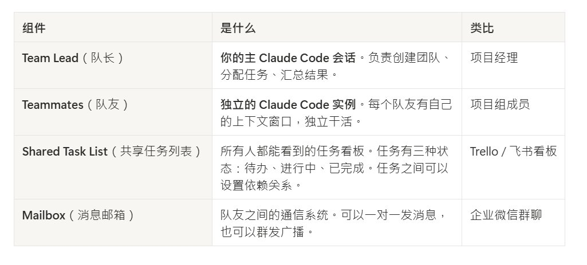

这个体系的协作流程，完美复刻了人类高效团队的工作模式：

- 你描述需求 → Main Agent（队长）理解并拆解为多个子任务

- 队长创建队友 → 每个队友被分配到一个或多个子任务

- 队友并行工作 → 各自在自己的“大脑”（新窗口）中独立推进。

- 队友互相沟通 → 遇到需要其他人配合的地方，直接发消息询问

- 任务依赖自动管理 → 如果任务C依赖任务A的结果，C会自动等待A完成后再开始

- 队长汇总交付 → 所有队友完成后，队长整理全部成果，向你汇报

💯关键理解：每个队友都有独立的“大脑”（上下文窗口）
这意味着队友A写了什么，队友B不会自动看到 —— 他们需要通过Mailbox系统来显式地共享信息。
这种设计的好处是每个人的大脑都不会被不相关的信息塞满，能时刻保持思路清晰，专注于自己的核心任务。

---

# 第二章： 跟 Sub-agent 有什么区别？

在 Agent Team 出现之前，Claude 已经具备了 Sub-agent 的能力，这两者确实非常容易混淆。但实际上，它们的协作逻辑和适用场景截然不同。用一个生活化的例子就能讲清楚：

- Sub-agent 就像你同时在三个不同的App上点了三份外卖
三个外卖小哥各自接单、取餐、配送，他们之间互不相识，也无法沟通，最终都只向你一个人汇报（“您的餐到了”）。你作为中心节点，掌握所有信息。

- Agent Teams 则像你为了装修房子，组建了一个包含设计师、施工队长和采购员的项目组。
他们围坐在一起，设计师的图纸可以直接交给施工队长，施工队长发现材料问题可以马上和采购员沟通。他们共享一个总体的装修目标，并能主动协调解决问题。

为了更清晰地展示差异，我们整理了以下详细对比表格，这可能是全网最全的对比：

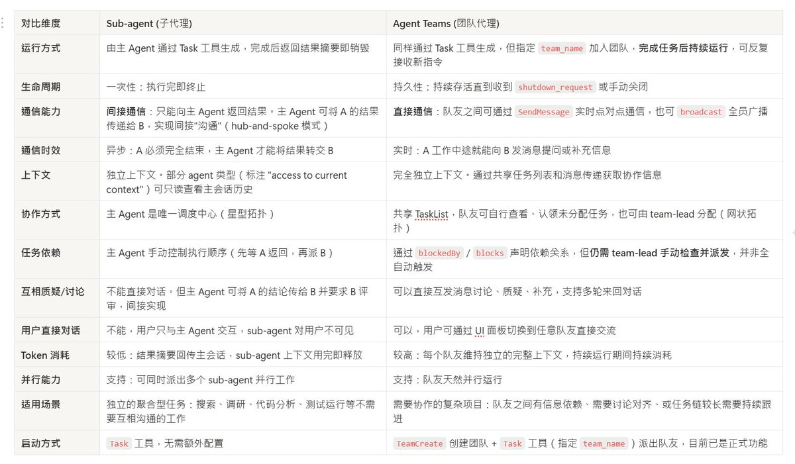

如果你嫌麻烦，上面的表格直接忽略不看！！我们直接注意一下几个点：

1. 💟生命周期
Sub-Agent：一次性，做完即销毁
Team Agent：持久运行，可反复接收新指令，直到主动关闭

1. 📶通信能力
Sub-Agent：没有直接通讯能力
Team Agent：拥有直接通讯能力

1. 🎼协作模式
Sub-Agent：星型拓扑，主 Agent 是唯一调度中心
Team Agent: 网状拓扑，共享任务列表，队友可自行认领 

1. 🧌用户可达性
Sub-agent: 用户看不到、摸不到 sub-agent
Team Agent: 用户可以直接和任意队友对话

一个简单的判断法则：当你不确定用哪个时，问自己两个问题：

1. 这些子任务之间需要互相沟通吗？
\- 需要 -&gt; 用 Agent Team
\- 不需要 -&gt; 用 Sub-Agent

1. 任务的总复杂度高吗？
\- 简单任务（1-2个子任务） ： 用 Sub-Agent
\- 复杂任务（3个以上需要协调的子任务）：Agent Team

💰经验法则：需要快速完成独立小任务，用 Sub-agent；任务复杂、多模块、需要队友互相讨论，用 Agent Team。如果预算紧张且任务简单，Sub-agent 更省钱。

---

# 第三章：实战案例，使用 Agent Team 完成产品经理 Go-To-Market 材料准备

理论讲完，我们进入最激动人心的实战环节。Agent Team 的使用并不复杂，即使你不是程序员，也能通过简单的几步，用自然语言指挥一支Agent Team。这里我们以Windows环境为例。

## 第一步：功能开启

> [⚠️](https://abs-0.twimg.com/emoji/v2/svg/26a0.svg)Agent Team 由于目前是实验性功能，因此默认是关闭的，需要手动打开。

这里有两种开启的方式，分别是“临时启动”和“永久启动”：

[1️⃣](https://abs-0.twimg.com/emoji/v2/svg/31-20e3.svg)临时启动：

\`\`\`bash
$env:CLAUDE\_CODE\_EXPERIMENTAL\_AGENT\_TEAMS = "1"
\`\`\`

在启动 Claude Code 前，输入上述指令即可临时启动。

[2️⃣](https://abs-0.twimg.com/emoji/v2/svg/32-20e3.svg) 永久启动：

为了方便，更推荐在 Claude Code 的 settings.json 配置文件中进行永久设置。找到 \~\\.claude\\settings.json 文件（没有就新建一个），写入以下内容并保存：

\`\`\`
{
  "env": {
    "CLAUDE\_CODE\_EXPERIMENTAL\_AGENT\_TEAMS": "1"
  }
}
\`\`\`

## 第二步：启动并下达你的第一个组队指令

在 Claude Code 里输入以下内容（你可以直接复制这段话，然后根据自己的产品修改）：

\`\`\`markdown
我们下周要发布一款 AI 写作助手产品「妙笔 AI」。
请帮我组建一个 Agent Team，并行准备以下材料：

队友 1 - 竞品分析师：
  搜索并分析市场上主流的 AI 写作工具（如 Jasper、Copy.ai、
  Notion AI 等），整理成一份竞品分析报告，包含：
  \- 各家核心功能对比（用表格呈现）
  \- 定价策略对比
  \- 用户口碑和槽点
  \- 我们产品的差异化优势在哪里
  输出为 Markdown 格式的报告文件

队友 2 - 文案策划：
  撰写产品发布所需的全套文案，包括：
  \- 官网 landing page 的标题、副标题和 3 个核心卖点
  \- 5 条适合发微博/小红书的种草文案（要有网感）
  \- 1 篇公众号发布稿（800字左右，风格专业但不枯燥）
  注意参考队友 1 的竞品分析来突出差异化

队友 3 - 销售支持：
制作一份销售团队 FAQ 手册，包含：
  \- 客户最可能问的 15 个问题和标准回答
  \- 与竞品对比时的话术建议
  \- 常见反对意见（如「我已经在用 Notion AI 了」）的应对方法
  同样参考队友 1 的竞品分析来保持信息一致

三个队友通过共享任务列表协作。
文案和 FAQ 都需要参考竞品分析的结果。

\`\`\`

## 第三步：看团队自动协作

输入完毕后，你只需要看着 Claude 自动工作：

[1️⃣](https://abs-0.twimg.com/emoji/v2/svg/31-20e3.svg) 组建团队：Claude 自动成为队长，并且生成3个独立的队友

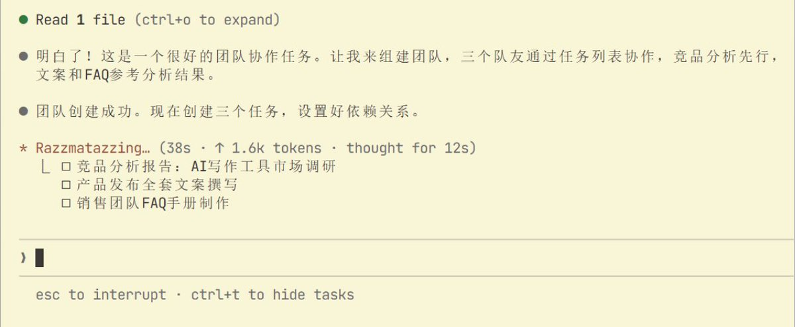

[2️⃣](https://abs-0.twimg.com/emoji/v2/svg/32-20e3.svg) To-Do List：Claude 队长为团队创建了任务清单

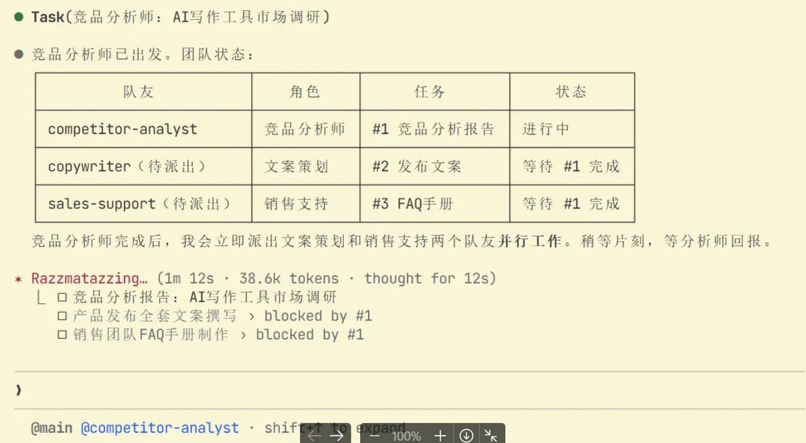

[3️⃣](https://abs-0.twimg.com/emoji/v2/svg/33-20e3.svg) 竞品分析师率先开工：搜索资料、整理对比表格、分析差异化

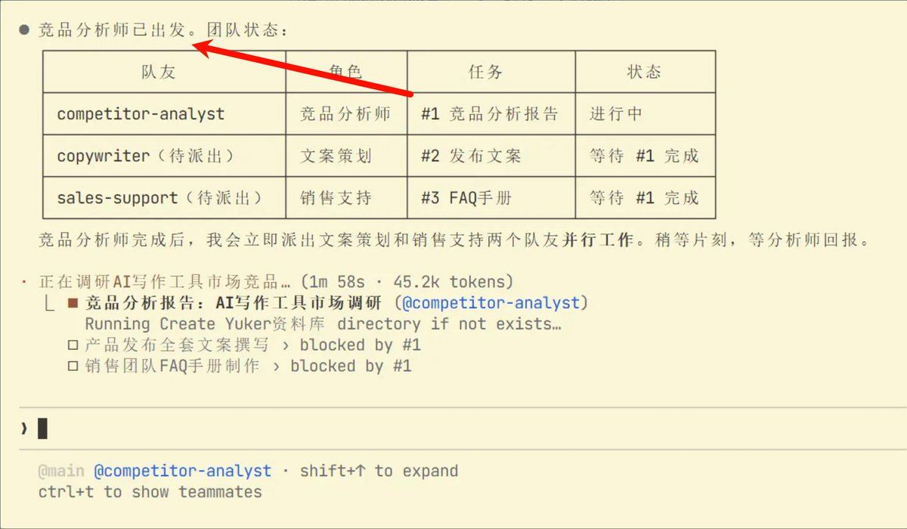

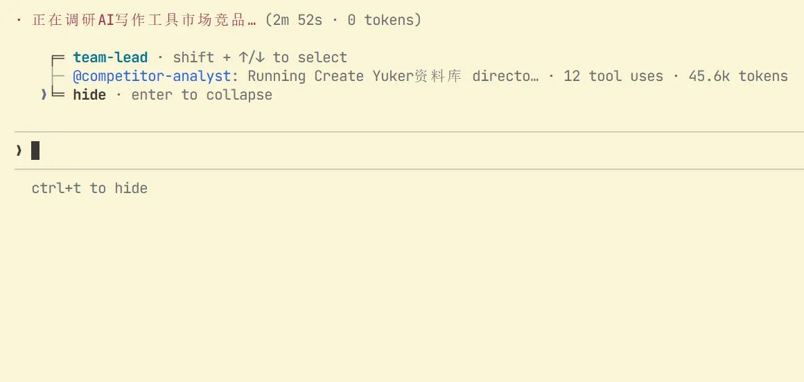

 [4️⃣](https://abs-0.twimg.com/emoji/v2/svg/34-20e3.svg) 文案策划同步起步：先用已有的产品信息开始写草稿框架

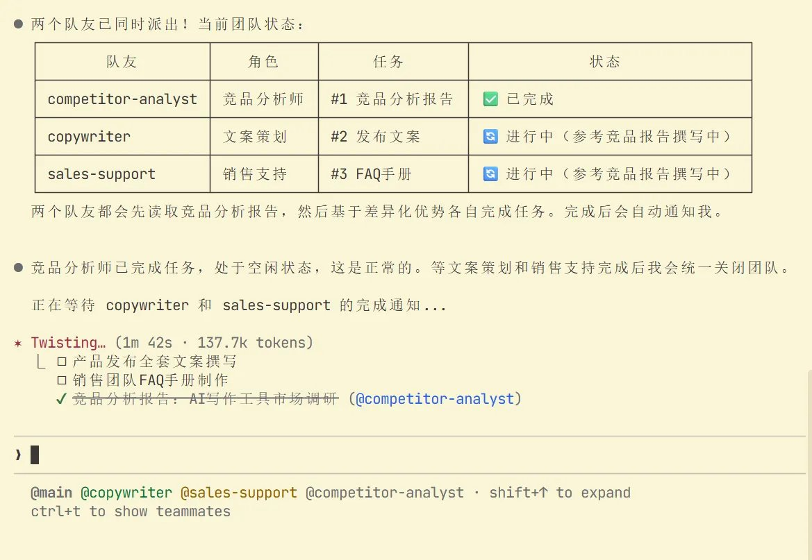

[5️⃣](https://abs-0.twimg.com/emoji/v2/svg/35-20e3.svg) 信息自动流转：队长会查看内容并进行评价和沟通

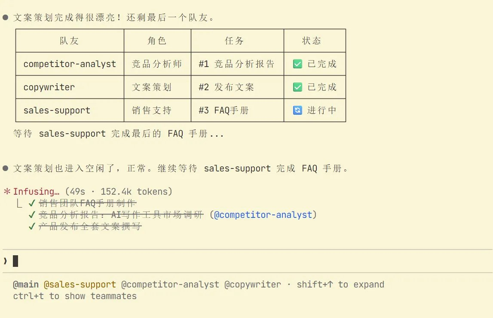

[6️⃣](https://abs-0.twimg.com/emoji/v2/svg/36-20e3.svg)队长汇总：全部完成后，整理所有文件，给你一份交付清单

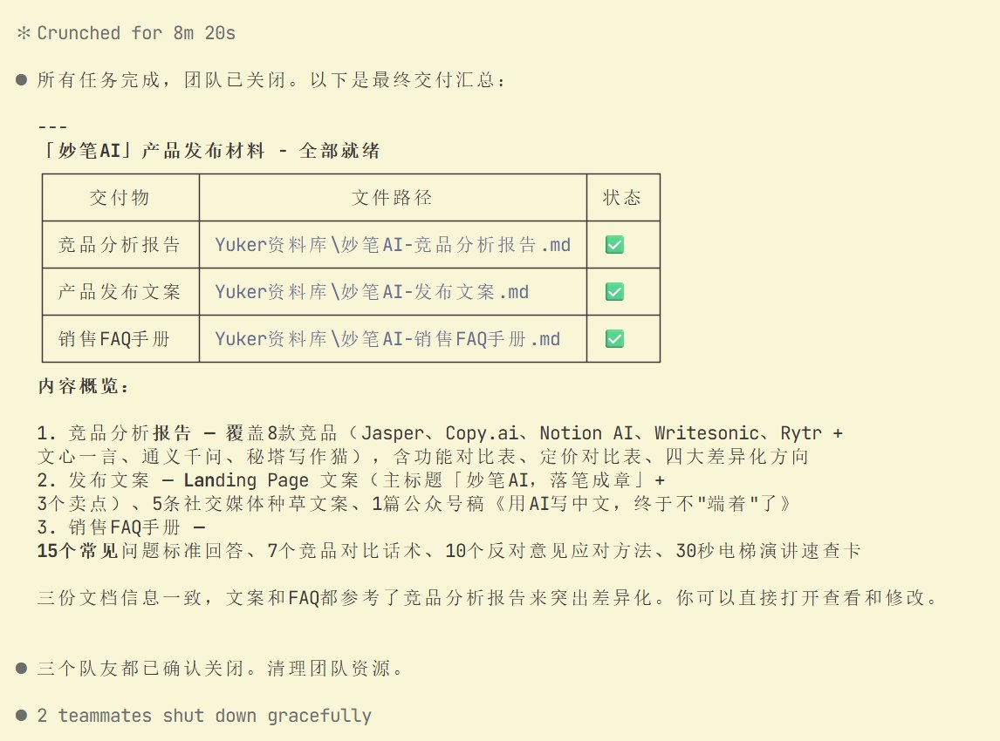

[🏴‍☠](https://abs-0.twimg.com/emoji/v2/svg/1f3f4-200d-2620-fe0f.svg)️强烈建议大家可以去看看输出的结果

作为一次测试性的功能演示，其输出的成果，并不比 Manus来的要差；我相信只要提示词写的够精确（特别是 Claude 4.6 支持 1M 上下文后），定能产出十分优质的结果。

# 第四章：真实案例，16个Agent并行构建C编译器

在讲完实战技巧之后，让我们来看一个真正震撼的官方案例，它完美展示了 Agent Teams 的极限能力。

2026年2月5日，Anthropic 的安全研究员 [Nicholas Carlini 发表了一篇工程博客](https://www.anthropic.com/engineering/building-c-compiler) ，详细记录了他如何使用 Agent Teams 指挥 16个 Claude 实例并行工作，从零开始构建了一个能够编译真实C程序的编译器。这个编译器最终包含 超过10万行代码，能够通过数百个测试用例。

这个项目的工作方式是这样的：Carlini 将编译器的不同模块（词法分析器、语法解析器、类型检查器、代码生成器等）分配给不同的 Agent 队友。这些队友并行开发各自负责的模块，同时通过 Mailbox 系统协调接口定义和数据格式。当一个队友完成了词法分析器并定义好了 Token 格式，语法解析器队友会立即收到通知并基于这个格式开始工作。

这个案例之所以重要，是因为它证明了三件事：

1. Agent Teams 能处理真正的工程级复杂任务，而不仅仅是写写文案、做做表格。

1. 并行协作的效率提升是实打实的 —— 如果让单个 Agent 按顺序写10万行代码，可能需要数天；16个Agent并行，大幅缩短了时间。

1. AI之间的协调能力已经达到了令人惊讶的水平——它们能够自主定义接口、解决冲突、保持代码风格一致。

# 结语：从“使用AI”到“领导AI”，你准备好了吗？

回到文章开头的那个场景。当你坐在CEO的位置上，面对三项紧急任务时，你不再需要焦虑地排优先级、催进度、当信息中转站。你需要做的，是像一个真正的领导者那样 —— 定义目标、组建团队、分配角色、然后信任你的团队去执行。

Agent Teams 的出现，标志着我们与AI的交互方式正在经历一次根本性的范式转换。这个转换可以用三个阶段来概括：

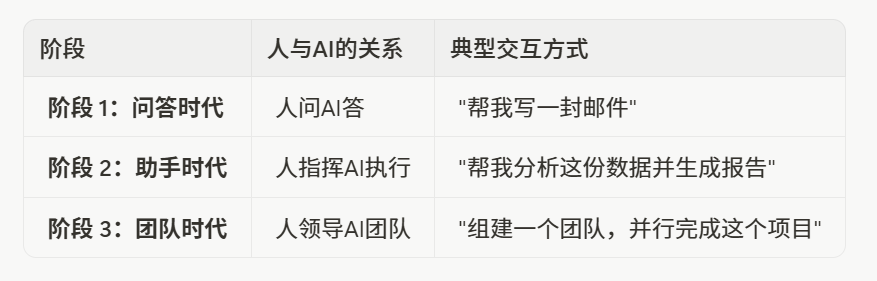

我们正站在第二阶段向第三阶段跃迁的临界点上。Agent Teams 虽然仍是实验性功能，存在不支持会话恢复、不支持嵌套团队、费用较高等局限，但它所揭示的未来图景已经足够清晰：未来的超级个体，不是那个什么都会做的人，而是那个知道如何组建、指挥和优化一支AI团队的人。

对于产品经理、市场人员、研究员、开发者乃至任何知识工作者而言，学会如何定义角色、拆解任务、构建并引导这样一支AI团队，将成为未来最核心的竞争力之一。

现在，就打开你的终端，输入那行环境变量，开始组建属于你的第一支AI梦之队吧。未来已来，而你，就是那个总指挥。

[✨](https://abs-0.twimg.com/emoji/v2/svg/2728.svg)加入交流群：@YukerX（TG）

### 🖼️ Attached Media

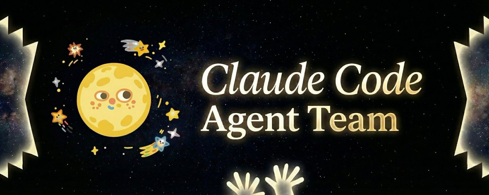

## 💬 Replies

### 1 @qf0421 (RFIHW)

*Sat Feb 07 06:42:47 +0000 2026*

@YukerX 我觉得这需要：
1\. 模型本身多次几乎相同请求的激活不同区域向量的能力比较高。
2\. 工程上简单说就是增加了一个查看/分享任务结果数据的action

### 2 @YukerX (Yuker) (Author)

*Sat Feb 07 07:28:41 +0000 2026*

@qf0421 也不能这么说，工程上主要是把 Agent 之间的通讯给打通了，这在以往只能通过 md 文件来共享进展，现在可以及时同步进展，对于并发任务友好度提升了很多

### 3 @AI_jacksaku (阿川 | AI thinking)

*Sat Feb 07 07:06:02 +0000 2026*

@YukerX 厉害

### 4 @newbeeklass (咕噜咕噜加速VPN)

*Mon Feb 09 02:06:24 +0000 2026*

@YukerX 我这种小白虽然看不懂，但认为Team 的耦合太大了，共享任务列表不加锁是要出问题的，整体上还不如sub agent 架构职业清晰独立，搞个agent 池就很好。

### 5 @zhishiai6 (安逸爸爸学AI)

*Sat Feb 07 15:42:32 +0000 2026*

@YukerX 实不相瞒
小白的我只懂复制粘贴…

### 6 @pirtylab (SIPU)

*Sat Feb 07 08:46:24 +0000 2026*

@YukerX Agent team和oh my opencode架构上是不是类似的

### 7 @ffffxxxx620488 (ffffxxxx)

*Sat Feb 14 12:12:39 +0000 2026*

@YukerX 我已经用不上agennteams了

### 8 @hooray90848513 (hooray)

*Sat Feb 07 16:44:57 +0000 2026*

@YukerX @readwise save thread

### 9 @WithFlyYang (云随心飞扬)

*Sat Feb 07 19:02:06 +0000 2026*

@YukerX 我昨天只写了一句话的prompt，claude code就自动分配类似于一个4人的agent team，共同完成了任务。

### 10 @zosen_ (nene)

*Sun Feb 08 16:37:27 +0000 2026*

@YukerX opencode的omo插件的功能

### 11 @jungeAGI (俊哥AI)

*Sat Feb 07 13:04:16 +0000 2026*

@YukerX agent  team真爽, openclaw 已启用opus 4.6特性 

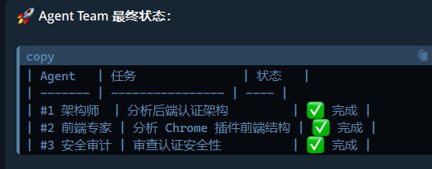

