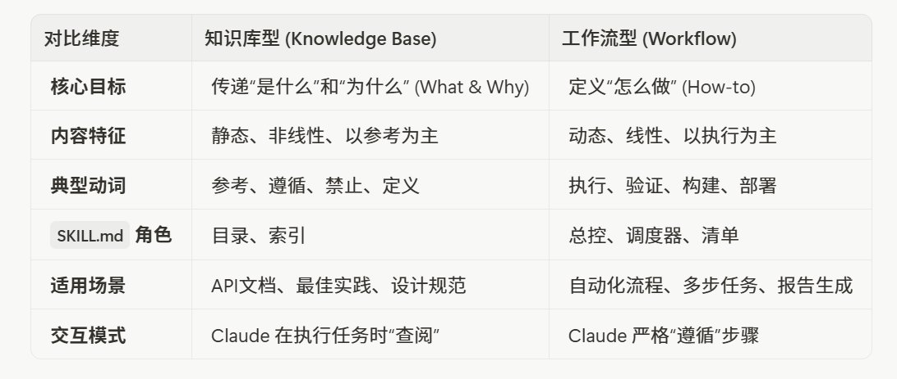
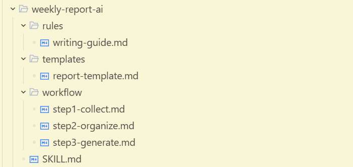
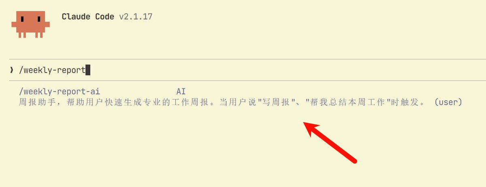
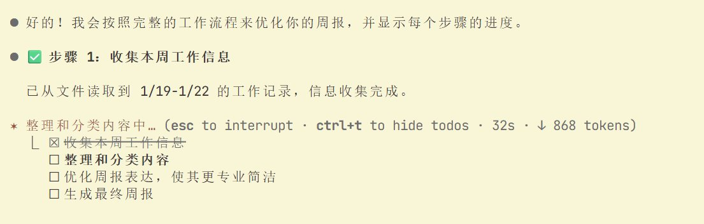

# 📰 Claude Code 零基础进阶：高手都在用的 Skill 2.0 架构指南（附完整步骤）

如果你之前阅读过我的文章《[小白也能解锁 Claude Code 的秘密武器：Skills](https://x.com/0xYuker/status/2008156911611633896)》的话，那么在 Skills 越来越火热的当下，你或许会抱有以下的疑问：

> Skills 不是应该只有一个 Markdown 文件吗？为什么我看别人 Remotion 的 Skills 都有一大堆 Rules 什么之类的！

> 为什么我 [SKILL.md](https://skill.md/) 写的那么长，反而感觉它越来越笨了呢？

> 我该怎么样做出别人那种特别厉害的 Skill 呀？

假若你曾冒出来过这样的念头，那今天这篇文章，将会彻底解决你的疑问和顾虑。我们将跳出 SKILL.md 的单文件思维，进入“文档架构”的世界。

这期文章篇幅会较长，但无需担心，依旧是小白也能看懂的内容，并且配合马上能上手练习的实战案例，相信你看完后，也能完成属于你的 Skill 作品！

> 今天我们要讲的是 -- Skills 文档架构。

# 第一章：为什么你的 SKILL.md 不够用？单文件思维的两大“困境”

在学习任何新技能的初期，我们总是倾向于最简单直接的方法。对于 Claude Code Skills 而言，这意味着把所有东西都塞进 SKILL.md。这在入门阶段完全没问题，但当你试图构建一个真正强大的、可长期使用的 Skill 时，这种单文件思维模式的弊端就会暴露无遗。

## 困境一：上下文的“无形枷锁”

这个大家都应该知道，当你将所有指令、规则、示例代码、参考文档全部堆砌在一个 SKILL.md 中时，每一次 Skill 的触发都变成了一次沉重的“记忆负担”。Claude 就像一个需要时刻背着一本厚重百科全书的学者，即使只是为了查找一句话，也必须扛着整本书。

这将会导致：

- 性能下降：加载和处理庞大的 SKILL.md 会消耗更多时间，让交互变得迟钝。

- 关键信息丢失：当上下文接近极限时，模型可能会“遗忘”掉文件开头或中间的关键指令，导致执行效果大打折扣，出现所谓的“指令漂移”。

- 预算超支：在某些计费模式下，更大的上下文意味着更高的成本。

## 困境二：维护的“噩梦迷宫”

一个超过 500 行的 SKILL.md 就是一个维护的噩梦。想象一下，你现在需要更新其中关于“数据库连接池”的最佳实践。你不得不在这个巨大的文本文件中，通过 Ctrl+F 小心翼翼地定位，然后像拆弹专家一样修改内容，同时祈祷不会影响到其他不相关的部分。

这种高耦合的结构，会带来诸多的问题：

- 逻辑混乱：做到后面，你自己都看不懂自己在做什么

- 可读性差：就算你能看懂，你的同事想要用，也得掉层皮

- 修改风险高：原本能跑的，你改完可能就跑不了了

# 第二章：Skill 2.0的核心 - 像搭乐高一样构建你的“技能”

告别了单文件的混乱，我们迎来的是 Skill 2.0 的核心思想：模块化与渐进式披露（Progressive Disclosure）。这个听起来有点“学术”的词，其实原理非常简单，就像我们日常阅读一本书：

- 先看目录（SKILL.md）：我们首先浏览目录，对全书的结构有一个宏观的了解。

- 按需阅读章节（引用文件）：当我们对某个特定章节感兴趣时，才会翻到那一页去深入阅读。

Claude Code 使用 Skill 的方式与此完全相同。它不会一口气吞下所有信息，而是先加载一个轻量的“目录” —— SKILL.md，然后根据任务的需要，通过文件链接去“翻阅”更具体的“章节”——也就是我们拆分出去的各种 .md，.py 或 .json 文件 。

这种架构的精髓在于，将一个庞大的知识体系，拆解成一个个独立、内聚、可管理的“知识积木”。然后，通过 SKILL.md 这个“蓝图”，将这些积木有机地组织起来。这不仅解决了上下文的“无形枷锁”，更让维护、协作和扩展变得前所未有的简单。

> 👹文档架构的“规则怪谈”如下：

\`\`\`markdown
\## 1.1 唯一强制要求：SKILL.md

my-skill/
└── SKILL.md    ← 这是唯一强制要求的文件

没有 \`SKILL.md\`，Claude 不会识别这个目录为 Skill。

\## 1.2 其他文件夹和文件：完全自由

除了 \`SKILL.md\` 必须存在，\*\*其他所有东西都是可选的，名字也是自由的\*\*。

my-skill/
├── SKILL.md              # 必须
├── 随便叫什么/            # 自由命名
│   └── 任意文件.md
├── abc.json              # 自由
├── 中文文件夹/            # 可以用中文
│   └── 说明.txt
└── scripts/
    └── helper.py

\*\*但是，Claude 不会自动读取这些文件！\*\*

你需要在 \`SKILL.md\` 中明确告诉 Claude 这些文件的存在和用途。

\---
\`\`\`

基于这一核心思想，社区和官方的最佳实践中沉淀出了两种最经典、最实用的文档架构模式：知识库型（Knowledge Base） 和 工作流型（Workflow）。

## 模式一：知识库型架构 （Knowledge Base）

适用场景：当你的 Skill 主要是为了给 Claude 提供一套静态的、结构化的知识时，这种模式是你的不二之选。比如：

- 公司内部的 API 文档

- 特定编程框架（如 React, Vue）的最佳实践

- 团队共享的设计规范或写作风格指南

核心理念：将知识“原子化”。每一个独立的知识点都应该是一个独立的文件，而 SKILL.md 则扮演着这些知识点的“索引”或“目录”的角色。

目录结构：

\`\`\`plaintext
📁 company-knowledge/
├── 📄 SKILL.md          ← 核心入口：作为知识索引
└── 📁 knowledge/      # 规则目录 (可自由命名, 如 docs/, knowledge/)
    ├── 📄 术语表.md     # 知识点1
    ├── 📄 产品FAQ.md
    ├── 📄 报销流程.md
    └── 📁  assets/                # (可选) 存放代码示例或图片等资源
         └── xxx.tsx

\`\`\`

SKILL.md 怎么写：

\`\`\`markdown
\---
name: company-knowledge
description: 公司内部知识库。当需要了解公司术语、产品信息或内部流程时使用。
\---

\# 公司知识库

这是一个内部知识库，包含以下内容：

\- \*\*术语表\*\*：公司常用的专业术语解释 → \[knowledge/术语表.md\](knowledge/术语表.md)
\- \*\*产品FAQ\*\*：产品常见问题解答 → \[knowledge/产品FAQ.md\](knowledge/产品FAQ.md)  
\- \*\*报销流程\*\*：费用报销的详细步骤 → \[knowledge/报销流程.md\](knowledge/报销流程.md)

请根据用户的问题，查阅对应的知识文件。
\`\`\`

工作原理：

当用户问 "公司的 OKR 是什么意思" 时，Claude 会：

1. 先看 SKILL.md，发现这是个术语问题

1. 打开 knowledge/术语表.md，找到 OKR 的解释

1. 回答用户

> Claude Code 不会去打开 "产品FAQ" 或 "报销流程"，因为跟当前问题无关。这就是"按需取用"的威力。

[⚠️](https://abs-0.twimg.com/emoji/v2/svg/26a0.svg)也就是说， 如果 SKILL.md 里面没有提及到需要使用某些文件，某些文件将永远不会被用上！

## 模式二：工作流模式 -- 打造你的“自动化流水线”

适合场景：当你的 Skill 是要完成一个多步骤的任务时。

典型例子：

- 写周报（收集信息 → 整理 → 按格式输出）

- 做会议纪要（听录音 → 提取要点 → 生成文档）

- 发布文章（检查格式 → 配图 → 发布到平台）

核心理念：将任务“流程化”。把一个复杂的任务拆解成一系列线性的、可独立执行和验证的步骤，每个步骤都是一个独立的文件。

推荐目录结构：

\`\`\`plaintext
📁 weekly-report/
├── 📄 SKILL.md              ← 总指挥
├── 📁 workflow/
│   ├── 📄 step1-收集信息.md        # 步骤1
│   ├── 📄 step2-整理内容.md       # 步骤2
│   └── 📄 step3-生成周报.md       # 步骤3
├── 📁 templates/
│   └── 📄 周报模板.md                     # 参考模板
└── 📁 rules/
    └── 📄 写作规范.md                       # 规范
\`\`\`

SKILL.md 怎么写：

\`\`\`markdown
\---
name: weekly-report
description: 自动生成周报。当用户说"写周报"、"生成本周总结"时触发。
\---

\# 周报生成助手

请严格按照以下步骤执行：

\## 执行清单

\- \[ \] \*\*第一步：收集信息\*\* → 遵循 \[workflow/step1-收集信息.md\](workflow/step1-收集信息.md)
\- \[ \] \*\*第二步：整理内容\*\* → 遵循 \[workflow/step2-整理内容.md\](workflow/step2-整理内容.md)
\- \[ \] \*\*第三步：生成周报\*\* → 遵循 \[workflow/step3-生成周报.md\](workflow/step3-生成周报.md)

\## 参考资料

\- 周报格式：\[templates/周报模板.md\](templates/周报模板.md)
\- 写作要求：\[rules/写作规范.md\](rules/写作规范.md)
\`\`\`

工作原理：

> 当用户说"帮我写周报"时，Claude 会：

1. 看 SKILL.md，了解整体流程

1. 依次执行 step1 → step2 → step3

1. 在 step3 时，打开"周报模板"来格式化输出

1. 每完成一步，在清单上打勾 ✓

这就像一条流水线，每个步骤都清清楚楚，不会漏也不会乱！

## 知识库 vs. 工作流：我该如何选择？

当然，在现实世界的复杂项目中，这两种模式并非完全互斥。你完全可以在一个工作流型的 Skill 中，引入一个 reference/ 目录来存放知识库型的参考文档。

掌握了这两种核心架构，你就拥有了构建任何复杂 Skill 的基础。接下来，我们将进入实战环节，手把手带你从零开始，构建一个既实用又结构精良的 Skill！

# 第三章：实战演练！10 分钟打造你的第一个“架构化” Skill

理论讲完了，现在我们来实战！我会带你从零开始，用 10 分钟打造一个真正好用的"AI 周报助手"。

这个案例之所以选周报，是因为：

1. 人人都要写周报：不管你是程序员、产品经理还是运营，都能用

1. 效果立竿见影：做完马上就能用，周五下班前再也不用愁了

1. 完美展示架构思想：既有工作流，又有知识库！

💡下面较长篇幅都是模板文件，以供大家 Copy & Paste 体验！大家实操完的结构应该如下：

🔥前几步大家只需要跟着 Copy & Paste 即可，一切感悟都会在“最后一步”为大家打通！

## 第一步：创建文件夹结构

打开你的终端（或者文件管理器），创建以下结构：

\`\`\`bash
mkdir -p weekly-report-ai/workflow
mkdir -p weekly-report-ai/templates
mkdir -p weekly-report-ai/rules
\`\`\`

创建完成后，你应该有这样的目录：

\`\`\`plaintext
📁 weekly-report-ai/
├── 📁 workflow/      (存放执行步骤)
├── 📁 templates/     (存放输出模板)
└── 📁 rules/         (存放规范要求)
\`\`\`

## 第二步：编写“写作规范” （Rules）

这是给 Claude 的"写作指南"，告诉它周报应该怎么写：

\`\`\`markdown
\# 周报写作规范

\## 语言风格

\- 使用\*\*简洁、专业\*\*的语言，避免口语化表达
\- 多用\*\*数据和事实\*\*说话，少用模糊的形容词
\- 每个要点控制在 1-2 句话，不要写成小作文

\## 内容要求

\### ✅ 应该包含

\- 本周完成的具体工作（带量化结果更好）
\- 遇到的问题及解决方案
\- 下周的工作计划

\### ❌ 不要包含

\- 流水账式的日常琐事
\- 没有结论的问题描述
\- 与工作无关的内容

\## 格式要求

\- 使用 Markdown 格式
\- 重点内容用\*\*加粗\*\*标注
\- 列表项不超过 5 条，多了要分类
\`\`\`

## 第三步：编写"周报模板" ( report-template.md )

> 这是周报的输出格式，Claude 会严格按照这个模板来生成内容：

\`\`\`markdown
\# 周报 \| {姓名} \| {日期范围}

\## 📌 本周概要

&gt; 用 1-2 句话总结本周最重要的成果

\## ✅ 完成事项

\### {项目/模块名称 1}
\- 具体完成的工作内容
\- 量化成果（如有）

\### {项目/模块名称 2}
\- 具体完成的工作内容

\## 🚧 进行中

\- 正在进行但未完成的工作
\- 预计完成时间

\## ❗ 问题与风险

\| 问题描述 \| 影响范围 \| 解决方案/需要的支持 \|
\| 问题1 \| 影响1 \| 方案1 \|

\## 📅 下周计划

\- \[ \] 计划事项 1
\- \[ \] 计划事项 2
\- \[ \] 计划事项 3
\`\`\`

## 第四步：编写工作流步骤

[1️⃣](https://abs-0.twimg.com/emoji/v2/svg/31-20e3.svg) Workflow 第一步：搜集信息 （step1-collect.md）

\`\`\`markdown
\# 第一步：收集本周工作信息

\## 你的任务

向用户收集以下信息：

1\. \*\*本周完成了哪些工作？\*\*
   \- 提示用户回忆：参加了什么会议？提交了什么成果？解决了什么问题？
   
2\. \*\*有没有遇到什么困难或阻碍？\*\*

3\. \*\*下周有什么计划？\*\*

\## 收集技巧

\- 如果用户回答得太简略，追问细节："这个任务的具体成果是什么？"
\- 如果用户回答得太啰嗦，帮他提炼重点："所以核心成果是 XXX，对吗？"

\## 完成标志

当你收集到足够的信息后，进入下一步。
\`\`\`

[2️⃣](https://abs-0.twimg.com/emoji/v2/svg/32-20e3.svg) Workflow 第二步：整理内容 （step2-organize.md）

\`\`\`markdown
\# 第二步：整理和分类

\## 你的任务

将收集到的信息进行整理：

1\. \*\*分类\*\*：把工作内容按项目或模块分组
2\. \*\*提炼\*\*：把啰嗦的描述精简成 1-2 句话
3\. \*\*量化\*\*：尽可能加上数据（完成了多少、提升了多少%）
4\. \*\*排序\*\*：重要的放前面

\## 参考标准

整理时请参考 \[rules/writing-guide.md\](../rules/writing-guide.md) 中的写作规范。

\## 完成标志

整理完成后，你应该有一份结构清晰的内容大纲。
\`\`\`

[3️⃣](https://abs-0.twimg.com/emoji/v2/svg/33-20e3.svg) Workflow 第三步：生成周报 （step3-generate.md）

\`\`\`markdown
\# 第三步：生成最终周报

\## 你的任务

1\. 打开 \[templates/report-template.md\](../templates/report-template.md)
2\. 将整理好的内容填入模板
3\. 检查格式是否正确
4\. 输出最终周报

\## 输出要求

\- 直接输出 Markdown 格式的周报
\- 不要输出任何解释性文字
\- 确保所有占位符（如 {姓名}）都已替换为实际内容

\## 完成！

输出周报后，询问用户是否需要修改。
\`\`\`

## 第五步：编写主控文件 (SKILL.md) ！

这是整个 Skill 的"大脑"，把所有东西串起来：

\`\`\`markdown
\---
name: weekly-report-ai
description: AI 周报助手，帮助用户快速生成专业的工作周报。当用户说"写周报"、"帮我总结本周工作"时触发。
\---

\# 🤖 AI 周报助手

你好！我是你的周报助手，我会帮你快速生成一份专业的工作周报。

\---

\## 📋 工作流程

请按顺序执行以下步骤：

\| 步骤 \| 说明 \| 详细指引 \|
\| 1️⃣ \| 收集本周工作信息 \| \[workflow/step1-collect.md\](workflow/step1-collect.md) \|
\| 2️⃣ \| 整理和分类内容 \| \[workflow/step2-organize.md\](workflow/step2-organize.md) \|
\| 3️⃣ \| 生成最终周报 \| \[workflow/step3-generate.md\](workflow/step3-generate.md) \|

\---

\## 📚 参考资料

\- \*\*写作规范\*\*：\[rules/writing-guide.md\](rules/writing-guide.md)
\- \*\*周报模板\*\*：\[templates/report-template.md\](templates/report-template.md)

\---

\## ⚡ 快速开始

直接告诉我你本周做了什么，我来帮你整理成周报！
\`\`\`

## 第六步：见证奇迹！

现在，在确保了 Skills 已经存放在\~/.claude/skills/ 目录下后，可以尝试在 Claude Code 中输入：

\`\`\`markdown
\## 文字版本
&gt; 帮我写个周报，兄弟

\## 命令版本
/weekly-report-ai
\`\`\`

如果你能在 Claude Code 里面，看到以下画面，那就代表着 Skill 已经存在于你的目录了：

当你输入指令，并且把这一周的工作告诉 Claude Code 后，你能惊讶的发现，它居然真的在按照你的 Workflow 设定工作！正如下图一样：

Claude Code 会：

1. 先问你本周做了什么

1. 帮你整理、分类、提炼

1. 按照模板生成一份漂亮的周报

从此，周五下班前的周报焦虑，不复存在！ 🎉

# 第四章：三个让 Skill 更强大的进阶技巧

Skill 能做到的设置， 远远不止周报生成器这么简单，它甚至能够内嵌 Program 来应付各种需求，但限于篇幅有限，今天我们还是以周报生成器作为例子，以便大家理解！

## 技巧一：用配置文件实现"一键切换"

如果你需要在不同场景下使用同一个 Skill（比如给不同部门写周报，格式要求不同），可以用配置文件来实现。

\`\`\`plaintext
📁 weekly-report-ai/
├── 📄 SKILL.md
├── 📁 config/
│   ├── 📄 tech-team.json      ← 技术部配置
│   └── 📄 marketing-team.json ← 市场部配置
└── ...
\`\`\`

里面的 Json 格式文件，可以设置好结构化数据，如下：

\`\`\`json
{
  "team\_name": "技术部",
  "focus\_areas": \["代码提交", "Bug修复", "技术方案"\],
  "report\_style": "数据导向，多用指标"
}
\`\`\`

最后，必须要在 Skill.md 里面引用文件，否则不会生效！

\`\`\`markdown
请先读取 \`config/tech-team.json\`，了解本次周报的特殊要求。
\`\`\`

这样，切换部门只需要改一下配置文件的引用，不用改任何指令。

## 技巧二：用“禁止清单”防止 Claude Code犯错

> 有时候，告诉 Claude "不要做什么" 比告诉它 "要做什么" 更有效

我们可以在 Rule/ 目录下创建一个 dont-do.md ：

\`\`\`markdown
\# 🚫 禁止事项

以下行为是\*\*绝对禁止\*\*的：

1\. \*\*禁止编造\*\*：不要编造用户没有提到的工作内容
2\. \*\*禁止使用表情\*\*：周报是正式文档，不要用 emoji（本文件除外）
3\. \*\*禁止超长段落\*\*：单个段落不超过 3 句话
4\. \*\*禁止模糊表达\*\*：不要用"一些"、"若干"、"大概"等词
\`\`\`

然后同样的，必须在 SKILL.md 中强调：

\`\`\`markdown
⚠️ 执行前，请务必阅读 \[rules/dont-do.md\](rules/dont-do.md) 中的禁止事项！
\`\`\`

## 技巧三：用“检查清单”确保质量

在最后一步加一个自检环节，让 Claude 在输出前自己检查一遍。

可以在 Workflow 中，多加一个自检的步骤：

\`\`\`markdown
workflow/step4-review.md

\# 第四步：输出前自检

在输出最终周报之前，请逐项检查：

\- \[ \] 格式是否符合模板要求？
\- \[ \] 是否有错别字或语法错误？
\- \[ \] 数据和事实是否准确（没有编造）？
\- \[ \] 是否违反了禁止清单中的任何一条？
\- \[ \] 内容是否简洁（没有废话）？

\*\*全部通过后，再输出周报。\*\*
\`\`\`

这就像给 Claude 配了一个"质检员"，大大减少低级错误。

# 结语：你不是在写 Skill，你是在构建一个“数字员工”

从最初那个臃肿、混乱的 SKILL.md，到现在我们面前这个结构清晰、权责分明的“企业级黄金架构”，我们走过了一段从“炼金术”到“现代化学”的旅程。我们不再满足于偶然调配出有效的“魔法药水”（Prompt），而是开始系统性地构建稳定、可预测、可扩展的“分子结构”（Skill 架构）。

这，就是 Claude Code Skills 2.0 的精髓所在。

当你开始用“架构”的眼光去审视你的 Skill，你赋予 Claude 的，就不再是一条条孤立的指令，而是一个完整的、结构化的“数字大脑”。

记住，你所做的，远不止是提升 AI 的工作效率。你是在定义一种全新的、与人工智能深度协作的未来。在这个未来里，我们不再是 AI 的“使用者”，而是它的“设计者”和“架构师”。我们构建的每一个结构精良的 Skill，都是在为这个智能时代，添上一块坚实的基石。

### 🖼️ Attached Media

## 💬 Replies

### 1 @omerfarukaplak (Omer Aplak)

*Fri Jan 23 10:46:12 +0000 2026*

@YukerX Thanks. Read it via translate. We are collecting tested skills from dev teams in awesome skills directories, like Cloudflare, Expo, Vercel, Sentry dev teams, etc. Might be useful for the readers.

[github.com/VoltAgent/awes…](https://github.com/VoltAgent/awesome-claude-skills)

### 2 @YukerX (Yuker) (Author)

*Fri Jan 23 10:49:02 +0000 2026*

@omerfarukaplak Proof that you’re not an AI.

### 3 @leon_muskAI (林旬leon)

*Fri Jan 23 03:40:52 +0000 2026*

@YukerX 看完直接follow你了哈哈哈，或许可以有用别的软件生成skills的好文吗哈哈哈比如codex

### 4 @YukerX (Yuker) (Author)

*Fri Jan 23 03:43:53 +0000 2026*

@leon\_muskAI 感谢支持🙏有很多讨论Skills的文章，但是好像没看到太多讨论该怎么设计Skill的，所以才写了这篇hh

### 5 @sodawhite_dev (苏打白.Dev)

*Fri Jan 23 03:23:23 +0000 2026*

@YukerX 又出好文啦！！！！！

### 6 @YukerX (Yuker) (Author)

*Fri Jan 23 03:24:59 +0000 2026*

@sodawhite\_dev 哈哈哈，好文算不上，只能说是用心写了

### 7 @ffffxxxx620488 (ffffxxxx)

*Fri Jan 23 03:53:36 +0000 2026*

@YukerX 又来学习了，知识库启发了我。。。但对我真实工作有帮助的就是工作流，我的是多步AI生成+部分人深度打磨的工作流，不可避免就是skill冗长。。。一直没有好办法。。。

### 8 @YukerX (Yuker) (Author)

*Fri Jan 23 03:57:22 +0000 2026*

@ffffxxxx620488 是滴，可以多利用渐进式披露带来的优势

### 9 @AICodeMirror (AICodeMirror｜AI工作流实战)

*Fri Jan 23 05:39:27 +0000 2026*

@YukerX 老师可以转吗，很喜欢，急

### 10 @YukerX (Yuker) (Author)

*Fri Jan 23 05:40:11 +0000 2026*

@AICodeMirror 转吧，标注一下我就好！

### 11 @wangdefou (得否)

*Fri Jan 23 13:35:20 +0000 2026*

@YukerX 这个设计思路可以啊，这下更有感觉了

### 12 @wulujia (luca wu)

*Fri Jan 23 14:34:46 +0000 2026*

@YukerX @SlaxReader

### 13 @manglvlv (Alex He)

*Fri Jan 23 06:58:40 +0000 2026*

@YukerX 学习

### 14 @Chat24954Lip (Lip Sucre👩‍🚒)

*Fri Jan 23 09:29:08 +0000 2026*

@YukerX 学到了很多东西！谢谢！

### 15 @lijianjun1984 (俊哥｜Tom Lee (互fo))

*Fri Jan 23 06:30:10 +0000 2026*

@YukerX 干货满满，谢谢大佬分享👍

### 16 @mic28703 (tonyhuang)

*Fri Jan 23 05:11:44 +0000 2026*

@YukerX Thanks

### 17 @2332jssj (怀民亦未眠)

*Fri Jan 23 06:16:00 +0000 2026*

@YukerX 太棒了 终于上点深度了

### 18 @lyzdenda (Adenfly)

*Mon Jan 26 05:00:44 +0000 2026*

@YukerX 强

### 19 @SisyphusMr (Patrick)

*Fri Feb 27 16:34:56 +0000 2026*

@YukerX 写的真好，实践了一遍，不会写markdown的非程序员有点理解skill文件架构和执行思路了，从设置、执行到调用。

### 20 @Feliks1025 (刘威)

*Sun Jan 25 03:25:19 +0000 2026*

@YukerX workflow需要生成todos 
有依赖的步骤加上check point 效果会好很多

### 21 @yfusionai (画伞)

*Sat Jan 24 08:30:13 +0000 2026*

@YukerX 非常清晰👍

### 22 @zeruihui (Zerui Hui)

*Sat Jan 24 00:46:54 +0000 2026*

@YukerX 第一次打开，望而生畏，没有捣鼓下去。这个很好，适合新手白丁如我，😀

### 23 @jeff_run_faster (小鳄鱼)

*Sun Jan 25 09:35:01 +0000 2026*

@YukerX 有种易语言初学编程的美

### 24 @QuietAmen (TinToLiving)

*Fri Jan 23 22:44:47 +0000 2026*

@YukerX 对 codex 适用吗？

### 25 @EHyais451 (昼夜折叠)

*Fri Jan 23 23:44:26 +0000 2026*

@YukerX 对于所有小白向的技术文章，我都是跪着读的。感谢分享

### 26 @MengoBianco (mengo)

*Tue Jun 16 04:17:06 +0000 2026*

@YukerX 写的非常仔细，新手也能完全明白，感谢付出🙏

### 27 @amazingjxq (Xuqing Jia)

*Fri Jan 23 11:49:31 +0000 2026*

@YukerX 一直有个疑问，如果有多个skill都包含同一部分知识，这种应该怎么组织？skill不像代码，代码有很好的复用机制，但skill没有

### 28 @qf0421 (RFIHW)

*Fri Jan 23 09:55:51 +0000 2026*

@YukerX 再发展下去又要变成skills之间要计算link rank了…

### 29 @jnetuuuuu (Milo)

*Sat Jan 24 00:52:06 +0000 2026*

@YukerX 这文章不也是ai写的吗

### 30 @Vernon34870189 (Vernon)

*Sun Jan 25 07:30:48 +0000 2026*

@YukerX 请问你在香港claude里面接的是opus4.5还是glm4.7啊？会有限制或者风险吗

