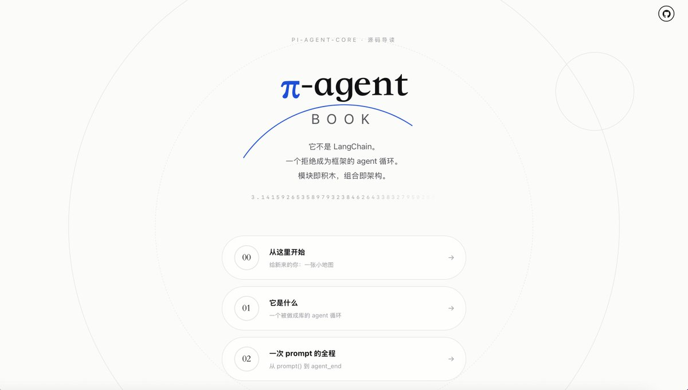
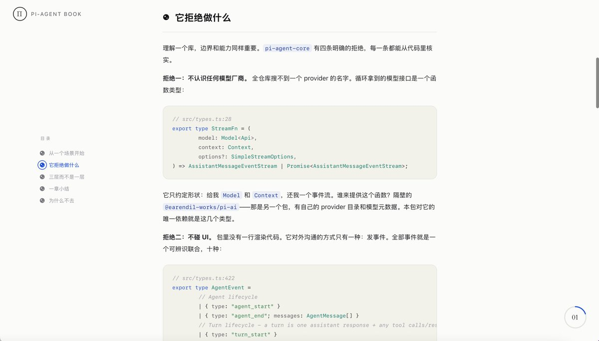
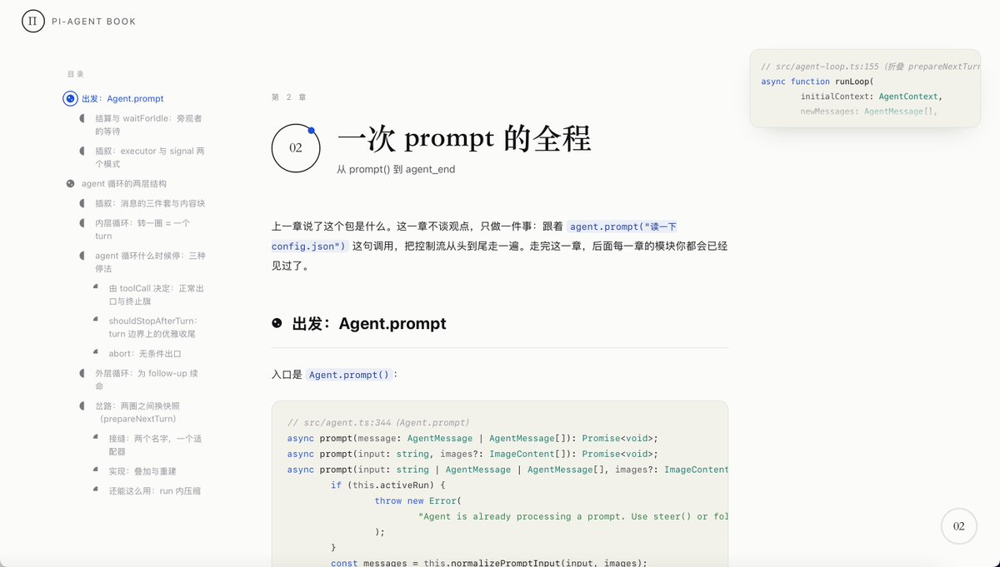
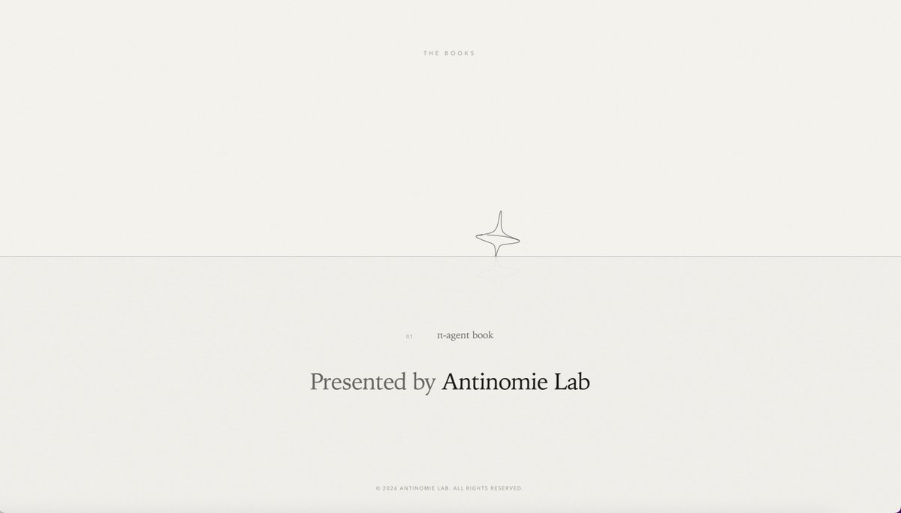
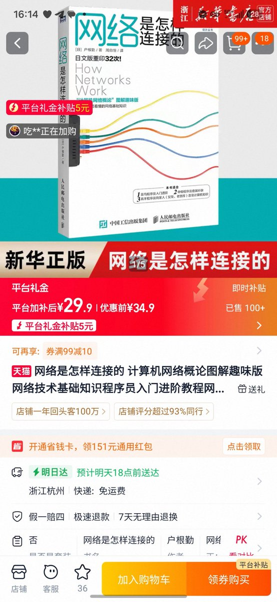
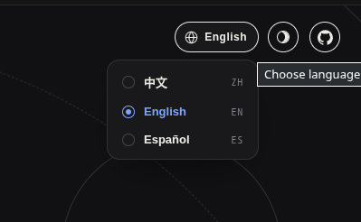

pi codebase book 第 1、2 章上线：[books.antinomie.org/pi/](https://books.antinomie.org/pi/)
每个论断都关联源码的具体行号，写岔了欢迎来挑错
每周更新一章，因为我们希望能有不错的质量（建议在电脑上查看，因为有很多代码引用
我们的定位是想把 pi agent 的代码完全讲透，并且讲出那些可以用于构建你自己的 agent 的思想，这部分的话部分章节除了分析代码之外还有一个独立 part「从 pi 到任何 agent」，会之后再放出
github repo：[github.com/antinomie-lab/…](https://github.com/antinomie-lab/pi-book)
如果大家觉得讲得不错还请多多 star（逃
网页走的是极简风格，前端也在持续打磨中
希望大家喜欢，也欢迎大家支持 Antinomie Lab 的后续 project～

### 🖼️ Attached Media

## 💬 Replies

### 1 @yutao56666761 (yutao)

*Sat Aug 08 13:38:02 +0000 2026*

@QuantumTransf 谢谢分享，学习了

### 2 @BtreeWw (BinaryTree)

*Sat Aug 08 08:12:56 +0000 2026*

@QuantumTransf 不错不错，看着像看小说一样。

### 3 @QuantumTransf (Yuu💖) (Author)

*Sat Aug 08 08:15:45 +0000 2026*

@BtreeWw hhh 其实是参照了「网络是怎样连接的」这种比较轻松的风格
然后同时又不想失去读代码的深度\~这大概是和这本书不太一样的地方\~
不知道你会怎么看第二章这种把全流程都讲清楚的写法，很多问题都是我自己读代码时候有的，所以写进去了，也算是一种费曼学习法的实践吧 

### 4 @hotpotjupyter (火锅底料)

*Sat Aug 08 15:28:40 +0000 2026*

@QuantumTransf 排版很舒服

### 5 @QuantumTransf (Yuu💖) (Author)

*Sat Aug 08 16:32:55 +0000 2026*

@hotpotjupyter 谢谢w，有认真设计怎么读比较舒服（
可以好好利用悬浮代码块 xx

### 6 @punk2sang (Paulchan)

*Sat Aug 08 11:03:57 +0000 2026*

@QuantumTransf 里面一直出现的 举旗 是不是直接用flag原英文就好了，中文里应该也没有这么说的吧

### 7 @QuantumTransf (Yuu💖) (Author)

*Sat Aug 08 11:53:37 +0000 2026*

@punk2sang 我不觉得直接用 flag 比较好…flag 出现在中文里一般都是「打 flag」之类的搭配，直接出现「flag」会很怪
当然我承认「举旗」也不是一个很好的说法，但这个说法来自于航海，我认为还是比较形象的

### 8 @SuHuan2hen (今天也要加油努力)

*Sat Aug 08 08:42:55 +0000 2026*

@QuantumTransf wo03ne

### 9 @QuantumTransf (Yuu💖) (Author)

*Sat Aug 08 10:16:33 +0000 2026*

@pv\_wen 下周

### 10 @FrancoE114696 (Fran Escob)

*Sun Aug 09 22:19:34 +0000 2026*

@QuantumTransf just sent a PR with translation to English and Spanish! Amazing book, thanks.
[github.com/antinomie-lab/…](https://github.com/antinomie-lab/pi-book/pull/3) 

### 11 @QuantumTransf (Yuu💖) (Author)

*Mon Aug 10 01:04:10 +0000 2026*

@FrancoE114696 What a great way to start the day! Thanks for the PR! Let me grab my morning coffee (or get fully awake) first, and I'll review it shortly. ✨

### 12 @dddanielwang (DanielW)

*Sat Aug 08 07:48:17 +0000 2026*

@QuantumTransf 狠狠追更

### 13 @QuantumTransf (Yuu💖) (Author)

*Sat Aug 08 07:50:15 +0000 2026*

@dddanielwang 那我努力不断更🥺

### 14 @Xudong07452910 (Xudong Han)

*Sat Aug 08 13:42:43 +0000 2026*

@QuantumTransf 好东西呀，下次分享一下

### 15 @QuantumTransf (Yuu💖) (Author)

*Sat Aug 08 13:43:13 +0000 2026*

@Xudong07452910 好呀，谢谢你☺️

### 16 @hackeryangtze (hackeryangtze)

*Sat Aug 08 15:17:40 +0000 2026*

@QuantumTransf 看完了 不错 期待更新

### 17 @QuantumTransf (Yuu💖) (Author)

*Sat Aug 08 15:25:39 +0000 2026*

@hackeryangtze 谢谢夸奖 www，我们会继续努力的\~

### 18 @hebbarmp (s.h)

*Sun Aug 09 13:33:12 +0000 2026*

@QuantumTransf English please.

### 19 @QuantumTransf (Yuu💖) (Author)

*Sun Aug 09 13:41:08 +0000 2026*

@hebbarmp It’s in our plan, don't worry!

### 20 @zhan9san (Jack)

*Mon Aug 10 02:43:34 +0000 2026*

@QuantumTransf 第一次读到“为什么不去”时，感觉有点晦涩

是不是可以润色下

[github.com/antinomie-lab/…](https://github.com/antinomie-lab/pi-book/blob/main/agent/01-what-it-is.md#%E4%B8%BA%E4%BB%80%E4%B9%88%E4%B8%8D%E5%8E%BB)

我看到英文翻译使用的是"Why not"，相比中文更简洁
[github.com/antinomie-lab/…](https://github.com/antinomie-lab/pi-book/pull/3/changes#diff-10981db2b9939451a3b1cb357fdc6f48a6b75aecd572b0c65caaadec3ada84feR138)

### 21 @QuantumTransf (Yuu💖) (Author)

*Mon Aug 10 05:06:43 +0000 2026*

@zhan9san 我觉得这里是我有意制造的辨识度（？
因为这是一个会反复出现的小节结构

### 22 @_ChangYo_ (ChangYo)

*Mon Aug 10 03:56:41 +0000 2026*

@QuantumTransf 老师你的参考的pi源码的版本似乎不太对，而且第01章引用的agent-harness. ts文件刚好上周被重构了，diff很大😂
我已提issue了

### 23 @QuantumTransf (Yuu💖) (Author)

*Mon Aug 10 04:48:37 +0000 2026*

@\_ChangYo\_ 好像有标注是什么版本的？没记错的话是上周的版本吧（我看看

### 24 @leon7hao (leon7hao)

*Sat Aug 08 07:41:00 +0000 2026*

@QuantumTransf 坐等更新

### 25 @mianbao1024 (CyberGhost)

*Sat Aug 08 14:11:57 +0000 2026*

@QuantumTransf 感谢大佬写这类内容😇已关注

### 26 @Ma7039Ma (mjhhh)

*Sat Aug 08 11:47:21 +0000 2026*

@QuantumTransf 点赞

### 27 @keikurosawa0721 (KeiKurosawa0721)

*Sun Aug 09 03:32:52 +0000 2026*

@QuantumTransf 这个好，我严肃阅读

### 28 @Vinen77 (Vinen)

*Sat Aug 08 15:47:50 +0000 2026*

@QuantumTransf 看到浅拷贝突然一惊，浅拷贝深拷贝DNA动了

### 29 @alkaidy2025 (DeDi)

*Sun Aug 09 11:03:08 +0000 2026*

@QuantumTransf 代码逐行溯源显著提升技术文档的可验证性

