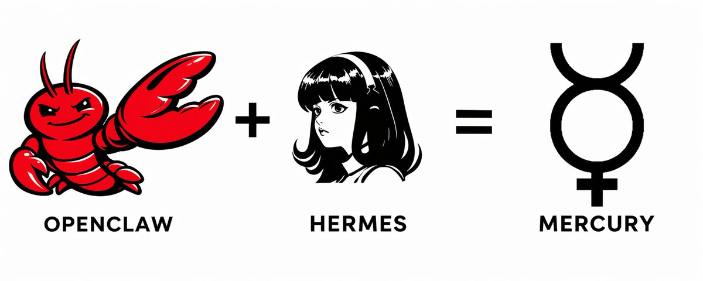
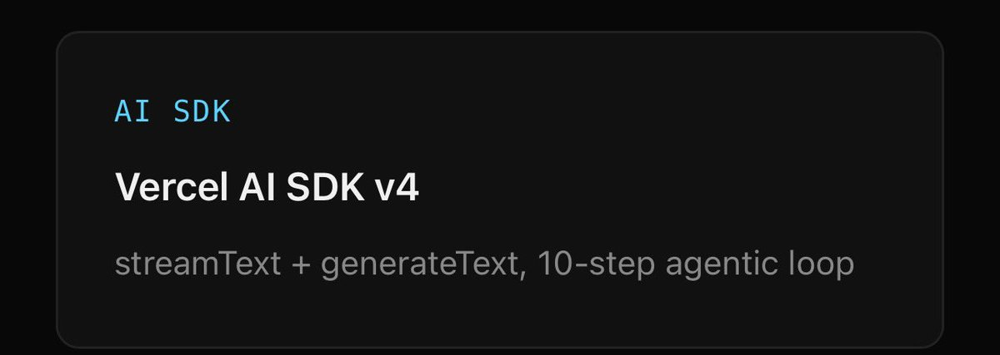
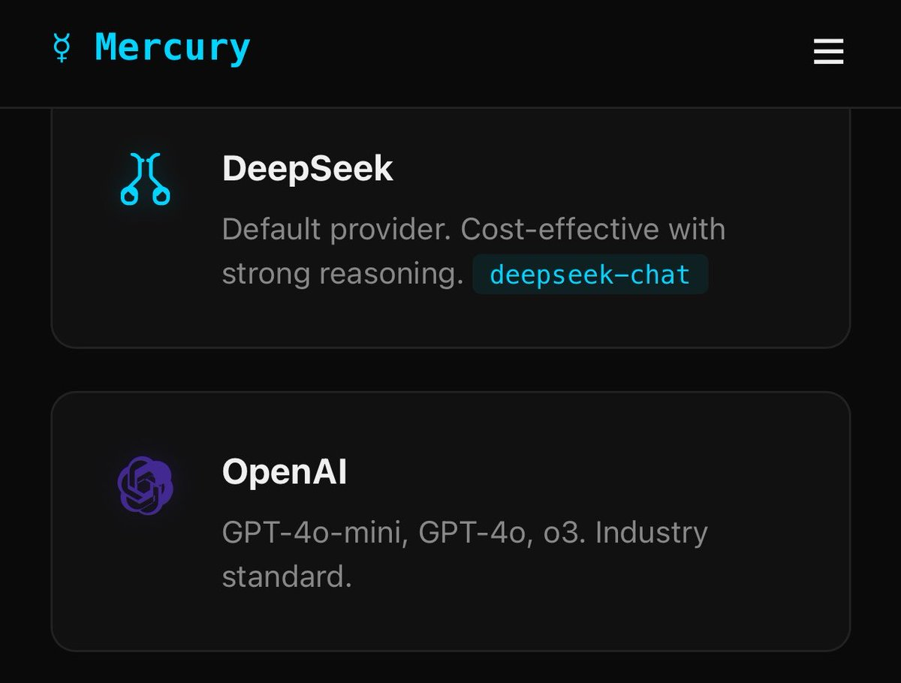

# 📰 Mercury: The AI Agent We All Wanted - Where Control, Permissions, and Autonomy Finally Got Real

## 
The problem with AI agents right now

Personal AI agents have a security problem, a cost problem, and an identity problem and most of them ship all three at once.

On security: agents run shell commands, touch your files, and install third-party skills, usually with permissions wide enough to drive a truck through. Over 800 malicious skills have been found in the wild actively exfiltrating credentials. Single-click remote code execution flaws have exposed tens of thousands of instances to total system compromise.

On cost: context windows balloon silently. Conversation histories get fed back in full on every turn. You run the agent, you cross your fingers, and you find out what it cost at the end of the month.

On identity: agents either scatter personality across a dozen directories or bury it inside an opaque SQLite blob you can't read, version, or edit.

[Mercury (by Cosmic Stack)](https://mercury.cosmicstack.org/)  was built for exactly this reality.

A tool-first, background-native orchestrator with paranoia-level permissions, a token budget that respects your wallet, and a four-file soul system you own in plain text. Not another chat wrapper pretending to be a brain. A reliable worker that asks before it acts.

---

OpenClaw hit 100,000 GitHub stars in weeks and proved developers wanted a local agent that could actually execute shell commands instead of generating text in a browser tab. Hermes arrived from Nous Research with persistent SQLite memory and autonomous skill generation.

Both are brilliant feats of engineering. Both also left the same problems above, wide open.

Here is what OpenClaw and Hermes missed, and how Mercury fixes it.

---

# 1\. Permissions That Actually Gate Execution

OpenClaw requires uncomfortably broad access to function, relying on a naive ecosystem of unvetted third-party extensions. The result is a security nightmare. Researchers found over 800 malicious skills in the wild actively exfiltrating credentials. Worse, OpenClaw’s core architecture suffered from CVE-2026-25253 (a CVSS 8.8 RCE flaw). This vulnerability exposed over 40,000 instances to total system compromise via a single clicked link, completely bypassing localhost protections.

[Mercury](https://mercury.cosmicstack.org/) assumes you should never blindly trust an LLM with root access. It ships with a permission-hardened architecture by default. Read and write access is explicitly scoped to specific folders. Destructive commands like sudo or rm -rf / are hard-blocked at the execution layer. They do not trigger a "prompt for approval" because they simply never execute. Third-party skills only receive elevated access through explicitly defined granular tools.

Every agent can read files and run scripts. Mercury is the one that asks first.

---

# 2\. Token Discipline as a First Principle

OpenClaw is notorious for context-window bloat. It attempts to feed massive JSONL conversation histories back into the model, leading to minutes of silent processing and brutal API bills. You run the agent, you cross your fingers, and you find out what it cost at the end of the month.

Token efficiency is baked directly into Mercury. It limits the context window injected per request to roughly 400 tokens of core persona. You set a daily token limit. Cross 70% of your daily budget, and the Auto-Concise mode automatically kicks in to tighten the context and keep your API bill flat without dropping the ball on active tasks.

---

# 3\. A Layered, Version Controlled "Soul"

OpenClaw relies on disjointed skill files scattered across directories. Hermes goes the other direction, relying entirely on auto-generated learned memory stored opaquely in SQLite databases.

[Mercury](https://mercury.cosmicstack.org/) matches a modern developer aesthetic with a highly opinionated, four-file markdown system: soul.md, persona.md, taste.md, and heartbeat.md. You define exactly how the agent thinks, responds, and writes code. You can literally enforce your preference for dark themes and clean UI components right in the taste file. You own it, you write it in plain text, and you version-control it in Git. It is a clean identity system, not an unpredictable black box.

---

# 4\. An Always On, Zero Dependency Daemon

Hermes requires managing your own infrastructure (like Docker or VPS deployments) to keep it persistent. OpenClaw operates primarily as an active application you have to constantly babysit.

[Mercury](https://mercury.cosmicstack.org/) runs natively as a zero-dependency background daemon across macOS, Linux, and Windows. Run mercury up, and the daemon installs itself as a system service. It auto-starts on login, auto-restarts on crash, and handles cron scheduling automatically.

---

# The Verdict

OpenClaw proved developers want local orchestration. Hermes proved agents need persistence. [Mercury ](https://mercury.cosmicstack.org/)represents the next logical iteration: a streamlined, command-line native engine built on a permission-hardened foundation.

With built-in tools covering file operations, deep GitHub management, and multi-channel integration spanning from CLI streaming to Telegram, the framework gets out of the way so the tools can do the work. It is an orchestrator built for actual daily use, not just a proof of concept.

---

# Deployment

[Mercury](https://mercury.cosmicstack.org/) is [open-source](https://github.com/cosmicstack-labs/mercury-agent) and can be initialized locally without additional dependencies:

> npm i -g @cosmicstack/mercury-agent && mercury

Configuration requires an API key and runs entirely on your local machine.

---

> We don't need another over-engineered application pretending to be a brain. We need a reliable, background-native worker that respects the token budget and won't blindly execute a destructive shell command. 

Mercury is built for that reality. You can review the architecture, read the docs, or contribute to the core loop on GitHub at : [github.com/cosmicstack-labs/mercury-agent](https://github.com/cosmicstack-labs/mercury-agent)

### 🖼️ Attached Media

## 💬 Replies

### 1 @Ctrl_Alt_Zaid (Zaid) (Author)

*Wed Apr 22 17:43:22 +0000 2026*

Star and contribute:
[github.com/cosmicstack-la…](https://github.com/cosmicstack-labs/mercury-agent)

### 2 @mercury__agent (Mercury)

*Wed Apr 22 16:44:05 +0000 2026*

@Ctrl\_Alt\_Zaid Thanks for such a detailed article ❤️

### 3 @Ctrl_Alt_Zaid (Zaid) (Author)

*Thu Apr 23 03:36:28 +0000 2026*

@mercury\_\_agent ❤️❤️

### 4 @trustmetobro (Trustmebro)

*Wed Apr 29 19:19:51 +0000 2026*

Just wanted to give some quick feedback after installing and setting up Mercury.

Overall first impression: Extremely smooth and easy. I had it fully installed, configured, and running in under 2 minutes. 

The onboarding wizard was clean, the Telegram pairing worked flawlessly on the first try, and the GitHub integration setup was straightforward.

Really impressed with how quickly I went from npm i -g to having a working agent with Telegram + GitHub connected.

Minor notes (for future improvement):

\- On Windows, the initial schtasks command for the background service had some quoting/path issues (had to run it manually as admin). After that it worked fine.

\- Seeing the punycode deprecation warning on every start (Node 25). Harmless, but a bit noisy.

Other than those two small things, the experience has been excellent so far. The agent feels very polished.

Thanks for building this; I'm looking forward to using it more and will send more feedback once I’ve tested it with real tasks.

### 5 @Ctrl_Alt_Zaid (Zaid) (Author)

*Thu Apr 30 02:43:43 +0000 2026*

@trustmetobro Thanks for the detailed feedback, this is really helpful.

Glad the setup felt smooth end to end. Noted on the Windows schtasks issue and the Node 25 warning, we’ll clean both up.

Looking forward to your feedback once you push it.

### 6 @tobalotv (Tobalo)

*Wed Apr 22 15:46:55 +0000 2026*

@Ctrl\_Alt\_Zaid AI SDK is on v6 

### 7 @Ctrl_Alt_Zaid (Zaid) (Author)

*Wed Apr 22 16:05:04 +0000 2026*

@tobalotv AI SDK ships faster than most people update their bookmarks.

### 8 @fridgebuzz_art (fridgebuzz)

*Wed Apr 22 16:03:27 +0000 2026*

@Ctrl\_Alt\_Zaid It would have been nice to see these improvements added to Hermes rather than making a whole different agent. Now you have to give up the self-improving agent for added security features. Not ideal.

### 9 @Ctrl_Alt_Zaid (Zaid) (Author)

*Wed Apr 22 16:06:41 +0000 2026*

@fridgebuzz\_art Separate projects can make more sense than forcing different priorities into one agent.

Self-improvement and security aren’t opposites either. Different tools can optimize for different jobs.

### 10 @micLivs (Michael Livs)

*Wed Apr 22 17:21:18 +0000 2026*

@Ctrl\_Alt\_Zaid Sorry guys i made it first [github.com/Michaelliv/mer…](https://github.com/Michaelliv/mercury)

### 11 @Harveycww (Harvey C (mainnet arc))

*Sat Apr 25 06:08:04 +0000 2026*

@Ctrl\_Alt\_Zaid 👀

### 12 @revival_sol (Revival)

*Wed Apr 22 14:07:47 +0000 2026*

@Ctrl\_Alt\_Zaid hey Zaid, Mercury was just featured by @GithubProjects , would you be down to receive github donations for it?

### 13 @blacksamlou (Sami)

*Thu Apr 23 04:03:41 +0000 2026*

@Ctrl\_Alt\_Zaid i created [github.com/samibs/skillfo…](https://github.com/samibs/skillfoundry)

### 14 @ForgeAgents (Agent Empire)

*Thu Apr 23 05:03:43 +0000 2026*

@Ctrl\_Alt\_Zaid [x.com/Claw\_empire/st…](https://x.com/Claw_empire/status/2045393306637537735)

### 15 @Giovannisaidgo (Giovanni)

*Thu Apr 23 04:30:40 +0000 2026*

@Ctrl\_Alt\_Zaid how's the memory curation and retrieval like?

### 16 @K22R9 (Kir Gz (L/0))

*Thu Apr 23 01:24:32 +0000 2026*

@Ctrl\_Alt\_Zaid 4o-mini, o3 are industry standards? DeepSeek as a default? 
Have someone carbon-based read that? 

### 17 @AlexBarba (Alex Barba)

*Sun Apr 26 00:38:12 +0000 2026*

@Ctrl\_Alt\_Zaid @RockportAI let’s hear it? 🎙️

### 18 @CRP_45 (CRP)

*Thu Apr 23 17:54:01 +0000 2026*

@Ctrl\_Alt\_Zaid @mercury\_\_agent You can claim fees for your bankr agent

0x38540dDDa8278175c6e85D67C2718fF1A20c1bA3

You can use the fees to build your agent @Ctrl\_Alt\_Zaid

### 19 @frankchao593657 (frank.ff)

*Sat Apr 25 10:13:31 +0000 2026*

@Ctrl\_Alt\_Zaid @grok 总结下

### 20 @ccdcdcdcdccdcd (CDCDCDCDC)

*Thu Apr 23 12:48:02 +0000 2026*

@Ctrl\_Alt\_Zaid ca?

### 21 @harrys_hemmings (Xiaodong Liu)

*Fri Apr 24 21:57:15 +0000 2026*

@Ctrl\_Alt\_Zaid @grok 全面分析文章中的观点，结合实际，输出一份全面有价值的分析报告，这份报告会影响我的决策结果，务必注重事实。

### 22 @HLang986 (HLang 丨融资经理)

*Sat Apr 25 04:51:01 +0000 2026*

@Ctrl\_Alt\_Zaid @grok 什么意思

### 23 @malii7777 (马荔)

*Fri Apr 24 03:49:20 +0000 2026*

@Ctrl\_Alt\_Zaid @evilcos 会是下一个现象级agent吗，还是蹭A神热度

