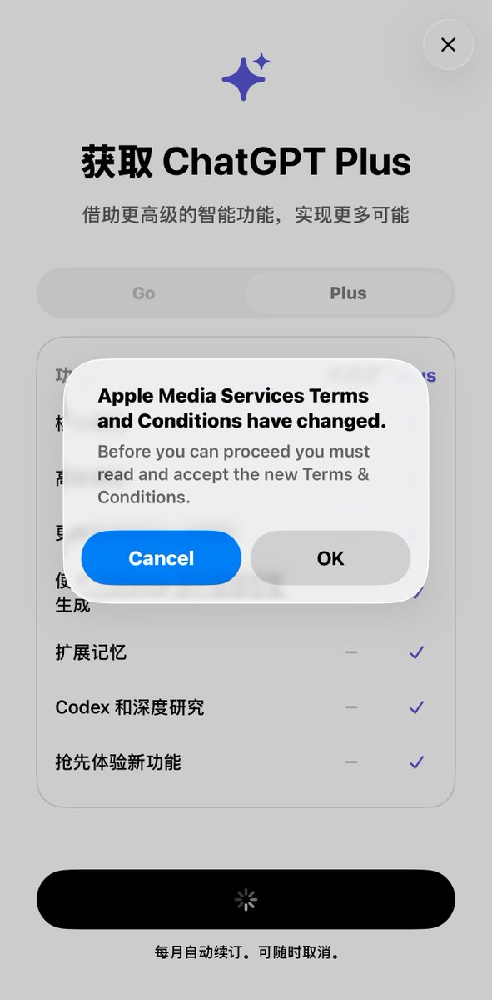
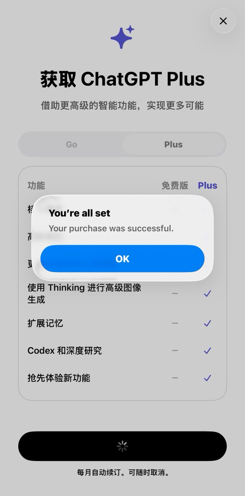
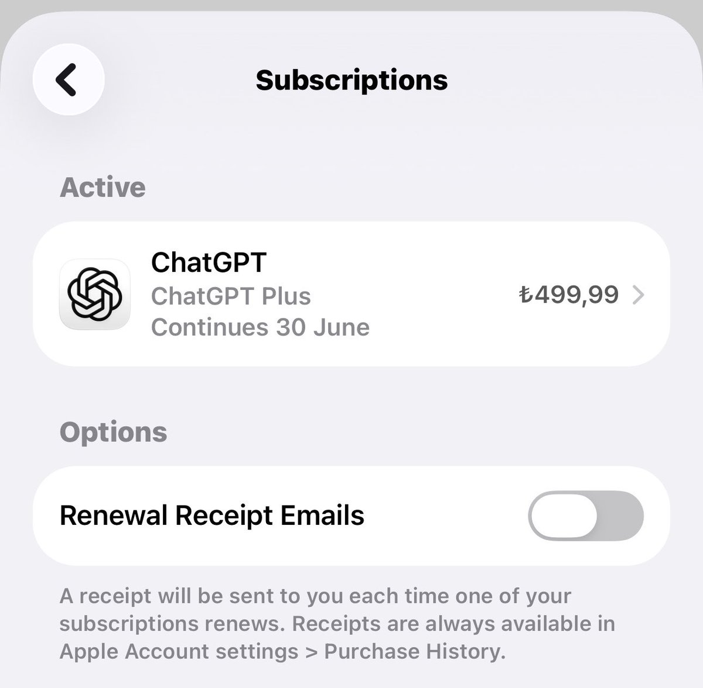
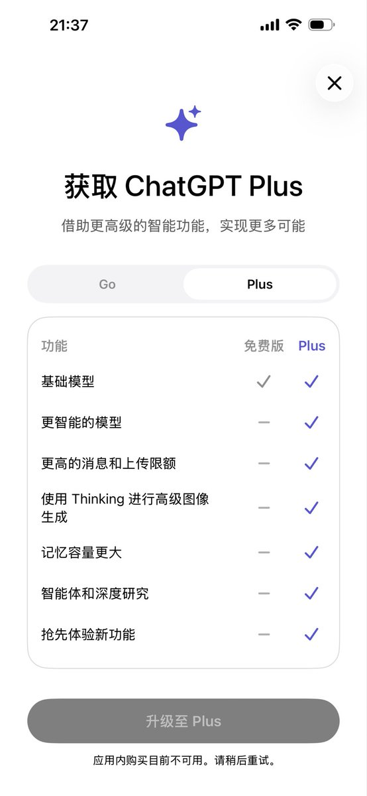

搞定土耳其区Apple ID和ChatGPT 订阅了，花了76人民币开通一个月的Plus。

全程不到半小时，流程极简

1、注册Apple ID（随便哪个区）
2、登陆商店换成土耳其区🇹🇷
3、生成土区虚拟[meiguodizhi.com/tr-address](https://www.meiguodizhi.com/tr-address)G8
4、充值礼品卡
5、购买ChatGPT 订GI

## 💬 Replies

### 1 @sunkaixuan1718 (GoalTrader 喵关喵回版)

*Sun May 31 05:37:35 +0000 2026*

@GTAZion 每次gpt新更新发布的时候 那一定是最划算的时候， 因为你可以白嫖它2个月

### 2 @BarrettDream (霹雳游侠)

*Sat May 30 12:17:10 +0000 2026*

@GTAZion 实际地址随便填，有占位就行，我一般是gggg hjjj ssdd之类的，选填的我连乱按都不按，直接空白。😂

### 3 @GTAZion (Zion（全球交友版）) (Author)

*Sat May 30 12:20:11 +0000 2026*

@Johnxxmith 你这条经验绝了，现在很多号都开始严格KYC了，所以习惯性搞个地址生成器。

### 4 @jasmin0828 (Jasmin• Alpha Hunter)

*Sat May 30 11:11:33 +0000 2026*

@GTAZion 恭喜🎉，配合到 codex 使用，爽歪歪🤩

### 5 @GTAZion (Zion（全球交友版）) (Author)

*Sat May 30 11:17:48 +0000 2026*

@jasmin0828 无敌，现在在搞Codex了，一头雾水，有得折腾了

### 6 @fark990020900 (火星Silver Bullet)

*Sat May 30 12:35:31 +0000 2026*

@GTAZion 用U卡不是 百分百返还？

### 7 @GTAZion (Zion（全球交友版）) (Author)

*Sat May 30 12:40:07 +0000 2026*

@fark990020900 还有这种福利？🤔

### 8 @AAAget10m (听说我是AAA)

*Sat May 30 12:43:50 +0000 2026*

@GTAZion 换区，信用卡这关过不去。都显示卡在此不可用

### 9 @GTAZion (Zion（全球交友版）) (Author)

*Sat May 30 12:45:26 +0000 2026*

@AAAget10m 直接刚注册就可以换区，我刚注册是美区，绑卡那一项选择None，填写账单地址和自己手机号就可以了。

### 10 @qinjinling (Rylan)

*Sun May 31 01:12:36 +0000 2026*

@GTAZion 连续两个月美区 20 美元订阅，今天换了土区 id，不过不敢在闲鱼上买礼品卡，oyunfor 上买的，可以用国内信用卡付款

### 11 @GTAZion (Zion（全球交友版）) (Author)

*Sun May 31 01:22:01 +0000 2026*

@qinjinling 一直在闲鱼买，美区的买了几年了

### 12 @Ai_JasonX (JasonX)

*Sat May 30 11:24:56 +0000 2026*

@GTAZion 注册下来要等多久再充chatgpt plus 会员呢？

### 13 @GTAZion (Zion（全球交友版）) (Author)

*Sat May 30 11:26:18 +0000 2026*

@Ai\_JasonX 马上可以，不用等，设置好账单地址就可以了

### 14 @TuningZhou (Tuning Zhou)

*Sat May 30 11:13:07 +0000 2026*

@GTAZion 要一直使用土耳其的IP吗？

### 15 @GTAZion (Zion（全球交友版）) (Author)

*Sat May 30 11:16:37 +0000 2026*

@TuningZhou 哪里的ip 都可以，先把ID搞下来，然后换国家，就行，如果注册成功个人主页显示的是土耳其，那就不用改了。

### 16 @feixingdehelanr (相当钻石手的恐龙🔆)

*Sat May 30 12:09:38 +0000 2026*

@GTAZion 太强了  这不得狠狠收藏  我的codex可以重新启动了

### 17 @GTAZion (Zion（全球交友版）) (Author)

*Sat May 30 12:13:40 +0000 2026*

@feixingdehelanr 我的codex也正在启动，马上就绑定好了。丝般顺滑，然而，不是程序员出身的我看到里面一堆术语也是崩溃了，随便做了个项目，还算不错，看来得端起自己的GitHub 了。

### 18 @JieSeeker (只想赢一次)

*Sat May 30 15:51:14 +0000 2026*

@GTAZion 封号吗🤔

### 19 @GTAZion (Zion（全球交友版）) (Author)

*Sat May 30 16:00:45 +0000 2026*

@JieSeeker 正儿八经用不封

### 20 @rasitakyol (Rasit Akyol)

*Sat May 30 18:19:30 +0000 2026*

@GTAZion ben türkiyedeyim ve bu fiyatları görmüyorum, muhtemelen eski kullanıcıları hala global havuzdan devam ettiriyorlar, eski kullanıcı olmak cezalandırılıyor gibi

### 21 @GTAZion (Zion（全球交友版）) (Author)

*Sat May 30 18:36:00 +0000 2026*

@rasitakyol 为什么呢？这价格不是都公布出来的吗？而且据说现在你们那边也不是全球最低的了，最低的是非洲的。我不知道为什么老用户会被惩罚，人们买东西不是都可以货比三家吗？谁会一直找贵的东西买呢？有便宜的商品大家都会分享出来不是吗？🤜🏼🤛🏻

### 22 @FenderXu (Fender_666)

*Sat May 30 21:55:24 +0000 2026*

@GTAZion 用到 codex 中的用量是不是不多？

### 23 @GTAZion (Zion（全球交友版）) (Author)

*Sat May 30 23:28:11 +0000 2026*

@FenderXu 对，目前跑了几个项目，都很难跑完当日的，所以普通人几乎很难用完

### 24 @songzhigao007 (志高)

*Sat May 30 19:28:20 +0000 2026*

@GTAZion 尼区没出现none付款选项,信用卡付款绑定绑不上，我充值礼品卡用礼品卡支付claude会员能成功吗

### 25 @GTAZion (Zion（全球交友版）) (Author)

*Sat May 30 19:58:32 +0000 2026*

@songzhigao007 有空我研究下尼区看看，土区直接选None就可以。克劳德这会应该不如codex了吧？

### 26 @anonyer01 (anonyer)

*Sat May 30 19:37:54 +0000 2026*

@GTAZion 注册的apple id必需要双重认证吗

### 27 @GTAZion (Zion（全球交友版）) (Author)

*Sat May 30 20:00:06 +0000 2026*

@anonyer01 不用，我直接86手机和gmail绑定，然后ChatGPT 要美国手机验证，我前面帖子有试过开通ESIM ，可以参考下。

### 28 @XaYuan88164 (yuan xa)

*Tue Jun 02 13:37:48 +0000 2026*

@GTAZion 现在他不让我充了说是应用内购不可用 

### 29 @GTAZion (Zion（全球交友版）) (Author)

*Tue Jun 02 13:51:16 +0000 2026*

一般最好是新号绑定，不需要等待。

我问了ChatGPT ，它是这么回答的：

1\. 先等 24–48 小时
    尤其是你刚下载 App、刚切换 App Store 地区、刚换 Apple ID、刚新建 ChatGPT 账号时，最容易这样。

2\. 检查 iPhone 是否禁用了内购
    路径：
    设置 → 屏幕使用时间 → 内容和隐私访问限制 → iTunes 与 App Store 购买项目 → App 内购买 → 允许

3\. 检查 Apple ID 地区和付款方式
    如果你是土耳其区、韩区、美区、港区来回切，或者付款方式不匹配，App 内购很容易灰掉。
    建议：先固定一个区，不要频繁切；付款方式、账单地址、App Store 地区要一致。

4\. 退出 ChatGPT 重新登录
    尤其确认你登录的是要开 Plus 的那个账号。移动端订阅会同时绑定 Apple ID / Google Play 账号和当时登录的 ChatGPT 账号，不能随便转到另一个 ChatGPT 账号。 

5\. 如果之前已经买过 Plus
    在 ChatGPT App 里点：
    设置 → Account / 账户 → Restore purchases / 恢复购买
    
OpenAI 官方说明，App Store 购买的订阅可以用这个功能恢复。

### 30 @lengxuemotaizi (魔太子ˣ)

*Sat May 30 16:47:22 +0000 2026*

@GTAZion X会员怎么买便宜

### 31 @GTAZion (Zion（全球交友版）) (Author)

*Sat May 30 17:11:02 +0000 2026*

@lengxuemotaizi 我研究下，如果土区便宜我就换成土区买了

### 32 @KoreSUN111028 (赖屎狗)

*Sat May 30 16:56:46 +0000 2026*

@GTAZion 现在很多人订阅土区后账户被封了，你还在宣传这种

### 33 @GTAZion (Zion（全球交友版）) (Author)

*Sat May 30 17:12:32 +0000 2026*

@KoreSUN111028 我在尝试这种方式，不保证会不会被封，也不是宣传，因为我自己在做这个事，总的来说为了降本增效

### 34 @chaowang326024 (库里)

*Sat May 30 16:40:23 +0000 2026*

@GTAZion 大佬，能私信我下吗，求指导

### 35 @GTAZion (Zion（全球交友版）) (Author)

*Sat May 30 17:10:40 +0000 2026*

@chaowang326024 怎么私信？我不知道哪里可以跟你联系

