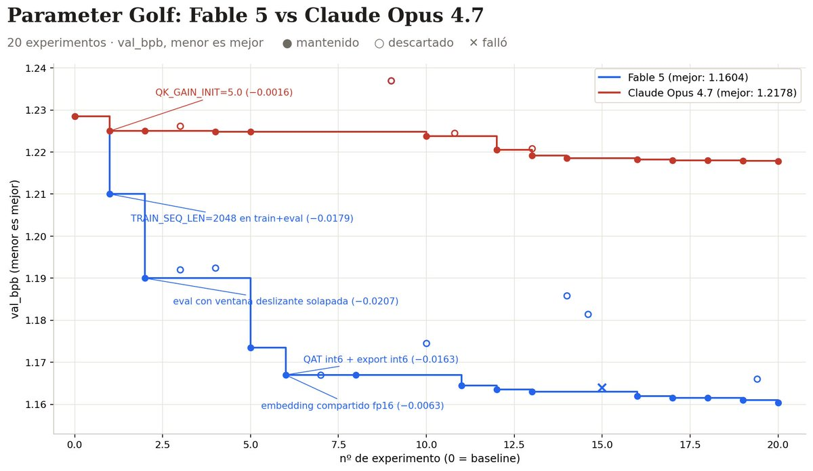
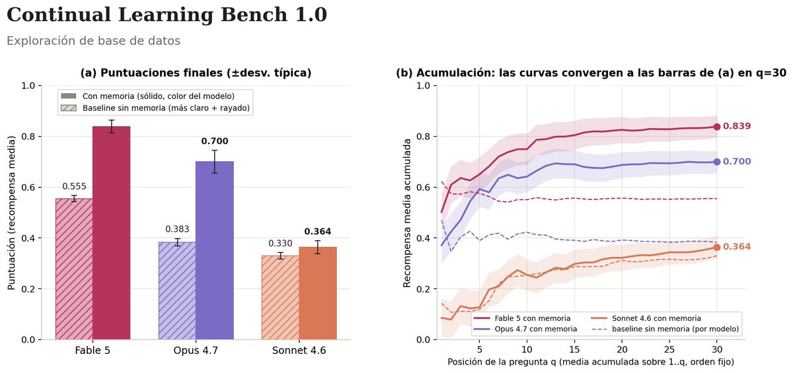
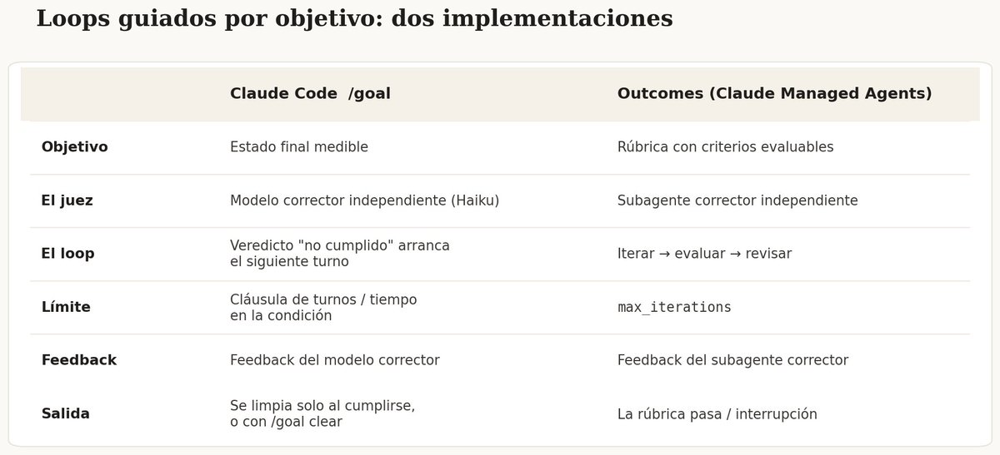
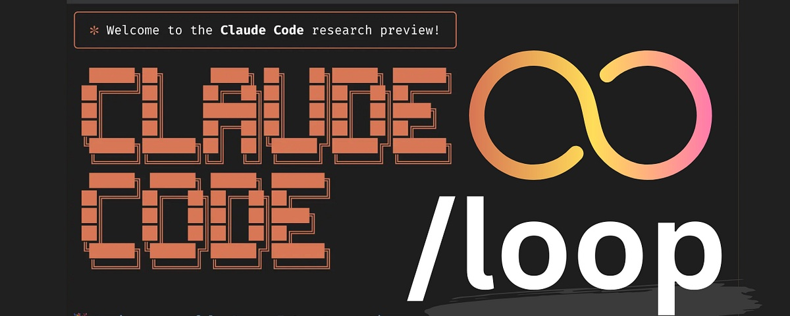

# 📰 Cómo crear Loops en Fable 5

# DEJA DE HACER PROMPTS. EMPIEZA A DISEÑAR LOOPS.

Anthropic acaba de publicar cómo trabajan internamente con Fable 5.

Y la conclusión es clara: el prompt ha muerto como unidad de trabajo.

Lo nuevo se llama Loop Engineering.

Te explico qué es, cómo funciona y cómo montarte uno hoy mismo

## 
EL PROBLEMA: TÚ ERES EL LOOP

Así hemos trabajado con agentes los últimos dos años:

→ Escribes un prompt → El agente responde → Tú revisas → Tú corriges → Tú vuelves a escribir otro prompt

¿Ves el patrón? El cuello de botella eres tú.

Cada iteración pasa por tus manos. El agente no aprende nada entre intentos. Y tu tiempo se va en revisar trabajo a medias.

Un prompt le da instrucciones al agente. Un loop le da un trabajo.

## 
QUÉ ES UN LOOP (EXPLICADO FÁCIL)

Un loop es un ciclo de feedback que el agente repite solo hasta cumplir un objetivo verificable.

Todos los loops, simples o complejos, pasan por las mismas 5 etapas:

DESCUBRIR → PLANIFICAR → EJECUTAR → VERIFICAR → ITERAR

Si pasa la verificación: termina. Si falla: vuelve a empezar con el feedback del fallo.

La clave está en la palabra "verificable". No es "haz una landing bonita". Es "todos los tests de /auth pasan y el lint está limpio".

El agente sabe exactamente cuándo ha terminado. Y tú no estás en medio.

## 
POR QUÉ FABLE 5 CAMBIA EL JUEGO

Aquí viene lo interesante. Anthropic probó Fable 5 contra Opus 4.7 en un reto real: Parameter Golf.

El reto: entrenar el mejor modelo posible que quepa en 16MB, en menos de 10 minutos, sobre 8 GPUs H100.

El agente tenía que editar el código de entrenamiento, lanzar el training, leer los logs, ver el score y decidir el siguiente experimento. Durante 8 horas. Solo.

Resultado:

→ Fable 5 mejoró el pipeline \~6 veces más que Opus 4.7

Pero lo importante no es el número. Es el CÓMO:

→ Opus 4.7 encontró una pequeña mejora al principio y repitió la misma plantilla 20 veces: tocar un parámetro, medir, quedarse con lo que sume → Fable 5 apostó por cambios estructurales grandes (arquitectura, no constantes) y aguantó una regresión de cuantización que acabó siendo su mayor victoria

Fable 5 no solo itera. Asume riesgos y se recupera de los fallos dentro del propio loop.

## 
LA REGLA DE ORO: EL QUE HACE NO ES EL QUE JUZGA

Este es el detalle que casi todo el mundo se salta.

Los modelos son malos criticando su propio trabajo. Son demasiado buenos consigo mismos. Es como corregir tu propio examen.

La solución de Anthropic: un subagente verificador independiente, con su propio contexto, que decide si el trabajo cumple o no.

En la práctica tienes dos formas de montarlo:

→ /goal en Claude Code: defines una condición medible y un modelo independiente decide si se cumplió. Si no, arranca el siguiente turno solo → Outcomes en Claude Managed Agents: defines una rúbrica con criterios evaluables y un subagente la corrige en cada iteración

En el experimento de Parameter Golf, el verificador no dejó parar a Fable 5 hasta cumplir los 9 criterios de la rúbrica.

Sin juez independiente: el agente deriva. Con juez independiente: el agente mejora.

## 
MEMORIA: EL LOOP QUE SOBREVIVE ENTRE SESIONES

Aquí está el segundo hallazgo brutal del experimento.

Probaron Fable 5, Opus 4.7 y Sonnet 4.6 en Continual Learning Bench: preguntas secuenciales sobre una base de datos SQL, donde cada pregunta es una sesión nueva pero la memoria se comparte.

Resultados finales (score medio):

→ Fable 5: 0.839 → Opus 4.7: 0.700 → Sonnet 4.6: 0.364

¿Por qué tanta diferencia? Porque usar bien la memoria tiene 5 niveles:

1. Fallar y documentarlo

1. Investigar por qué fallaste

1. Verificar la causa hasta convertirla en hecho

1. Destilar el hecho en una regla general

1. Consultar la regla en vez de rederivarla cada vez

Sonnet 4.6 se queda en el nivel 1: apunta fallos y suposiciones, pero casi nunca relee sus notas.

Opus 4.7 llega al nivel 3: crea referencias con dudas marcadas, pero solo verifica un \~17% de las veces.

Fable 5 completa el ciclo: verifica hasta el 73% de sus diagnósticos y los convierte en reglas que reutiliza en tareas futuras.

El modelo olvida entre sesiones. El archivo de memoria no. Esa es la diferencia entre un agente que empieza de cero cada día y uno que acumula conocimiento.

## 
LOOPS ABIERTOS VS CERRADOS

Antes de montar el tuyo, la distinción práctica más importante:

LOOP ABIERTO → Le das un objetivo amplio y dejas al agente explorar → Potente, pero quema tokens a lo bestia → Sin estándares claros se convierte en una máquina de slop

LOOP CERRADO → Tú diseñas el camino: objetivo claro, pasos definidos, evaluación en cada paso, punto de parada → Fiable, mejora con cada pasada y cabe en un presupuesto normal

La recomendación: empieza con loops cerrados. Cuando tengas quality gates que funcionen, abre el espacio.

## 
LOS 6 BLOQUES DE TODO BUEN LOOP

Esto es lo que construyes de verdad:

1. AUTOMATIZACIONES El latido del loop. Un prompt + una cadencia + un objetivo. /goal sigue hasta que la condición sea cierta. Tú te vas.

1. WORKTREES Agentes en paralelo sin pisarse. Cada uno con su directorio aislado en su propia rama de git.

1. SKILLS Conocimiento del proyecto escrito una vez y leído en cada ciclo. VISION.md, ARCHITECTURE.md, RULES.md. Sin esto, el loop rederiva todo tu proyecto desde cero cada vez.

1. CONECTORES (MCP) Un loop que solo ve el filesystem es un loop pequeño. Con conectores lee tu issue tracker, consulta la base de datos, abre la PR y avisa en Slack cuando el CI está en verde.

1. SUBAGENTES El que verifica nunca es el que hizo el trabajo. Un modelo fresco decide si el loop terminó.

1. MEMORIA Un simple markdown fuera de la conversación. Qué se probó, qué pasó, qué queda abierto. El loop del día 47 sabe todo lo que probaron los días 1 a 46.

## 
CÓMO MONTAR TU PRIMER LOOP (PASO A PASO)

Vale, teoría clara. Ahora vamos a montarlo de verdad.

Hay dos formas oficiales de hacerlo con Fable 5. Empezamos por la fácil.

OPCIÓN A: /goal EN CLAUDE CODE

PASO 1: Define qué significa "terminado"

Esta es la parte donde la gente falla. El objetivo tiene que ser VERIFICABLE, no una opinión.

Mal: "mejora el código de autenticación" Bien: "todos los tests de tests/auth pasan y el lint está limpio"

Si no puedes comprobarlo con un comando, no es un objetivo. Es un deseo.

PASO 2: Dale contexto al agente

Antes de lanzar nada, crea estos archivos en tu repo:

→ VISION.md: cómo se ve el éxito → ARCHITECTURE.md: stack y estructura de carpetas → RULES.md: lo que el agente nunca puede tocar

Cinco minutos escribiéndolos. Te ahorran que el loop rederive tu proyecto desde cero en cada vuelta.

PASO 3: Lanza el loop

Abre Claude Code y escribe:

/goal todos los tests de tests/auth pasan y el lint está limpio. Máximo 30 turnos.

Fíjate en la última frase: SIEMPRE pon un límite de turnos o de tiempo dentro de la condición. Es tu freno de emergencia.

PASO 4: Deja que el sistema trabaje

A partir de aquí el ciclo es automático:

→ El agente trabaja hacia el objetivo → Un modelo independiente (no el que hizo el trabajo) evalúa si la condición se cumple → Veredicto "no cumplido" = arranca el siguiente turno solo, con el feedback del juez → Veredicto "cumplido" = el goal se limpia automáticamente y el loop para

Tú vuelves cuando está en verde. Y si quieres cortarlo antes: /goal clear.

OPCIÓN B: RÚBRICA + OUTCOMES EN CLAUDE MANAGED AGENTS

Para tareas largas (horas, no minutos) la opción es CMA, que te da el harness y el sandbox alojado.

Aquí en vez de una condición escribes una RÚBRICA: un archivo con criterios evaluables, uno por línea.

Ejemplo real del experimento de Anthropic (el de Parameter Golf):

→ Ejecutar un baseline antes de tocar nada → Correr 20 experimentos → Documentar cada resultado → ...hasta 9 criterios verificables

Configuras max\_iterations como límite, y Outcomes lanza un subagente corrector que evalúa la rúbrica en cada vuelta. El agente no puede parar hasta que todo pase.

Así corrió Fable 5 durante 8 horas solo. Sin nadie mirando.

PASO EXTRA: AÑÁDELE MEMORIA

Si tu loop va a correr varios días, crea un MEMORY.md con tres secciones:

→ PROBADO: qué experimentos se hicieron y su resultado → VERIFICADO: hechos confirmados (no suposiciones) → ABIERTO: qué queda por intentar

Y añade una regla en RULES.md: "antes de empezar, lee MEMORY.md. Antes de terminar, actualízalo."

Eso es literalmente lo que hace Fable 5 mejor que nadie: convertir fallos en reglas verificadas y consultarlas en vez de rederivarlas.

## 
TU PRIMER LOOP EN 10 MINUTOS

Si quieres empezar hoy sin complicarte:

1. Elige una tarea con verificación automática (tests, lint, un script que devuelva pass/fail)

1. Escribe el objetivo como condición comprobable + límite de turnos

1. Lánzalo con /goal

1. Revisa el resultado final, no los pasos intermedios

Empieza pequeño. Un loop que funciona en una tarea aburrida vale más que diez loops ambiciosos que nunca terminan.

## 
4 LOOPS REALES QUE PUEDES MONTAR HOY

- EL LOOP DE CÓDIGO

Lee contexto → planifica el cambio → edita → ejecuta tests → si fallan, lee el error y corrige → si pasan, resume y para. Sin humano en medio.

- EL LOOP DE INVESTIGACIÓN

Define la pregunta → busca fuentes → resume → verifica afirmaciones contra las fuentes → compara contradicciones → sintetiza → para cuando la confianza supera el umbral.

- EL LOOP DE CONTENIDO

Tema + audiencia + objetivo → borrador → un agente crítico lo revisa → reescritura → puntuación contra criterios de éxito → si pasa, publica. Si no, otra vuelta.

- EL LOOP DE VENTAS

Perfil de cliente ideal → encuentra leads → enriquece con datos → cualifica → personaliza el mensaje → revisión de calidad → envía o escala a un humano.

Todos tienen el mismo esqueleto:
Objetivo → Acción → Verificación → Corrección → Repetir hasta terminar.

## 
PROMPT ENGINEER VS LOOP ENGINEER

El gap de skills que se está abriendo en 2026:

PROMPT ENGINEER → Escribe mejores instrucciones → Revisa cada output a mano → Él es el feedback loop

LOOP ENGINEER → Diseña mejores ciclos de feedback → Los tests revisan automáticamente → El sistema es el feedback loop

Uno pide: "escríbeme una función". El otro diseña: "escribe → testea → corrige hasta que esté en verde".

Las herramientas son las mismas. La mentalidad es completamente distinta.

## 
EL MATIZ FINAL (QUE NADIE DICE EN VOZ ALTA)

Dos personas pueden montar exactamente el mismo loop y obtener resultados opuestos.

Una lo usa para ir más rápido en trabajo que entiende a fondo. La otra lo usa para no entender el trabajo en absoluto.

El loop no sabe la diferencia. Tú sí.

Diseña loops como alguien que piensa seguir siendo el ingeniero. No como quien solo pulsa el botón.

Porque un loop fiable vale más que mil prompts perfectos.

### 🖼️ Attached Media

## 💬 Replies

### 1 @igus_ai (gus)

*Thu Jun 11 19:20:26 +0000 2026*

@angeldot\_ muy interesante angel!

### 2 @gerardsans (Gerard Sans | Axiom 🇬🇧)

*Fri Jul 03 01:05:00 +0000 2026*

@angeldot\_ [x.com/gerardsans/sta…](https://x.com/gerardsans/status/2072680394424451394)

### 3 @gerardsans (Gerard Sans | Axiom 🇬🇧)

*Thu Jul 23 13:36:59 +0000 2026*

@angeldot\_ [x.com/gerardsans/sta…](https://x.com/gerardsans/status/2079981112986599435)

### 4 @gerardsans (Gerard Sans | Axiom 🇬🇧)

*Wed Jul 15 00:33:49 +0000 2026*

@angeldot\_ [x.com/gerardsans/sta…](https://x.com/gerardsans/status/2077185128757944659)

### 5 @gerardsans (Gerard Sans | Axiom 🇬🇧)

*Tue Jul 07 23:11:17 +0000 2026*

@angeldot\_ PhD in fails

### 6 @LisanReloaded (Lisandro)

*Sat Jun 13 19:56:09 +0000 2026*

@angeldot\_ Lo que planteas es lo ideal si no tuviésemos que hacer malabares para optimizar el uso de tokens.

### 7 @fapradex (francis ⭐⭐⭐)

*Sat Jun 13 02:21:35 +0000 2026*

@angeldot\_ [anthropic.com/news/fable-myt…](https://www.anthropic.com/news/fable-mythos-access)

### 8 @SimonethG (SimonethG)

*Tue Jul 21 05:30:20 +0000 2026*

@angeldot\_ Hermoso! Me estaba comiendo la visión. Gracias por aclararlo 💫

### 9 @HectorMir4nda (Hector Miranda)

*Sat Jul 25 20:45:14 +0000 2026*

@angeldot\_ Y la factura que?

### 10 @guilebaldo (Guile)

*Sat Jun 13 21:12:18 +0000 2026*

@angeldot\_ Otro elemento guardado que no voy a leer. Yei!

### 11 @Big_Shark09324 (BigShakr)

*Sun Jul 12 16:45:17 +0000 2026*

@angeldot\_ Oro puro

### 12 @Hu59645Hugo (Hugo Rogelio CERROS)

*Sun Jul 26 09:43:31 +0000 2026*

@angeldot\_ How many millón have you made ?

### 13 @JMRCQuaresma (JMRCostaQuaresma)

*Mon Jul 13 00:41:23 +0000 2026*

@angeldot\_ Se lo acabo de pasar a Claude Code y le he dicho que aplique este método en su configuración para cuando se lo mencione entonces lo aplique. 😅

### 14 @rodrigotozato (Rodrigo Tozato)

*Sun Jun 14 00:37:08 +0000 2026*

@angeldot\_ @grok  resuma e cite exemplos praticos em português

### 15 @rheasouzaaa (rhea souza)

*Thu Jun 11 22:32:31 +0000 2026*

@angeldot\_ hey angel, check your DMs - paid campaign

### 16 @datouyezi (不知道起什么)

*Mon Jun 15 00:56:07 +0000 2026*

@angeldot\_ @grok 帮我归纳总结

### 17 @animals_random_ (marronald)

*Thu Jun 11 19:40:01 +0000 2026*

@angeldot\_ Muy bueno

### 18 @TrucosIAHoy (Trucos IA | Ahorra Tiempo)

*Sun Jun 14 22:56:56 +0000 2026*

Totalmente. Los Loops son la fábrica; los prompts, escribir a mano.
Lo que más cambia el juego: el subagente verificador independiente. Un CTO cabreado que no halaga. Sin eso, todo deriva en "sí, jefe, qué bonito quedó".
Fable 5 ya lo implementa de serie y la diferencia en consistencia es brutal.
Loop Engineer = Prompt Engineer retirado que solo diseña sistemas que se mejoran solos. 🔁

### 19 @RealMarvelX (MAIL)

*Wed Jul 15 09:56:41 +0000 2026*

@angeldot\_ this is peak article

### 20 @fedepiergentili (Federico Piergentili)

*Sun Jun 14 07:16:51 +0000 2026*

@angeldot\_ Buen contenido, muchas gracias por compartir.

### 21 @digows (Rodrigo P. Fraga)

*Mon Jul 27 01:44:21 +0000 2026*

@angeldot\_ I'm using [agentkavor.com](https://agentkavor.com/) for this.

### 22 @ElAdictoalaIA (Adicto a la IA | Noticias, tools & prompts)

*Sat Jun 13 14:50:39 +0000 2026*

@angeldot\_ La guía es buenísima, te la has sacado

### 23 @DmitrAI_ (DmitrAI)

*Mon Jul 13 16:59:48 +0000 2026*

@angeldot\_ 💸 $12,600 this month

### 24 @AsesorLS (Luis Silva)

*Sat Jul 11 11:54:15 +0000 2026*

@angeldot\_ Buen resumen del post de Lance Martin. Un matiz: Parameter Golf fue una sola corrida por modelo. Experimento ilustrativo, no evidencia estadística.

### 25 @gogoelectronic (gbit)

*Sat Jul 11 14:44:42 +0000 2026*

@angeldot\_ Interesante. Vamos a probar.

### 26 @Coronatot (Tomas Coronato)

*Sun Jun 14 07:50:10 +0000 2026*

@angeldot\_ Puedo utilizar esta función también en opus 4.8 sin problemas? Me gustaría mejorar más posible mis skills en Claude code

### 27 @drz073 (D10sLiberal)

*Thu Jul 16 20:52:36 +0000 2026*

@angeldot\_ fable es un pacman come tokens XD

### 28 @melowizme (Yang Liu)

*Mon Jun 15 02:12:13 +0000 2026*

@angeldot\_ @grok 总结后发送给我

### 29 @queceq67 (スクロール民(戒め))

*Tue Jun 16 18:33:42 +0000 2026*

@angeldot\_ @LilysAI\_ 要約

