# Jev Engineering: Full 10-Step Roadmap to Set Up and Use a New Brain for AI (from scratch)

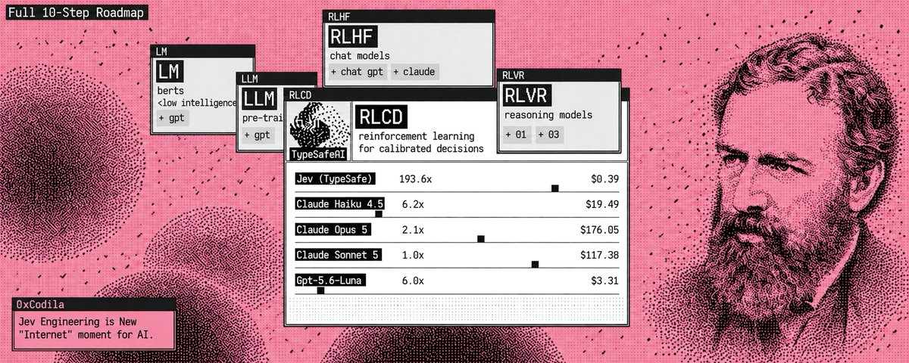

The Jevons Paradox (he's on picture) is a rule stating that an increase in the efficiency of a resource's use does not reduce, but rather increases, its overall consumption

- That's the global problem for AI: LLMs and Agents 

And Jev by @typesafeai is built to save 101% of your money, time and will improve your efficiency of using AI

So trust me - this is the 2030 setup that you need to install right now
before the alpha -  subscribe to my substack for more fresh alpha - [https://substack.com/@0xcodila](https://substack.com/@0xcodila)

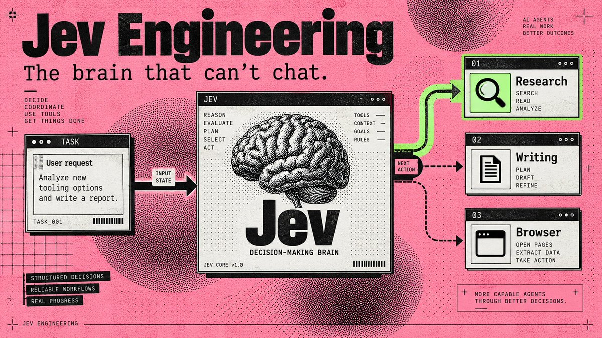

"Browser Use put Jev inside an agent that found flights in 7 seconds for $0.0039"

That gets interesting when you look at what your Chief of Staff does all day: choose a worker, check a result, decide whether to continue. Each fork can become another model call before any useful work happens

Jev gives those decisions their own model

 Your writing agent keeps writing. Your research agent keeps researching. The small judgments between them become a separate component you can inspect, price, and change.

Start with a standalone task router: enter a job, let Jev choose its destination, and save the handoff on your computer. 
Then run Browser Use's complete browser agent. (The first needs one API key; the browser project needs two)

## 01. Find the part of your agent Jev can take over

Jev is TypeSafe AI's System One model: you provide information and predefined questions, it returns typed answers with probabilities. It cannot write your briefing, generate code, or explain its reasoning in prose. [TypeSafe's launch essay](https://typesafe.ai/blog/introducing-system-one-models-and-jev)

Start with a job like this:

Research three new AI-agent tools and draft tomorrow's briefing. Save the draft for my review.

That job contains several decisions: Do we have enough sources? Which worker goes next? Is the draft ready for review?

Those are candidates for Jev. Fetching sources, writing paragraphs, and saving files still belong to your tools and generative models. An exact rule, such as stopping after ten actions, belongs in code.

For a GrokBot-style Chief of Staff, the saved handoff can feed an existing worker. Connecting that worker comes after the standalone setup below; you can complete the first run without an agent team.

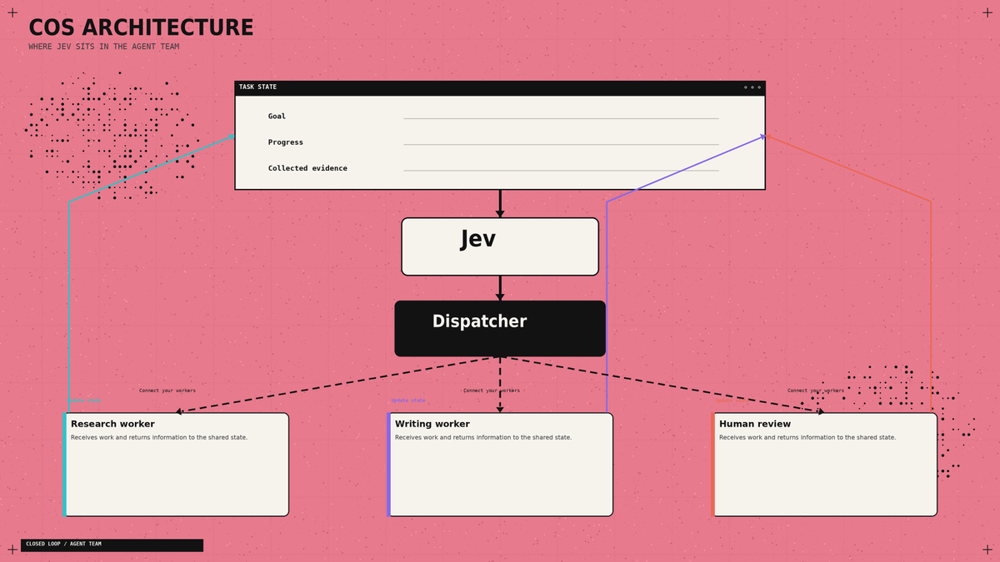

## 02. Give it one decision in the Playground

- Open the [TypeSafe Playground](https://console.typesafe.ai/playground). Sign in and complete the access process if your account requires it.
Use this as your state:

Add a Choice question: "Which worker should act next?"

Define three options: research for missing evidence, write for drafting from sufficient evidence, and review for unclear requests or completed work.

Run it. Then replace the completed-work field with actual research notes and compare the decision. This is the basic interaction described in the [official Quickstart](https://docs.typesafe.ai/introduction/quickstart).

## 03. Connect the API once

You need a TypeSafe account with API access enabled and a key from [key settings](https://console.typesafe.ai/settings/keys). API calls are billed to that account. 

Install [Python](https://www.python.org/downloads/) 3.12 or newer, then open Terminal on macOS/Linux or PowerShell on Windows.

macOS / Linux:

Windows PowerShell:

These commands create an isolated environment and install the [official Python SDK](https://docs.typesafe.ai/sdk/python). Keep your key outside source files; the script below asks for it privately.

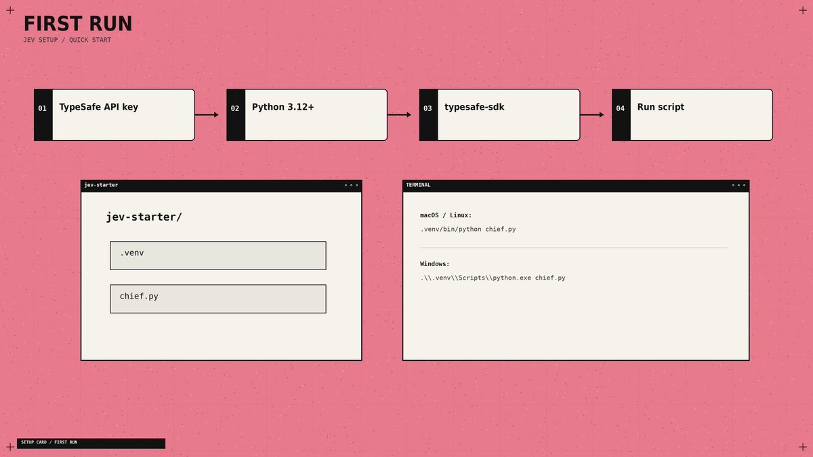

Using a coding agent? With Node.js/npm installed, add TypeSafe's official skill:

Select your supported agent when prompted. The skill gives it integration instructions; Jev itself runs through the API. [Official repository](https://github.com/typesafe-ai/skills)

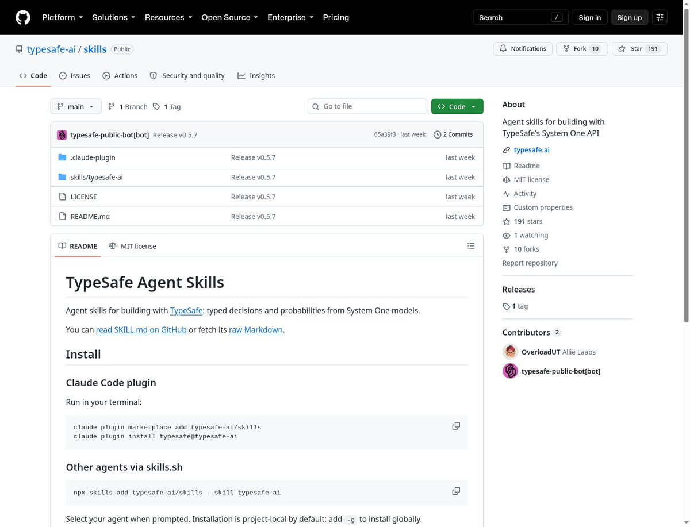

## 04. Turn a request into a saved handoff

Create chief.py inside jev-starter, outside .venv. Use a plain-text editor and save the exact filename, not chief.py.txt.

Run on macOS/Linux:

Run on Windows:

Paste your API key when asked - the terminal hides it. 
For Goal, enter Compare three AI-agent tools for tomorrow's briefing. For Completed work, enter No sources collected yet.

Your result: a Saved handoff: message with a full file path. Open that JSON file: it contains your request, progress, Jev's choice, confidence, and destination. 
Each run creates a new file under queue/research, queue/write, or queue/review. These are local task queues; a saved job waits for a worker to consume it

The API call and error handling follow the [SDK usage guide](https://docs.typesafe.ai/sdk/python/usage). I set the initial review threshold to 0.85 - adjust it using labeled examples from your workflow. Confidence is not an accuracy percentage. [Confidence guidance](https://docs.typesafe.ai/confidence)

## 05. Ask questions that lead somewhere

Three answer types cover different jobs:

Jev gives you three question types, each built for a different kind of decision:

- Choice selects one option from a list. Use it for questions like: "Who should work next?" It returns the selected option, its probability distribution, and confidence.
- Score evaluates something against a scale you define. Use it for questions like: "How relevant is this source?" It returns a value on that scale, plus probabilities and confidence.
- Noul answers a yes-or-no question. Use it for questions like: "Does this request require publishing?" It returns the probability of “yes” from 0 to 1.
Define a relevance Score with three descriptions: unrelated, partially relevant, directly addresses the question. Its numeric result runs from 0 to 2, including fractions. A Noul near 0.5 means uncertainty about yes/no. [Score](https://docs.typesafe.ai/primitives/score) · [Noul](https://docs.typesafe.ai/primitives/noul)

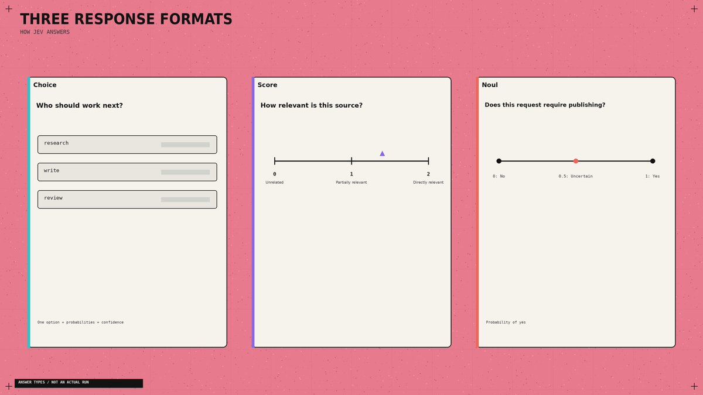

A useful detail: Jev does not see your question ID. Naming a field safe_to_publish contributes no instructions. Put the actual requirement in the question and describe each option clearly. [Choice documentation](https://docs.typesafe.ai/primitives/choice)

Also supply evidence. "The researcher finished" tells Jev less than the sources, findings, and remaining gaps. Keep those fields separate from the original request. [State documentation](https://docs.typesafe.ai/concepts/state)

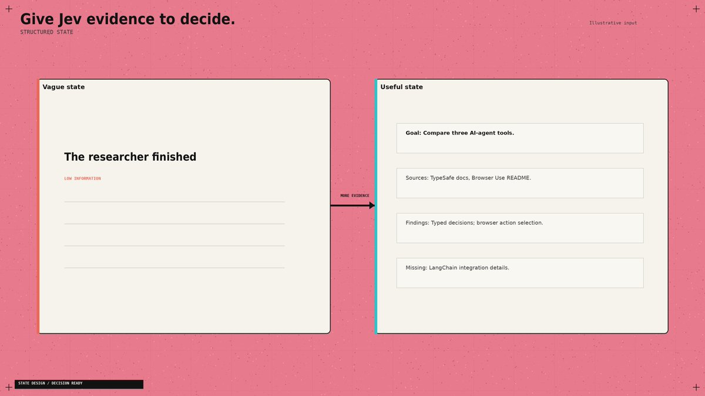

## 06. Steal Browser Use's best idea: rebuild the menu

A browser's available actions change after every click. Browser Use builds a fresh list of observed controls and lets Jev choose from that list. A small LLM generates text when an input field needs filling. [Decision implementation](https://github.com/browser-use/jev-ultrafast/blob/main/jev_ultrafast/model.py)

Apply that design to your Chief of Staff. Build the choices from workers that exist and are available now. Include the current source IDs when selecting research material. Refresh the options after a tool changes the state.

- Otherwise your decision model is choosing from yesterday's menu.
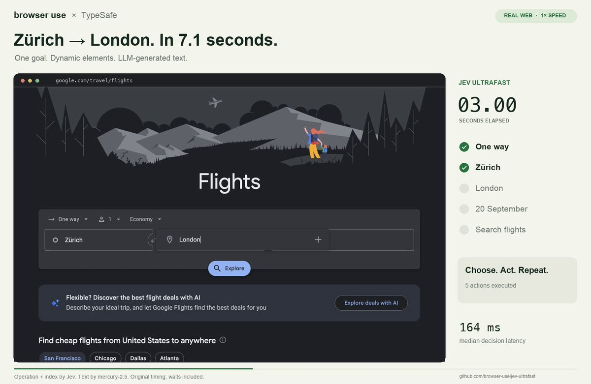

For large candidate lists, filter obvious mismatches in code, score the remaining items, then choose among the shortlist. Choice supports up to 255 options; TypeSafe describes this scoring-then-selection approach in its [launch examples](https://typesafe.ai/blog/introducing-system-one-models-and-jev)

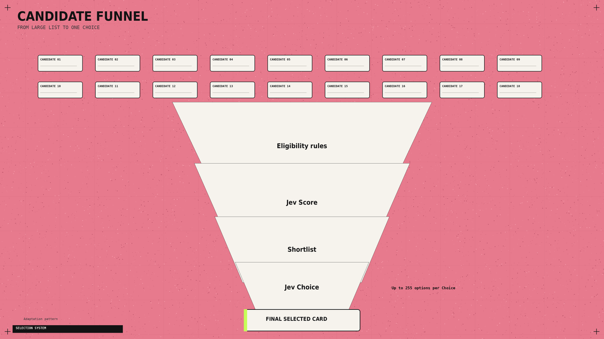

## 07. Stop paying for questions to wait on each other

Your dispatcher may need a worker, an urgency score, and an approval check. 
If all three can inspect the same state, send them together.

TypeSafe supports parallel questions and speculative branches: ask about possible next actions, then use only the answer relevant to the selected branch. 
Questions cannot read one another's answers. If a decision needs a fresh search result, perform the search first. [Parallel evaluation pattern](https://docs.typesafe.ai/patterns/fan-out)

The browser example exposes another bottleneck. Its optimized runtime reduced median browser protocol calls from 1,092 to 101, while median task time fell 25% across three matched pairs. Both versions used the same models.

The changes included collecting the page state in one read and avoiding fresh predictions for irrelevant animations. Inspect repeated tool calls before paying for a faster model. [Performance report](https://github.com/browser-use/jev-ultrafast/blob/main/docs/performance.md)

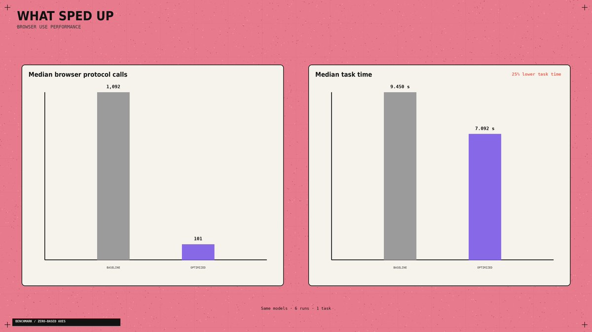

## 08. Give overnight work somewhere to stop

For a morning briefing, I'd allow source collection and draft creation, then stop at review. Publishing should require a separate permission check.

The application also needs an action limit, a spending limit, and saved progress. 
After an interruption, it should inspect the last completed action before repeating anything. A confident answer cannot prove that a file was saved or a message was sent.

Browser Use independently checks the outcome after Jev selects DONE. Borrow that separation for your own completion checks. [Agent loop](https://github.com/browser-use/jev-ultrafast/blob/main/jev_ultrafast/agent.py)

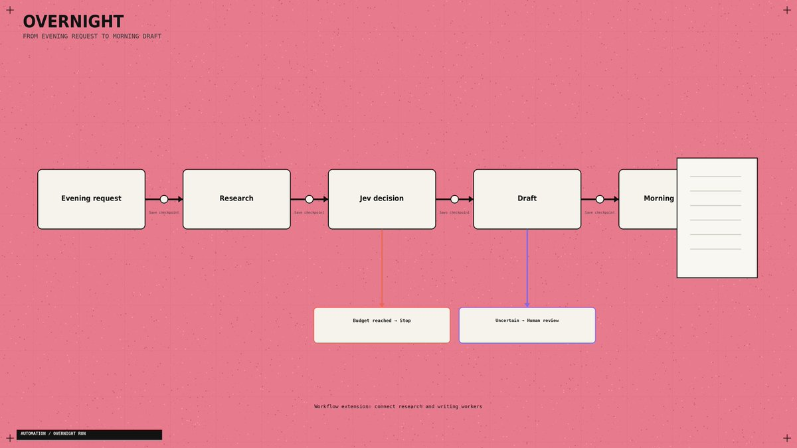

Once the local router works, use this brief to connect your existing agents:

Read the TypeSafe skill and inspect my worker interfaces. Connect chief.py's JSON queues to existing research and writing handlers. Prevent duplicate processing. Save progress after each action. Add call and spending limits, review on uncertainty, and a draft-exists completion check. Keep publishing behind approval. Identify missing connectors explicitly.

If the starter fails, use the error to choose the fix:

- Python command missing: finish Python installation and reopen the terminal.
- Module missing: repeat the SDK install with the same .venv interpreter.
- 401: replace the API key and rerun.
- 422: check the named request field against the pasted code.
- 429 / 529: allow backoff; retry later if rate limiting or overload persists.
The SDK supplies retries; the script stops if an API error remains. [API reference](https://docs.typesafe.ai/api)

## 09. Know what the headline price actually buys

Jev 1.13 costs $0.042 per million input tokens, with no output-token charge. At 1,000 billed input tokens per decision, 10,000 decisions cost $0.42 for Jev inference. [Pricing](https://docs.typesafe.ai/models)

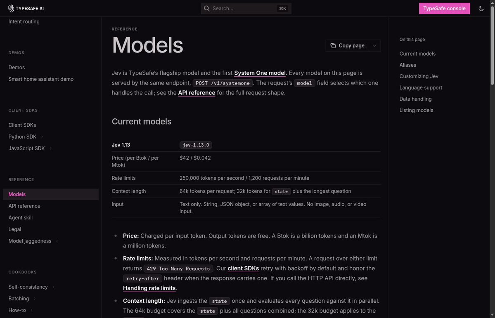

The flight demo's reported $0.0039 fits its recorded 90,558 Jev input tokens plus the text helper's reported charge. 
Browser costs sit outside that calculation. Its roughly seven-second clock starts after the initial page observation and excludes fresh post-run verification

- So it finds flight results; it does not book tickets. [Run measurements](https://github.com/browser-use/jev-ultrafast/blob/main/docs/performance.md)

For a different workload, Vercel's fx team reported roughly 5-18x faster safety classification than GPT-5.6-luna, alongside improved accuracy. 
That comparison concerns the classifier, not the duration of an entire agent run. [Original benchmark](https://x.com/fazxes/status/2100300097695232164)

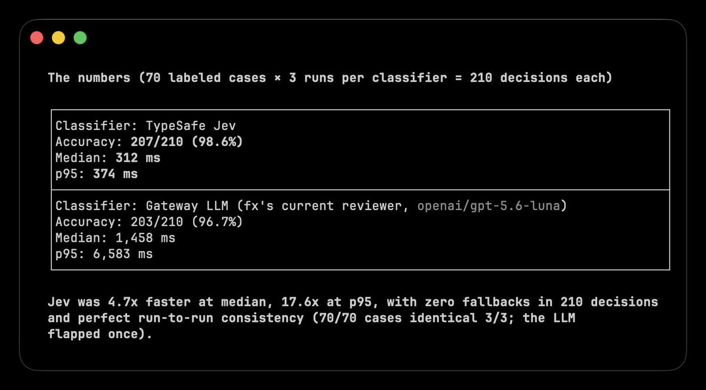

Track the bill per completed task. A cheap decision that sends a worker down the wrong branch can cost more than the decision itself.

## 10. Examples of Use

After the basic setup, Jev can already read the state of a task and choose between predefined options. Now you only need to decide which repeated decision to automate.

1. Control a Browser

Browser Use used Jev to select the next action and the correct page element. The agent found flights in 7 seconds for $0.0039.

[Open the code](https://github.com/browser-use/jev-ultrafast)

How to repeat it: run the official project, add your TypeSafe and OpenRouter keys, then give the agent a website and a goal. Jev selects the action and target, while the browser executes the decision.

2. Classify Research

Hassan used Jev to classify 1,018 AI research papers. The entire classification cost $0.08, with 256ms median end-to-end latency per paper

How to repeat it: send the title and summary of each paper to Jev, then define your topics as Choice options. Save the selected category and send the strongest papers to your writing agent.

3. Triage Your Inbox

Riley Brown demonstrated how Jev can classify incoming emails and decide what should happen next.

How to repeat it: pass each email as the state, then add reply, research, wait, and review as Choice options. Connect each answer to the corresponding folder or email agent.

4. Route Tasks Between Models

LangChain uses Jev to choose between cheaper and more capable models based on the task

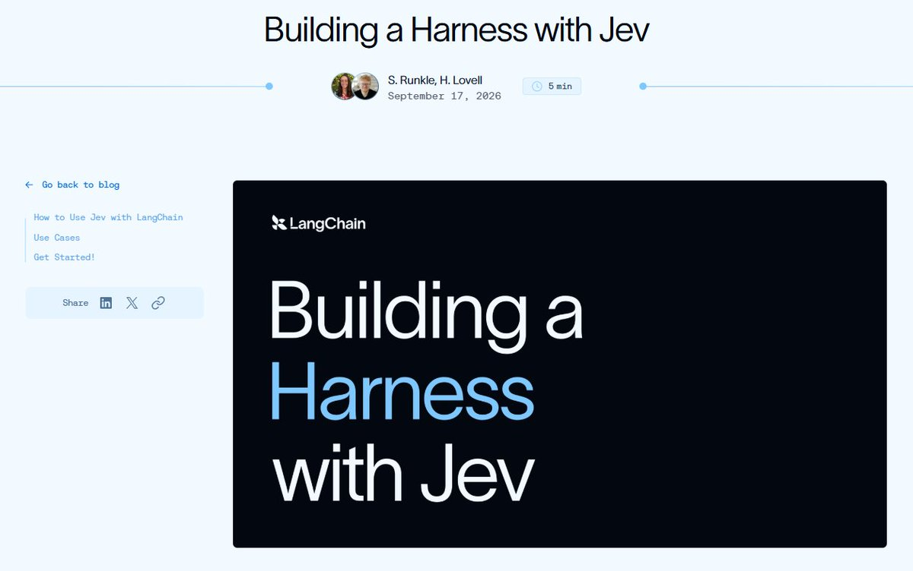

[Open the LangChain guid](https://www.langchain.com/blog/building-a-harness-with-jev)

How to repeat it: connect several models, describe what each one is best at, and send the incoming request to Jev. Route simple tasks to a cheaper model and complex tasks to a reasoning model.

And other cases:

## The shift

An LLM creates the work → Jev decides what happens next.

Jev is not another chatbot

It is a fast decision layer that reads the current state of your system and chooses between the options you define

And the real alpha is not the 7-second flight demo or the $0.08 paper classification

The real alpha is realizing how many expensive LLM calls inside your agents never needed generation:

- Let the LLM research, plan, and write
- Let Jev route, score, approve, or escalate
- Let code execute the decision
That split changes the entire agent stack

You now have the setup, the working decision router, and four real ways to deploy it. Start with one repeated decision. Measure it. Then replace the next one.

Most builders will keep spending frontier-model tokens on every yes, no, route, and score

The few who separate thinking from deciding will build faster agents at a fraction of the cost.

Bookmark this playbook before your next agent  → [@0xCodila](https://x.com/@0xCodila)
