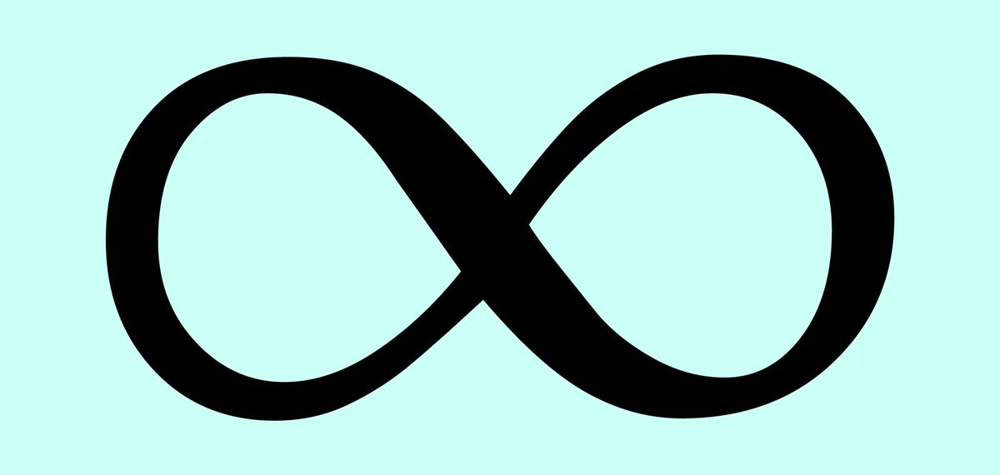
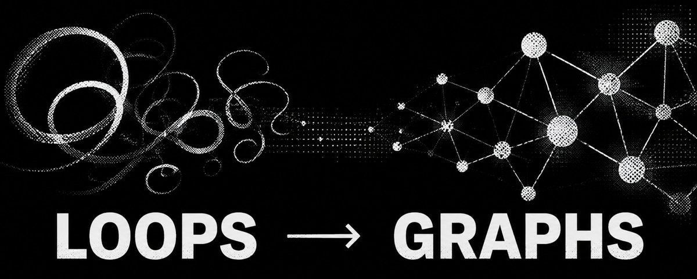

# 📰 Loops are just shitty graphs.

Peter Steinberger’s viral tweet asked a deceptively simple question: “Are we still talking loops or did we shift to graphs yet?” 

[Embedded Tweet: https://x.com/i/status/2078277297791189132]

This is how technology usually advances. First we invent something genuinely new then we forget about it for decades. Then a tech bro rediscovers three old computer science ideas and announces that the future has arrived. 

The joke went viral because it is true. But it also works because something has in fact changed. The primitives are old. The things we can build with them are not.

## A loop is the simplest possible shitty version of a graph

A few nodes connected in a circle. Think leads to action. Action leads to observation. Observation leads back to think. The agent keeps driving around this tiny roundabout until it finds the exit or runs out of money.

People like loops because they are easy to build. You do not have to decide much in advance. You put the model in a box with some tools and tell it to keep going.

This is also why loops become bad so quickly.

- Where is the plan stored? In the transcript.

- Where are the dependencies between tasks stored? In the transcript.

- Where is the reason the agent rejected one approach and chose another? Usually in the transcript.

- Where are the facts it found twelve steps ago? Also in the transcript, unless they were summarized, truncated, or forgotten.

The transcript gradually becomes a database implemented as a string. And a string is a shitty graph. Which is why your agent is mid.

## A graph is not automatically better.

I have nothing against loops, in fact I think they are essential. There is a temptation, whenever the industry is trending a new subject, to apply it to everything.

This is how we will end up with diagrams containing eighty-seven boxes for an agent whose job is to summarize an email.

A simple loop is often exactly right. When the task is short, the consequences are small and the path cannot be known in advance, a loop gives the model room to improvise. The programmer supplies a goal and a set of tools. The model discovers the procedure.

Simple solutions to a simple problem.

## There is more than one graph

The current discussion tends to mix together several meanings of the word graph.

There is the control graph: the possible steps an agent may follow.

There is the execution graph: the steps it actually followed during a particular run.

And there is the data graph: the people, documents, events and other things it can know, along with the relationships between them.

These are logically different graphs. But they do not necessarily require different systems.

A workflow engine such as LangGraph is primarily concerned with control. It decides which node runs next, when execution branches, where it pauses and what happens after a failure.

Polygres builds graphs over ordinary PostgreSQL tables. Those tables could describe customers and invoices. They can also describe agent runs, tasks, dependencies, tool calls, approvals, artifacts and state transitions.

@polygres can store the world the agent acts on, the state it carries between steps and the execution graph it leaves behind.

The execution graph becomes part of the data graph. And the data graph changes future execution. That changes what context means.

## I call this the Infinite Context Window.

The agent no longer has to carry everything it knows inside the transcript. It can pull in the part of the graph it needs, do the work, and write what it learned back to the graph.

The model’s context window is not actually infinite. The context available to it is. The loop keeps running. The graph keeps growing. And it all forms a loop.

That's what we hope to achieve with Polygres.

\- Dale

If you want to try polygres today, you can sign up and use it for free on polygres.com. 

### 🖼️ Attached Media

## 💬 Replies

### 1 @daleverett (dale) (Author)

*Mon Jul 20 11:47:29 +0000 2026*

@grok
why did this post go viral suddenly

### 2 @daleverett (dale) (Author)

*Mon Jul 20 12:50:50 +0000 2026*

pgGraph Repo: [github.com/Evokoa/pgGraph](https://github.com/Evokoa/pgGraph)           

Discord: [discord.gg/RFSHD5DgKP](https://discord.gg/RFSHD5DgKP) 

official website: [polygres.com](http://polygres.com)

### 3 @LivewJack (Jack)

*Mon Jul 20 10:26:53 +0000 2026*

@daleverett Only took 4 weeks to go from Loops to Graphs. 

Took a couple months to go from Brains to Loops. 

Took a couple more months to go from Harnesses. 

How fast before we get to Recusion and “up only”?

### 4 @daleverett (dale) (Author)

*Mon Jul 20 10:29:02 +0000 2026*

@LivewJack Give me 24 hours

### 5 @KayaHickin (Kaya Hickin)

*Sun Jul 19 22:40:42 +0000 2026*

@daleverett @hperwinn

### 6 @daleverett (dale) (Author)

*Mon Jul 20 04:05:53 +0000 2026*

@KayaHickin @hperwinn Hehe

### 7 @yernarmerkhanov (Yernar)

*Mon Jul 20 08:49:19 +0000 2026*

@daleverett the real shift is admitting state should live somewhere better than a giant chat log

### 8 @daleverett (dale) (Author)

*Mon Jul 20 09:49:12 +0000 2026*

@yernarmerkhanov 👀

### 9 @ArthurReyn (Arthur Reynolds)

*Mon Jul 20 09:01:59 +0000 2026*

@daleverett [x.com/arthurreyn/sta…](https://x.com/arthurreyn/status/2078405184124846562?s=46)

### 10 @daleverett (dale) (Author)

*Mon Jul 20 09:49:06 +0000 2026*

@ArthurReyn Interesting!

### 11 @eldar_hsnv (Eldar Hasanov)

*Mon Jul 20 13:48:18 +0000 2026*

@daleverett what comes after graphs tho?

### 12 @damienhe (Lim Damien)

*Sun Jul 19 22:27:47 +0000 2026*

@daleverett @grok wdyt

