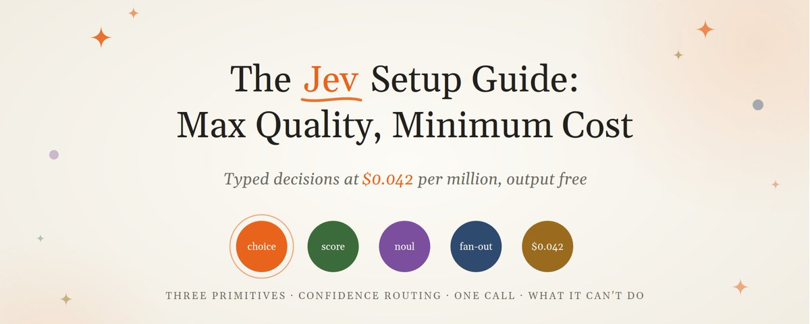
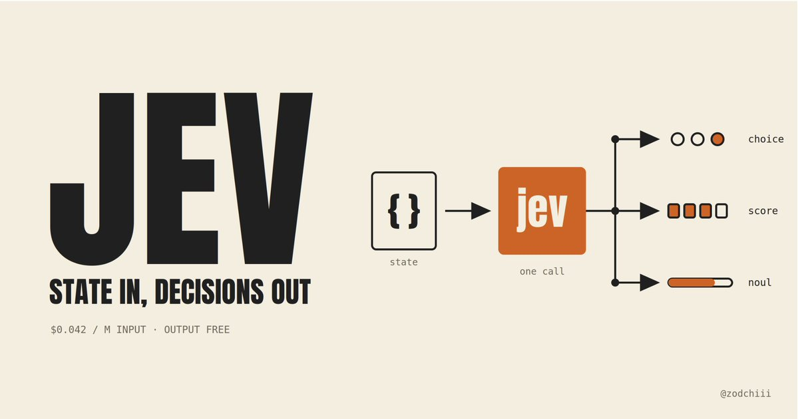
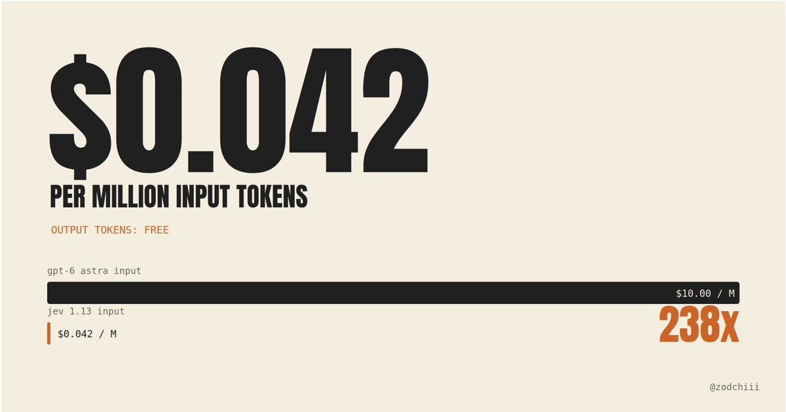
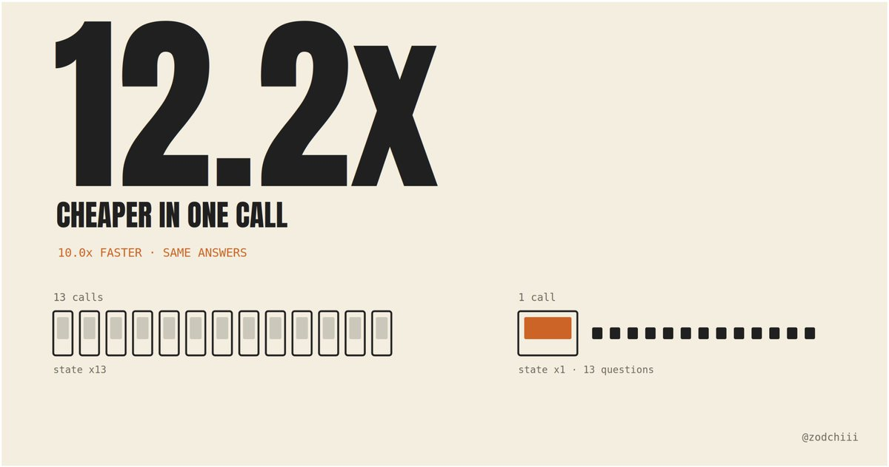
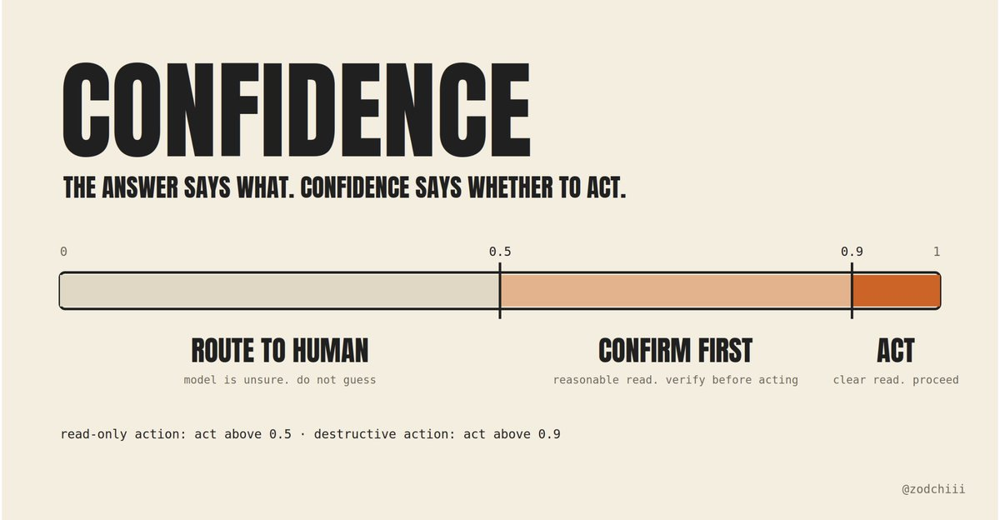

# The Jev Setup Guide: How to Get Maximum Quality for Minimum Cost (Exact Config Inside)

Jev shipped this week at $0.042 per million tokens. Output is free. Most people will reach for it like a cheap LLM.

Inside: why the cost math on Jev runs backwards, the request pattern that's 12.2x cheaper, and the nine things its own docs say it can't do.

Get the shape right and a thousand decisions cost less than one Astra call.

Here's the full setup 👇

Before we dive in, I break down new models, test the configs and share what works on my Substack: https://zodchiii.substack.com/ 🧠

## The price sheet

- $0.042 per million input tokens. Output tokens are free
- Rate limits: 250,000 tokens per second, 1,200 requests per minute, and TypeSafe says both can change without notice while they scale
- Context: 64k tokens per request total, 32k for the state plus your longest single question
- Input: text only. Strings, JSON, arrays of text. No images, no audio
Put that against Astra at $10 per million input:

That ratio is why the API bill is not where you'll lose money. You'll lose it on architecture.

## The setting that decides your bill: questions per call

Every question in a request is evaluated in parallel against the same state. Adding questions barely moves latency, and the state is charged once, not once per question.

So the expensive mistake is one call per question.

TypeSafe's own cookbook ran a 13-question briefing both ways: batched into one call was 12.2x cheaper and 10.0x faster with no change in answers.

Ask the speculative ones too. If the ticket turns out to be a feature request, bug_severity cost you nothing and you ignore it in code.

That's the pattern: fan out every question you might need, route in code afterwards.

## Confidence is the second axis

Every Choice and Score answer carries confidence, a 0 to 1 number derived from how concentrated the probabilities are. Flat distribution, low confidence.

The answer tells you what. Confidence tells you whether to act.

Three tiers, and the threshold moves with the stakes:

A read-only action can run on a 0.5. A destructive one waits for 0.9. Your code encodes the risk tolerance, and TypeSafe hands you the full probabilities array if you want your own confidence measure instead of theirs.

## Six things that aren't in the quickstart

Pulled from TypeSafe's own agent skill and the first week of people shipping on it.

- Questions can't read each other's answers. They run in parallel against the same state. If the next decision needs a fresh search result, that's a second request, not a bigger first one.
- Rebuild the menu every step. Build Choice options from what actually exists right now, not from yesterday's list. A Choice takes up to 255 options and a Score runs 2 to 10 levels, so for long lists: filter the obvious misses in code, score the rest, choose from the shortlist.
- Confidence isn't permission. It summarizes how concentrated the probabilities are. It says nothing about whether the workflow is correct or whether the side effect happened. A confident "done" doesn't prove the file was saved. Check outcomes separately, in code.
- A Noul at 0.5 means "as likely yes as no." Not "medium." Don't read it as intensity.
- Send evidence, not summaries. "The researcher finished" tells Jev less than the sources, the findings and the gaps. Keep those fields separate from the original request.
- The type guarantee and the correctness guarantee are different. An answer can only be one of your options, so it can't be malformed. It can still be wrong. Design for the second, the first comes free.
## What Jev can't do, from its own docs

TypeSafe publishes a jaggedness page for the current version. Read it before you design anything, because most of it is about work that belongs in code, not in the model.

- It reads literally. It answers the question you wrote, not the one you meant. When you catch yourself explaining what you really meant, that explanation is the missing half of the instruction
- It doesn't count and doesn't do arithmetic. If a regex or a parser can find the unit, count in code. Ask one Noul per item and sum the results yourself
- It reads dates as text. Which comes first, how far apart, inside a window: all unreliable. Extract the parts as Choices over closed sets, assemble and compare in code
- Large state costs accuracy. Irrelevant detail is a distractor. Filter first, send only what the question needs
- State is not treated as hostile. Injected instructions inside the state can move the answer. Test edge cases before you ship
- Structural identities don't hold. A Noul and a yes/no Choice on the same question return different numbers. P(refund) and 1 - P(not refund) won't sum to one. Never carry a threshold from one primitive to the other
- It doesn't generate. Bounded answer space? Turn extraction into a Choice over options. Need text? Use a different model
That last section is worth a second read. The failures are all the same shape: something that should have been code got handed to the model.

## The full call, wired

Two lines in there that matter more than they look. The model is pinned to jev-1.13.0 because jev-latest moves when a new release ships, and thresholds you tuned on one version don't transfer.

And r.model is logged on every call for the same reason: when answers shift, you want to know whether the model did.

## Common mistakes

- One call per question. The state gets charged every time. Fan out, then route in code. The docs put the difference at 12.2x.
- Shipping the whole document as state. Accuracy drops with irrelevant detail and you can't tell which part produced a wrong answer. Retrieve and filter first.
- Asking the model to do math. Dates, counts, comparisons, magnitudes. All of it belongs in code. The model is for the judgment, not the arithmetic.
- Tuning thresholds on jev-latest. The alias moves. Pin the version, log what answered, migrate on your own schedule.
- Assuming Noul and Choice agree. They answer different questions. Choice is relative, which option wins. Noul is absolute, and can be low for all of them.
## The 10-minute setup

pip install typesafe-sdk, set TYPESAFE_API_KEY, pin jev-1.13.0 (2 min)

Write your questions as one dict, including the speculative ones (3 min)

Filter your state in code before the call, send only the fields the questions read (2 min)

Set a 0.5 confidence floor and route below it to a human (1 min)

Log r.model and r.usage on every call (2 min)

If you build with a coding agent, install TypeSafe's official skill first. It carries the three primitives, the patterns and the question-writing rules, so the agent stops guessing at the API:

TypeSafe's own note on this is worth keeping: agents aren't great at writing questions, so expect to edit them together, and keep the questions and thresholds in one file so they're easy to review.

Then read the jaggedness page once, properly. It's the shortest and most useful document TypeSafe has published.

The price is cheap enough that you'll stop thinking about it. The architecture isn't, and it's the only lever left.

Thanks for reading!

Full guides like this one land on Substack first: https://zodchiii.substack.com/ 🧠

