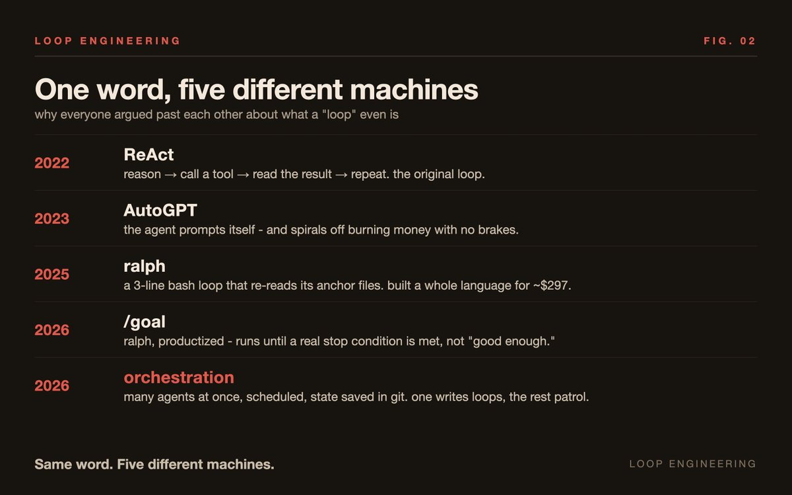
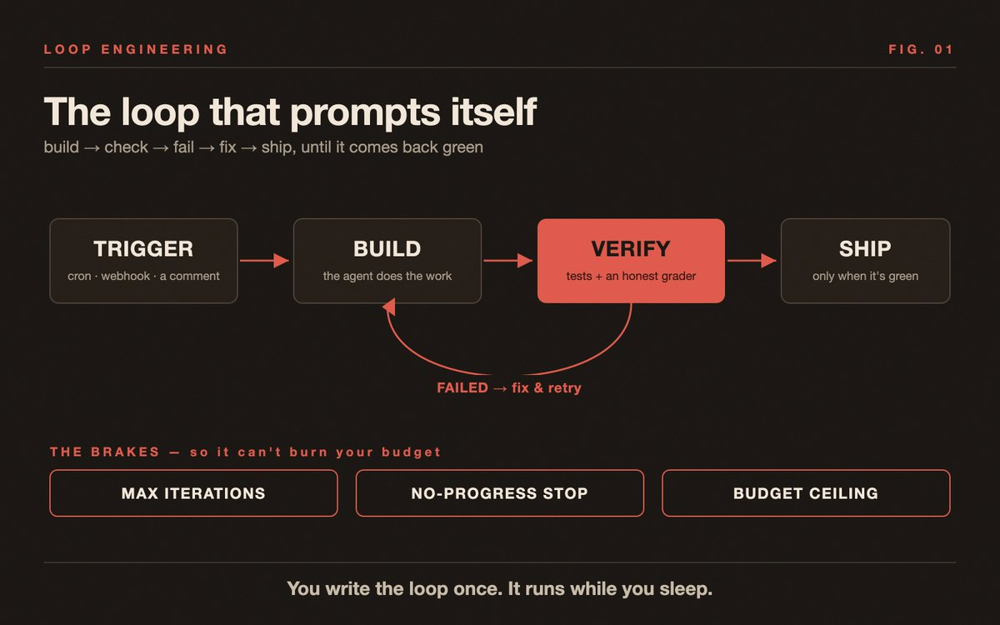
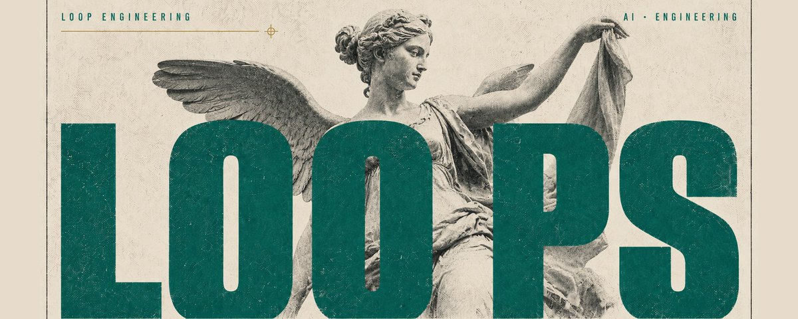

# 📰 Loop engineering: the skill that quietly ate prompt engineering

259 pull requests in 30 days, and a human typed exactly zero of them.

That's Boris Cherny, the guy who built Claude Code - he deleted his IDE back in November and hasn't missed it.

Most people are still hand-typing prompts into one chat window, one request at a time, babysitting every step.

He stopped doing that months ago. Now he writes loops, and the loops do the typing.

On June 8, Peter Steinberger posted two sentences - "you shouldn't be prompting coding agents anymore, you should be designing loops that prompt your agents" - and it did 6.5M views in a week. Then the whole timeline spent seven days arguing about what a "loop" actually is. Half the replies were some version of "wtf is a loop." Someone summed it up: nobody really knows except him and Boris.

So let me actually pin it down, because the confusion is the whole problem.

---

# A loop is not a cron job with a hat on

That's the lazy take, and I get why. You schedule a thing, it runs on a timer, it does work. Sounds like cron.

The difference is one word: decision. A cron job runs a fixed script the same way every time. A loop looks at the current state on each tick and decides what to do next - fix this failing test, answer that review comment, or stop because everything's green. It can check its own work and retry when it's wrong.

And that last part is the part everyone skips. Someone in the replies nailed it: a loop with nothing to push back is just the agent agreeing with itself on repeat. No feedback, no loop - just an expensive way to generate confident garbage faster.

---

# Five things have been called "loop," and people are arguing across all of them

This is why the timeline melted down. "Loop" hides a whole lineage:

-  ReAct (2022) - the academic one. Model reasons, calls a tool, reads the result, goes again.

-  AutoGPT (2023) - the agent prompts itself. Famous mostly for spiraling off and burning money.

-  ralph (2025) - Geoffrey Huntley's three-line bash loop that re-reads the same anchor files every tick. He built an entire programming language with it for about $297 in API spend.

-  /goal (2026) - ralph, productized, with stop conditions baked in so it doesn't run forever.

-  orchestration (2026) - many agents at once, scheduled, state saved in git, sub-agents spawned per task. Steve Yegge's Gas Town runs a "mayor" agent over 20-30 patrol agents.

When one person says "loop" and means ReAct and another means a 30-agent orchestration, of course they talk past each other. They're five different things wearing the same word.

---

# The shape of every loop worth running

Strip away the hype and a real loop is just six lines you decide up front:

\`\`\`plaintext
TRIGGER  → every 15m, on a PR comment, on a CI failure
SCOPE    → open PRs I authored, this repo only
ACTION   → run tests, fix lint, answer review comments
BUDGET   → max 3 sub-agents a tick, 50k tokens
STOP     → all PRs green, or 10 iterations, or $5 spent
REPORT   → drop a summary in Slack
\`\`\`

If you can fill those six lines in, you have a loop. If you can't, you don't have a loop - you have a vibe.

---

# Verification is the part that makes it real

The whole thing lives or dies on the "no."

An open loop writes code and tells you it's done. That's a demo. A closed loop runs the tests and the type checks after every change, and the failures are the feedback that drives the next tick. A review loop goes further - a second agent reads the work in the background and feeds problems back in. That's the one that survives a multi-hour run.

The feedback has to come from something the agent can't sweet-talk. Tests pass or they don't. Types check or they don't. That's why you anchor the loop to real files - a VISION.md for where it's going, a CLAUDE.md for the rules, a loop.md for the per-tick prompt, and a test suite for the part that says "no, try again."

---

# The expensive part isn't the tokens anymore. It's the loop.

Here's the thing nobody warns you about. Once the agent runs on its own, the cost stops being "I sent a few prompts" and becomes "this thing ran 400 times overnight."

Uber found out the hard way - they reportedly burned an annual tooling budget in four months and ended up capping spend at $1,500 per person per month, per tool. An unattended loop with no brakes doesn't just fail, it fails with your credit card.

So the brakes aren't optional. Three of them, every time:

-  a hard iteration cap - 10, 20, whatever, but a number

-  no-progress detection - same error twice in a row means it's guessing, not fixing, so stop

-  a dollar or token ceiling - the loop dies at the limit, not at your invoice

The "same failure twice" rule is the one that's saved me the most money. Two identical failures means the agent is stuck, and cycle four is just you paying to watch it flail.

---

# Skills are the actual asset

A loop calling raw prompts is a \`while true\` wrapped around a stranger who forgets everything each morning.

The compounding only kicks in when you turn your repeated work into named skills - code-review, fix-ci, dependency-audit - and the loop calls those on a schedule. A skill gets sharper every time it hits a new edge case. A one-off prompt re-derives your whole setup from scratch, every run, forever. One compounds. The other just burns.

---

# Build one this week - it's the only way you'll get it

You can read about loops all day and still not feel it. So:

-  Level 0, 15 minutes - \`/loop 10m review PR #123 and report\`. Watch two ticks. Confirm it's actually reading state, not repeating itself.

-  Level 1, an hour - a PROMPT.md and a bash wrapper with MAX=10 and a test gate. This is ralph, with brakes.

-  Level 2, ongoing - /loop plus your skills plus a cloud session plus /goal, running multi-hour work while your laptop is shut.

---

# The reframe

Prompt engineering didn't die. It got promoted.

You used to sit inside the loop, typing the next message, grading the output, typing again. The skill now is to climb one level up and write the loop itself - the trigger, the scope, the brakes, the "no" - and then go decide what to build next while it runs.

The only people who actually know what a loop feels like are the ones who already built one. You can't prompt that into yourself.

So build the small one today. The next one builds itself.

/ follow for me /

### 🖼️ Attached Media

## 💬 Replies

### 1 @0xMovez (Movez)

*Mon Jun 29 14:22:34 +0000 2026*

@dunik\_7 Bro, you’re delivering high-quality “loop” articles like a machine. Real CHAD. Keep shipping.

### 2 @dunik_7 (dunik) (Author)

*Mon Jun 29 15:00:46 +0000 2026*

@0xMovez Thank you, bro!

### 3 @itsthedonhashim (Hussain Hashim | Building SundayBack)

*Mon Jun 29 14:27:09 +0000 2026*

@dunik\_7 @dunik\_7 wait, he deleted his IDE? that's wild. I can't imagine coding without one.

