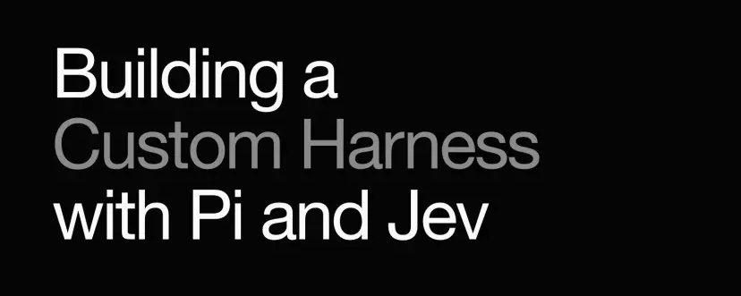
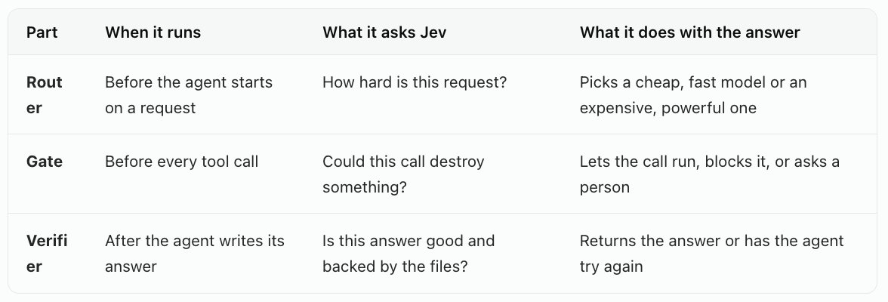
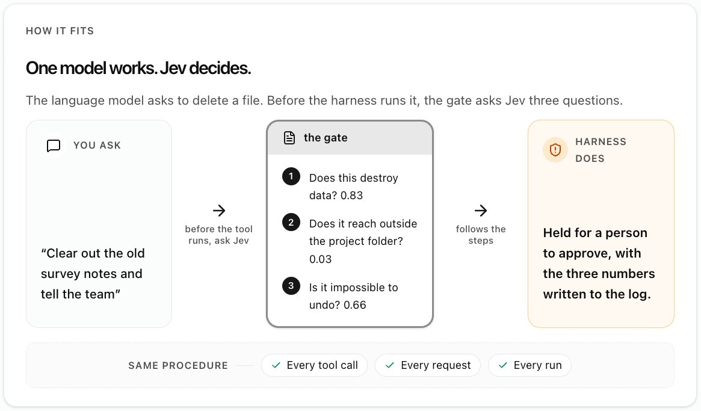
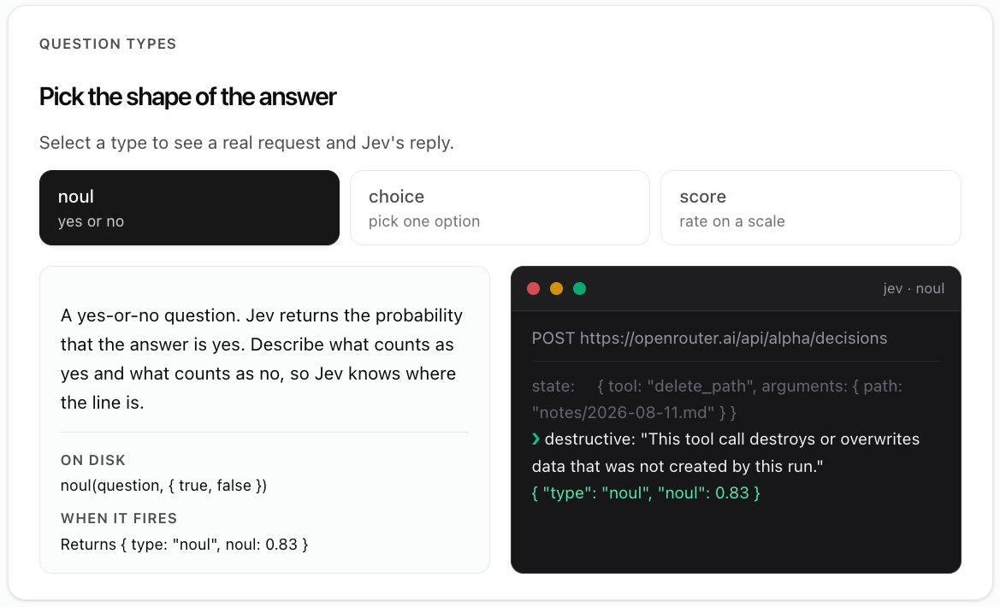
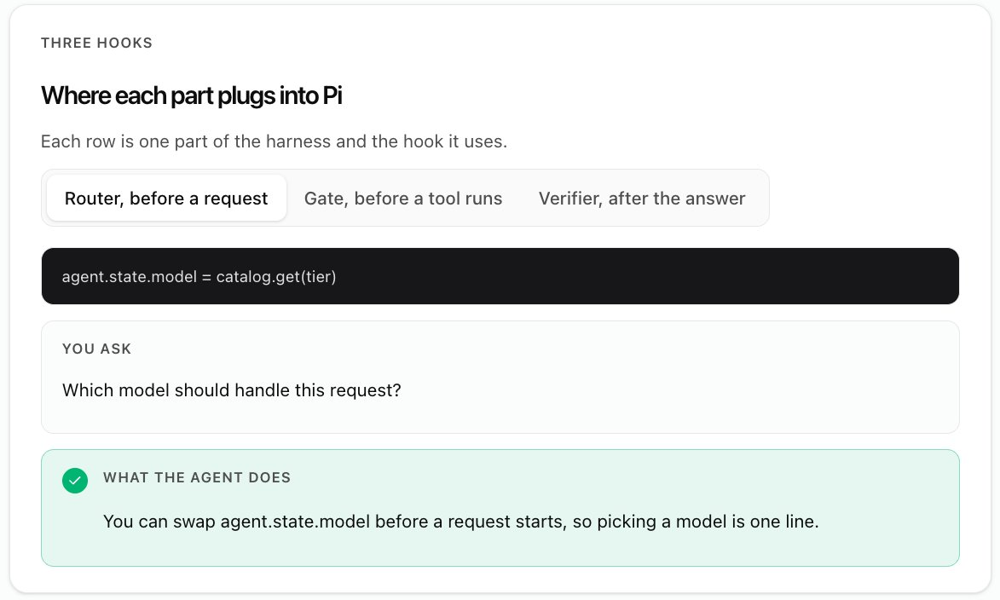
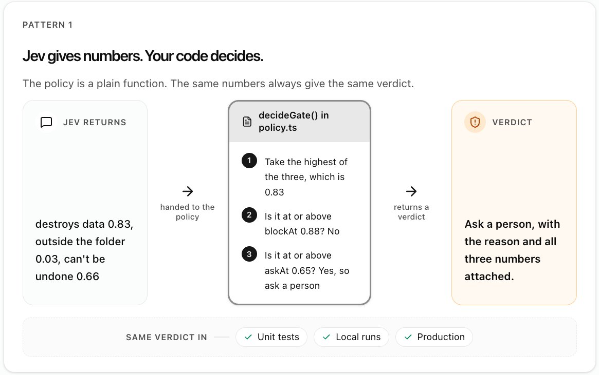
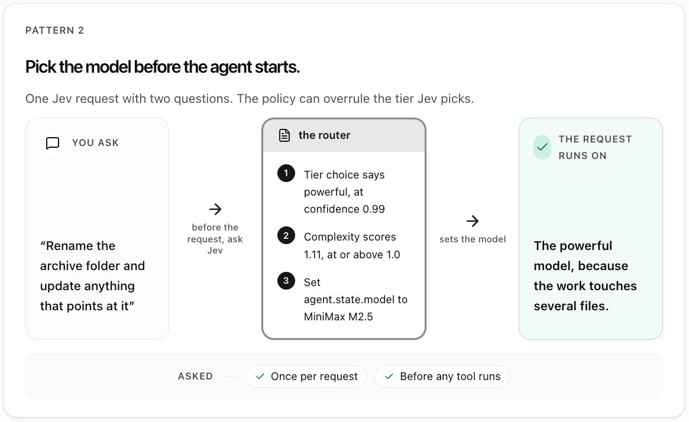
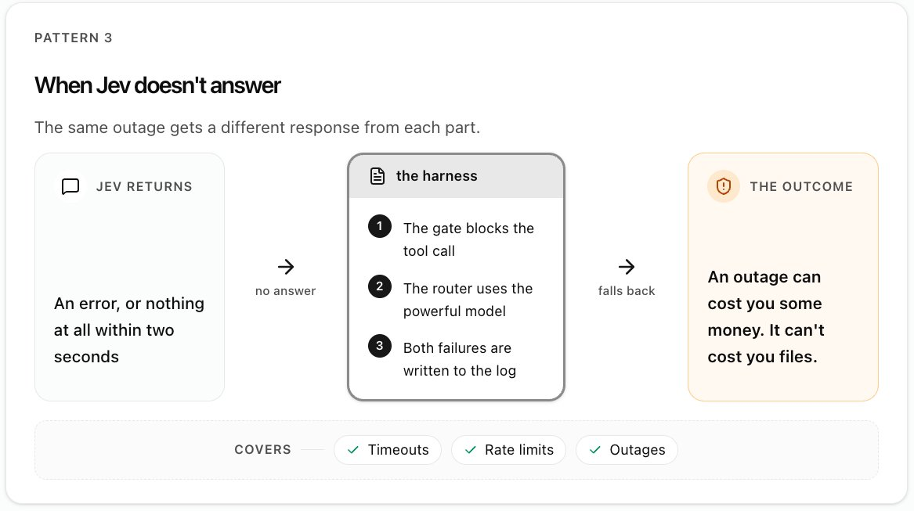
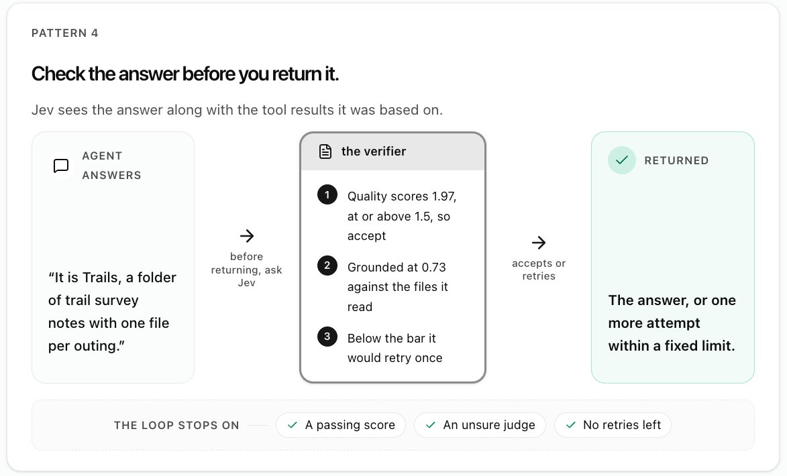

# Building a Custom Harness with Pi and Jev

An AI agent is a language model that works in a loop. It reads the task, uses a tool such as "read this file" or "delete that file", looks at the result, and keeps going until the job is done. Each time the model asks to use a tool, that request is called a tool call.

The code that runs this loop is called the harness. The model decides what it wants to do. The harness runs it and also decides what the model is allowed to do.

A good harness makes lots of small decisions along the way. Which model should handle this request? Is this tool call safe to run? Is this answer good enough to hand back? Most harnesses answer these by asking a chat model and reading its reply. That costs a full model call each time, so in practice most checks get skipped.

[Jev](https://typesafe.ai/) from TypeSafe AI is a small model built only for these decisions. You describe the situation and ask a few questions, and it answers each one with a number. It never writes text.

This matters most when you build a custom harness, your own agent loop instead of an off-the-shelf agent. A custom harness lets you choose which models run, what the agent may touch, and what counts as done. Jev makes the checks behind those choices cheap enough to run on every step.

In this tutorial, you build a harness with the [Pi SDK](https://github.com/earendil-works/pi), a TypeScript toolkit for building agents, and use Jev in three places. At the end, you run the finished harness in a live sandbox and change its settings yourself.

Access the full interactive tutorial and the playground here:

[https://academy.dair.ai/resources/jev-decisions-in-a-pi-sdk-harness](https://academy.dair.ai/resources/jev-decisions-in-a-pi-sdk-harness)

This guide was inspired by Sydney Runkle's [Building a Harness with Jev](https://www.langchain.com/blog/building-a-harness-with-jev) on the LangChain blog, which shows model routing and tool gating as ready-made LangChain middleware. Here, you build the same ideas yourself on the Pi SDK, then add two more patterns for handling failures and checking answers.

## What you'll build

The harness has three parts. Each one asks Jev a question at a different moment, and the rest of this guide refers to them by these names.

The running example is an agent working in a folder of trail survey notes, one file per outing. It can read, write, and really delete those notes, which is why the gate matters.

## What Jev is

TypeSafe calls Jev a System One model. The name comes from psychologist Daniel Kahneman, who described two modes of thinking. System One is fast and automatic, like knowing a pan is hot. System Two is slow and deliberate, like doing long division.

In this harness, a regular language model does the slow work of reading files and writing answers. Jev makes the quick judgment calls around it. Jev is cheap and fast enough to ask about every tool call, not just the ones you expected to be risky.

Each number is a probability between 0 and 1. A 0.83 means Jev is fairly sure the answer is yes. A 0.03 means it is fairly sure the answer is no.

## Three question types

Every Jev request has two parts. The state is the situation you want judged, such as a tool call or a user's request. The questions are what you want to know about it. Jev answers all the questions in one call, at the same time, so asking three questions takes about as long as asking one.

Jev supports three kinds of questions. The first, which Jev calls a noul, is a yes-or-no question.

Jev only knows what you tell it, so describe every option and every level in plain words. The descriptions are the prompt.

## Setup

Jev is available through OpenRouter, a service that gives you many AI models behind one API key. That one key covers both the language model and Jev. Install the two Pi packages and set your key.

Jev has its own web address, separate from the usual chat one. Always name an exact version, such as typesafe/jev-1.13. The whole Jev client is one fetch call.

The agent waits while Jev answers, so the call gives up after two seconds. A normal answer takes 200 to 400 milliseconds.

## Where Jev plugs in

Pi's Agent class runs the loop for you. It lets your own code run at set moments in that loop. These spots are called hooks. The harness uses one hook for each of its three parts.

## A first gate

Start with the smallest useful version of the gate. Before every tool call, ask Jev one yes-or-no question and block the call if the answer looks like yes.

The 0.65 is a threshold, the cutoff where the harness stops trusting a call. Anything Jev scores at or above it gets blocked.

Now an agent that tries to delete your notes stops before the delete happens. Deleting a note scores about 0.83, and reading one scores 0.01. The gate is blunt, though. Writing a brand new file scores about 0.70, so that gets blocked too.

Asking costs very little. Jev charges $0.042 per million input tokens, under a third of the input price of GLM 5.3 Flash, the cheaper of the two models this harness uses.

## From first gate to full harness

The first gate works, but it leaves four gaps.

The threshold is buried inside the hook, so it is hard to adjust or test.

Every request runs on the same model, whether it's easy or hard.

Nothing says what happens if Jev can't be reached.

Nothing checks whether the final answer is any good.

Each numbered section below closes one gap.

## 1. Keep thresholds in one place

This section improves the gate.

Thresholds decide what the agent may do, and you will adjust them often once you see real results. So move them out of the hook into one plain function, decideGate(). It takes Jev's numbers and returns a verdict: the harness's final decision about a call. Keeping these rules in one place is called the policy.

The policy also adds a middle option. One threshold can only say allow or block. Two thresholds give three verdicts.

- At or above blockAt, the call is blocked.
- Below askAt, the call runs.
- In between, the call waits for a person to approve it.
That middle range catches the calls Jev is unsure about, which a single cutoff would get wrong one way or the other.

Because it is a plain function, you can test it by passing in numbers like the ones above, with no live model involved.

## 2. Pick a model per request

This section adds the router.

Some requests are easy, like reading one file. Some are hard, like tracking down why something broke. Running everything on the most powerful model wastes money, and running everything on a cheap one gives weak answers to the hard requests. The router matches each request to the right tier, meaning the fast, cheap model or the powerful, expensive one.

Before a request starts, the router asks Jev two questions in one call. A choice picks the tier, and a score rates the request's complexity.

The router's policy uses the two answers like this.

- If the complexity score is high, use the powerful model, even if Jev picked fast.
- If Jev isn't confident about its pick, use the powerful model to be safe.
- Otherwise, use the model Jev picked.
This is one example policy. Yours can weigh the answers differently to suit your domain, for instance, leaning cheap for a high-volume batch job or always escalating anything that touches production. Jev only supplies the answers; your code decides what to do with them.

Why pick only once

The router picks a model once, when a request starts, and keeps it until the request is done. That is because of prompt caching.

Every time the agent takes a step, the model re-reads the whole conversation so far. AI providers store recently read conversations so that re-reading them is cheap. But each model has its own store. Switch models halfway through and the new model has to read everything again at full price.

The Jev founder works through the numbers in [a design doc on coding agents](https://docs.google.com/document/d/1G61uUB0FifUnmmrPzFQojZ3KpczYKmXGpgEXDJ2l_Zg/edit?tab=t.0). In one long session, switching from Claude Opus to the cheaper Sonnet and back cost about 50% more than staying on Opus the whole time. So choose the model at the start, while the conversation is still short, and stick with it.

## 3. Plan for Jev being down

This section changes both the gate and the router.

Once the harness asks Jev about every tool call, the agent depends on Jev. Like any online service, Jev can be slow or down. Decide ahead of time what each part does when it gets no answer. The right choice is different for each part.

The gate blocks the call. If the gate can't ask Jev, it has no idea whether the call is safe. Letting it through could delete files, so the gate refuses. Engineers call this failing closed, like a door that locks when the power goes out.

The router uses the powerful model. If the router can't ask Jev, it doesn't know how hard the request is. The powerful model can handle anything, so the request still gets a good answer, and you pay a little more. This is failing open, letting the work go ahead.

## 4. Verify the answer

This section adds the verifier. In agent harnesses, a verifier is the step that checks the agent's work before it counts as done.

An agent can finish with an answer that leaves something out, or that states things it never actually checked in the files. The person reading it often can't tell. Checking the answer before returning it catches this while the agent can still try again.

The verifier sends Jev the finished answer along with the files and tool results it was based on. Jev scores the answer's quality and says whether its claims are grounded, meaning backed up by what the agent actually read.

Two rules stop the agent from retrying forever. It gets at most two attempts in total. And when Jev isn't confident about its own grade, the harness accepts the answer rather than paying for another try.

## Safety and logging

Jev gives you a probability, and a probability can be wrong. So anything plain code can check for certain should be checked in code. In this harness, every file tool refuses any path outside the project folder, no matter what Jev says. Save Jev for the judgment calls code can't make.

The gate looks only at the tool call itself, meaning the tool's name and its inputs. That helps with prompt injection, where text hidden in a file or web page tricks the model into doing something harmful. The gate never sees the trick, but it still sees the harmful call it leads to.

Log every decision along with the numbers behind it. The log explains why something was blocked and shows real numbers to set thresholds. The harness writes one line per decision to a file called decisions.jsonl. The gate sees everything the agent tries to do, so the log hides email addresses and keys and shortens long inputs.

## Try it

The sandbox below runs the finished harness from this tutorial, connected to the real Jev. It works on the folder of trail survey notes, and its delete_path tool really can delete them.

Try here: [https://academy.dair.ai/resources/jev-decisions-in-a-pi-sdk-harness](https://academy.dair.ai/resources/jev-decisions-in-a-pi-sdk-harness)

## Why build your own harness

Off-the-shelf agents make these decisions with their own built-in rules. A custom harness puts them in your code. You pick the models, set the thresholds, decide when a person steps in, and read in the log exactly why each call was made.

Jev is what makes that practical. Each decision takes a few hundred milliseconds and costs a tiny fraction of a cent, so you can add a check wherever your work needs one, not only where you can afford a full model call. The three parts in this tutorial are a starting point. A custom harness for your own domain can ask Jev whatever questions matter there.

## Other uses

The same three parts work outside coding agents.

- Code review bots. Score each suggested change and show a person only the ones worth reading.
- Record cleanup. Ask whether two records describe the same thing before merging them, and leave the unsure pairs for a person.
- Document pipelines. Score each extracted page and re-run only the low-scoring ones.
- Approval queues. Only the calls in the ask-a-person range reach a human reviewer.
In each case, the language model does the open-ended work, and Jev answers the small questions around it.

The questions, thresholds, and policies in this tutorial are examples for learning, not tuned production settings. We are benchmarking how these harness changes affect cost and answer quality, and a follow-up guide with those results is coming soon.

I spent an evening with Opus 5.5 putting together the guide and sandbox. If you encounter any issues, please DM me. Feel free to copy the article and feed it to your agents to continue experimenting with the ideas.
