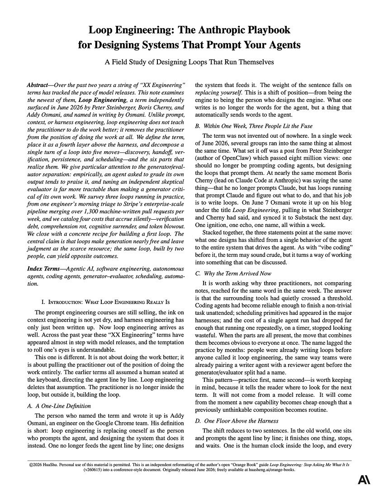

An Anthropic senior dev just dropped an 11-page breakdown on "Loop Engineering."

The game has changed: you don’t prompt the agent anymore, you build the system that prompts it.

The 5-step loop :

Discovery: The agent hunts down its own tasks (failing CIs/issues) instead of waiting for a list.

Handoff: Tasks run in isolated git worktrees so parallel agents don't clash.

Verification: A separate agent reviews the code assuming it’s broken. (Rule #1: an agent grading its own work always gives itself an A).

Persistence: Results save to disk so they don't vanish when the context window clears.

Scheduling: A timer auto-wakes the system, keeping the loop alive.

This PDF completely flipped my approach to building AI agents. Read it now, then check the article below.

### 🖼️ Attached Media

## 💬 Replies

### 1 @h100envy (h100envy) (Author)

*Wed Jun 24 19:25:08 +0000 2026*

[drive.google.com/file/d/1qzKI4D…](https://drive.google.com/file/d/1qzKI4DKnyHRpXK1J3ATPqwaqLc0iNu-M/view)

### 2 @yanhua1010 (Yanhua)

*Thu Jun 25 11:47:32 +0000 2026*

@h100envy This isn't fucking written by an Anthropic engineer, look closer everyone
[x.com/yanhua1010/sta…](https://x.com/yanhua1010/status/2070086633672909213?s=20)

### 3 @Nekt_0 (Nekt0)

*Thu Jun 25 12:18:06 +0000 2026*

@h100envy That may shape what comes next

### 4 @0xSlyth (0xSlyth)

*Thu Jun 25 13:30:19 +0000 2026*

@h100envy wild

### 5 @lagerskoy (lagerskoy)

*Thu Jun 25 01:14:54 +0000 2026*

@h100envy Verification is the unlock

### 6 @JohnWPellew (John Pellew)

*Thu Jun 25 19:14:34 +0000 2026*

@h100envy Then all you need is memory &amp; autonomous goal setting and you are off to the races. Visit my Katra my OpenSource Agenting Cognitive Memory system and find out how. 
[github.com/kolegadev/Katr…](https://github.com/kolegadev/Katra-Agentic-Memory/tree/main)

### 7 @SteamVibeLtd (Petru | Steam Vibe)

*Thu Jun 25 12:46:00 +0000 2026*

@h100envy The shift from prompting to system-building mirrors the reliability challenges I faced getting my local agents to behave.

### 8 @bktm_f (Üf Bıktım Senden)

*Thu Jun 25 11:32:23 +0000 2026*

@h100envy wait, does hallucinated task discovery just become real constraints by loop 3? or is there constraint-checking that catches the drift?

