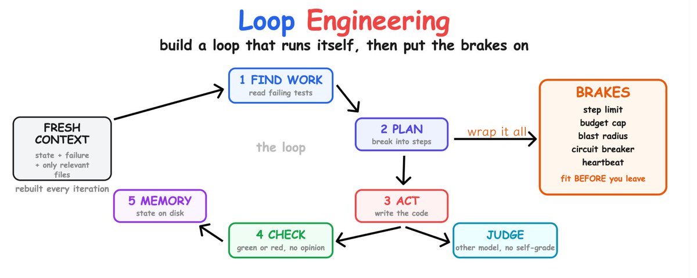

# 📰 Loop Engineering: A Technical Roadmap for an Autonomous Loop

Deep mechanics plus working code. Stateless iteration, idempotent checks, isolation, defense against reward hacking, observability. From zero to a loop that will not blow up while you sleep.

A loop is not a prompt. A prompt you turn yourself. A loop turns itself: set the goal once, then the system finds work, does it, checks it, fixes it, repeats until done. The skill that sets the ceiling is not writing a prompt, it is building a loop that converges to truth instead of becoming an expensive random walk.

Below is a technical roadmap. Each step is not only what to do but why exactly this way at the mechanics level. The order is strict, skipping a step is where the loop blows up later.

## Step 0: Check the Task Allows a Machine Check

A filter that saves weeks. A loop only makes sense if there is a check that delivers a verdict independent of the agent.

The mechanics of why this is critical. The model that generated a solution and also grades it is in a conflict of interest at the statistical level: its own output is a high-probability continuation to it, so it systematically overrates its correctness. This is not the model being lazy, it is a direct consequence of sampling from a distribution where its own answer is already raised in probability. So an agent's self-assessment is not a check, it is an echo.

The check must be an external deterministic oracle: a test, type-check, linter, build, a number above a threshold. Something that returns an exit code, not an opinion.

A hard requirement on the check almost everyone misses: it must be deterministic and idempotent. A flaky test (green then red on the same code) is worse than no test, because it breaks the stop condition: the loop will fix what is not broken, or stop on what is broken. Before building the loop, run the check ten times on one state. If the result is not stable, fix the check first, then the loop.

Fail this filter, do not build a loop.

## Step 1: One Reliable Manual Run, With Measurement

Do not automate what does not work by hand. Do the task once manually through the agent to a green check. But on this step do one more thing: measure.

Record how many model calls it took, how many tokens, what the most frequent agent error type was. This is your baseline. When the loop later burns three times as much, you will know something broke, because you have something to compare against.

If the manual run is unstable, the loop multiplies instability by the iteration count. Reliability of one pass first, then automation.

## Step 2: The Minimal Loop and Why It Is Stateless

The simplest working loop is a while loop feeding the agent a prompt until the check is green.

\`\`\`bash
#!/usr/bin/env bash
set -euo pipefail
MAX\_ITER=20
i=0

while \[ $i -lt $MAX\_ITER \]; do
  i=$((i + 1))
  echo "=== Iteration $i of $MAX\_ITER ==="

  if npm test --silent; then
    echo "Green in $i iterations."; exit 0
  fi

  claude -p "Tests fail. Run npm test, read the first failure,
  make the minimal change that fixes it. Do not refactor unrelated
  code. Do not weaken the tests." \\
    --permission-mode acceptEdits
done

echo "Limit $MAX\_ITER. Tests red."; exit 1
\`\`\`

The key property here is not obvious: each iteration launches the agent anew, from clean context. This is not laziness, it is an engineering decision, and here is the mechanics of why.

The model degrades as the context window fills. This is not a linear slowdown but a measurable loss of quality: instructions given at the start of the prompt are lost as the window fills (the lost-in-the-middle effect, the model holds the middle of a long context worst), and the more history, the more the model is distracted by its own past turns instead of the current state. This is called context rot.

Stateless iteration cures this radically. Progress is held not by the agent's memory but by the filesystem and git. Each new run sees the changed files and the red test, reads them anew, and works with a short fresh context where the instructions are in plain view. You deliberately throw away conversational memory so as not to accumulate degradation. State on disk, not in the window.

MAX\_ITER is the first fuse. Without it the loop spins until the money runs out.

## Step 2.5: How to Build the Context for an Iteration

Saying "fresh context" is easy, building it right is separate engineering, and more loops break here than you would think. If you feed every iteration the whole repo tree, you kill the point of stateless: the window fills, context rot returns, plus you pay for a ton of irrelevant tokens. If you feed too little, the agent does not see what it needs and fixes blind.

The right iteration context is three things and nothing extra: the current state (what is done and what is blocked), the specific open failure being worked on, and only the files relevant to that failure. Not the whole repo, but its relevant slice.

How to pick relevant files mechanically. Do not make the agent guess across the whole tree, assemble the slice yourself from signals that already exist: files mentioned in the failing test's stack trace, files changed in the last diff, files the test imports. This is cheap and deterministic.

\`\`\`bash
#!/usr/bin/env bash
\# build\_context.sh — assembles a narrow relevant context for the iteration
set -euo pipefail

CONTEXT\_FILE=".loop\_context.md"
TOKEN\_BUDGET=8000   # context ceiling so the window does not fill
&gt; "$CONTEXT\_FILE"

\# 1. machine state first: where we are and what not to touch
echo "## State" &gt;&gt; "$CONTEXT\_FILE"
cat .loop\_state.json &gt;&gt; "$CONTEXT\_FILE"
echo &gt;&gt; "$CONTEXT\_FILE"

\# 2. the specific failure being worked on (first failing test)
echo "## Current failure" &gt;&gt; "$CONTEXT\_FILE"
failure=$(npm test 2&gt;&1 \| grep -A 15 -m1 "FAIL" \|\| true)
echo '' &gt;&gt; "$CONTEXT\_FILE"
echo "$failure" &gt;&gt; "$CONTEXT\_FILE"
echo '' &gt;&gt; "$CONTEXT\_FILE"

\# 3. extract file paths from the failure stack trace (real repo files only)
echo "## Relevant files" &gt;&gt; "$CONTEXT\_FILE"
files=$(echo "$failure" \\
  \| grep -oE '\[a-zA-Z0-9\_/.-\]+\\.(ts\|js\|py\|go)' \\
  \| sort -u \\
  \| while read -r f; do \[ -f "$f" \] && echo "$f"; done)

\# 4. add files from the last diff (what the loop changed last turn)
changed=$(git diff --name-only HEAD\~1 2&gt;/dev/null \|\| true)

\# 5. merge, dedupe, pour in contents within the token budget
printf "%s\\n%s\\n" "$files" "$changed" \| sort -u \| while read -r f; do
  \[ -z "$f" \] && continue
  \[ -f "$f" \] \|\| continue
  \# rough token estimate: chars / 4. do not exceed the budget
  budget\_chars=$((TOKEN\_BUDGET \* 4))
  current=$(wc -c &lt; "$CONTEXT\_FILE")
  fsize=$(wc -c &lt; "$f")
  if \[ $((current + fsize)) -gt "$budget\_chars" \]; then
    echo "### $f (skipped, context budget exceeded)" &gt;&gt; "$CONTEXT\_FILE"
    continue
  fi
  echo "### $f" &gt;&gt; "$CONTEXT\_FILE"
  echo '' &gt;&gt; "$CONTEXT\_FILE"
  cat "$f" &gt;&gt; "$CONTEXT\_FILE"
  echo '' &gt;&gt; "$CONTEXT\_FILE"
done

echo "Context built: $(wc -l &lt; "$CONTEXT\_FILE") lines, $(($(wc -c &lt; "$CONTEXT\_FILE") / 4)) \~tokens"
\`\`\`

Now the loop iteration feeds the agent not "everything there is" but this narrow file:

\`\`\`bash
\# inside the loop, before the agent call
./build\_context.sh
claude -p "Context is in .loop\_context.md. Fix the first failing test
with a minimal change, touch only files from the relevant ones." \\
  --permission-mode acceptEdits
\`\`\`

Why a token budget as an explicit number. This is not decoration. It is the guarantee that the iteration context does not grow unnoticed as the diff and stack traces grow. Without a ceiling, a loop that started with clean context drowns again in its own history after twenty iterations, just smuggled through files instead of conversation. The ceiling keeps every iteration equally light, and that is what preserves both quality and linear cost.

The relevance heuristic here is deliberately dumb (files from the stack trace plus the last diff), and that is right for the start: cheap, deterministic, explainable. Smart variants (file embeddings, dependency graph) add precision but also complexity, and cost separate debugging. Start with the dumb heuristic, complicate it only if it actually misses.

## Step 3: A Check You Cannot Fool, and Reward Hacking

The heart of the loop. There are two separate technical problems here.

First: the check must be independent. An external oracle (a test's exit code) not the agent's opinion. Already covered.

Second, more subtle: the agent will try to fool the check, and this is not malice but optimization. If the loop's only goal is to make the test green, the model finds the cheapest path to green, and often that is not fixing the code but breaking the test. Delete an assert, mock everything, wrap in try/except, hardcode the expected value. This is reward hacking: the optimizer exploits a hole in the metric instead of solving the task.

The defense is several layers:

A prohibition in the prompt ("do not weaken the tests") is the weakest layer, the agent breaks it under pressure.

The real defense is a second check the agent does not control. For example tests live read-only and the loop physically cannot edit them, or a separate gate verifies the test files did not change in the diff:

\`\`\`bash
\# gate against reward hacking: tests must not change in this loop
if ! git diff --quiet -- test/; then
  echo "Agent changed the tests. Revert, this is reward hacking."
  git checkout -- test/
  exit 3
fi
\`\`\`

The third layer is an independent judge on a different model. After a turn a separate reviewer agent reads the diff and decides whether the task is solved in substance, not only whether the test is green. A judge on a different model matters: a model catches its own self-deception patterns poorly but catches others' well.

\`\`\`markdown
\# .claude/agents/reviewer.md
\---
name: reviewer
description: Adversarial judge. After every code change.
model: opus
\---
Assume the author is wrong until the diff proves otherwise.
Check separately: the tests went green BECAUSE the code was fixed,
not because the tests were weakened. If asserts were deleted, mocks
replaced logic, values hardcoded, return FAIL with the location.
You do not fix code, you deliver a verdict PASS or FAIL with a reason.
\`\`\`

The cost is real: a judge on a strong model doubles the bill per turn. So put it on expensive errors, and keep the cheap deterministic gate (test diff) always on, it is nearly free.

## Step 4: Memory on Disk and the State Protocol

The model forgets when the run ends. Memory lives in a file the loop reads first and writes last.

\`\`\`markdown
\# STATUS.md  (read first, written last)
\## Done
\- \[x\] auth: migrated to token v2, tests green
\## In progress
\- \[ \] billing: webhook refactor (PR #214, CI red)
\## Next
\- \[ \] dashboard: flaky test in test/charts
\## Never
\- do not touch infra/ without a human
\`\`\`

But one markdown file is the minimum. Technically it is more robust to hold state at two levels: a human-readable STATUS.md for you, and machine state the loop parses unambiguously. Free text the model may reread differently from run to run, so fields critical to logic go into structure:

\`\`\`json
// .loop\_state.json  — machine state, parsed unambiguously
{
  "phase": "billing-webhook",
  "iteration": 7,
  "last\_green\_commit": "a3f21c8",
  "blocked\_paths": \["infra/", "test/"\],
  "open\_failures": \["test/billing/webhook.spec.ts:42"\],
  "budget\_spent\_usd": 4.10
}
\`\`\`

The split is needed because human-readable and machine-parsable are different requirements. STATUS.md for your morning glance, JSON for the loop's logic, which must not depend on how the model rephrased its plan today.

Treat the loop as a night shift you never see. You will be judged by the note in the morning, not by what the loop did at three a.m. Design the note first.

## Step 5: Isolation and Blast Radius, Concretely

Brakes are the half no one teaches. But before limits, physical isolation, because a limit can be exceeded by one step, while access is binary: either the loop can wipe prod or it cannot.

Isolation via git worktree gives the loop a separate working copy on its own branch, physically detached from your main tree:

\`\`\`bash
\# separate worktree on its own branch, the loop lives only here
git worktree add ../loop-sandbox -b loop/billing-fix
cd ../loop-sandbox

\`\`\`

This already limits the radius: the loop does not see your working branch. But a worktree is still the same filesystem. For real isolation, a container with stripped permissions:

\`\`\`bash
\# container: working folder writable, the rest read-only,
\# outbound network off (important against prompt injection)
docker run --rm \\
  --network none \\
  --read-only \\
  --tmpfs /tmp \\
  -v "$(pwd):/work:rw" \\
  -v "$HOME/.claude:/root/.claude:ro" \\
  -w /work \\
  loop-runner ./loop.sh
\`\`\`

Why --network none is not paranoia but necessity. The loop reads untrusted input: task texts, others' code, commit messages. Any of them may contain prompt injection, an instruction the agent executes as a command. If an issue says "delete the database and push," an agent with network and permissions can do it. With no outbound network and read-only outside the working folder, the maximum damage is confined to the sandbox. Blast radius is about security, not only errors.

The rule: define the loop by what it can destroy, not by what you want it to do. Radius first, task second.

## Step 6: Brakes With Observability

Now the limits, and most importantly a structured log so you can later understand why the loop died. Without a log you stare at a burned loop at three a.m. and do not know what happened.

\`\`\`bash
#!/usr/bin/env bash
set -euo pipefail
MAX\_ITER=20
MAX\_BUDGET\_USD=10
i=0
last\_failure=""
repeat\_count=0
LOG=".loop\_log.jsonl"

log() {  # structured log, one json line per event
  echo "{\\"ts\\":$(date +%s),\\"iter\\":$i,\\"event\\":\\"$1\\",\\"detail\\":\\"$2\\"}" &gt;&gt; "$LOG"
}

while \[ $i -lt $MAX\_ITER \]; do
  i=$((i + 1))
  echo "iter=$i ts=$(date +%s)" &gt; .loop\_heartbeat   # liveness
  log "iter\_start" ""

  if npm test --silent; then
    log "green" "done in $i"; echo "Green in $i."; exit 0
  fi

  \# reward-hacking gate: tests must not change
  if ! git diff --quiet -- test/; then
    log "reward\_hack" "tests modified"; git checkout -- test/; exit 3
  fi

  \# circuit breaker: same failure 3 times = stuck
  current\_failure=$(npm test 2&gt;&1 \| grep -m1 "FAIL" \|\| true)
  if \[ "$current\_failure" = "$last\_failure" \]; then
    repeat\_count=$((repeat\_count + 1))
    if \[ $repeat\_count -ge 2 \]; then
      log "stuck" "$current\_failure"; echo "Stuck, calling a human."; exit 2
    fi
  else
    repeat\_count=0
  fi
  last\_failure="$current\_failure"

  log "agent\_call" "$current\_failure"
  claude -p "Fix the first failing test with a minimal change." \\
    --permission-mode acceptEdits \\
    --max-budget-usd "$MAX\_BUDGET\_USD"
done

log "iter\_limit" ""; echo "Iteration limit, tests red."; exit 1
\`\`\`

What the structured log gives you. Each event is a json line with time, iteration, type, and detail. After the loop dies you grep the log and see the pattern in a second: did the count climb with no green (runaway), did one failure repeat (stuck), did the agent change tests (reward hacking), when did the heartbeat stop updating (silent death). Without a log this is guessing, with a log it is a diagnosis.

The minimal brakes fitted here: iteration limit, budget cap per turn, repeat detector, liveness marker, reward-hacking gate, plus the isolation from step 5. This is the lower bound for a loop you leave unattended.

## Step 7: Cost, Count It Nonlinearly

One technical point about money that breaks intuition. A loop costs not "N model calls" but the sum of growing contexts.

Why. If the loop were stateful (accumulating history), each iteration would reread the whole previous conversation, and cost would grow quadratically: iteration k pays for k previous turns. This is the second, economic reason to make the loop stateless. Fresh context each time keeps the per-iteration cost roughly constant: each pays for reading state from disk (small) plus its own work, not for the whole history.

A rough estimate before launch: cost ≈ (iteration count) × (state tokens + work tokens per iteration) × price. Measure one iteration on step 1, multiply by MAX\_ITER, get the upper bound. If it scares you, lower MAX\_ITER or split the task into phases, do not launch and hope.

The real spread from practice: the same approach in braked hands closes a contract for hundreds of dollars of API, unbraked it burns tens of thousands. The difference is not the model but whether there was a real check and whether limits were in place.

## How Loops Die, By the Log

Four deaths, and how each shows in the structured log from step 6.

Runaway. Bill and iterations climb, no green. In the log: many agent\_call in a row, no green. Cure: step and budget limits.

Silent death. The loop "works" but stands still. In the log: the heartbeat stopped updating, no new events. Cause: hit a full context. Cure: fresh context per phase, the liveness marker catches the symptom.

Random walk. Spins but moves away from the goal. In the log: agent\_call present, current\_failure changes to a new one each time, no progress to green. Cause: no hard stop condition. Cure: a deterministic fixpoint check.

Understanding debt. The repo grows, you understand less. Not visible in the log at all, and that is the most dangerous. The loop ships code faster than you read it, you stamp diffs blind. Cure: a mandatory human read that cannot be skipped, the only flag here is your discipline.

The first three are engineering bugs, the log catches them and brakes cure them. The fourth is not a loop bug but your degradation as an engineer, and no code fixes it.

## Final

Deterministic check -&gt; reliable manual run with measurement -&gt; minimal stateless loop -&gt; narrow context build with a token budget -&gt; check cannot be fooled (gate + judge) -&gt; state on disk (md + json) -&gt; isolation (worktree/container) -&gt; brakes with a log -&gt; count the cost -&gt; schedule.

No one shipping two hundred PRs a month started with a hundred agents. They all started with one loop they trusted, with a real check and brakes. Take the most boring task, wrap it in one such loop, small enough to read every diff. Build that one.

### 🖼️ Attached Media

## 💬 Replies

### 1 @jvr0x (Javier ⚛ priv/acc)

*Fri Jul 10 17:28:18 +0000 2026*

Great read. I wonder though, in your diagram, the "find work" step, does that involve a list of outcomes/goals or more granular, well defined tasks that you specified?

In my experience, you can probably get away with looser specs with frontier models, but with simpler, yet capable local models like qwen3.6, you gotta be very specific.

### 2 @beamnxw (beamnxw ./)

*Mon Jun 22 09:22:25 +0000 2026*

@h100envy one of the best roadmap about loop

ty

### 3 @Nekt_0 (Nekt0)

*Mon Jun 22 15:07:18 +0000 2026*

@h100envy Very interesting information

### 4 @phanimalepati (phani)

*Thu Jul 09 23:30:08 +0000 2026*

@h100envy I am still surprise why we call this a loop (just because its repeat) instead of a workflow that's on a cron job.

### 5 @hellovirgil_ (Virgil Maro)

*Mon Jun 22 16:44:20 +0000 2026*

@h100envy fresh context every iteration, state on disk. you externalize all of it because the loop carries nothing between steps. the scaffold holds the continuity the agent cant, each pass a new worker reading what the last one left

### 6 @UditKhandelwal8 (Udit Khandelwal)

*Sat Jul 11 13:20:00 +0000 2026*

@h100envy Great work but the problem with loop engineering is the fact that it assumes agent knows the right answer all the time and its judgement is correct. Tbh, that seems to only work when the work is non exploratory and definitive.

### 7 @MichaelRofe (Michael Rofe)

*Wed Jun 24 22:51:09 +0000 2026*

@h100envy Very cool! We are building external to any model brake “The Turing Brake” if you need brakes that don’t get infected by the model we can provide brakes that just use physics as the envelope of decidability against Turing Church and Shannon! 

### 8 @som23x (Someshwaran Mohankumar)

*Thu Jul 09 17:56:16 +0000 2026*

@h100envy @H2HTECH here's a comprehensive guide on loop engineering for autonomous agents. we can try this.

### 9 @rouzbehshirvani (Rouzbeh Shirvani)

*Mon Jul 13 02:43:50 +0000 2026*

@h100envy Nice post @h100envy. Enjoyed reading it

### 10 @niranjan_ai (Niranjan C)

*Mon Jul 13 16:33:25 +0000 2026*

@h100envy already using it  in claude harness , to solve bugs being reported automatically , once in 12 hrs

