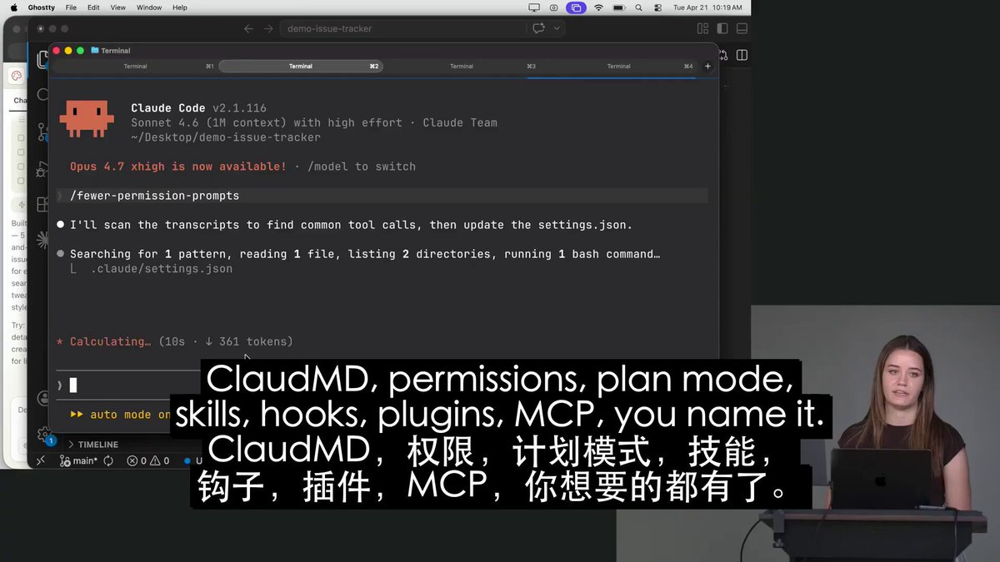

Claude Code 团队刚刚发布了一门关于使用 Fable 5 进行循环工程的免费课程：

\[00:00\] —— Claude Code 的底层工作原理
\[05 :01\] —— 智能体循环机制解析
\[16 :21 \] —— 99% 开发者忽略的功能：自动模式
\[19 :00\] —— 为什么语音优于打字
\[32: 34\] —— 使用草稿合并请求进行自动代码审查
\[58: 39\] —— 将 Fable 5 用于非编程工作

这门免费课程可以替代付费的 Claude Code 教程

### 🖼️ Attached Media

## 💬 Replies

### 1 @servasyy_ai (huangserva) (Author)

*Thu Jul 09 23:40:49 +0000 2026*

GPT-5.6 Sol两个月实测：浪费你时间最少的模型 [x.com/servasyy\_ai/st…](https://x.com/servasyy_ai/status/2075364123131699263)

### 2 @hanqing1120 (hanqing)

*Thu Jul 09 06:56:14 +0000 2026*

@servasyy\_ai 自动模式被99%开发者忽略，剩下的1%在偷偷无痛下班。免费的往往最贵——因为会上瘾。

### 3 @wangnimab40s (SoSo004)

*Thu Jul 09 08:33:24 +0000 2026*

@servasyy\_ai 试试LingTube这个Chrome插件吧！  
它能把YouTube、TikTok、Bilibili等平台的视频实时语音翻译播放出来，看教程学东西特别方便～😊

### 4 @servasyy_ai (huangserva) (Author)

*Thu Jul 09 08:46:11 +0000 2026*

@wangnimab40s 给个地址

### 5 @WEEXAILabs (WEEX AI Labs)

*Thu Jul 09 12:31:48 +0000 2026*

@servasyy\_ai 🐎了就是看了，看了就是学了，学了就是会了

### 6 @ajs6888 (安叫兽|Bird🕊️ 🔶 BNB)

*Thu Jul 09 14:25:55 +0000 2026*

@servasyy\_ai 自动模式那段估计很多人真会跳过，看完才发现挺关键

### 7 @clonncd (Caesar Chi)

*Thu Jul 09 09:44:12 +0000 2026*

@servasyy\_ai 講了一堆，就是不放原文原始影片，就 TM 特討厭你們這種賺資訊差的剪接仔

[youtube.com/watch?v=hXMTkm…](https://www.youtube.com/watch?v=hXMTkm-JUlQ)
[youtube.com/watch?v=6ERUGF…](https://www.youtube.com/watch?v=6ERUGFurDHY)

### 8 @_CyrusDoyle (Cyrus)

*Thu Jul 09 07:27:57 +0000 2026*

@servasyy\_ai 原视频是在哪里发布的啊

### 9 @daniel_du (Daniel Du)

*Thu Jul 09 05:02:30 +0000 2026*

@servasyy\_ai 语音优于打字, 我基本上是语音输入了

### 10 @KingofKungFu0 (John)

*Thu Jul 09 05:45:19 +0000 2026*

@servasyy\_ai 先点个赞收藏一波

### 11 @yo_yan14480 (获客编导阿言)

*Thu Jul 09 06:17:55 +0000 2026*

@servasyy\_ai 要点挺多 值得深学一下，不过fable 5是用不上了🙃

### 12 @weiwang11208 (vay)

*Thu Jul 09 07:21:56 +0000 2026*

@servasyy\_ai 只学 prompt，很快会撞到天花板。

### 13 @P_PLoveSinjai (TRX省费老斑)

*Thu Jul 09 02:56:45 +0000 2026*

@servasyy\_ai 赶紧去学了看看干货多不多

### 14 @redman_talk (红孩儿Redman)

*Thu Jul 09 06:05:44 +0000 2026*

@servasyy\_ai 收藏了先

自动模式那段是真的救命啊 之前一直手动点太累了

### 15 @Typori_2nd (Typori)

*Thu Jul 09 10:21:26 +0000 2026*

@servasyy\_ai 到中间就没翻译了

### 16 @Xcxy888 (Xc)

*Thu Jul 09 11:48:35 +0000 2026*

@servasyy\_ai 这集真的干货

### 17 @Jun1270408 (JuNN)

*Thu Jul 09 23:39:19 +0000 2026*

@servasyy\_ai @grok 总结一下视频生成resume文本

### 18 @sosolab13 (MaYo | Quant & AI)

*Tue Jul 21 08:25:28 +0000 2026*

@servasyy\_ai 循环工程概念不错，但真正落地还得看代码质量。

