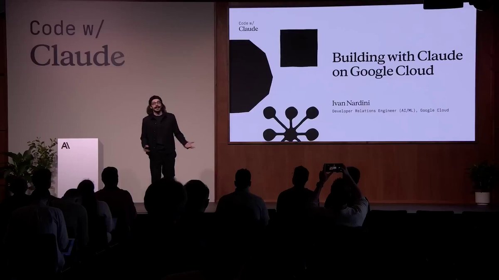

一位谷歌云工程师刚刚展示了
如何完全利用 Claude 从零开始构建一个完整的应用程序。  

他花了 26 分钟，完整地展示了拥有“Claude”这个角色的人能做些什么，而且完全是免费的。  

比很多付费课程都更有价值。  

以下是他的报道内容： 
&gt; 将应用程序在单次会话中部署的想法/方案 
&gt; 全体工程团队都使用 Claude 进行工作 
&gt; 他们在谷歌所采用的具体工作流程 
&gt; 不需要大型团队，也无需任何相关经验  

那些弄清楚Claude究竟能做什么的人，正在创造着那些在别人看来需要整个团队才能完成的东西。  

我特地给大家做了双语字幕👇

### 🖼️ Attached Media

## 💬 Replies

### 1 @blockphd7 (Blockphd区块博士.Ai 🎒)

*Sun May 24 01:19:49 +0000 2026*

@servasyy\_ai 免费这事儿倒是戳心——多少付费课程讲完理论学员还在配环境，属实是降维打击了。

### 2 @HuySolo_BBW (Huysolo)

*Sat May 23 05:05:48 +0000 2026*

@servasyy\_ai Claude真的让开发变得如此简单，令人惊叹！这样的展示让人对未来充满期待

### 3 @weidoqmomo (Alien🥞)

*Mon May 25 10:48:28 +0000 2026*

@servasyy\_ai 不好意思 請問 Google cloud 部署不是很容易要付費嗎

### 4 @AI_EC_Hacker (EC専門エンジニア)

*Sat May 23 22:07:44 +0000 2026*

@servasyy\_ai これ、逆に言うと「理想の対話設計」が全部見えてしまってるんですよね。

現場で価値出すのはモデルの出力力よりも、役割定義と手戻りを最小化するプロンプト設計の再現性で、そこが整うと時給換算で数万円レベルで差が出るのが現実。まるでCPUに最適化された命令列を組むがごとし。

### 5 @platoxai (PlatoX.AI)

*Sat May 23 15:39:57 +0000 2026*

@servasyy\_ai Google 云工程师介绍Claude？ 😆

