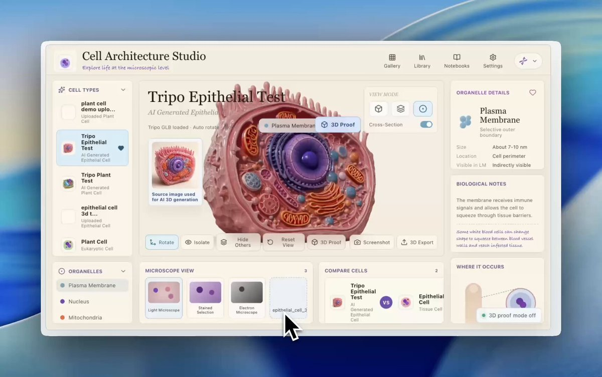

兄弟们！答应你们晚上开源，它来了

image to 3D模型目前只对接了线上：[tripo3d.ai](http://tripo3d.ai)
你们也可以改其他家，或者本地模型

记得点赞关注，用的好GitHub也给一颗小星星👇[github.com/huangserva/3DC…](https://github.com/huangserva/3DCellForge)BV

## 💬 Replies

### 1 @frxiaobei (凡人小北)

*Mon May 11 16:04:40 +0000 2026*

@servasyy\_ai 这个好，搞个器官的可以给医学院上课用

### 2 @servasyy_ai (huangserva) (Author)

*Tue May 12 00:41:37 +0000 2026*

@frxiaobei 其实什么都能做，只要上传物体图片

### 3 @yanhua1010 (Yanhua)

*Sun May 10 23:45:09 +0000 2026*

@servasyy\_ai @xingjian\_ai 可以用来教生物了 很不错

### 4 @berryxia (Berryxia.AI)

*Sun May 10 13:24:01 +0000 2026*

@servasyy\_ai 你都干完了 我本来想试试哈哈

### 5 @servasyy_ai (huangserva) (Author)

*Sun May 10 13:30:10 +0000 2026*

@berryxia 哈哈哈

### 6 @DilumSanjaya (Dilum Sanjaya)

*Sun May 10 23:59:44 +0000 2026*

@servasyy\_ai Don't act like the idea was yours. Give credit when you copy from someone else
[x.com/DilumSanjaya/s…](https://x.com/DilumSanjaya/status/2053155739389378849)

### 7 @servasyy_ai (huangserva) (Author)

*Mon May 11 04:33:03 +0000 2026*

@DilumSanjaya I never claimed the idea was mine. I simply recreated it and open-sourced it.

### 8 @li9292 (李韭二)

*Sun May 10 11:22:59 +0000 2026*

@servasyy\_ai 难得黄总又开源了，且看且珍惜

### 9 @servasyy_ai (huangserva) (Author)

*Sun May 10 11:27:08 +0000 2026*

@li9292 我这么抠的吗？

### 10 @ai_muzi (木子不写代码)

*Sun May 10 20:08:06 +0000 2026*

@servasyy\_ai nice啊黄兄！

### 11 @servasyy_ai (huangserva) (Author)

*Sun May 10 23:09:15 +0000 2026*

@ai\_muzi 玩一个？

### 12 @ZuiJiu61637 (车九 （低价蓝V代开）)

*Sun May 10 12:26:00 +0000 2026*

@servasyy\_ai 

### 13 @servasyy_ai (huangserva) (Author)

*Sun May 10 12:27:51 +0000 2026*

@ZuiJiu61637 感谢！

### 14 @ponyodong (波妞PONYO)

*Sun May 10 12:45:34 +0000 2026*

@servasyy\_ai 这个开源项目里 3D 模型的渲染逻辑太丝滑了。请教一下，从 Tripo 生成的模型导入 Codex 后，在处理纹理贴图的一致性上有什么避坑指南吗？”

### 15 @servasyy_ai (huangserva) (Author)

*Sun May 10 12:56:29 +0000 2026*

@ponyodong Tripo 模型导入后先查 UV 重叠/拉伸、校验 PBR 各通道是否完整，经常有"假数据"，多材质情况下统一分辨率和色调，批量生成时锁定  +  参数能省大量后处理。

### 16 @buildwithkuma (Kuma酱)

*Sun May 10 12:48:46 +0000 2026*

@servasyy\_ai 试了下效果不错，我用自己照片转3D贴Blender里当参考模型省了不少建模时间

### 17 @servasyy_ai (huangserva) (Author)

*Sun May 10 12:56:43 +0000 2026*

@buildwithkuma 那关注一下呗

### 18 @kylegeeks (Kyle Geeks)

*Mon May 11 02:53:26 +0000 2026*

@servasyy\_ai 好有趣，点上了
btw， tripo3d 这个贵不

### 19 @servasyy_ai (huangserva) (Author)

*Mon May 11 02:56:15 +0000 2026*

@kylegeeks 注册有一些免费的额度，也可以用本地模型，最新代码有本地模型选

### 20 @CopperForgeAI (铜匠AI・十点睡觉)

*Sun May 10 11:08:24 +0000 2026*

@servasyy\_ai 😀😀😀😀😀😀已star

### 21 @servasyy_ai (huangserva) (Author)

*Sun May 10 11:11:48 +0000 2026*

@smithandai 感谢！

### 22 @jimail0218 (Oberon)

*Sun May 10 11:54:07 +0000 2026*

@servasyy\_ai 是用GPT5.5 PRO嗎? 我只有PLUS, 沒能復刻的那麼完整

### 23 @servasyy_ai (huangserva) (Author)

*Sun May 10 11:54:33 +0000 2026*

@jimail0218 我用的pro

### 24 @Saramanho (Saraman)

*Sun May 10 13:12:36 +0000 2026*

@servasyy\_ai 谢谢黄总 这么高价值的项目

### 25 @servasyy_ai (huangserva) (Author)

*Sun May 10 13:14:02 +0000 2026*

@Saramanho 感谢🙏🏻

### 26 @LucianaiB0318 (LucianaiB)

*Sun May 10 11:28:33 +0000 2026*

@servasyy\_ai 牛，这个必须star

### 27 @servasyy_ai (huangserva) (Author)

*Sun May 10 11:29:15 +0000 2026*

@LucianaiB0318 感谢

