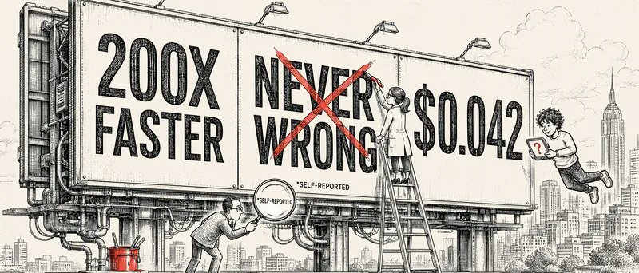
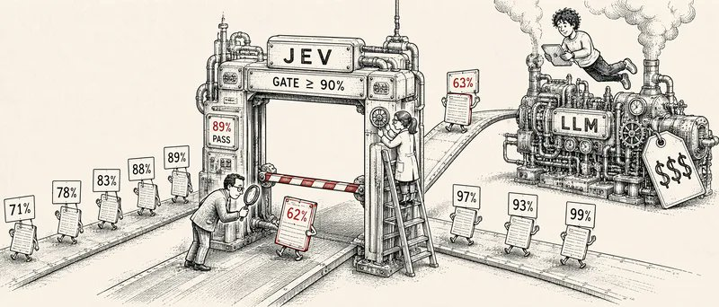
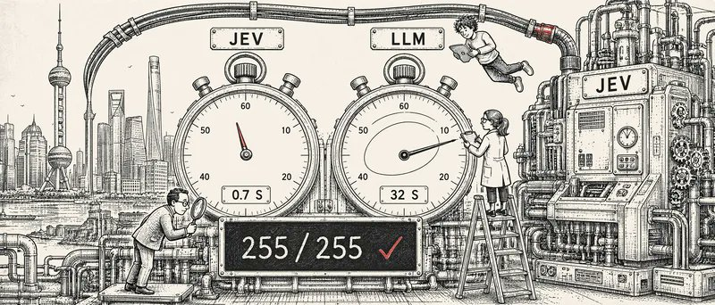

# 拿到 Jev，然后呢？ Jev 到底能干什么：剔掉虚火之后的一份真实落地清单

## 为什么写这篇

Jev 发布不到一周，网上已经满是“快 200 倍”“永不出错”“LLM 要被取代”。我翻了大量帖子，也跑了一批用例，感受是：真把东西做出来的人不多，大多数是转发、观点和“我打算做一个……”。

这篇文章只做三件事：说清 Jev 是什么、不是什么；把真正跑通的案例按用途分类；把水分讲明白。

## Jev 是什么：一个只做选择题的 AI

TypeSafe AI 在 2026 年 9 月 15 日发布了 Jev，创始人 Diogo Almeida 出身 OpenAI。

一句话理解：ChatGPT、Claude 是“会写作文的 AI”，Jev 是“只会做选择题的 AI”。 你给它一段信息和几道预先定好选项的题，它把答案一次性返回，每个答案附带一个“我有几成把握”。

它只会答三种题：

- 单选（Choice）：从最多 255 个选项里选一个
- 打分（Score）：在一个刻度上给分
- 是/否（Noul）：给出一个“是”的概率
为什么它快、便宜？普通大模型是一个字一个字往外写，Jev 的答案范围事先定好，算一遍每个选项的概率就完事。官方数据：响应 0.07 到 0.5 秒，输入每百万 token 收 0.042 美元，输出免费。它的训练目标也不同：不追求“答得好看”，追求“概率要准“——说 70% 把握时，就该有大约 70% 是对的。[citation](https://typesafe.ai/blog/introducing-system-one-models-and-jev) [citation](https://www.explainx.ai/blog/typesafe-ai-jev-system-one-models-launch-2026)

它不能聊天、不能写代码、不能写文案、不能看图。

怎么拿到 Jev

今天有两条路。一条是官方：去 TypeSafe 官网排队申请，通过后会收到一封“You‘re in!”的邮件，点进去注册账号就能拿到 API 密钥。我等了几天才排到，下面就是那封邮件。

另一条是 [OpenRouter](https://openrouter.ai)：不用排队，注册后直接调用 typesafe/jev 模型，按量付费。想马上上手的走这条，后文两轮实测就是从 OpenRouter 跑的。

官方数字，以及要打折的地方

官方对比（全部自报）：

官方没有跑公开榜单，而是自建了一套测试：让各模型在同一段程序里做决策，拿两个最强模型的平均答案当标准。在这套测试里，Jev 的准确率约 68%，接近中等水平的大模型，但便宜 40 到 400 倍、快 20 到 200 倍。[citation](https://www.datacamp.com/blog/system-one-models-jev)

Hacker News 上值得记住的三条质疑：

“永不幻觉”说的是“不会给出选项之外的答案”，但选错一个选项完全可能。TypeSafe 的 CEO 自己也承认了这一点。

“前沿模型”这个词有点借光。 更老实的说法是：在**“做选择题”**这件事上，它把速度和成本推到了新水平。

速度对比不完全公平。 它对比的是大模型完整写出一段答案的时间，而不是让大模型也只答一个字母。

刷屏的 Doom 游戏演示喂的是敌人坐标，不是画面。 模型相当于能透视，说明的是反应快，不是会玩游戏。[citation](https://www.explainx.ai/blog/typesafe-ai-jev-system-one-models-launch-2026)

我的看法：这些批评没推翻它的价值，但说明**“Jev 取代大模型”是伪命题**。合理用法是：大模型帮你想清楚判断规则，Jev 在生产环境里高频、低价地执行。它抢的不是大模型的活，而是那些以前“不值得上 AI”的小判断。

## 已经真实跑通的场景

以下每一条都有可访问的代码、演示或产品入口。数字多为作者自报，未独立复核。

一、给 AI 助手当“决策器”

数量最多、质量最高的一类。AI 助手每一步都要在有限动作里选一个，正好是选择题，而且要快。

标杆是 Browser Use 开源的 [Jev Ultrafast](https://github.com/browser-use/jev-ultrafast)：不再每步截图给视觉模型看，而是把网页拆成带编号的元素清单，让 Jev 选“做什么、对哪个”。实测搜一张机票全程从 9.5 秒缩到 7.1 秒，项目带测量脚本，是我见过证据最完整的案例。[citation](https://news.lavx.hu/article/jev-ultrafast-cuts-browser-agent-time-by-25-with-typesafe-action-space)

同一思路的其他项目：

二、海量数据逐条分类

这是 Jev 最能省钱的地方。输出免费、输入极便宜，意味着对几百万条数据逐条问“这条要不要报警“”这封邮件是不是诈骗“是算得过账的。用大模型干这事从来都太贵太慢。

文本分类的实测：

三、“有把握就自动过，没把握再问大模型”

我认为最值得研究的用法，因为它用上了 Jev 最独特的东西：那个“几成把握”。

这套打法的前提是概率要准——如果 Jev 说 90% 把握却只对了 70%，整套流程就是漏的。这是我第二轮实测重点验证的一点，见后文。

四、实时反应与“预测你想做什么”的界面

五、仿真与控制实验

提醒：这些全是模拟数据。Jev 不能看图，网上传的“自动驾驶“说法也已经被工程师们否掉了。当形状探索看就好。

## 已经接入产品的

这是我最看重的信号：有人在真金白银的产品里承担了 Jev 判错的后果。

## 哪些没算进来

OpenJev、Kev、Nimble 这类模仿 Jev 的替代模型没算，它们不是 Jev 的应用。纯观点、教程、上架公告、没有运行证据的构想也都排除了——这部分的数量大概是真实案例的好几倍。

## 我自己的实测：四次失败，两轮跑通

上面的案例全是别人跑的，接下来是我自己跑的。先说失败的，再说跑通的。

先说四次失败：把 Jev 塞进自己的工具，全卡死

拿到 Jev 的第一周，我没急着做基准测试，而是直接把它往自己每天用的工具里塞，想看它能不能帮我提效。试了四次，全失败。先说清楚：失败原因都不在模型本身——Jev 的接口每次都正常返回，中文判断也准——而是它一被塞进真实应用，就撞墙。

四次失败，根子是三条：

一、它看不到内容。 压缩插件和磁盘清理都死在这。为了塞进 32K 上限得先砍内容，砍完它就没法判断了。“又快又准”只有前半句成立——要准就得给它看内容，给它看内容就超上限。不是它不精准，是根本没给它看内容。

二、订阅制杀死了它的经济学。 它的卖点是“比调大模型便宜几百倍”，可我用的 Codex、Claude Code 是订阅制，判断这件事本来就包在月费里，边际成本是零。再插一层 Jev，只会多一层、多一秒、多出毛病。至于“路由到便宜模型省额度”——换便宜模型不叫省，叫少买。

三、它只会“判断”，不会“干活”。 一旦要接进真实流程，就得靠第三方写的插件或代理去搬数据，而那些项目大多是个人两三天写出来的。失败往往不是 Jev 的错，是它周围那层壳的错。

这四次给我的教训不是“Jev 没用”，而是：想拿它给自己提效的人，走不通；把它当零件做进产品的人，才有可能。 于是我换了方向，正经做了两轮测试，回答两个问题：

一、这 60 个案例里，到底有多少是今天就能拿来用的？二、Jev 说“几成把握”，这个数准不准？不准的话，前面第三种用法“按把握分流”就是空谈。

于是做了两轮：第一轮，让 Jev 自己给 217 个 Jev 项目打分，判断“能不能用”，回答第一个问题，顺手验证“海量分类”这个用法；第二轮，造 100 条中文资讯、预先标好答案，让 Jev 做 300 个判断，看它的“把握程度”和实际正确率对不对得上，顺带测国内真实速度，并拉一个便宜大模型做对照。这也是五次尝试里唯一真正跑通的一次。

第一轮：让 Jev 自己给 217 个项目打分

把 60 个案例加上 GitHub 上 167 个 Jev 项目，共 217 条的公开介绍喂给 Jev，让它逐条判断“今天能不能拿到、能不能用”。

真正“拿来就能用”的很少，而且几乎都是接口，不是应用。 217 条里被判为“现在可用”且证据充分的只有 15 个，其中 14 个是 pydantic-ai、LangChain、Vercel AI SDK 这类主流开发框架里的 Jev 接入。唯一的应用是 [jev-ultrafast](https://github.com/browser-use/jev-ultrafast)，和我把它列为标杆的判断一致。

X 上的演示，大多是“作者跑通了，但你拿不到”。 热闹是真的，能下载的少。

“已接入产品”那五个，Jev 比我保守。 它只认 SPIRITT 和 ReqLLM 是今天能直接摸到的。

局限：Jev 只看我喂的文字，不开链接、不跑代码，判的是“公开证据够不够”，不是项目好不好。它的“几成把握”准不准，这轮验证不了，因为我没有 217 条的标准答案。

第二轮：它的“几成把握”准不准，国内多快

100 条中文科技资讯，答案事先标好，每条三道题，共 300 个判断。对照组是便宜的大模型 Qwen 3.8 Flash。从上海一条一条串行调用。

它说“九成以上把握”的，一个没错。 300 个判断里 255 个是这一档，全对。把 80% 设为自动放行线，能放掉 89% 的请求，只错 1 个。“有把握就自动过”这套打法，至少在简单任务上成立。

上海实测约 0.7 秒，比官方说的慢，但极稳。 最慢一次 1.5 秒；对照的 Qwen Flash 中位数差不多，但最慢一次 32 秒。Jev 赢的不是“快”，是“没有长尾”。

准确率和费用，都和便宜大模型打平。 94.7% 对 93.0%，各花 0.003 美元。官方的“便宜 40 到 400 倍”比的是前沿大模型，对上轻量模型 Jev 不占便宜。

局限：100 条是 25 个模板各变 4 次造出来的，任务偏简单，高把握全对不算意外；80%–90% 那档只有 11 个样本，说不了准。Jev 和 Qwen 答得不一样的 12 条，几乎全是“云数据库算应用还是算其他”这类标签边界问题，结论多少取决于你怎么定义标签。要下生产结论，得拿真实数据盲测。

## 综合判断

两轮实测做完，加上前面四次失败，我的观点很明确。

一、Jev 是真的，但它不是“更便宜的大模型”，而是另一种东西。 对上 Qwen Flash 这类轻量模型，它准确率打平、费用打平，多出来的只有两样：反应时间稳定，以及每个答案带一个能拿来分流的把握程度。谁拿“便宜”当选它的理由，谁就选错了。它不是更聪明，是把“判断”这一种活从“写作文”变成了“涂答题卡”——代价是它只会涂卡。

二、今天能用的 Jev，是框架里的接口，不是应用。 217 个项目筛出 15 个真能用，14 个是 pydantic-ai、LangChain、Vercel AI SDK 的接入层。我自己四次往日常工具里塞，全失败。X 上的演示看看就好，别指望拿来用。Jev 是给做产品的人用的零件，不是给用工具的人提效的东西。

三、它真正值钱的只有一个用法：按把握程度分流。 高把握自动过，低把握再问大模型。我的测试里，九成以上把握的 255 个判断一个没错。这不是“替代大模型”，是在大模型前面加一道又快又稳的闸门，把八九成的请求挡在外面。

四、但今天别上生产。 两轮样本都偏简单，80%–90% 那一档只有 11 个样本；官方账号还要排队，OpenRouter 能立刻用，但那是第三方通道，不是官方的服务承诺。

我的方案，三步：

把自己业务里“现在用大模型，但其实只让它返回一个选项”的调用列出来。一个都没有，就别追这个热点。

有，挑一个，拿真实历史数据、人工先定好答案，跑一次盲测，重点看 70%–90% 那一档的真实正确率。

过了，就在大模型前面加一道 Jev 闸门，从 90% 阈值起步，看着数据慢慢往下调。
