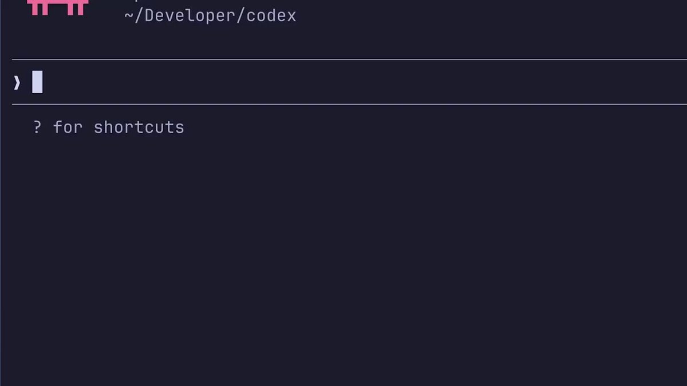

用过的应该都知道
Claude Code 里用 Codex 感觉太好了！

一条命令安装，OpenAI 发布的一个插件：
/plugin install codex@openai-codex

直接在 Claude Code 里运行 Codex

代码审查、对抗性审查、后台任务……💪

还不快去试试？
[x.com/dr\_cintas/stat…](https://x.com/dr_cintas/status/2054617730104328257/video/1)w

### 🖼️ Attached Media

## 💬 Replies

### 1 @AIPlusLabs (ezsou)

*Thu May 14 14:24:35 +0000 2026*

@servasyy\_ai 1年Vibe Coding 总结： Codex 适合作为开发经理，开发工程师角色，能围绕单点不断优化； Claude Code Opus适合产品经理，架构师角色，更具有大局观。

### 2 @servasyy_ai (huangserva) (Author)

*Thu May 14 14:26:50 +0000 2026*

@AISeek\_PT 说的很好，就是这样，Claude做规划，Codex做执行/审查

### 3 @Dearzeus09 (Chang09)

*Thu May 14 13:36:13 +0000 2026*

@servasyy\_ai 为什么？我一直没有用过cc，不太习惯终端，codex desktop好像功能已经很完善了？

### 4 @servasyy_ai (huangserva) (Author)

*Thu May 14 13:49:14 +0000 2026*

@Dearzeus09 codex cli也是和cc一样的啊

### 5 @songsong (宋宋)

*Thu May 14 13:12:40 +0000 2026*

@servasyy\_ai 还是再codex里用claude code 比较得劲

### 6 @servasyy_ai (huangserva) (Author)

*Thu May 14 13:13:40 +0000 2026*

@songsong 怎么说？

### 7 @drmrzhong (AI设计钟师傅)

*Thu May 14 14:59:18 +0000 2026*

@servasyy\_ai 用上了，真香

### 8 @QT9277 (阿台🕊️)

*Thu May 14 11:17:48 +0000 2026*

@servasyy\_ai Codex插件让ClaudeCode代码审查体验飞跃。

### 9 @mylifcc (lifcc)

*Thu May 14 17:13:03 +0000 2026*

@servasyy\_ai 拿 Codex 做代码审查试了不少次——对抗性审查效果不太稳定，分出后台任务 + Claude Code 主线规划的方式反而顺。另外 \`\[features\].codex\_hooks\` 已弃用，换成 \`\[features\].hooks\` 后 hook 才能触发。

### 10 @bygregorr (Gregor)

*Thu May 14 14:25:38 +0000 2026*

@servasyy\_ai ngl didn't expect openai to ship a claude code plugin before anthropic did

### 11 @Chenzeze777 (阿泽 AZe)

*Thu May 14 13:03:14 +0000 2026*

@servasyy\_ai 两个最强模型配合确实香

### 12 @Himi_LL (Himi.L)

*Thu May 14 13:01:55 +0000 2026*

@servasyy\_ai 感觉有点 ntr

### 13 @mikeng_io (ᎷᎥᏦᏋ ᏁᎶ)

*Thu May 14 19:07:59 +0000 2026*

@servasyy\_ai 順序才是關鍵，讓Claude先寫、Codex最後review效果最好，因為Claude寫完會有 sunk cost，Codex最後看反而更客觀跳出來挑毛病。

### 14 @cjtong_X (cjtong)

*Thu May 14 14:48:37 +0000 2026*

@servasyy\_ai 要重新auth吗？

### 15 @0xhodl_k (HODL_K 💎)

*Thu May 14 17:42:50 +0000 2026*

@servasyy\_ai 脫褲子放屁…

### 16 @fengtui8 (呈诫元奘)

*Thu May 14 16:33:23 +0000 2026*

@servasyy\_ai 能直接在 Codex 里运行 Claude Code不呢，哪种方式更好？

### 17 @yzg75001 (CryptoClaw)

*Thu May 14 18:10:54 +0000 2026*

@servasyy\_ai Just tried this — Codex running inside Claude Code is surprisingly smooth. The adversarial review mode caught a race condition in my auth flow that I totally missed. Worth the 30s setup.

### 18 @AIxiaolinzys (AI小林自由说)

*Thu May 14 18:00:06 +0000 2026*

@servasyy\_ai 这个组合适合拿来做交叉审查：Claude Code 先按项目上下文改，Codex 再从另一个角度挑毛病。关键是别让两个 agent 同时写同一块代码，不然 review 成本会炸。

### 19 @youguang77 (祐光 YG)

*Thu May 14 18:22:19 +0000 2026*

@servasyy\_ai 是很好用 可惜有时候用codex写码的时候不能用claude review

