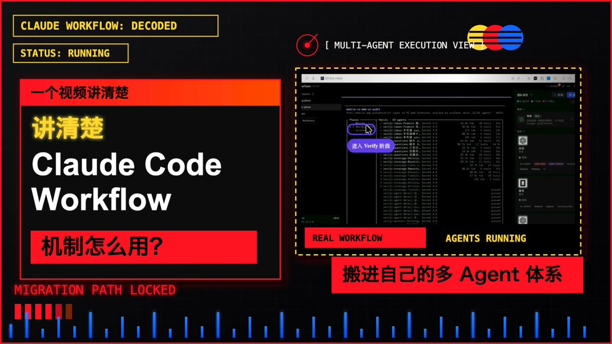

肝了几天,来回打磨了快 30 遍,
一次性把最新的 Claude Code 的 Workflow 给你完全拆解清楚

有人说它的伟大程度,不亚于 MCP 和 Skill。

第一眼我是不信的,直到拆开看它内部怎么跑：
这不是"问一句答一句"的对话,而是一个能自己跑起来的任务系统:后台持续执行、可监控、可保存进度, 还能一口气派出几十上百个 agent 分头干活/合并汇总。

核心就三个角色:
Claude 拆任务、定计划;
Runtime 管调度和状态;
每个 agent 只啃一个子任务,配上并发池和队列,有节奏地推进。
它代表的是一种新的工程编排方式:智能负责规划,Runtime 负责执行,状态独立保存,模型按需调度。

最反直觉的一点:它能扩展到上百个 agent,靠的不是模型变强,而是"状态外置"—中间结果全交给执行系统保存,主上下文只看摘要和关键判断。这才是复杂任务能跑稳的真正原因。

这条视频直接给了你把它搬进自己系统的方法:
先用 Claude Code 做高质量规划、拆任务定阶段;
再把 workflow 转成自己的执行格式,按任务难度路由到不同模型池，简单的走便宜模型，复杂的才上高阶模型。

这条视频,值得反复看几遍👇

### 🖼️ Attached Media

## 💬 Replies

### 1 @AI_Jasonyu (鱼总聊AI)

*Tue Jun 02 06:37:07 +0000 2026*

@servasyy\_ai 非常有用！

### 2 @PandaTalk8 (Mr Panda)

*Tue Jun 02 03:48:04 +0000 2026*

@servasyy\_ai 黄老板吾辈楷模

### 3 @servasyy_ai (huangserva) (Author)

*Tue Jun 02 04:17:02 +0000 2026*

@PandaTalk8 panda老师可以刷到我了？

### 4 @Pluvio9yte (雪踏乌云)

*Tue Jun 02 03:41:12 +0000 2026*

@servasyy\_ai 这个具体视频细节是怎么做的

### 5 @servasyy_ai (huangserva) (Author)

*Tue Jun 02 04:17:27 +0000 2026*

@Pluvio9yte codex+hyperframe + remotion

### 6 @gkxspace (余温)

*Tue Jun 02 03:49:35 +0000 2026*

@servasyy\_ai 黄总视频做的真好，什么时候把这个的工作流程讲一讲

### 7 @servasyy_ai (huangserva) (Author)

*Tue Jun 02 04:18:12 +0000 2026*

@gkxspace 好

### 8 @yanhua1010 (Yanhua)

*Tue Jun 02 02:20:44 +0000 2026*

@servasyy\_ai 我在想，如何将claude code这套agent workflow用国产模型跑起来了， 比如ds

### 9 @servasyy_ai (huangserva) (Author)

*Tue Jun 02 02:35:02 +0000 2026*

@yanhua1010 对，我就是这个思路

### 10 @bozhou_ai (泊舟)

*Tue Jun 02 01:03:05 +0000 2026*

@servasyy\_ai 视频是用啥做的啊

### 11 @servasyy_ai (huangserva) (Author)

*Tue Jun 02 01:08:32 +0000 2026*

@bozhou\_ai Codex +  Remotion + HyperFrames

### 12 @LufzzLiz (岚叔)

*Tue Jun 02 04:09:56 +0000 2026*

@servasyy\_ai 赞，也顺便推荐下我用cc dw 对自己做的分析😄[cc-dynamic-workflows.pages.dev](https://cc-dynamic-workflows.pages.dev/)B

### 13 @servasyy_ai (huangserva) (Author)

*Tue Jun 02 04:16:41 +0000 2026*

@LufzzLiz 这个分析比较好

### 14 @MinLiBuilds (实践哥 Li)

*Tue Jun 02 01:04:50 +0000 2026*

@servasyy\_ai 看起来不错，先收藏，再观看

### 15 @servasyy_ai (huangserva) (Author)

*Tue Jun 02 01:08:49 +0000 2026*

@MinLiBuilds 花了不少心思的

### 16 @adelbucetta (Adel Bucetta)

*Tue Jun 02 06:20:23 +0000 2026*

@servasyy\_ai the honest answer is that polish is overrated. if your product doesn't change someone's behavior after day 3, the extra 29 iterations don't matter.

### 17 @servasyy_ai (huangserva) (Author)

*Tue Jun 02 06:23:00 +0000 2026*

@adelbucetta You are right

### 18 @Lonely__MH (Lonely)

*Tue Jun 02 01:01:22 +0000 2026*

@servasyy\_ai 硬核👏

### 19 @servasyy_ai (huangserva) (Author)

*Tue Jun 02 01:08:14 +0000 2026*

@Lonely\_\_MH 感谢

### 20 @hezhiyan7 (droidHZ)

*Tue Jun 02 03:48:58 +0000 2026*

@servasyy\_ai 黄老板这个是用心做教程呀

### 21 @servasyy_ai (huangserva) (Author)

*Tue Jun 02 04:18:06 +0000 2026*

@hezhiyan7 是比较用心，这个视频

### 22 @xingjian_ai (星见)

*Tue Jun 02 01:36:40 +0000 2026*

@servasyy\_ai claude做的这个工程化的多agent上下文管理
还是很值得学习的

### 23 @servasyy_ai (huangserva) (Author)

*Tue Jun 02 01:47:45 +0000 2026*

@xingjian\_ai 非常值得学，真的好用到吐的东西

### 24 @shitunote (马识途)

*Tue Jun 02 01:39:52 +0000 2026*

@servasyy\_ai 很专业 最近在玩Claude Code 

先收藏 人后认真观看 🤪

### 25 @servasyy_ai (huangserva) (Author)

*Tue Jun 02 01:47:55 +0000 2026*

@shitunote 非常非常好，真的，不是吹的

### 26 @yhslgg (老杨啊 | AI产品商业化)

*Tue Jun 02 01:54:03 +0000 2026*

@servasyy\_ai 看上了黄总这个视频模版。

### 27 @servasyy_ai (huangserva) (Author)

*Tue Jun 02 01:54:36 +0000 2026*

@yhslgg codex + remotion +hyperframes

### 28 @vickyzhangtimes (Vicky)

*Tue Jun 02 07:04:04 +0000 2026*

@servasyy\_ai 好细致的拆解  好奇是怎么想到要去拆的 大佬的思维方式果然值得学习

### 29 @servasyy_ai (huangserva) (Author)

*Tue Jun 02 07:09:43 +0000 2026*

@vickyzhangtimes 因为实在太好用，但是又太消耗tokens了

### 30 @longkinght (黄彬)

*Tue Jun 02 01:14:04 +0000 2026*

@servasyy\_ai 终于打磨出来了！太强大了

### 31 @servasyy_ai (huangserva) (Author)

*Tue Jun 02 01:15:25 +0000 2026*

@longkinght 第一版本出来了，还需要继续打磨

### 32 @CopperForgeAI (铜匠AI・十点睡觉)

*Tue Jun 02 00:55:14 +0000 2026*

@servasyy\_ai 老规矩,先码字再学习

### 33 @servasyy_ai (huangserva) (Author)

*Tue Jun 02 00:55:40 +0000 2026*

@smithandai 最近流量不高，这个真实辛苦码出来的

### 34 @mumaren_2 (Allen)

*Tue Jun 02 07:24:05 +0000 2026*

@servasyy\_ai 下次拆下Codex？

### 35 @servasyy_ai (huangserva) (Author)

*Tue Jun 02 07:26:44 +0000 2026*

@mumaren\_2 codex不是开源吗？

