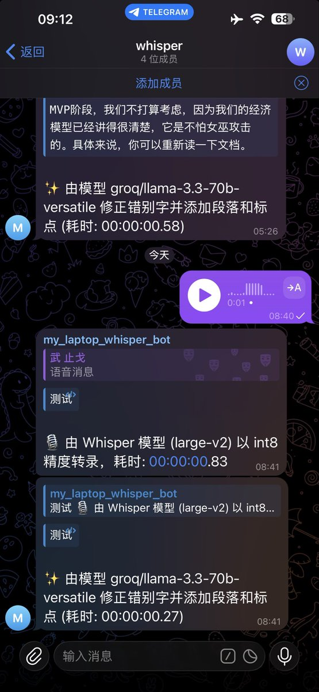

🔥🔥强烈推荐的宝藏项目！
比Whisper 性能升级：4倍提速的完美迁移

我已经用上了，非常好，优秀！

之前用OpenAI 官方 Whisper，现在发现了更优方案：faster-whisper

核心数据（13分钟音频测试）：
⚡ 速度：2m23s → 59s（快4倍），批量模式仅需16s
💾 显存：4708MB → 2926MB（省38%）
🎯 新特性：int8量化 + 批量处理 + 内置VAD静音过滤

为什么值得升级？
1.CTranslate2引擎替代PyTorch，效率翻倍
2.量化技术显著降低资源占用
3.API几乎完全兼容，迁移成本极低
4.自动过滤无效音频段，提升实际准确率

我实际测试下来结论：
• 速度：
短音频（&lt;10s）：faster-whisper 有初始化开销，反而更慢一点
长音频（&gt;30s）：faster-whisper 优势明显，快 3倍多

• 内存：减半（int8 量化）
• 新特性：内置 Silero VAD 自动过滤静音段

对实时性要求高的场景，faster-whisper 是无脑升级选项！
项[github.com/SYSTRAN/faster…](https://github.com/SYSTRAN/faster-whisper)E3yU

## 💬 Replies

### 1 @berryxia (Berryxia.AI)

*Wed Dec 31 15:48:50 +0000 2025*

@servasyy\_ai 改天试试

### 2 @LufzzLiz (岚叔)

*Wed Dec 31 15:48:40 +0000 2025*

@servasyy\_ai 可以挂闪电说吗？

### 3 @servasyy_ai (huangserva) (Author)

*Wed Dec 31 15:53:52 +0000 2025*

@LufzzLiz 闪电说，不是用whisper，它用了是更快的一个模型

### 4 @hiheimu (赖叔 | LaiShu.ai)

*Wed Dec 31 15:23:13 +0000 2025*

@servasyy\_ai 可以本地化部署吗

### 5 @servasyy_ai (huangserva) (Author)

*Wed Dec 31 15:25:04 +0000 2025*

@hiheimu 就是本地化的，我已经用上了

### 6 @chaunceylee2030 (Chauncey Lee)

*Thu Jan 01 13:31:34 +0000 2026*

@servasyy\_ai 已经fork了 在4090上真的飞快 等会再试试看在mac上本地性能怎么样

### 7 @servasyy_ai (huangserva) (Author)

*Thu Jan 01 13:49:39 +0000 2026*

@lsy\_dy9759 mac也很快

### 8 @block0_eth (block0)

*Thu Jan 01 05:35:32 +0000 2026*

@servasyy\_ai 这是本地跑吗 ？比如10分钟的youtube视频，音频转字幕大约时长是？

### 9 @servasyy_ai (huangserva) (Author)

*Thu Jan 01 05:48:19 +0000 2026*

@block0\_eth 本地跑的，就是我的mac电脑，10分钟我没试过，理论是whisper的1/4的时间

### 10 @codewithimanshu (Himanshu Kumar)

*Thu Jan 01 19:56:01 +0000 2026*

@servasyy\_ai Faster-whisper increases transcription speed; Whisper performance undergoes improvement.

### 11 @EvanLing888 (Aria Ling)

*Thu Jan 01 02:32:55 +0000 2026*

@servasyy\_ai 同推荐这个，低成本，带时间线

### 12 @JoeyDeepWorld (周.乙 (⌐▀͡ ̯ʖ▀)ノJoey)

*Thu Jan 01 10:38:20 +0000 2026*

@servasyy\_ai 这个牛👍，吃完饭试试。

好人有好报，钞票多到爆🙏

### 13 @wuzhige4pixel (武止戈👽🦀相比于《1984》, 我宁可《2012》)

*Thu Jan 01 17:12:57 +0000 2026*

@servasyy\_ai gemini3刚出的时候用gemini cli闭着眼纯vibe出来的项目，我做调研确定使用fast-whisper用的时间比vibe coding还久🤣

效果如图

地址
[github.com/RyderFreeman4L…](https://github.com/RyderFreeman4Logos/whisper-bot-zh)C7

### 14 @xmoiduts (xmoiduts)

*Fri Jan 02 04:37:08 +0000 2026*

@servasyy\_ai 有word timestamp吗？

### 15 @xiamiluo (虾米)

*Thu Jan 01 05:51:50 +0000 2026*

@servasyy\_ai 有无代码体验一下

### 16 @Suraelaxeqw (hjngg)

*Thu Jan 01 01:24:23 +0000 2026*

@servasyy\_ai amd support?

