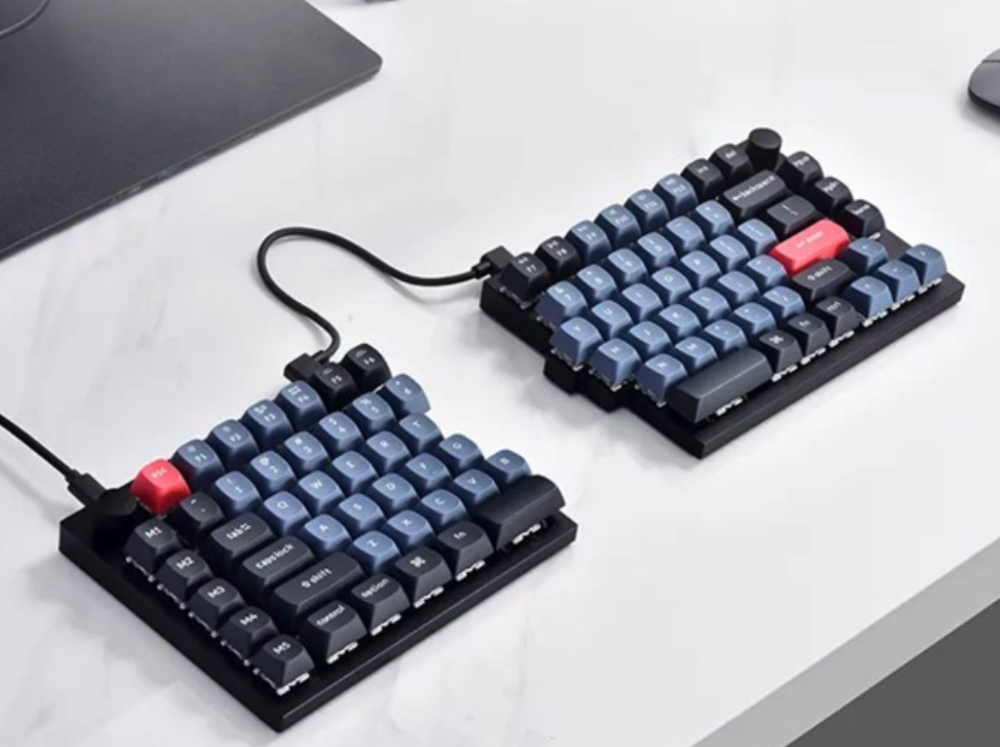
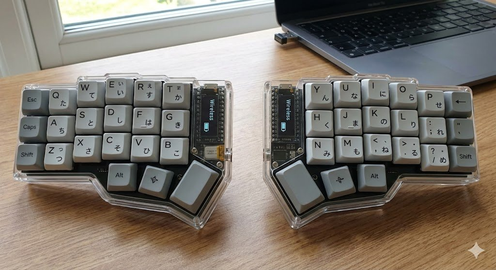

程序员就没几个是健康的，所以我最近做了一些点。
1\. 升降桌自动化，买了可以接入米家的升降桌，坐了45分钟之后，自动站立15分钟。（千万不能久坐，很容易降低睾酮和得前列腺炎。）
2\. 买了分体式键盘 + 键盘托！现在写代码胸腔可以完美展开，配合人体工学椅，完全放松颈椎和胸腔。但是目前这个还没有解决缺少抬头的这个点。暂时先多打羽毛球抬头。
2\. 补充复合维生素
3\. 额外隔一天单独，补充维D，K2, Zn, Se ,甘氨酸镁(比氧化镁或柠檬酸镁更容易被身体吸收和利用，不易导致腹泻) 补充叶黄素，护眼
4\. 抗阻运动(健身)，尤其注意练背，程序员全都前束紧张
5\. 买了小米洗牙器2，这个太重要了！用了之后牙齿好了很多，避免牙周炎。
6\. 设置了每天定时喝水的提醒
7\. 定期洗鼻，帮我减弱鼻炎。
8\. 每天注意补充足量的蛋白质。
9\. 每天踩缝纫机（椭圆仪

这也是好东西
[github.com/zijie0/HumanSy…](https://github.com/zijie0/HumanSystemOptimization)

### 🖼️ Attached Media

## 💬 Replies

### 1 @Easson_Wen (Dr. Wen. Pediatrics🩺)

*Sat Feb 21 23:29:44 +0000 2026*

@jakevin7 程序员没几个健康是有原因的，24年JAMA就发表了这样一份研究，可以去了解下，根据这份研究的建议去做些改变。

### 2 @jakevin7 (kabikabi) (Author)

*Sun Feb 22 14:44:15 +0000 2026*

@Easson\_Wen 感谢！

### 3 @frank_uid (Frank)

*Sun Feb 22 11:49:49 +0000 2026*

@jakevin7 前司的健身房、食堂、工位都在同一栋楼，以前经常早上去健身然后下楼吃早餐，再下楼回工位上班

当早上卧推涨了5kg后，一天工作遇到什么糟心事都能想得通😅

### 4 @jakevin7 (kabikabi) (Author)

*Sun Feb 22 14:47:28 +0000 2026*

@frank\_uid 健身提高睾酮，这个可以抗抑郁让人开心。确实心情都好很多，再配合偶尔散散步，血清素也会分泌，人状态更好。

### 5 @nameless_2024 (nameless)

*Sat Feb 21 12:41:05 +0000 2026*

@jakevin7 请教下，踩缝纫机的作用是啥

### 6 @jakevin7 (kabikabi) (Author)

*Sat Feb 21 12:44:03 +0000 2026*

@nameless\_2024 带抗阻作用的有氧运动。

### 7 @bystander520 (bystander)

*Sat Feb 21 12:24:05 +0000 2026*

@jakevin7 第一次知道分体式键盘还有这个好处.

### 8 @jakevin7 (kabikabi) (Author)

*Sat Feb 21 12:33:30 +0000 2026*

@bystander520 普通的键盘正常的使用过程之中，你的胸腔是含着的，很容易造成胸前束紧张并且头前倾

### 9 @weqqq278051 (we'q'q'q)

*Sat Feb 21 15:22:46 +0000 2026*

@jakevin7 电动牙刷餐餐刷，洗牙器基本没用了

### 10 @jakevin7 (kabikabi) (Author)

*Sun Feb 22 14:43:18 +0000 2026*

@weqqq278051 错误的，你试试就知道了，这两个是两码事。
牙刷是大面积的，洗牙器是水牙线，必须配合使用。

### 11 @macrochen9 (macrochen)

*Mon Feb 23 10:26:37 +0000 2026*

@jakevin7 久坐确实影响生殖系统健康，但“坐45分钟降低睾酮”的说法略显夸张。睾酮水平更多受深度睡眠、体脂率和大重量腿部训练影响。

### 12 @jakevin7 (kabikabi) (Author)

*Mon Feb 23 10:32:37 +0000 2026*

@macrochen9 久坐影响睾酮，不是坐45分钟影响睾酮…

### 13 @crazyox (Crazyox🌶️（微微辣版）)

*Sun Feb 22 02:48:19 +0000 2026*

@jakevin7 哇这真的好细节，学到了

### 14 @hahagood (hahagood)

*Sat Feb 21 14:21:50 +0000 2026*

@jakevin7 我用分体键盘好多年了. 
是下图这一款. (corne)
图是AI画的. 

### 15 @Linus56269438 (Linus)

*Sat Feb 21 15:25:49 +0000 2026*

@jakevin7 买人体工学椅+机械臂，120度办公，这样对腰椎压力小。少用键盘多语音输入，键盘的钱也可以省掉了

### 16 @JimMartinKing (Jim Martin)

*Sun Feb 22 01:46:21 +0000 2026*

@jakevin7 不工作立刻没毛病了 亲身体验

### 17 @lambieliu44663 (Lambieliu)

*Sat Feb 21 13:54:44 +0000 2026*

@jakevin7 还需要做力量训练

### 18 @thePixelsAI (Pixels.AI)

*Sun Feb 22 01:17:27 +0000 2026*

@jakevin7 练腿、练腿、练腿

重要的事情说三遍

一定要练腿

特别特别是体重大的程序员

### 19 @jihuayu123 (纪华裕)

*Sat Feb 21 14:50:10 +0000 2026*

@jakevin7 我是二指禅，用不了分体式键盘🥲🥲

### 20 @shinonome_tk (東雲たく)

*Sat Feb 21 19:05:27 +0000 2026*

@jakevin7 注意身体，1到10都数不齐了……

### 21 @bullusy (魔力根)

*Sat Feb 21 12:04:11 +0000 2026*

@jakevin7 牛逼，收藏了

### 22 @poseidon023 (Poseidon023)

*Sat Feb 21 21:09:51 +0000 2026*

@jakevin7 最近也在看分体键盘，但是keychron这个，真的太丑了😀

### 23 @alexzyuan (一个人的嗡嗡作响)

*Sat Feb 21 14:11:55 +0000 2026*

@jakevin7 请问哪个升降桌可以接入米家呢、

### 24 @jekindsww (jekinshdjjw)

*Sat Feb 21 15:36:47 +0000 2026*

@jakevin7 我也想用分体式键盘，但是我更需要巧克力键盘。 你说的展开胸腔的问题我有注意到，确实是这样的，抬头的话很容易解决，用外接显示器，把显示器垫高到眼睛平视的高度就好了，非常简单。

### 25 @haiwenw (haiwenwang)

*Sun Feb 22 02:50:38 +0000 2026*

@jakevin7 我之前不知道，没有装软胶垫或活动脚垫，体重大，鞋底还硬，在桌前站15分钟太久，一星期把脚底站出问题了，出问题后按摩休息了半年才好。每次站两三分钟就足够了，我感觉另外还需每小时或深蹲或转肩60秒

### 26 @Microstrongs (microstrong)

*Sat Feb 21 13:41:59 +0000 2026*

@jakevin7 确实要注意日常保健，身体是本钱，健康是底线。

### 27 @dangnianyu (Philip)

*Sun Feb 22 02:46:16 +0000 2026*

@jakevin7 买个显示器支架，把显示器抬高点

### 28 @polin_solana (Polin.ai🎒)

*Sun Feb 22 02:44:53 +0000 2026*

@jakevin7 我也买了这个键盘，但就隔开10cm 够吗？

### 29 @Ymc3Ymty (Seashell on beach Stand with 🇺🇦)

*Sun Feb 22 14:43:39 +0000 2026*

@jakevin7 我给你出一个活动脖子的点子，把显示器竖起来，尤其适合 codex/cc 这一类界面，能看到的东西更多

### 30 @Lamdam30797422 (Lam dam)

*Sat Feb 21 16:43:37 +0000 2026*

@jakevin7 鍵盤怎麼個價格？

### 31 @zcsrs (瘦肉丝)

*Sun Feb 22 03:32:02 +0000 2026*

@jakevin7 显示器高点 直接向上看 是不是就不用刻意练抬头了？

### 32 @TigerKingByte (TigerKing 金太阁)

*Sat Feb 21 18:48:45 +0000 2026*

@jakevin7 麻烦推荐个分体式键盘...加拿大买得到的那种

