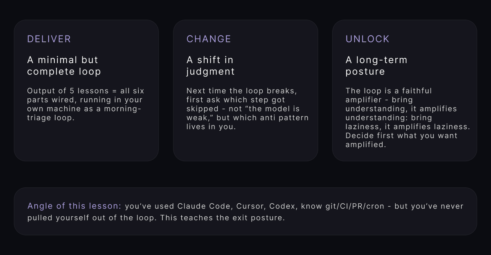
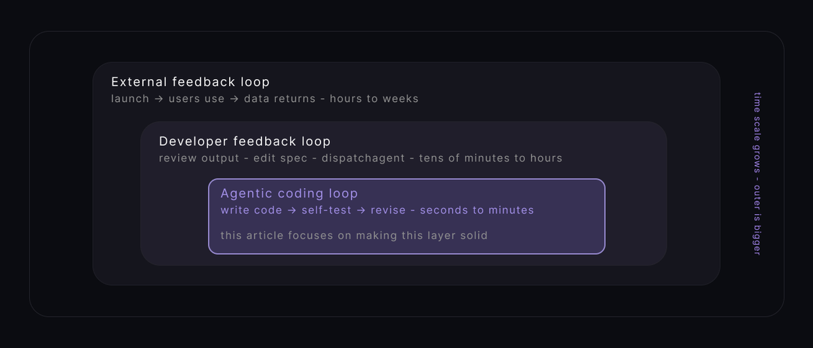
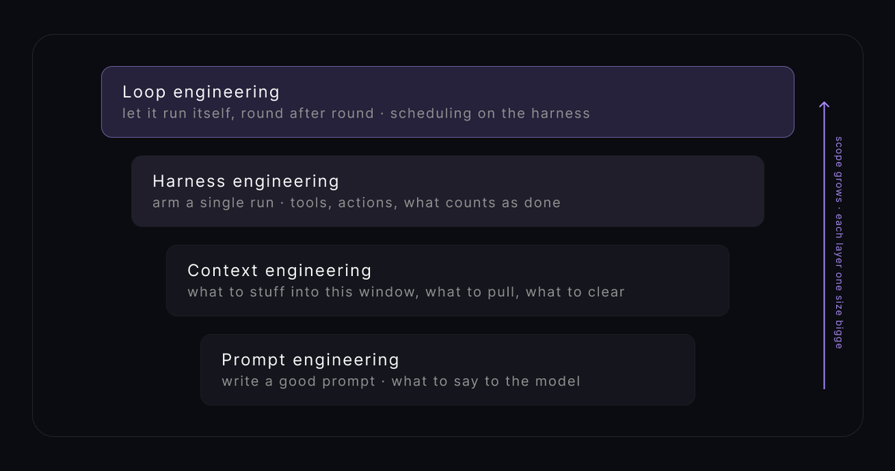
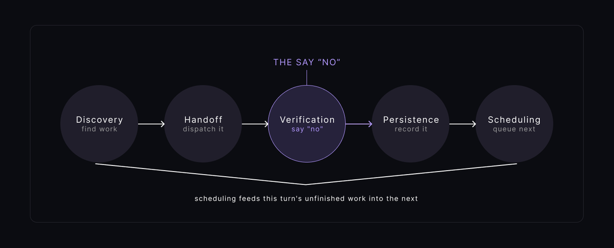

# 📰 Loop Engineering - From Prompting to Looping

I’ve decided to dedicate this article to how to create your own programmable agent that will do the work for you, so you won’t have to turn on your computer every morning and give it commands over and over again.

it will wake up on its own, find tasks on its own, identify problems on its own, and save and present the results on your desk for you to review.

## Preface

The idea for Loop didn’t come out of nowhere - during a single week in June 2026, three industry experts almost simultaneously expressed the same thought: it was time to start developing this level.

A week later, Andrew Ng placed this conversation within the broader context of "Building Products from 0 to 1," providing a more comprehensive picture.

This article starts from that story and then walks you through building a minimal but complete loop from scratch: 5 moves, 6 parts, one door that says "no," and one human door - all running on your own machine, and reusable on any software project.

## The week 3 people lit the fuse

June 2026: three people, none of them coordinating, said almost the same thing within days of each other.

Peter Steinberger, creator of OpenClaw posted two sentences on X that hit 8.9 million views:

[Embedded Tweet: https://x.com/i/status/2063697162748260627]

That post is where the discourse actually started. it wasn't a manifesto or a long essay, just two lines that named something people were quietly already doing.

Boris Cherny: I don't prompt Claude anymore, I have loops that are running. They're the ones that are prompting Claude and figuring out what to do.

Addy Osmani: Loop engineering is replacing yourself as the person who prompts the agent. you design the system that does it instead.

Practice came before the name by months, everyone was already writing loops, nobody had called it anything yet.

So, loops are now a key part of how we enable AI agents to work iteratively over the long term to create software.

Andrew Ng arranged the three loops from innermost to outermost based on their time scales: the innermost loop is the fastest, and the outermost loop is the slowest. Furthermore, the input to the outermost loop comes from the output of the innermost loop:

\|  Loop \| Who runs it  \| Cycle length  \| What it outputs to the outer layer  \|
\| --- \| --- \| --- \| --- \|
\| Agentic coding loop  \| the agent itself  \| seconds - minutes  \|  a version that runs \|
\|  Developer feedback loop \| human + agent  \| tens of minutes - hours  \| a clearer product vision and spec  \|
\| External feedback loop  \| users + team  \| hours - weeks  \| real data that evolves the vision  \|

Andrew Ng gave us the map by time: three loops running at different speeds. Addy Osmani drew a second map by abstraction: prompt -&gt; context -&gt; harness -&gt; loop.

Loop engineering sits at the top and adds three verbs the harness doesn't have. It runs on a timer, spawns helpers, and feeds itself - today's output becomes tomorrow's input. That last one is what makes it a loop, not the same task run N times.

The single most important intuition: the same bug costs a different amount at each layer:

\|  Layer \| What it cares about  \| Core question \|
\| --- \| --- \| --- \|
\| Prompt eng. \| write a prompt  \| what to say to the model  \|
\| Context eng.  \| what's loaded in the window  \| what to pull, summarize, clear  \|
\| Harness eng.  \| arming a single run  \| which tools, which actions, what counts as done  \|
\| Loop eng.  \| scheduling on top of the harness  \| how to make it run itself, round after round  \|

A loop is by design a machine that makes "number of turns" large. Every decision from here on - evaluator, human gate, token cap, state file - exists to shorten the distance between "mistake happens" and "someone sees it."

What happens inside one turn:

"Loop" gets misread as "spinning in place." It's not, every turn has 5 concrete moves. cut any one and the loop either won't run - or it runs without going anywhere.

1. Verification is the move that says "no."

1. Scheduling is the move that feeds this turn into the next.

That's exactly the part that makes it a loop.

Mapped to the project we're about to build: a morning-triage loop for a small team:

\| Action  \| What it does  \|  In the TRIAGE LOOP \|
\| --- \| --- \| --- \|
\| Discovery  \| figure out what this turn should do  \|  a skill reads CI / issues / recent commits \|
\| Handoff  \|  dispatch the task, and isolate it \| each finding gets its own worktree  \|
\| Verification  \| swap in another agent to say no  \|  a second sub-agent as reviewer, poking at tests and skills \|
\| Persistence \| write state outside the conversation  \| PR + Linear ticket + ./state/triage.md  \|
\| Scheduling  \| let it run turn after turn  \| GitHub Actions cron triggers at 06:00  \|

Each of the 5 lessons below grows exactly one move. 

Five lessons = a complete Loop. 

And we start with the first one: Discovery, because if the Loop can't decide what's worth doing today, nothing after that matters.

## Lesson 1 Discovery: write a morning-triage SKILL.md

Skills, not a wall of prompt.

Imagine, it's Monday 6am, Your laptop is closed and GitHub Action wakes up and fires claude --skill morning-triage: what it reads, what it judges as actionable, where it writes the results - all of that lives inside the SKILL.md you're about to write.

Osmani's key line: automation should trigger a skill - written-down, updatable project knowledge, not a wall of prompt pasted into a cron job. The pasted prompt just rots there, because nobody ever goes back to update something buried inside a schedule.

Your task for this lesson: write a skill at .claude/skills/morning-triage/SKILL.md that reads three sources (CI / issues / commits) on its own, decides what's worth doing on its own, writes results to ./state/triage.md - and has an explicit Stop section that spells out what the loop is NOT allowed to do.

Here's the starter - change three things and it's yours:

\`\`\`json
\# .claude/skills/morning-triage/SKILL.md
\---
name: morning-triage
trigger: invoked by daily automation
\---

\## Read   (discovery inputs — swap for sources YOUR repo actually has)
\- CI runs that failed since the last run      # gh run list --status failure
\- issues opened in the last 24h               # gh issue list --search "created:&gt;=…"
\- commits merged since yesterday              # git log --since=yesterday
\- the previous ./state/triage.md              # the "yesterday → today" handoff

\## Judge  (the ceiling — let the loop pick, don't hand it a list)
For each candidate, decide:
\- is it actionable NOW, or noise?
\- does it block a release? → priority = P0
\- is it already being tracked? → skip
Keep only what is worth a worktree TODAY.

\## Write  (persistence — land it in markdown, not chat)
Append to ./state/triage.md:
\| finding \| source \| priority \| status \|
Commit the file so tomorrow can read it.

\## Handoff  (prep for Lesson 2)
For each kept finding, emit a task line:
  worktree=fix/&lt;slug&gt;
  goal=&lt;stop-condition&gt;

\## Stop   (the ONE non-boilerplate section — think hard here)
Never merge. Never delete.
Anything you're less than confident about → ./inbox/ for a human.
NOT a PR.
\`\`\`

Three sections do the real work here:

Read: this is Discovery's input - list concrete sources, down to the actual command. Remember, "read the context" is not a source, but gh run list --status failure is a source.

Judge: this is the ceiling of your entire loop. The loop decides "actionable vs noise" itself - it doesn't receive a list from you, because if you're still handing it a list every morning, you automated the doing but not the choosing. And choosing is usually the more expensive step. No matter how good your sources are, if this section picks garbage, the other four moves are spinning on worthless work.

Stop: the only part of this file that isn't boilerplate. The loop will do everything the skill says, and only what the skill says. if you don't write "never merge" - it will merge for you one day. 
Spell out the red lines: never merge, never delete, never push to main, anything uncertain goes to ./inbox/ for a human, not into a PR.

One more thing worth knowing: this same skill structure works beyond morning triage: swap the Read section for "yesterday's access logs + new issues + current deploy version" and it becomes an evening site-health loop. add one line to Judge - "is this a regression from yesterday?" - and it grows cross-day comparison.

The disease this lesson prevents - Blind Loop:

The most common "looks like a loop but isn't.": the loop runs, but you're still assigning the work every morning ("hey, look at these three bugs"). That's automation of execution, not automation of discovery. 
Symptom: the loop never surprises you, because it only ever does what you already knew needed doing. 
Fix: put Judge inside the skill and let it pick today's work itself.

Before moving on, answer these three:

1/ how many lines does your Stop section have? 
If it's just "never merge" - add one more: what else should this loop never do for you? (never close issues / never push to main / never take more than 3 findings at once..)

2/ rewrite the first line of Read into a command that actually runs in YOUR project

3/ if this skill goes unchanged for a year - what happens?
now compare: what happens to a wall of prompt pasted in a cron job for a year?

## Lesson 2 Handoff: hand out the work, and isolate it

Lesson 1's skill just finished running. ./state/triage.md now holds 5 actionable findings. Еhe most natural next thought - fire 5 agents at once, go fast. Еhat exact step is how you grow a Tangled Loop: several agents editing the same files in the same directory, and merge day turns into archaeology.

The antidote is one line: every finding gets its own worktree.

git worktree is a built-in git mechanism: one repo, multiple independent working directories, each checked out to its own branch. git worktree add ../fix-auth fix/auth opens a fully isolated workspace at ../fix-auth. builds, edits, tests - nothing touches anyone else. one worktree per finding = agents physically separated.

Your task for this lesson: write a script that reads each finding from ./state/triage.md, opens an isolated worktree per finding (named fix/&lt;slug&gt;), sends an agent to draft a fix inside it - and sets a parallel cap so it doesn't spawn infinitely.

\`\`\`json
\# read state/triage.md, one worktree per finding
\# change: MAX\_PARALLEL to what your machine / bill can handle
MAX\_PARALLEL=3

\# change: parsing to match your actual triage.md columns
findings=$(awk -F'\|' 'NR&gt;2 && $5 \~ /open/ {print $2}' \\
           state/triage.md \| head -n $MAX\_PARALLEL)

for finding in $findings; do
  slug=$(echo "$finding" \| tr ' ' '-' \| tr -cd '\[:alnum:\]-')

  \# the key line: physical isolation per agent
  git worktree add ../wt-$slug -b fix/$slug

  \# change: goal is the stop condition Lesson 3's evaluator will read
  claude --worktree ../wt-$slug \\
    --goal "tests in tests/$slug pass and lint is clean" \\
    "draft a fix for: $finding" &
done

wait   # let all parallel agents finish

\# closing rule: agents never auto-merge — worktrees wait
\# for the human gate in Lesson 5
echo "All worktrees ready for review:"
git worktree list
\`\`\`

The rules that matter here: never work on main. 

Main is the landing strip for human review - not the agents' desk. All agents live on fix/\* worktrees.

Cap the parallelism: unbounded spawning is the front door to a token blowout (Lesson 5 comes back to this). pick MAX\_PARALLEL based on an honest question: not "how many can my machine run" but "how many PRs can I actually review."

Merge is a human decision: Stripe runs 1,000+ PRs a week through loops like this, and humans still review every one. The human didn't leave the process - they changed desks: from writing code to reviewing code.

And one detail from the Stripe case worth stealing: they counterintuitively used a smaller model with strict deterministic gates instead of the biggest model available. 

The lesson: a tight verification gate beats raw model power for loop work.

The disease this lesson prevents - Tangled Loop:

A single-agent loop looks perfectly healthy. The problem only shows up the day you go parallel - five agents run, five diffs collide in the same file, merge is chaos.
Fix: every task gets its own worktree, never share a working directory between agents.

Before moving on, answer these three:

1/ What number did you set MAX\_PARALLEL to - and why?
(money? machine? or "how many PRs I can honestly review"?)

2/ if a worktree crashes - the agent exits without touching
what should tomorrow's state file record about it?

3/ Stripe used a smaller model + strict deterministic gates
Instead of the biggest model, what does that choice mean for YOUR loop?

## Lesson 3 Verification: install a door that says "no" (the heaviest lesson)

This is the hardest move in loop engineering, and it deserves more effort than any other lesson.

Anthropic engineer Prithvi Rajasekaran, working on long-running agentic apps, noticed something: ask an agent to grade code it just wrote, and it will almost always praise itself - even when a human can see at a glance it's mediocre.

This isn't the model being dumb: grading your own homework is structurally broken. By the time the code is done, the agent's context is stuffed with the self-justification chain of why it wrote things this way. looking at its own output, it doesn't see the result - it sees the argument for the result.

Put that inside a loop and it amplifies into a disaster: every turn's "is this good enough?" Gets answered by the agent that just wrote it. Every turn nods at itself. the longer it runs, the further it drifts from real quality. That's the Nodding Loop - and it's the most expensive disease on the list.

Rajasekaran's fix, in his own words:

"Tuning a standalone evaluator to be skeptical is far more tractable than making a generator critical of its own work."

This is a structural problem, not a wording problem. You can't ask an author to step outside their own head, but you can bring in a different agent, with completely different instructions, looking at the code from zero - with no self-justification chain attached. 

The analogy comes from GANs: one network builds, another attacks: maker and checker. The same old banking rule: the person who wires the money and the person who approves it must be different people.

Your task for this lesson - write two things:

1\) An evaluator system prompt at .claude/agents/reviewer.md with five sections: ROLE + ASSUME + CHECK + USE + VERDICT.
2\) A /goal command declaring this loop's stop condition - judged by a separate fresh model, not by the generator.

\`\`\`json
\# .claude/agents/reviewer.md  (change 3 things)
ROLE: Adversarial code reviewer.
ASSUME: this code is BROKEN until proven otherwise.
DO NOT praise. Find what fails.

\# change: order CHECK by your project's real failure modes,
\# runnable checks first
CHECK, in order:
  1\. Does it run?  (execute, don't read)
  2\. Tests: run them, paste real output.
  3\. Edge cases the author skipped.
  4\. Does behavior match the ticket?

\# change: which MCP depends on what you're testing —
\# frontend → Playwright, API → curl/httpie
USE Playwright MCP: open the page, click,
screenshot, inspect the DOM.
Judge behavior, not intent.

VERDICT: PASS only if every check holds.
         Otherwise REJECT + list each reason.
\`\`\`

\`\`\`json
\# stop condition — judged by a fresh small model, NOT the generator
\# change: swap for the real verifiable condition of your finding
/goal all tests in test/auth pass and the lint step is clean

\# careful: /goal and /loop are NOT the same thing
\#   /loop = rerun on interval (no stop judgment — dangerous)
\#   /goal = run until a fresh model judges the condition true
\`\`\`

Two agents, ideally two models: "same model, different prompt" often preserves the same blind spots. swap the model too if you can.

Default skepticism: the evaluator's baseline is ASSUME BROKEN - trust must be earned by passing checks, not granted by default.

Judge behavior, not intent: "this JSX looks fine" and "I clicked the button, the page navigated, here's the screenshot" are two different universes. the evaluator must act - run the tests, click the page, not read the code and vibe.

Reject with reasons: a REJECT without listed reasons is not a reject - the generator has no idea what to fix.

And the acid test: has your evaluator actually rejected something in the last 5+ turns? A loop that has never once said "no" across hundreds of turns is statistically impossible on any real workload. so it proves the evaluator isn't working.

The disease this lesson prevents - Nodding Loop:

The loop runs, the agent writes code, the same agent says "looks good." every turn self-approves, stacking plausible-looking mistakes at machine speed. fix: this entire lesson: structural separation + default skepticism + judging by action + a third-party stop condition.

Before moving on, answer these three:

1/ is your evaluator the same model with a different prompt, or a different model? why?

2/ translate "judge behavior, not intent" into your project's
concrete sentence: "my evaluator doesn't read code  it 

runs \_\_\_\_\_, and only PASSES when it sees \_\_\_\_\_"

3/ how likely is a "close enough" fresh model to falsely PASS your /goal condition? 
if your scariest failure mode is X - add a check for X to the stop condition right now

## Lesson 4 Persistence: make today's work survive to tomorrow

Lesson 3 finished. your evaluator judged three findings - two PASS, one REJECT. question: where do those three verdicts live right now?

if the answer is "in the context window" - then tomorrow at 6am, the loop wakes up to a flushed context and remembers nothing. It re-triages from scratch, trips over yesterday's unfixed REJECT, maybe assigns another agent to fix it again, maybe misses it entirely, maybe falls into the same hole.

That's the Amnesiac Loop - every day starts from the same square.

The antidote in one line: memory is state written to disk, not context. a markdown file, a Linear board, a database - once it's written down, it doesn't matter how thoroughly the agent forgets.

These two get confused constantly, so pin the difference:

CONTEXT = the window the agent sees THIS turn -&gt; cleared on every refresh.

MEMORY = state that lives across turns and days -&gt; written to disk (markdown / DB / board).

A loop bridges today -&gt; tomorrow through MEMORY only.

Your task for this lesson: 

1. Create ./state/triage.md with at least 4 columns (finding / source / priority / status) - Lesson 1's skill writes it, Lesson 2's worktrees read it.

1. Wire a connector (MCP): a PASS verdict auto-opens a PR, a REJECT auto-updates the ticket.

1. Verify tomorrow's loop can actually read back today's state.

\`\`\`json
\# ./state/triage.md  (the loop's memory — change as needed)

\| finding         \| source       \| priority \| status     \|
\|-----------------\|--------------\|----------\|------------\|
\| auth test flaky \| CI #4821     \| P0       \| fixing     \|
\| null deref      \| issue 92     \| P1       \| PR open    \|
\| stale dep       \| commit a3f9c \| P2       \| inbox      \|

\# extend columns as needed: last\_seen, retry\_count, assigned\_to
\# this file MUST be committed to the repo —
\# otherwise tomorrow's cloud runner can't see it
\`\`\`

\`\`\`json
// .mcp/connectors.json — plug the loop into the outside world
{
  "github\_pr": {
    "type": "mcp",
    "on\_event": "evaluator.verdict.PASS",
    "action": "open\_pr",
    "branch": "fix/${slug}",
    "auto\_merge": false        // ← MUST be false. human gate = Lesson 5
  },
  "linear": {
    "type": "mcp",
    "on\_event": "evaluator.verdict.REJECT",
    "action": "update\_ticket",
    "fields": { "status": "Blocked", "reason": "${verdict.reasons}" }
  }
}
\`\`\`

Why each column matters: no source -&gt; you can't audit where a finding came from. no priority -&gt; you can't order the work. no status -&gt; tomorrow can't pick up the baton.

And the verification for this lesson is the only one you can't fake: wait until tomorrow. Wake up, check - is the inbox still there? Do unfinished findings still hold their status? Did the 6am run pick up where yesterday stopped instead of starting over? This one you find out by running it, not by reasoning about it.

A quiet discipline that comes with persistence - read a sample, always.

Once persistence works, a trap opens: the loop ships PRs at speed, you feel productive - and your mental map of the codebase silently drifts out of date. the rule: don't read everything (that defeats the point of the loop), but read one sample PR a day and force yourself to explain what the loop changed and why. 

The moment you can't explain it - your map has fallen behind. Fixing that on a calm morning costs ten minutes. Fixing it during a production incident costs a lot more.

The disease this lesson prevents - Amnesiac Loop:

The loop finds good work, does it, then forgets it did - because the result only lived in a flushed context. Next turn it re-discovers the same work, or worse - redoes it and clobbers the first attempt.

Symptom: no accumulated progress, every day starts from the same place. Fix: state file on disk.

Before moving on, answer these three:

1/ Translate "memory ≠ context" into one concrete sentence 

from your own project: "my \_\_\_\_\_ is memory, my \_\_\_\_\_ is context"

2/ Tomorrow's loop wakes up - which COLUMN of state.md does 
It read first to decide its first move? did you name that column right, or did you just bury a landmine for it?

3/ Discipline: what time of day will you read your one 
Sample PR? set the calendar reminder now - this is a contract with yourself.

## Lesson 5 Scheduling: make it real, make it safe, keep one door open

Lessons 1-4 are installed, but the loop still stops the moment you stop pressing the button. The final move is one verb: hang it on a trigger.

But the most dangerous part of this lesson isn't getting cron wrong. It's getting cron right - because then the loop truly runs alone, and one bug can make it spin all night, helpers spawning helpers, until you wake up to a bill you don't recognize. 

So this lesson actually does three things: hang the trigger, set the caps, keep a human door.

First - pick your scheduler:

\`\`\`json
Cloud (GH Actions)   Desktop scheduled   /loop (in CC)
runs where          cloud                your machine        your machine
machine on?         not needed           needed              needed
session open?       not needed           not needed          needed
min interval        1 hour               1 minute            1 minute
sees local files?   no                   yes                 yes
\`\`\`

The deciding question: can this work leave your laptop?

\`\`\`json
"check my local dev server every minute"
   → must be local + /loop (cloud's 1-hour interval can't reach it)

"scan GitHub issues at 3am and open PRs"
   → must be cloud (your laptop is closed — the loop can't 
     be waiting on it)
\`\`\`

And the sneakiest self-deception in the whole practice: treating a local timer as "running while you sleep." It isn't. it's "running a few extra turns while I'm still around."

Your task for this lesson: 

1. Write .github/workflows/triage.yml with a cron trigger firing the morning-triage skill.

1. Set three caps: per-run budget, daily budget, max retries.

1. End the workflow with the rule: PRs never auto-merge, anything uncertain goes to ./inbox/.

\`\`\`json
\# .github/workflows/triage.yml  (change 3 things)
name: morning-triage

on:
  schedule:
    - cron: '0 6 \* \* \*'        # change: your timezone's 06:00 in UTC

jobs:
  triage:
    runs-on: ubuntu-latest
    timeout-minutes: 45          # ← per-run cap · change
    permissions:
      contents: write
      pull-requests: write
    steps:
      - uses: actions/checkout@v4

      - name: morning triage
        env:
          ANTHROPIC\_API\_KEY: ${{ secrets.ANTHROPIC\_API\_KEY }}
          DAILY\_BUDGET\_USD: '20'   # ← daily cap · change
          MAX\_RETRIES: '3'          # ← retries cap · change
        run: \|
          claude --skill morning-triage \\
            --max-retries "$MAX\_RETRIES" \\
            --daily-budget-usd "$DAILY\_BUDGET\_USD"

      - name: open PRs (NEVER auto-merge)
        run: \|
          # PRs open automatically. merging stays human.
          gh pr create --draft --base main \\
            --title "\[loop\] $(date +%F) triage" \\
            --body-file ./state/triage.md
          # there is no \`gh pr merge\` here — on purpose

      - name: route uncertain to inbox
        run: \|
          ls ./inbox/ && echo "items waiting for human review"
\`\`\`

The three rules that keep it alive at month six:

Cap before you ship: three levels - per-run timeout, daily budget, max retries - set before the first autonomous run, not after the first scary bill. a token cap isn't about saving money. It's a circuit breaker that turns open-ended risk into bounded risk. a loop without caps has outsourced its spending authority to its own bugs.

For scale: Uber capped engineers at $1,500 per person per tool per month after burning through its AI budget in four months. your per-loop cap is the granular version of that lesson.

Keep one door open: PRs don't auto-merge. uncertain items land in the inbox. you read one sample a day. the door isn't there because a human will always walk through it, it's there because the door existing keeps you in a position where you can. weld every door shut, and the day you need to get in, you've lost the key.

Verify it actually wakes up. run it for at least 3 turns (dry runs count). the most common failure: dazzling on demo day, dead by Thursday. "last run was the day it was demoed" is the diagnostic signature of a Manual Loop.

Works the same outside Claude Code - the capabilities aren't vendor-locked, just renamed:

\`\`\`json
CAPABILITY          Claude Code          Codex
scheduling          /loop · worker       Automations tab
run-to-condition    /goal                automation rerun + judge
parallel isolation  --worktree           background worktree
sub-agents          .claude/agents/      .codex/agents/
external connect    MCP + plugins        MCP connector
explicit skill      SKILL.md             $skill-name
runs machine-off    Cloud Routines       cloud (planned)
\`\`\`

The question was never "which vendor." It's "are all six capabilities installed."

The disease this lesson prevents - Manual Loop:

Four moves built beautifully, no cron. It's not a loop - it's a script you ran once and forgot. 
Fix: hang any trigger that doesn't depend on you remembering.

Before shipping, answer these three:

1/ What exact numbers are your three caps? 
if a bug spins all night - which cap breaks the fall first? If none of them would.. What does that tell you?

2/ What does your human door look like? 
(PR review / inbox / daily sample / weekly reconciliation?) write it down = sign the contract with yourself

3/ the closing question: six months from now, will this loop have made you stronger (understanding, judgment, feel for the system)  - or turned you into the caretaker of a machine you can't read? what's your plan to avoid the second one?

## The 4 debts and staying the engineer

Нour loop is built: it wakes up, finds work, criticizes itself, remembers, and schedules its own tomorrow.

While a loop runs, four things pile up quietly - and their shared trait is that none of them trip an alarm.

\`\`\`json
VERIFICATION DEBT     unrejected output stacking up
COMPREHENSION ROT     the codebase grows, your mental map doesn't
COGNITIVE SURRENDER   "I don't feel like scrutinizing anymore"
TOKEN BLOWOUT         a bug spins all night → you see it as a bill
\`\`\`

They feed each other: unverified output erodes your understanding -&gt; eroded understanding invites surrender -&gt; surrender lets the loop run longer and spend more -&gt; which produces more unverified output.

Audit your fresh loop against all four before its first solo run:

- My evaluator actually rejects - it's not decoration.

- I read one sample PR a day and can explain what changed.

- I kept the habit of saying "this is wrong".

- My caps were set BEFORE the first run, not after the first bill.

And here's the part that decides everything:

The same loop, built by two people, can end in opposite places. One uses it to move faster while still reading the code and holding direction - the loop amplifies judgment they already have. 

The other uses the exact same loop specifically to never understand anything again - six months later, the first is sharper, and the second is a caretaker for a machine they can't read.

Addy Osmani: "build the loop, but build it like someone who intends to stay the engineer - not just the person who presses go."

Loops make generation nearly free, what stays scarce is judgment: which plan is right, which line to stop on, which thing runs but is wrong at the root. the loop doesn't devalue judgment - it strips away everything that isn't judgment, and leaves only that.

A loop is a faithful multiplier:

Bring understanding - it amplifies understanding. 
Bring laziness - it amplifies laziness.

Decide what you want amplified - before you build it.

Stay tuned!

Good luck :)

### 🖼️ Attached Media

## 💬 Replies

### 1 @bounceidc (Bounce)

*Sat Jul 04 16:53:49 +0000 2026*

@0x\_kaize the best 30 minutes i've ever invested. thx.

### 2 @0x_kaize (kaize) (Author)

*Sun Jul 05 11:35:55 +0000 2026*

@bounceidc It seems to me that you read it pretty quickly and didn't try out the examples in the article - mistake

### 3 @web3_FBI (Quantico)

*Sun Jul 05 21:21:35 +0000 2026*

@0x\_kaize Thanks for the post
I saved it for myself 🤝

### 4 @0x_kaize (kaize) (Author)

*Thu Jul 09 17:44:57 +0000 2026*

@web3\_FBI honestly, did u read it

### 5 @rewind02 (rewind)

*Sat Jul 04 20:29:34 +0000 2026*

@0x\_kaize prompting agents manually feels old

### 6 @RyzneOnX (ＲＹＺＥ -`𖹭´-)

*Sat Jul 04 19:57:54 +0000 2026*

@0x\_kaize Loops over prompts every time

### 7 @neil_xbt (NeilXbt)

*Sat Jul 04 21:27:25 +0000 2026*

@0x\_kaize banger!

### 8 @gippp69 (Gipp 🦅)

*Sat Jul 04 16:17:02 +0000 2026*

@0x\_kaize nice share kaize

### 9 @leopardracer (leopardracer)

*Sat Jul 04 18:06:16 +0000 2026*

@0x\_kaize saved!

### 10 @shmidtqq (shmidt)

*Sat Jul 04 16:45:49 +0000 2026*

@0x\_kaize very good explanation thx

### 11 @explorersofai (Sharon | AI wonders)

*Tue Jul 07 01:33:09 +0000 2026*

@0x\_kaize I will listen to all of this when you start paying my AI bills.

### 12 @wandermist (wandermist)

*Sat Jul 04 16:12:17 +0000 2026*

@0x\_kaize bookmarked

### 13 @JudasPhiGates8 (Judas Phi Gates | The Wealth Architect)

*Wed Jul 08 18:34:21 +0000 2026*

@0x\_kaize Understanding amplifies through loops; laziness also magnifies.  

Audit loops before running them solo always.  

Build loops to enhance judgment, not replace it.

### 14 @thegreatest_sv (kiosa)

*Sat Jul 04 16:10:38 +0000 2026*

@0x\_kaize banger

### 15 @heypearlai (Pearl AI)

*Wed Jul 08 08:18:37 +0000 2026*

@0x\_kaize finally, names for every loop I've broken

### 16 @ivee_web (ivee)

*Tue Jul 07 18:27:31 +0000 2026*

@0x\_kaize banger man

### 17 @StuyBoyNY (StuyBoy From NYC)

*Mon Jul 06 14:20:17 +0000 2026*

@0x\_kaize @readwise save

### 18 @kyroxxxq (kyrox)

*Mon Jul 06 12:56:57 +0000 2026*

@0x\_kaize real useful article, great share Kaize

### 19 @Mr_jatte (jatte)

*Mon Jul 06 19:00:31 +0000 2026*

@0x\_kaize [loopgenix.com](http://loopgenix.com) , [loopfluid.com](http://loopfluid.com)

