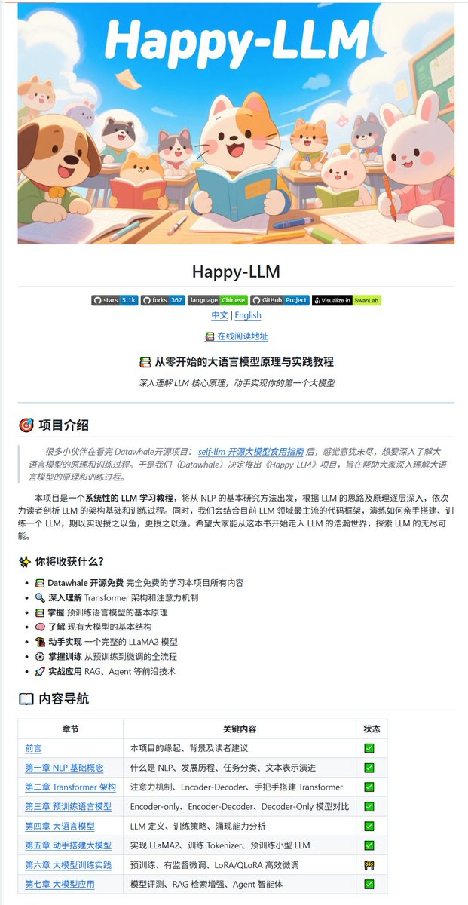

你有没有一直想学大模型原理，但是感觉教程都太晦涩难懂了？

中文教程来了！happy-llm，这个教程教你从0构建一个参数大小为 215M 的大模型。看的时候一定要记得那个小技巧哦：看不懂的地方直接复制给大模型，问它我这里看不懂，你给我解释下。

教程：[github.com/datawhalechina…](http://github.com/datawhalechina/happy-llm) 

## 💬 Replies

### 1 @aipm_sheep (AI Seeker Lamb)

*Wed Jul 02 15:45:31 +0000 2025*

@karminski3 学过才知道，零基础的我真看不下去

### 2 @zhouyu1516921 (我要吃两碗！)

*Wed Jul 02 13:58:35 +0000 2025*

@karminski3 谢谢！能不能出 epub 格式，pdf 在 7 寸电纸书上看确实不方便

### 3 @juryxiong (Jury)

*Wed Jul 02 04:10:09 +0000 2025*

@karminski3 这个和那个 gpt2 教程比怎么样啊

### 4 @BeartwoHome (熊二)

*Thu Jul 03 07:27:28 +0000 2025*

@karminski3 哥哥牛逼

### 5 @powercheng0501 (Caiden)

*Fri Jul 04 00:34:48 +0000 2025*

@karminski3 这个开源组织真的是大善人，出了好多有用的中文教程

### 6 @localhost_8188 (faych)

*Wed Jul 02 04:09:56 +0000 2025*

@karminski3 好好好

### 7 @fnxtdm (木材)

*Wed Jul 02 11:24:09 +0000 2025*

@karminski3 @readwise save thread

### 8 @bPeCjGJBMgNcIMr (P=m(c-v))

*Wed Jul 09 19:26:31 +0000 2025*

@karminski3 牛逼

### 9 @ge_qu49171 (我了个去)

*Thu Jul 03 15:53:43 +0000 2025*

@karminski3 学了

### 10 @CatelliLeticia (币安交易所注册服务 (Parody))

*Wed Jul 02 03:48:27 +0000 2025*

@karminski3 好教程

