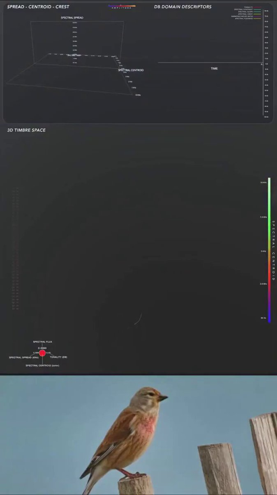

向量数据库脑电图来啦!

把一大堆文档拖进 RAG，然后提问题，结果大模型回答的驴唇不对马嘴，是不是会怀疑大模型到底是怎样在向量数据库检索的, 才能搞成这个熊样?

来看这个 RAG 可视化项目 Project Golem!

它把向量数据库从黑盒变成了一个可交互的 3D "大脑皮层"。使用 UMAP 算法将 768 维的嵌入向量降维到 3D 空间，当你输入查询时，它不只是返回文本，而是会"点亮"与你的查询相关的神经通路。

这个项目的设计初衷是作为 RAG 的诊断工具。当检索失败时，你可以亲眼看到"思考"从嵌入查询出发所走过的精确路径。

如果看到一个紧密的簇亮起，说明模型找到了一个连贯的概念。如果可视化看起来很分散，那就意味着检索到的文本块在语义上彼此相距甚远，这正是你需要的视觉提示，告诉你 RAG 正在幻觉或强求关联。

技术栈方面，嵌入模型用的是 Google 的 embedding-gemma-300m，向量数据库是 LanceDB，前端是 Three.js 和 WebGL，后端是 Flask。

项目已经在 Reddit 的 LocalLLaMA 社区获得了 200 多个赞。有用户说这看起来真的像大脑中神经细胞的激活。还有用户说这对数据库优化太棒了，当某个查询表现不佳时，能立刻调出投影，瞬间获得一把手术刀。

项目还支持对接 Qdrant、Pinecone 等外部向量数据库，架构是解耦的，3D 查看器本质上是一个位于数据之上的界面，你无需移动数据，只需将其投影出来即可。

项目地址: [github.com/CyberMagician/…](http://github.com/CyberMagician/Project_Golem)

### 🖼️ Attached Media

## 💬 Replies

### 1 @lipeng0820 (SimbaLee)

*Mon Jan 12 03:10:26 +0000 2026*

@karminski3 好家伙，早上刚看了类似的可视化理解鸟语👍高级J

### 2 @LongXiao4082 (Rivers)

*Mon Jan 12 04:03:12 +0000 2026*

@karminski3 这个把 RAG 可视化是很炫酷，但是感觉有些面向于科研领域了，落地场景可能就是 RAG 自检了。

### 3 @kayacancode (Kaya Jones)

*Mon Jan 12 15:37:25 +0000 2026*

@karminski3 This is pretty neat!!

### 4 @OiiDev (OSDev)

*Mon Jan 12 10:00:16 +0000 2026*

@karminski3 rst @readwise save thread

### 5 @chatgpt1499 (Lotus)

*Mon Jan 12 08:52:15 +0000 2026*

@karminski3 这玩意儿太狠了，把向量库当地图用😂

### 6 @HelloWikies (夏日遐想)

*Mon Jan 12 15:02:13 +0000 2026*

@karminski3 嵌入模型将词元转换为高维向量，高维向量这种结构保存了词元的特征和模式（如语义）。特征和模式（如语义）接近的词元在高维空间中位置也比较接近。
嵌入模型本身是需要训练的。

