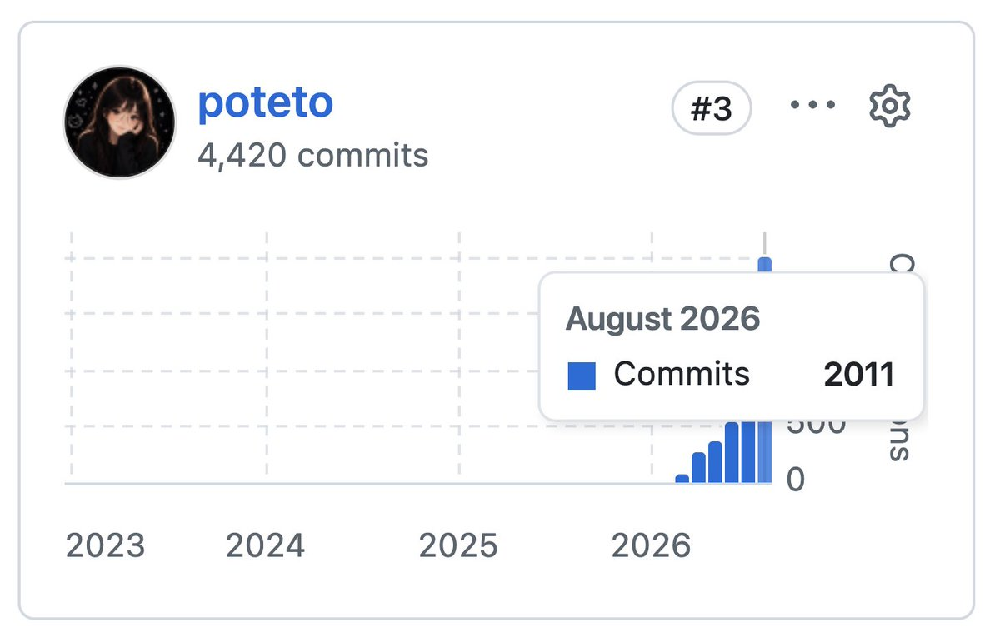
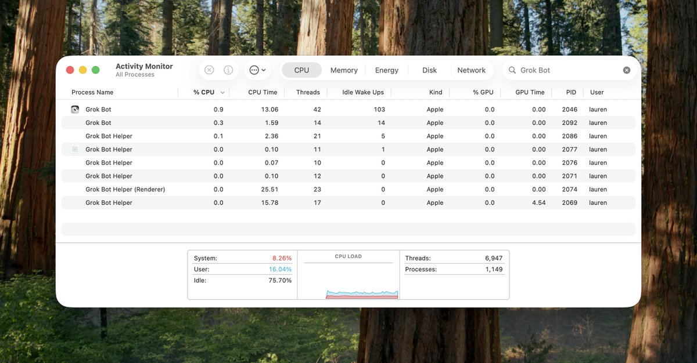
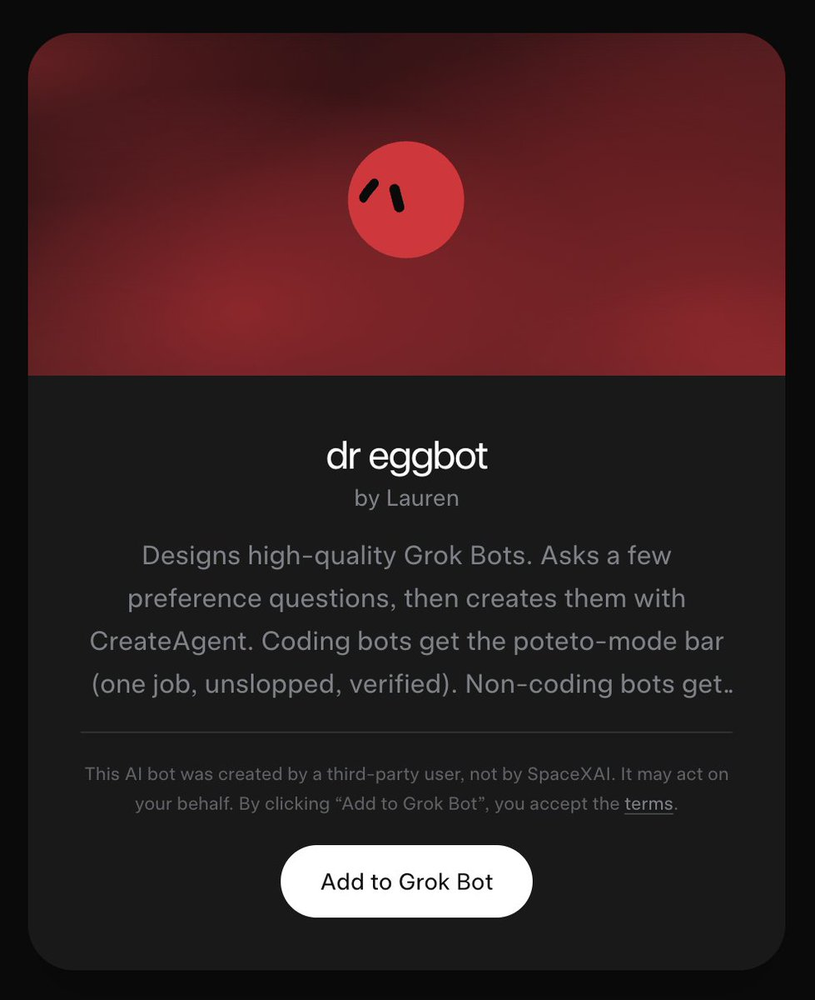
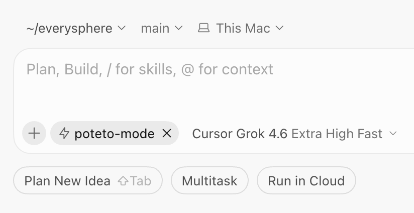
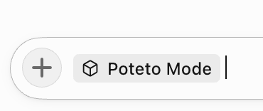

# 📰 The Complete Guide to pstack Pt. 1

In this series of posts, I'm going to show you how I use [pstack](https://x.ai/bot/plugin/9717366), my personal set of skills for doing rigorous engineering work. It's allowed me to ship 2,000 PRs a month to production with high confidence. 

Personally, I have never put much emphasis into how many lines of code or how many PRs I was landing. Before agents, no one cared, and rightfully so, as raw productivity did not always equate to quality or a visible outcome for users. It was simply a vanity metric.

But I've discovered through the course of building pstack that volume does matter, especially when you are able to maintain or even increase the level of quality of the product with agents. For example, I started working on Grok @Bot about 2 months ago, when it was still in its early days and the codebase was fresh but starting to grow. Despite the team growing and now landing hundreds of PRs a day into the Grok @Bot codebase, pstack has allowed me to keep the quality of the code high for everyone as I constantly monitor code, refactor, add new lints and checks, and also work on features. 

[Embedded Tweet: https://x.com/i/status/2090546476464451907]

Being Grok @Bot's gardener and maintainer is something I was only able to do through pstack. Our early momentum after building the prototype was very high and many people were joining the team. I had a critical moment of opportunity to refactor the whole codebase, while it was being built and extended and with no downtime, into something with strong foundations. A codebase with high quality that scales no matter how many engineers (and most importantly, non-engineers) contribute to it. All of this work requires me to refactor and improve the foundations of Grok Bot as it's being built, and you can only do that when the foundations can keep up with the number of contributions.

The proof is in Grok @Bot itself. Over the next few weeks, I'll tell you everything you need to know to be able to build and maintain a high quality app using pstack.

# Part 1 – Verification is all you need

The most critical skill to have in your toolbox is a high quality verification skill. This skill is so important to have and maintain that I think of it more like critical infrastructure rather than "just" a skill. A good one will amplify the output of your whole team, including non-engineers. Done well, you will 100-1000x your whole team's output. 

If you're not familiar with the term, verification means that an agent can verify its own work. It can keep going until it succeeds at its task, because it can now close the loop without you being the bottleneck. If you're interested to know more of the story of how I created my first verification skill for Cursor, check out my previous post [Loops You Can Trust](https://x.com/poteto/status/2069824386283319343).

## Let's build a verification skill together

To start, install pstack and then run [/create-verification-skill](https://github.com/cursor/plugins/blob/main/pstack/skills/create-verification-skill/SKILL.md). I also recommend adding [Dr Eggbot](https://x.ai/bot/93gOz3op1UQdBdbekQFLK), my bot that helps you create high quality bots, to your roster. Dr Eggbot ships with [pstack](https://x.ai/bot/plugin/9717366). It’ll teach coding bots how to use it, and it can also make non-coding bots with the same rigor.

You can ask Dr Eggbot to create an engineer bot for you that you can then ask to run /create-verification-skill and set up a daily routine to run /maintain-verification-skill. 

While that runs, let's walk through what the skill does and how it makes a high quality verification skill for you.

I distilled all of our verification skills that we use to build Grok @Bot and Cursor into this skill as a sort of meta-skill. It teaches your agent how to create a high quality one for your own app. 

Now this is where choice of tech stack is important. If you're building an app in Electron or for the web for example, you can take advantage of the rich debugging tools available for the JS ecosystem. For example, the [Chrome DevTools Protocol (CDP)](https://chromedevtools.github.io/devtools-protocol/) allows you to use the same tooling available in your browser's developer tools. Or if you're building an iOS app, making use of the simulator.

You ideally want the ability to interact with your app, debug it, take perf traces, and any other debugging and development tooling that you might typically use if you were developing the app by hand. If you don't have a rich runtime to make use of, you may need to ask your agent to create tools for you (eg using lldb, or a custom package that runs as a sidecar in dev environments), or just make use of what you have available.

I personally feel that agentic verification is so important that I would unironically suggest building your own rich debugging tools, or even choosing a different tech stack, in order to have unfair advantages and extreme productivity in building software. As I mentioned earlier, giving agents the ability to verify their own work unlocks everyone in your organization to be able to contribute and validate that their changes actually work. The harder your tech stack is to debug and control, the more difficult it will be to use agents productively.

Make it Reproducible

In pstack, we have a principle called ["Build the Lever"](https://github.com/cursor/plugins/blob/main/pstack/skills/principle-build-the-lever/SKILL.md). What this means in the context of creating a skill, is that we prefer to give agents tools rather than just markdown. For verification skills, this means creating a small CLI that scripts interaction and debugging of your app in a small, agent friendly utility. This means that agents consume fewer tokens trying to do a task (run a CLI command instead of writing a throwaway script to click on something), and makes your verification skill more reproducible and testable. 

Here's a hypothetical example of a CLI your agent might make for an Electron app:

\`\`\`shell
\# health
node .cursor/skills/verify-atlas/control-atlas.mjs doctor

\# open a blank thread and send
node .cursor/skills/verify-atlas/control-atlas.mjs new-session
node .cursor/skills/verify-atlas/control-atlas.mjs send "list open tasks in this project"

\# keyboard path
node .cursor/skills/verify-atlas/control-atlas.mjs press "Meta+KeyN"

\# accessibility snapshot of the live UI
node .cursor/skills/verify-atlas/control-atlas.mjs snapshot

\# screenshot for evidence
node .cursor/skills/verify-atlas/control-atlas.mjs screenshot /tmp/atlas-proof.png

\# wait for streaming / layout to settle
node .cursor/skills/verify-atlas/control-atlas.mjs wait-settle

\# flip a feature flag for the session
node .cursor/skills/verify-atlas/control-atlas.mjs feature-flag rooms\_v2 on
\`\`\`

Now, all agents can use this CLI to quickly navigate and debug your app. You'll also want to start thinking about the dev experience of building your app: 

- seeding a dev database

- how to handle auth, test users, API calls against a test/staging environment

- installing and bringing up your dev environment in a consistent way

All of this is stuff you've probably needed to think about anyway when you were writing code yourself. So think of this as your agents' main utility for doing dev work on your app. Keep it well maintained and tested!

Some other example commands you might want to consider: 

\`\`\`markdown
\- \*\*Inspection:\*\* \`info\`, \`snapshot\`, \`screenshot\`, \`components\`
\- \*\*Navigation:\*\* \`home\`, \`new-session\`, \`select-project\`, \`select-runtime\`, \`scroll\`
\- \*\*Interaction:\*\* \`send\`, \`click\`, \`click-xy\`, \`aria-click\`, \`type\`, \`press\`, \`eval\`, \`upload-image\`, \`add-context\`, \`feature-flag\`
\- \*\*Performance:\*\* \`trace\`, \`profile\`, \`record\`, \`perf-metrics\`, \`wait-settle\`
\- \*\*Streaming:\*\* \`console\`, \`network-log\`, \`network-summary\`
\- \*\*Health & cleanup:\*\* \`doctor\`, \`cleanup\`, \`watch --restart\`
\`\`\`

Once you have this basic setup, you should already start to see a big improvement in your agents. They should be able to navigate around and debug your app with ease.

I recommend spending time here making this CLI good and error free before doing anything more advanced. You'll also want to think about (or ask your agent to) designing an agent friendly CLI. There are many resources online you can point your agent to, but the key properties I like are:

- the API is easy to compose - think John Ousterhout's deep modules philosophy

- any command with potentially destructive side effects should have a --dry-run option

- make use of subcommands to gradually disclose functionality rather than all at once

- error messages should be very descriptive and tell the agent what it should do instead

- rich --help text

- outputs returned in machine readable form (eg JSON)

Go faster with parallelism with [Cloud Agents](https://cursor.com/docs/cloud-agent) instead of worktrees

When you've had some success running your verification skill to land a few PRs, you might start to wonder if you can parallelize more. For example, if an agent can now take your prompt and mostly drive it to a mergeable state, doesn't that free you up to run more agents? 

Your first instinct will be to add worktree support, meaning that your agents can use git to create a tracked copy of the repo where they can make changes in isolation to the main checkout. In theory, this lets you run multiple agents at once without their changes clobbering over each other.

I would recommend against doing this. For one, it uses a lot of storage space and resources on your machine. You may be able to get away with running up to 10 agents in parallel with worktrees depending on the size of your repo and how powerful your machine is. But there's a far better way! 

Cursor's [cloud agents](https://cursor.com/docs/cloud-agent) are agents that run on the cloud, on Cursor's infrastructure. These agents have access to a real computer, meaning that they can install dependencies, run your app, take videos and screenshots, and interact with your app like a real user can. If you've invested enough in the previous step to make your dev experience good, it shouldn't be a huge lift to be able to set up cloud agents. When you first set up your cloud environment, we send an agent to help you get it set up and running correctly. After the first build, we take a [snapshot](https://cursor.com/docs/cloud-agent/builds) which means that subsequent cloud agent runs always start up quickly.

I highly recommend taking the time to set cloud agents up, as it unlocks a massive increase in productivity in parallelism. In a later post I'll show you how I run hundreds of subagents in parallel in the cloud! But for now, set up your environment and get it to a state where you can start to feel confident about running all your agents in the cloud.

Keep agents smart with Feature Maps

As your app grows more complex, agents need more guidance to be able to find features and interact with them. To do this, I've come up with something I call the Feature Map. As the name suggests, it's an easily searchable map of all the features available in your app, what it does, and how to get to it from a user's perspective. 

Here's an [example Feature Map](https://github.com/poteto/verification-skill-example/blob/main/.cursor/skills/verify-atlas/references/features/README.md) that I've prepared for a fictional app called Atlas. It's just a couple of markdown file that are mentioned in the verification's SKILL.md. 

You can put this file anywhere, but in /create-verification-skill we automatically create a references/features directory alongside a README.md. The readme is the map itself: a high level overview of all the major features available, with links to specific details. An example feature looks something like this:

\`\`\`markdown
\# Preferences

Full-screen preferences overlay and its tab set.

\## Sub-features

\- settings-overlay: full-screen overlay opened from the gear or Cmd/Ctrl+,
\- settings-nav: left nav of tabs (General, Appearance, Models, Plan & Usage, ...).
\- settings-search: in-overlay search (Cmd/Ctrl+K while settings is open).
\- theme-picker: quick theme control on Appearance.

\## How to get to it (user POV)

Click the gear next to the account avatar, or press Cmd/Ctrl+,. Pick a tab from the left nav. Type in the preferences search box to jump. Escape or the close control dismisses.

\## Driving it with control-atlas

bash
node .cursor/skills/verify-atlas/control-atlas.mjs press "Meta+Comma"
node .cursor/skills/verify-atlas/control-atlas.mjs snapshot
node .cursor/skills/verify-atlas/control-atlas.mjs press "Escape"

\- Overlay root: look for a dialog/region named Preferences in the a11y tree.
\- Tabs: click by visible name. Plan & Usage may be absent for some account states.
\- While settings is open, Cmd/Ctrl+K is preferences search, not the global palette (see \`multi-surface-journeys.md\`).

\## Gotchas

\- Closing settings mid-suite can leave focus nowhere useful. \`new-session\` or \`home\` recovers.
\- Some tabs are entitlement-gated. Skip with an explicit account reason.
\`\`\`

Don't worry about writing these yourself! When you run /create-verification-skill, your agent will automatically go through your app and catalog everything and create these references for you. 

The Feature Map, when combined with the CLI, is one of the main reasons why pstack's verification skills are so good. Agents now have context about every single feature and how to get to it, saving precious tokens in its context window and teaching it exactly what it's for and how to get there.

You can think of the Feature Map as a form of "materialized memory". If you've been using agents for a while you're probably familiar with the concept of memory - typically these might be stored as simple markdown files (eg an Obsidian vault), or even something more complex like a vector database. Personally, I think your codebase is the ultimate form of memory. Code is a projection of the decision making you and your team have made and represents the source of truth for what's happened and how things actually work. A Feature Map is just a more compact form of that, designed to save tokens. And because it's just markdown inside of a skill, everyone contributing to your codebase benefits from this shared memory. 

This means that maintaining the verification skill is really important. I recommend running /maintain-verification-skill at least once a day to ensure that your agents always have the latest details on controlling your app. You may also find, as you use your verification skill more, that agents will automatically update them as they work on your app. /maintain-verification-skill catches whatever is missed. 

# How to use your verification skill

For reference, here's an example verification skill created for a fictional app: [https://github.com/poteto/verification-skill-example](https://github.com/poteto/verification-skill-example). As a reminder, run /create-verification-skill to make one, which includes a basic CLI and Feature Map.

Here's how I typically use it with pstack. 

First, of course, is to start your prompt with /poteto-mode. If you're using pstack through Cursor, you can also hit Opt + Enter instead of just Enter when you autocomplete /poteto-mode - this adds the skill as a [Custom Mode](https://cursor.com/changelog/08-19-26#custom-modes), which pins the skill so your agent gets a reminder to use the skill on every new turn. 

In Grok @Bot, install [the plugin](https://x.ai/bot/plugin/9717366), then type /poteto-mode.

Example: Building new features

For building new features, I typically use the verification skill alongside /poteto-mode to get the agent to verify its work. For example, I might prompt something like:

> /poteto-mode build &lt;description of feature, any useful context&gt;. use /control-app to verify your changes and show me a video and screenshots as proof

With /control-app being the result of /create-verification-skill. In Grok @Bot, I would prompt something like:

> spawn a cloud agent to use /poteto-mode to build &lt;description of feature, any useful context&gt;. use /control-app to verify your changes and show me a video and screenshots as proof

The minor difference here is that in Grok @Bot you tell your bot to spawn a cloud agent instead of doing the work itself. The main reason I prefer to do this is because it frees up your bot to do other things and keeps its context window clean. In that sense, I think of my bots more as coordinators who manage and supervise cloud agents. Cloud agents also mean that you can take advantage of the full array of models available in Cursor which have their own separate machine, so your bot's computer stays free for other things.

Example: Perf work

> spawn a cloud agent to use /poteto-mode to improve the initial loading time of our app. first use /control-app to take a trace of the status quo, and identify opportunities for improvement. then do a targeted fix and use /control-app + a [/swarm](https://github.com/cursor/plugins/blob/main/pstack/skills/swarm/SKILL.md) to confirm the win

[/swarm](https://github.com/cursor/plugins/blob/main/pstack/skills/swarm/SKILL.md) is one of the best skills to combine with your verification skill. It fans out any number of cloud agents to run your verification skill, so you can do things like confirm a perf win with a big enough sample size, or fuzz your app to ensure you didn't break or regress anything.

Example: Automatically reproduce user reports

When you're happy with your verification skill, you can put them inside of Grok @Bot routines, or [Cursor Automations](https://cursor.com/docs/cloud-agent/automations). Routines and automations let you run things on schedule, or trigger whenever an event happens. 

For example, if you pipe in user feedback into Slack, and/or have your own internal feedback channel, you can have your bots listen to every report and automatically try to reproduce them with a cloud agent. If your verification skill and Feature Map is good enough, you may even then decide to auto-fix issues as well.

There's a reason I said earlier that verification is the one of the most important skills in your toolbox. It gives you a foundation to build new skills and routines on top of. And most importantly, everyone in your team benefits. 

# Invest in your verification skill

Once you've created your verification skill, keep it sharp with /maintain-verification-skill. Keep improving the CLI and invest in the skill like you would critical infra. You may even want to put an oncall rotation on it - that's how important it is to unlock 100-1000x productivity for your team.

This skill is the foundation for many other skills that we'll cover in the pstack guide, and composes beautifully with all of them.

- pstack: https://x.ai/bot/plugin/9717366 ([github link](https://github.com/cursor/plugins/tree/main/pstack))

- Dr Eggbot: https://x.ai/bot/93gOz3op1UQdBdbekQFLK

I recommend adding [Dr Eggbot](https://x.ai/bot/93gOz3op1UQdBdbekQFLK), my bot that helps you create high quality bots, to your roster. Dr Eggbot ships with pstack. It’ll teach coding bots how to use it, and it can also make non-coding bots with the same rigor.

You can ask Dr Eggbot to create an engineer bot for you that you can then ask to run /create-verification-skill and set up a daily routine to run /maintain-verification-skill.

Thanks for reading and stay tuned for Part 2!

### 🖼️ Attached Media

## 💬 Replies

### 1 @mvanhorn (Matt Van Horn)

*Mon Aug 31 23:11:31 +0000 2026*

@poteto such a great post.

### 2 @IamEmily2050 (Emily)

*Tue Sep 01 00:39:12 +0000 2026*

@poteto You guys need to unify the subscription and fix the login. This should be number one on the team agenda. Merge everything into the Grok app or X.

### 3 @maria_rcks (maria)

*Mon Aug 31 18:21:47 +0000 2026*

@poteto loved it! but how do you make sure your 'feature maps' don't become outdated or get bloated over time, i've found that using some of these memory solutions they get obsolete pretty quick, curious how you maintain them

### 4 @poteto (lauren) (Author)

*Mon Aug 31 18:30:08 +0000 2026*

i have an automation that maintains it and keeps it up to date! i've also found that agents usually just update them along with the PR that modifies the app, because all PRs to Grok @Bot use the verification skill, the agent tends to update it while working on it. the automation just catches stuff that gets missed

### 5 @youravgtechbro (Thomas Kim)

*Mon Aug 31 18:32:11 +0000 2026*

@poteto would love to know more exactly about what you're using @bot for in your coding workflow. I don't quite get how bot + cursor interact w/ each other

### 6 @poteto (lauren) (Author)

*Mon Aug 31 19:20:09 +0000 2026*

@youravgtechbro @bot grok bot can spawn cursor cloud agents! that's where most of my coding happens. the bots just orchestrate

### 7 @armandokirwin (armandoki)

*Mon Aug 31 17:29:30 +0000 2026*

@poteto I don't see control-app in p-stack or Cursor Team Kit. Did I miss something obvious?

### 8 @poteto (lauren) (Author)

*Mon Aug 31 19:20:34 +0000 2026*

@armandokirwin that's the result of running /create-verification-skill, it'll make one for you (you can call it whatever you want)

### 9 @macmatan (Matan)

*Mon Aug 31 16:51:36 +0000 2026*

@poteto Love the stuff you post, but here I was expecting something more advanced, as in actual code not becoming slop, architecture stuff like that. I feel like verification is already pretty standard. Hopefully at the next part (:

### 10 @poteto (lauren) (Author)

*Mon Aug 31 17:19:43 +0000 2026*

@macmatan this is just part one! and writing a good verification skill and tooling is actually pretty hard. maybe you’ll find a tip or two in my post

### 11 @RonnyKhalil (Ronny Khalil)

*Mon Aug 31 18:02:42 +0000 2026*

@poteto poteto poteto poteto i’ve never felt more empowered as a non-dev dev 🙏🙏🙏 (sorry to summon without a question or challenge, won’t happen again :)

### 12 @poteto (lauren) (Author)

*Mon Aug 31 21:06:40 +0000 2026*

@RonnyKhalil glad it was helpful! let me know if anything was confusing

### 13 @igorpollo (Igor 'Pollo' Martins)

*Mon Aug 31 17:41:39 +0000 2026*

@poteto Q: how do you handle visual changes, like in frontend? Reading the text, I can see that this is mainly for backend tasks, right?

### 14 @poteto (lauren) (Author)

*Mon Aug 31 21:06:09 +0000 2026*

@igorpollo the verification skill works for client changes too! cursor cloud agents can run it and take videos / screenshots

### 15 @Pungsnigel (Jesper Lugner — e/acc)

*Mon Aug 31 18:18:09 +0000 2026*

@poteto My grok bots claim they \*can't\* launch cursor agents in /poteto-mode - even the agents with pstack installed. Any way of making the grok bot &lt;-&gt; cursor cloud agent relations clearer?

### 16 @poteto (lauren) (Author)

*Mon Aug 31 19:05:21 +0000 2026*

@Pungsnigel can you right click on the bot in the sidebar and share a conversation id? i think you'll need to setup cloud agents on your repo first

### 17 @prakyath_k (prakyath kantharaju)

*Mon Aug 31 16:31:32 +0000 2026*

@poteto QQ: who is the other 2, who are making more commits than you? that should not be physically possible right?

### 18 @poteto (lauren) (Author)

*Mon Aug 31 17:16:26 +0000 2026*

@prakyath\_k a founder and a founding engineer who’ve been there since the beginning. this is the all time contributors chart

### 19 @caelaxie (Kaitian)

*Mon Aug 31 21:58:01 +0000 2026*

@poteto used to Superpowers/CE brainstorm-before-build. what’s the pstack replacement so the agent builds what I have in mind?

### 20 @poteto (lauren) (Author)

*Mon Aug 31 22:14:52 +0000 2026*

i will cover this in my next post but try something like:

/poteto-mode use /architect and prototyping to give me a few options of &lt;xyz&gt; to pick from. then put that into a plan

basically i like to do my planning/brainstorming through code sketches as prototypes first rather than a detailed upfront spec

### 21 @misha_erm (Misha)

*Mon Aug 31 18:05:44 +0000 2026*

Thanks, looking forward for the next parts 🙇🏻‍♂️

The most unclear part to me here is Feature maps and how to keep them updated. 

After first run of /create-verification-skill it documented around 3-5 features. But the project definitely has hundreds more. Should I just call /maintain-verification-skill and name out missing features?

### 22 @poteto (lauren) (Author)

*Mon Aug 31 19:19:19 +0000 2026*

@misha\_erm ask your bot to think harder and use more subagents to exhaustively find all features

### 23 @matheusdmlopes (Matheus)

*Wed Sep 02 04:10:28 +0000 2026*

@poteto So, besides paying for Grok, do I have to pay for Cursor to use pstack? I didn't quite get it.

### 24 @poteto (lauren) (Author)

*Wed Sep 02 04:16:11 +0000 2026*

@matheusdmlopes nope, you can use it in grok bot too [x.ai/bot/plugin/971…](https://x.ai/bot/plugin/9717366)

### 25 @josephm95500426 (joseph morgan)

*Wed Sep 02 03:12:10 +0000 2026*

@poteto Hey @poteto poteto poteto poteto 

Two questions:
1\. Can /poteto-mode to build features map using /create-verification-skill or  /maintain-verification-skill?
2\. After adding a feature, will /control-app update the feature map first and, then verify it?

### 26 @poteto (lauren) (Author)

*Wed Sep 02 03:29:16 +0000 2026*

1\. yeah you can use both together if that's what you mean
2\. if you prompt your agent something like "/poteto-mode &lt;build feature X&gt; and verify using /control-app", usually it will update the control-app feature map too. if not, your regular routine of running /maintain-verification-skill should catch it

### 27 @mattyp (matt palmer)

*Mon Aug 31 16:44:50 +0000 2026*

@poteto best alpha in tech right now

### 28 @kloss_xyz (klöss)

*Mon Aug 31 18:50:30 +0000 2026*

@poteto @kristaletz poteto writes we read

