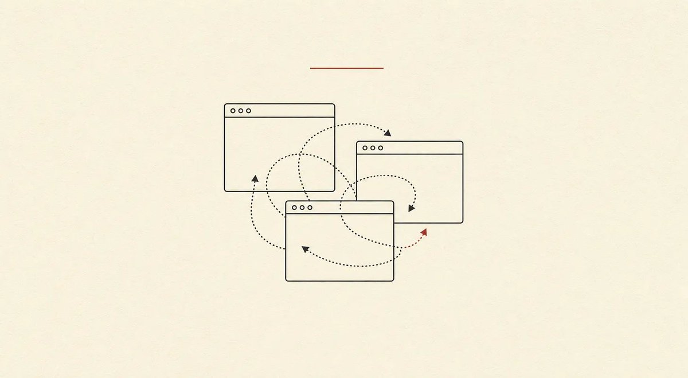
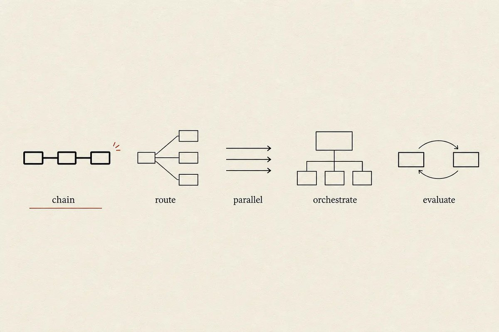
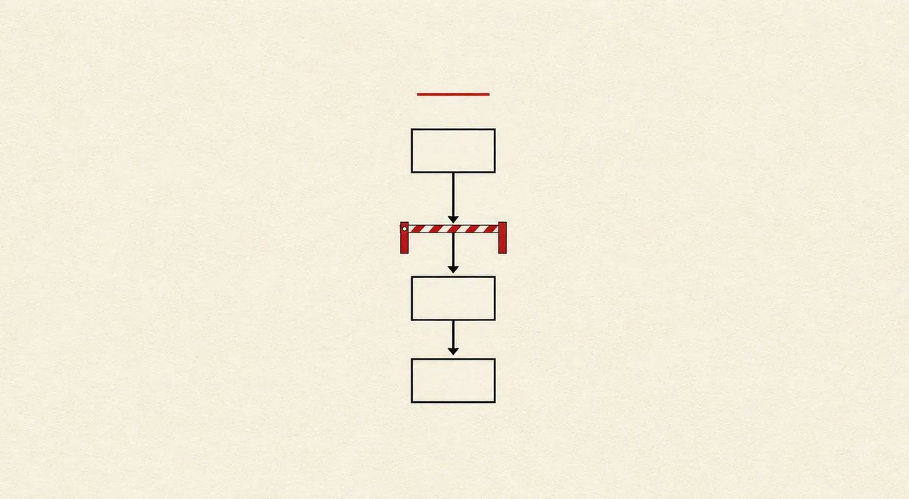
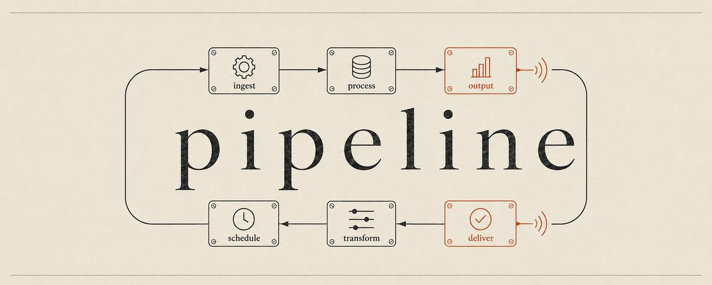

# 📰 How to Build AI Workflows When You're Tired of Optimizing Prompts

Hello everyone, leopardracer here!

Finding good content ideas used to take me hours every week. Reddit in one tab, news in another, arXiv in a third, and an Obsidian note where I’d paste everything and try to remember how the pieces connected. Each AI search took seconds, but I spent the rest of the time being the glue.

What made it worse was how much attention I burned just moving between tabs and chats. Every switch cost me focus, and every reset made the work feel heavier than it was.

I didn’t know it then, but instead of overly optimizing my prompts, I should’ve just created a workflow. Took me some time to figure out the best way to go about this and so I am ready to share my way of converting prompts into workflows.

In this piece:

- Why prompt habits break at scale

- How to spot your first workflow candidate

- How to find the seams in long conversations

- The handoff pattern that carries context forward

If you’re copying output between AI chat tabs, you’re doing the coordination work the AI should handle. The fix is to turn your prompts into a workflow where each step writes to a file and the next reads it. Context carries forward without you carrying it. You only stop where a real decision needs to be made.

## When Prompting Stops Working

Almost everyone starts with AI the same way. You type a question, get an answer, copy-paste it somewhere, repeat. This is how I spent my first year using it. And I get it, it feels productive because each interaction gives you something tangible.

Then you notice you’re spending more time managing the AI than the AI is saving you. You’re the one copying between steps. You’re the one remembering what step three needed from step one.

An October 2025 study [published on arXiv](https://arxiv.org/abs/2406.15782) found that LLM accuracy drops significantly when relevant information is embedded within longer contexts, even when all irrelevant tokens are masked.

Prompt engineering blogs and courses are still selling the idea that the right words will fix everything. They’re optimizing the wrong layer. You’re trying to run a pipeline through a chat window, and no amount of word-smithing changes that.

Hitting a ceiling with prompting means you have an architecture problem.

## How to Spot Your First AI Workflow

Before we go further, try this. Think about the last repetitive task you did with AI. The one that took 45 minutes and made you want to scream by minute 30. Now ask yourself:

- Did I copy-paste between steps?

- Did I open multiple chat windows because context kept getting polluted?

- Did I have to remember what step three needed from step one?

- Did the AI produce good output at each step, but the final result was mediocre?

If you answered yes to any of these, you already have a workflow candidate. You’ve been doing the coordination work manually.

Here’s a prompt you can use right now. Paste it at the end of your next long AI conversation, after you’ve finished a task:

\`\`\`
Look back at this conversation we just had. I'm going to paste the initial prompt I started with below. I want you to analyze whether this task could be converted into a reusable skill or workflow.

Specifically:
1\. Could the steps I took be structured as a sequence where each step produces output the next step needs?
2\. Are there handoff points where context needs to carry forward?
3\. Would this task benefit from being broken into separate steps with clean context, rather than running as one long conversation?
4\. What would the input, instructions, output, and checkpoint look like if this became a workflow?

Here's the initial prompt I used: \[PASTE YOUR INITIAL PROMPT HERE\]

Tell me if this is a good candidate for a workflow, and if so, sketch what the steps would look like.
\`\`\`

Run this after your next repetitive task. You might find you’re already doing workflow-shaped work manually.

This works whether you use Hermes, Claude Code, Codex, Cowork, or any other AI conversation tool. Patterns stay the same. Tools don’t matter. Structure does.

## Where to Find the Seams in a Long Conversation

Converting a long conversation into a workflow starts with seeing where your current process has seams.

When you have a long AI conversation, look for the moments where you switched gears. Where you said “okay, now let’s do X” and started a new mental context. Where you copied something from earlier in the chat and pasted it into a new request. Where you had to remind the AI what you were working on because it forgot. Those seams are where scope creep happens.

Those are your seams. Each seam is a potential step in a workflow.

My breaking point came during a content ideation project. I needed to find interesting angles for newsletter articles, which meant pulling from multiple sources. Reddit threads surfaced complaints about specific problems, news articles covered emerging tools, and arxiv papers hinted at new capabilities.

I started manually, copy-pasting Reddit posts into a document, scraping news headlines, running arxiv searches and saving abstracts. Each source lived in its own chat session because context windows kept getting polluted. By the time I finished with Reddit, I’d forgotten what I found in the news search.

Then I created individual skills for each source. One skill for Reddit research, another for news scraping, a third for arxiv papers. Each skill worked fine on its own, but I was still the one coordinating between them. I’d run the Reddit skill, save the output, run the news skill, save that output, run the arxiv skill, save that output. Then I’d manually combine all three into a final idea list.

I was doing the agent’s coordination work manually. The AI could do each step well. Handoffs were the problem. I was the middleware.

## How to Correctly Carry Context Forward

Workflows are sequences of steps where each step produces something the next step needs. What separates workflows from prompting is that context moves forward automatically instead of you carrying it by hand.

Anthropic’s “[Building Effective Agents](https://www.anthropic.com/engineering/building-effective-agents)” guide, published in December 2024 and widely cited as the definitive resource, makes a clean distinction. Workflows are systems where LLMs and tools are orchestrated through predefined code paths. Agents are systems where LLMs dynamically direct their own processes.

For non-coders, workflows are the sweet spot. You define the path. The AI does the work at each stop.

Anthropic describes five workflow patterns. In plain English:

Prompt chaining works like an assembly line. Step one’s output becomes step two’s input. Each step stays simple and focused.

Routing sorts different inputs down different paths. Like a mail sorter that sends letters to the right zip code.

Parallelization runs multiple things at the same time. Like having three researchers instead of one.

Orchestrator-workers uses a boss agent that breaks down the work and delegates it to worker agents.

Evaluator-optimizer has one agent do the work and another check it. The first one revises based on feedback.

I call the files that hold it all together handoff files. Each step writes its work down so the next step doesn’t have to guess. Format matters less than the principle. It could be a markdown file, a Google Doc, a structured text block. What matters is that each step produces something the next step can read.

I tried everything for holding context between steps. In-memory variables disappear when the session ends, database entries require setup and maintenance, and shared state files get corrupted when two steps write at once.

Markdown files in Obsidian won because they’re boring and reliable.

Each step in a workflow writes its output to a markdown file, and the next step reads that file. Files sit in a folder structure that mirrors the workflow. When something goes wrong, I open the file and see exactly what step three produced. I trace the problem backward through the chain.

This also gives me something I didn’t expect. I track what each subagent or step did, with links to the specific files it produced. When something sounds fishy in the final output, I open the intermediate files and find where the drift started.

Markdown has practical advantages too. Plain text works everywhere. Files move between systems without conversion. Changes are version-controllable over time. Everything renders nicely in Obsidian, which I already use for notes.

Storing context in a database or shared state mechanism adds complexity, requires setup, and creates dependencies. Markdown files require nothing except a folder and a text editor.

Each step writes its work down. The next step reads what the previous step wrote. Context carries forward through files, not through memory.

## Building an AI Workflow Step by Step

Let me show you what this looks like in practice. I’ll use my content ideation workflow as the example, but the structure works for any repeating task. 

Four steps make up this workflow. Each step reads from the previous step’s output file and writes to its own output file.

Step 1: Reddit research

Input: A topic or keyword to search for.

What it does: Searches Reddit for threads where people complain about problems related to that topic.

Output: reddit-findings.md with thread titles, URLs, and key complaints.

Step 2: News scraping

Input: The same topic.

What it does: Searches news sources for articles about emerging tools or trends related to that topic.

Output: news-findings.md with headlines, URLs, and summaries.

Step 3: Arxiv search

Input: The same topic.

What it does: Searches arxiv for papers that hint at new capabilities related to that topic.

Output: arxiv-findings.md with paper titles, abstracts, and relevance notes.

Step 4: Synthesis

Input: All three files from steps 1-3.

What it does: Reads all three files and synthesizes them into a list of article angle ideas.

Output: idea-angles.md with 5-10 potential article topics, each grounded in the research.

Each step gets a clean context with exactly what it needs. Nothing is buried. Nothing is forgotten.

My first attempt at this workflow was ugly. Files on my desktop, a checklist in a notes app, and a lot of copy-pasting held it together. But it was structured. Each step had a clear input and a clear output. The agent didn’t need to remember anything from three steps ago because I gave it exactly what it needed.

Eventually I built one unified skill that handles the whole pipeline. It pulls from Reddit, news sources, and arxiv in sequence, writes each batch of findings to a separate markdown file, then synthesizes all three into a final idea list. The skill runs top to bottom without me copying anything between steps.

## Prompting vs. Workflows: The Same Task

Content ideation looks completely different the prompt way versus the workflow way.

The prompt way: You open a chat and ask the AI to search Reddit for complaints about a specific topic. It gives you a list. You copy that list into a document. You open a new chat and ask it to scrape news articles about the same topic. It gives you headlines and summaries. You copy those into your document. You open another chat and ask it to search arxiv for relevant papers. It gives you abstracts. You copy those too.

By the time you’re done, you’ve got three separate chunks of text in a document. Now you need to synthesize them into idea angles. You paste everything into a new chat and ask for ideas. The AI produces a list, but it’s generic. It lost the nuance from the Reddit complaints because they got buried in the combined text. It missed the arxiv findings because they were at the bottom of a 5,000-word prompt.

The workflow way: You run a skill that searches Reddit and writes the findings to a file called reddit-findings.md. The skill then searches news sources and writes to news-findings.md. Then it searches arxiv and writes to arxiv-findings.md. Each file is clean and focused.

The final step reads all three files and synthesizes them into idea-angles.md. Each step gets a clean context with exactly what it needs. Nothing is buried or forgotten.

[Clare Liguori’s research at AWS](https://strandsagents.com/blog/steering-accuracy-beats-prompts-workflows/) tested five approaches to guiding agent behavior across 3,000 evaluation runs. Simple prompt instructions reached 82.5% accuracy, meaning roughly one in five interactions failed. When she added structured feedback loops, what she calls steering hooks, accuracy hit 100% across 600 runs.

Better structure made the difference, not better prompts.

I tested this myself when comparing how different models handle real Hermes workflows. Models that looked impressive on benchmarks often failed at structured workflows because they overthought simple steps or ignored format constraints. Structure matters more than raw capability.

## Where Humans Still Check

Every workflow needs checkpoints, but not every step needs one. Adding review points everywhere turns the workflow into a series of interruptions.

I use decision gates. You only stop where a real choice needs to be made. Which angle to pursue. Which source to prioritize. Whether to cut a section that doesn’t fit.

If the output is fine and no decision is needed, you don’t stop. Workflows run until they hit a point where they can’t proceed without your judgment.

Decision gates check whether the output matches your intent. AI produces grammatically correct, well-researched content that still goes in the wrong direction. Decision gates catch that before the next step builds on a mistaken assumption.

In my telegram chanel I wrote a full guide on adding approval gates to Hermes workflows if you want the technical details. Gates protect your reputation by blocking external actions without your OK, protect your data by requiring confirmation before system changes, and protect your wallet by blocking spending above a threshold without approval.

For most workflows, you need one gate at the point where the output becomes public or irreversible. A content workflow might have a gate after the outline, before the final draft goes live. A research workflow might have a gate after the synthesis, before you act on the findings.

Decision gates are where you stay in control of direction while the AI handles execution.

## Where to Start Your First Workflow

Pick one repeating task. Not the most complex one. Pick the one you do every week that takes 45 minutes and makes you want to scream by minute 30. That’s your first workflow.

Mine was a morning briefing that pulls tasks and articles before coffee. Two steps. Read from Asana, format the output, deliver it. Simple enough to build in an afternoon, useful enough to run every weekday since I built it.

If you’re new to Hermes, start with a two-step workflow like this one before attempting anything complex.

Minimum viable workflows have four parts: input (what goes in), instructions (what the agent does), output (what comes out), and checkpoint (where you verify). You don’t need software. You don’t need code. You need a folder with files in it.

Anthropic’s own advice from “Building Effective Agents” is to start simple and add complexity only when needed. They explicitly warn against starting with frameworks or complex architectures. Start with two steps. Make them reliable. Then add a third.

[Confluent’s guidance on AI workflows](https://www.confluent.io/compare/prompts-vs-workflows-vs-agents/) makes the same point. Simple solutions are often the best place to begin. Starting with simple prompt engineering may not be perfect, but it works well enough as a first pass. When you hit the ceiling, add structure. Don’t add structure preemptively.

Boring beats clever. Your first workflow should be so simple it’s embarrassing. A two-step process with a file handoff and a human check. That’s it. People who get value from AI workflows built boring ones and ran them 50 times, not impressive ones they ran twice. 

Most AI productivity advice tells you to write better prompts. Designing better handoffs is where the real payoff lives. Prompts at each step can be mediocre if the context they receive is clean. A brilliant prompt in a bloated chat thread will still produce mediocre output.

Recognizing when you’re doing coordination work the AI should handle is the whole shift. Once you see the pattern, you can’t unsee it. Every repetitive task becomes a candidate for structure. Every manual handoff becomes a design problem.

Hitting a ceiling with prompting means you have an architecture problem. Build the pipeline. Let the context flow. Keep your hands on the decisions that matter.

---

If this changed how you think about AI workflows, follow [@leopardracer](https://x.com/@leopardracer) for more content like this and join my telegram channel: [https://t.me/+ygATQAt9sUM1N2U6](https://t.me/+ygATQAt9sUM1N2U6)

### 🖼️ Attached Media

## 💬 Replies

### 1 @antpalkin (cvxv666)

*Fri Jun 19 12:05:37 +0000 2026*

@leopardracer My dream is to create the perfect loop where the AI does everything on its own and keeps getting better

### 2 @leopardracer (leopardracer) (Author)

*Fri Jun 19 14:54:56 +0000 2026*

@antpalkin that's the dream for all of us

### 3 @KanikaBK (Kanika)

*Fri Jun 19 13:14:04 +0000 2026*

@leopardracer Seems to be a valuable article.

### 4 @leopardracer (leopardracer) (Author)

*Fri Jun 19 14:51:35 +0000 2026*

@KanikaBK glad it landed, appreciate you reading

### 5 @witcheer (witcheer)

*Fri Jun 19 09:07:55 +0000 2026*

@leopardracer good writeup!

### 6 @leopardracer (leopardracer) (Author)

*Fri Jun 19 13:56:51 +0000 2026*

@witcheer thanks!

### 7 @neil_xbt (NeilXbt)

*Fri Jun 19 11:11:53 +0000 2026*

@leopardracer insane gem here!

### 8 @leopardracer (leopardracer) (Author)

*Fri Jun 19 14:57:18 +0000 2026*

@neil\_xbt glad it hit

### 9 @sairahul1 (Rahul)

*Fri Jun 19 09:32:24 +0000 2026*

@leopardracer bookmarking this for weekend

### 10 @leopardracer (leopardracer) (Author)

*Fri Jun 19 14:56:30 +0000 2026*

@sairahul1 enjoy the read, lmk what you think after

### 11 @Av1dlive (Avid)

*Fri Jun 19 11:11:07 +0000 2026*

@leopardracer This is nice

### 12 @leopardracer (leopardracer) (Author)

*Fri Jun 19 14:58:03 +0000 2026*

@Av1dlive appreciate it

### 13 @hammertime_one (hammertime)

*Fri Jun 19 09:20:40 +0000 2026*

@leopardracer less tabs, more flow

### 14 @leopardracer (leopardracer) (Author)

*Fri Jun 19 14:47:29 +0000 2026*

@hammertime\_one that's literally the whole point ngl

### 15 @gippp69 (Gipp 🦅)

*Fri Jun 19 08:59:21 +0000 2026*

@leopardracer This makes working with the AI ​​much easier

### 16 @leopardracer (leopardracer) (Author)

*Fri Jun 19 17:26:21 +0000 2026*

@gippp69 that's the goal, less friction more output

### 17 @kirillk_web3 (Kirill)

*Fri Jun 19 09:17:56 +0000 2026*

@leopardracer Great article, thanks! I read it and added it to my favorites.

### 18 @leopardracer (leopardracer) (Author)

*Fri Jun 19 14:55:23 +0000 2026*

@kirillk\_web3 appreciate you reading it through

### 19 @starmexxx (starmex)

*Fri Jun 19 09:02:42 +0000 2026*

@leopardracer saved, handoff pattern carrying context forward without you carrying it is the move

### 20 @leopardracer (leopardracer) (Author)

*Fri Jun 19 17:26:01 +0000 2026*

@starmexxx yeah carrying context forward without YOU carrying it is the unlock

### 21 @AeWdes (Gian)

*Sun Jun 21 19:55:31 +0000 2026*

@leopardracer ty ... followed!

### 22 @leopardracer (leopardracer) (Author)

*Sun Jun 21 19:59:25 +0000 2026*

@AeWdes glad it landed :)

### 23 @hitu_monke (hitu)

*Fri Jun 19 09:56:58 +0000 2026*

@leopardracer Long threads always lose context, breaking them into steps is a lifesaver
bookmarked

### 24 @leopardracer (leopardracer) (Author)

*Fri Jun 19 14:52:15 +0000 2026*

@hitu\_monke exactly the problem, breaking into steps fixes the context rot completely

### 25 @Nicoqp (Nico)

*Fri Jun 19 11:17:12 +0000 2026*

@leopardracer no more manual grind and getting tired because of a boring work

### 26 @leopardracer (leopardracer) (Author)

*Fri Jun 19 14:53:05 +0000 2026*

@Nicoqp yeah the boring repetitive part is exactly what should be automated first

### 27 @quroolarc (qurool)

*Fri Jun 19 09:57:15 +0000 2026*

@leopardracer goated article homie, love it

### 28 @leopardracer (leopardracer) (Author)

*Fri Jun 19 14:53:49 +0000 2026*

@quroolarc means a lot homie

### 29 @Blum_OG (Blum)

*Fri Jun 19 18:55:08 +0000 2026*

@leopardracer great read, bro, thanks for sharing

### 30 @rewind02 (rewind)

*Fri Jun 19 10:20:32 +0000 2026*

@leopardracer workflows beat better prompts

### 31 @alphabatcher (Alpha Batcher)

*Fri Jun 19 17:45:49 +0000 2026*

@leopardracer leo here with another smart article

you doing great work

### 32 @ridark_eth (Ridark)

*Fri Jun 19 09:56:57 +0000 2026*

@leopardracer The honesty about uncertainty was refreshing

### 33 @gerardsans (Gerard Sans | Axiom 🇬🇧)

*Sun Jun 21 14:25:00 +0000 2026*

@leopardracer ⚠️🕳️🐇

### 34 @zodchiii (darkzodchi)

*Fri Jun 19 10:02:41 +0000 2026*

@leopardracer fireee

### 35 @itsthedonhashim (Hussain Hashim | Building SundayBack)

*Fri Jun 19 11:10:11 +0000 2026*

@leopardracer @leopardracer dude, same. juggling tabs like I'm trying to win an Olympic sport or something 🤦‍♂️

### 36 @whemohere (whemo)

*Sat Jun 20 12:28:09 +0000 2026*

@leopardracer I hope my laziness can handle at least this much

AI has made me lazy, lol.

