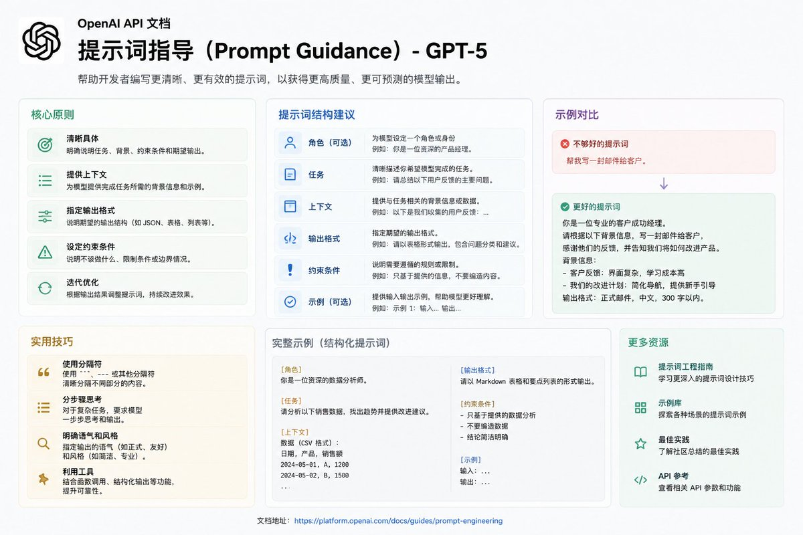

OpenAI 发布了 GPT-5.6 Sol 的官方 Prompting Guide。明确告诉我们：GPT-5.6 的最优 prompting 方式，和 GPT-5.5 / GPT-4 已经完全不同了。

官方内部数据：
精简 prompt 后，评测分数 +10-15%，token 降低 41-66%，成本降低 33-67%。
结论很明确：过度工程化的 prompt 正在成为新的瓶颈。

核心变化只有一句话：
从“手把手教怎么做”，变成“定义结果 + 边界 + 证据，让模型自己选最优路径”。
过去那种又长又详细的 prompt，在 GPT-5.6 上反而会拖累性能。

GPT-5.6 新特性 Programmatic Tool Calling：
模型可以写 JS 在沙箱里处理大量工具返回结果（过滤、聚合、去重等），大幅减少来回调用轮次。
适合需要批量处理数据的场景。

社区总结的 IDEA 框架很好用：

Intent：最终目标
Data：可用证据
Edges：边界与限制
Answer：交付格式与成功标准

比传统 prompt 模板更适合 GPT-5.6。

迁移建议：
不要一次性大改旧 prompt。 先切换模型跑 baseline，再逐步删掉重复指令，只保留真正改变行为的规则。
每改一次就验证效果。

### 🖼️ Attached Media

## 💬 Replies

### 1 @mylifcc (lifcc) (Author)

*Wed Jul 15 14:27:07 +0000 2026*

官方文档在这里： [developers.openai.com/api/docs/guide…](https://developers.openai.com/api/docs/guides/prompt-guidance-gpt-5p6)
对做 Agent 和复杂工具调用的人来说，这份指南的核心就是： 把 prompt 写得更干净、更像需求规格，而不是操作手册。
你目前在用 GPT-5.6 构建什么系统？

### 2 @ajs6888 (安叫兽|Bird🕊️ 🔶 BNB)

*Fri Jul 17 07:22:15 +0000 2026*

@mylifcc 看来以后少写点反而更稳

### 3 @mylifcc (lifcc) (Author)

*Fri Jul 17 08:19:57 +0000 2026*

@ajs6888 是的哈哈

### 4 @MossAI_CN (MOSS 中文)

*Thu Jul 16 03:40:40 +0000 2026*

@mylifcc 感觉未来 Prompt Engineer 可能越来越像系统设计师，而不是写指令的人，大家会开始重新审视哪些规则真的有价值🤔

### 5 @mylifcc (lifcc) (Author)

*Thu Jul 16 17:30:37 +0000 2026*

@MossAI\_CN 这个太难了，prompt eng 人人都能做，系统设计师对人的要求极其高

### 6 @wuzy_oye (ZuoYan Wu)

*Thu Jul 16 14:35:00 +0000 2026*

@mylifcc 随着 AI 能力越来越强，未来应该是 agentic 模式战胜 workflow 类流程与预制的模式。因为这些会束缚 AI 的能力发挥。

### 7 @mylifcc (lifcc) (Author)

*Thu Jul 16 14:49:30 +0000 2026*

@wuzy\_oye 这个很难呀，我觉得，大概率还是agent作为workflow的节点

### 8 @0xvck_ai (0xvck.ai)

*Fri Jul 17 08:46:26 +0000 2026*

@mylifcc 我现在都都像老板一样，直接说哪个项目来介入，它自己就会知道了，可能也要开下记忆功能。

### 9 @mylifcc (lifcc) (Author)

*Fri Jul 17 08:57:31 +0000 2026*

@0xvck\_ai 已经开了吧，自带了现在

### 10 @liexpressok (沙哥)

*Wed Jul 15 22:26:32 +0000 2026*

@mylifcc 我想到了2年前，李彦宏说过，未来，会出现提示词工程师这个职业。。。。。时过境迁，众里寻她，没人在灯火阑珊处

### 11 @mylifcc (lifcc) (Author)

*Thu Jul 16 02:26:21 +0000 2026*

@liexpressok 时代变得太快了

### 12 @Vorathen (Vyrneth)

*Thu Jul 16 03:30:12 +0000 2026*

@mylifcc 每次一看到这些所谓的提示词，我就知道所谓的AI与小爱音箱别无二致，AI发展的道路任重而道远

### 13 @mylifcc (lifcc) (Author)

*Thu Jul 16 06:00:14 +0000 2026*

@Vorathen 确实

### 14 @hencejacks (Ninus)

*Thu Jul 16 13:53:54 +0000 2026*

@mylifcc 模型能力越强，提示词反而越简单了

### 15 @mylifcc (lifcc) (Author)

*Thu Jul 16 17:30:14 +0000 2026*

@hencejacks 是的，说多了就限制模型了

### 16 @HongyouChou (Hongyou)

*Thu Jul 16 13:52:51 +0000 2026*

@mylifcc 从imitation learning 变成 constrained optimization 了😅

