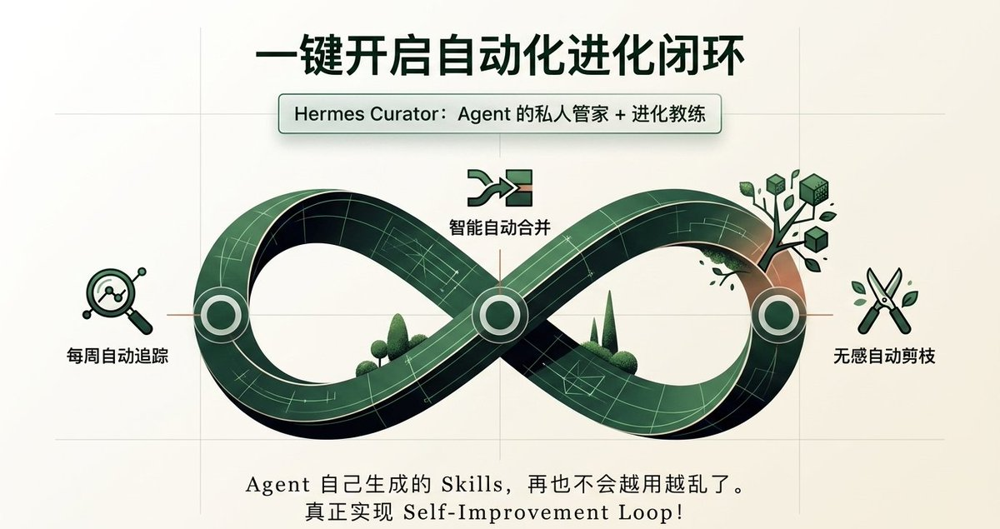

# 📰 Hermes Curator 横空出世！AI Agent 终于会“自我进化”了！

Hermes官方 @Teknium @NousResearch 发帖，Hermes Curator 功能正式上线！
社区直接炸了：“这才是真正的 Agentic Moment！”

一句话总结：
AI Agent 自己生成的 skills 再也不会越用越乱了！
每周自动追踪、自动合并、自动剪枝，真正实现 self-improvement loop 闭环！

先说痛点（所有玩过 Agent 的人都懂）：
你让 Agent 帮你写代码、做研究、建工作流……它每次都“学会”新 skill。
结果呢？
Skills 文件夹越来越大、重复、过期、互相冲突，最后整个 agent 变成一团乱麻。

以前这是所有 open-source Agent 的死穴。
现在？Hermes Curator 一键解决！

## Curator 到底干了什么？4大核心机制直接拉满 👇

机制① 使用频率追踪
Curator 实时记录每一个 skill 被调用的次数、场景、效果。
高频 skill 自动标记为「核心能力」，低频的自动进入观察名单。

机制② 每周自动运行
默认每周日凌晨自动触发一次「Curator 清理任务」。
完全无感，后台悄悄把你的 agent 进化成更聪明、更干净的版本。

机制③ 跳过 Pin 技能
你手动 pin（固定）的 skill 永远不会被合并或删除。
想保留的宝贝技能？直接右键 Pin，一劳永逸！

机制④ 智能合并 + 转模板

- 功能高度相似的 skill 自动合并成一个更强大的版本

- 通用性强的自动转为 reusable Template

- 低价值/过期的直接归档或删除

一句话：Curator 就是 Agent 的“私人管家 + 进化教练”！

## 实操教程来了（3分钟上手）

1. 确保你已经在跑最新版 Hermes（v0.12.0）

1. 在 config.yaml 里打开开关：curator:
  enabled: true
  schedule: "weekly"
  auto\_merge: true
  pin\_protection: true

1. 保存后重启 Hermes 即可！

一键手动触发清理（想现在就试试）：

hermes curator run --force

进阶小技巧（社区已经有人玩出花了）

- 加 --dry-run 参数先预览会合并哪些 skill

- 用 hermes curator status 查看当前技能健康报告

- 把高频 skill 导出成模板分享给朋友（社区已经开始流传「Curator 精选模板集」）

为什么这个功能这么炸？
因为它直接解决了「Agent 自我进化」最后一块短板。
以前大家说「Agent 会思考」，现在它真的会自己迭代了！

这波更新直接把 Hermes 从「好用的 Agent」推到了「能长期陪伴你一起成长的 Agent」。

转发给你正在卷 Agent 的朋友，一起把 skills 从“混乱”进化成“智慧”！

#HermesCurator #AICurators #AgenticAI #AI进化论

### 🖼️ Attached Media

## 💬 Replies

### 1 @qxgy88 (禹攸 | Gate Card刷遍全球)

*Sat May 02 03:39:54 +0000 2026*

@justloveabit 这个功能直接拉高了Agent的自我进化天花板，终于可以告别手动清理技能的痛苦了，值得每个Agent玩家都试一波。

### 2 @justloveabit (loveabit) (Author)

*Sat May 02 03:47:37 +0000 2026*

@qxgy88 的确进化很快

### 3 @btclaomao6 (老猫.Btc)

*Sat May 02 03:16:29 +0000 2026*

@justloveabit 值得继续关注

### 4 @justloveabit (loveabit) (Author)

*Sat May 02 03:23:08 +0000 2026*

@btclaomao6 恩，持续关注

### 5 @BTC100000015252 (加密贝姐LK)

*Sat May 02 07:06:36 +0000 2026*

@justloveabit 持续关注

### 6 @justloveabit (loveabit) (Author)

*Sat May 02 07:10:52 +0000 2026*

@BTC100000015252 恩，持续进化

### 7 @KOBOL19 (OX 白开水)

*Sat May 02 16:13:55 +0000 2026*

@justloveabit 看了这个，感觉Curator确实是个实用的更新，能帮Agent清理冗余技能，算是向自进化迈出踏实一步。

### 8 @justloveabit (loveabit) (Author)

*Sat May 02 16:16:23 +0000 2026*

@KOBOL19 自动化又进一步

### 9 @Mysticay2 (Mysticay)

*Sat May 02 13:52:37 +0000 2026*

@justloveabit 我看了看我自己的skill，331个，运行了curator，他告诉我都是活跃的。

### 10 @justloveabit (loveabit) (Author)

*Sat May 02 13:59:14 +0000 2026*

@Mysticay2 那状态挺好的

### 11 @pjjin574832 (等待被割的老韭菜 | 来Gate事件合约抢百万积分)

*Sun May 03 02:02:39 +0000 2026*

@justloveabit 比龙虾好用多了

### 12 @BTCzcv (Kimi)

*Sat May 02 11:44:31 +0000 2026*

@justloveabit 这波更新太强了，Agent终于能自己进化不乱了

### 13 @harryguo2015 (寻路)

*Sat May 02 10:32:52 +0000 2026*

@justloveabit 开始试了，多谢

### 14 @0xmz2987 (mz)

*Sat May 02 04:19:11 +0000 2026*

@justloveabit 进化太快了

### 15 @ZS1YYY (邹一一)

*Sat May 02 12:36:08 +0000 2026*

@justloveabit 有地址嘛

### 16 @luyi_luo (MrGreen.eth)

*Sat May 02 12:10:59 +0000 2026*

@justloveabit We've actually made a similar format in terminal based of Karpathy's idea of LLM Knowledge Bases. Give it a spin... [github.com/atomicmemory/l…](https://github.com/atomicmemory/llm-wiki-compiler)

### 17 @HunterPort71618 (钱钱小喇叭)

*Sat May 02 06:04:34 +0000 2026*

@justloveabit 我要把我的hermes进化了

### 18 @silicon_hotpot (硅基麻辣拌)

*Sun May 03 01:17:28 +0000 2026*

@justloveabit 方向不错值得一试，感觉这个 pin 的方式还不如直接集成 git，把 pin 换成 git 的版本 tag，这样整体可回溯，就算它乱进化清理我也可以随时找回来

### 19 @KI_Vater (Maurice | KI-Vater)

*Sat May 02 11:58:04 +0000 2026*

@justloveabit Krass, das Curator-Feature ist ja genau das, was Agents seit Ewigkeiten gebraucht haben! Endlich echtes Self-Improvement ohne dass der Skills-Ordner zum digitalen Messie wird  Werde Hermes direkt updaten und testen. Danke für den geilen Breakdown!

### 20 @Rios1728831 (Rios)

*Sat May 02 10:27:07 +0000 2026*

@justloveabit @grok 我目前已升级到最新版本，怎么在 config.yaml 里打开开关curator？

### 21 @JaxStuuu (Jax 辛)

*Sat May 02 21:24:23 +0000 2026*

@justloveabit 更新完後config裡沒有cutator選項，要自己添加嗎？

### 22 @VassilyChi (James)

*Sat May 02 22:52:20 +0000 2026*

@justloveabit 确实，假期把 openclaw 换成了 Hermes，感觉很好用，一些长程任务，真的可以跑完，原来 openclaw 不知道是不是我配置的不好，总是需要我时不时去推动一下，同样的问题也需要反复的告知，才能避免

### 23 @sunxin1982 (孙新)

*Sat May 02 15:07:55 +0000 2026*

@justloveabit 就是对skill的管理，还称不上自进化

