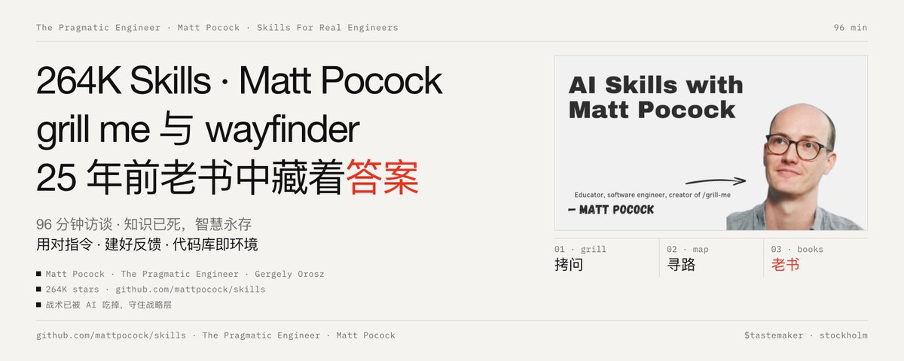

# 264K🌟 Skills 作者 Matt Pocock 96 分钟访谈：grill me 与 wayfinder 工作流，25 年前老书中藏着答案

264K 🌟 Skills For Real Engineers @mattpocockuk 与 The Pragmatic Engineer @GergelyOrosz 梦幻联动了！96 分钟深度对谈，把 “如何提升与 AI 协作质量” 的关键点，完全展开讲明白了。

而这些关键点，恰恰不是什么新方法，只是把 20 多年前经典软件工程书籍中的智慧重新用起来：用对指令、建好反馈回路、保持代码库整洁，因为你的代码库就是 Agent 生存的环境。

———

## Matt Pocock：一条非常规的职业路径

Matt Pocock 的经历本身就是一个注脚。他做了六年声乐教练和语音教师（在伦敦教歌唱、口音、莎士比亚戏剧台词，拥有硕士学位），为了不再住伦敦、回到乡下生活，2017 年前后转行自学成为开发者。他的第一个作品是一个分析学生嗓音频谱的 Web Audio 工具，极其野心勃勃但跑得很烂。

这段经历给了他一项“不公平的优势”：几乎零技术背景，却极擅长向人解释技术​。他因此晋升极快，历经多家外包公司，成为 TypeScript 早期布道者（他讲了一个经典案例：前后端分离团队因后端随意改契约而混乱，引入 TypeScript 后前端速度反超）。后来他进入 XState 作者 David Khourshid 的 Stately 团队，又在 Vercel 短暂工作过（参与了 Turbopack 初版文档）。

真正改变他命运的是 Total TypeScript 课程：与 Egghead 创始人 Joel Hooks 合作，2023 年初发布后迅速达到七位数营收，累计总收入 250 万美元。他的商业模式很“干净”：不做赞助、不接受打赏，只靠产品本身和企业的教育预算。

然后，AI 来了。

———

## 核心论点一：知识已死，智慧永存

Matt 对自己业务受到的冲击非常坦诚：Total TypeScript 的收入在下滑，因为“知识”（语法、怎么写）已经变得极其廉价，随手可查，甚至可以让 Agent 教你。

但“智慧”（为什么这样设计、长期后果是什么）并没有变得更容易学​。他借用了 John Ousterhout（本书作者也曾上过这档播客）的划分：

- 战术性编程（Tactical）：眼前的、局部的实现；AI 已经基本吃掉了这一层​；
- 战略性编程（Strategic）：长期结构、架构权衡；这成了人类唯一必须守住、且价值暴涨的领域​。
转折点是去年 12 月的寒假（Claude Opus 4.5 发布、大家假期疯狂使用后集体“顿悟”的那个冬天）：他意识到 Agent 终于“好到可以委派了”。

## 核心论点二：他的方法论，从 grill me 到 wayfinder

Matt 的 AI Skills 仓库已获 23 万 star，是全球第二受 star 的 skills 仓库。他的整个工作流建立在一个关键认知上（来自 Dex Horthy 的“聪明区/愚蠢区”理论）：

**无论上下文窗口多大，只有前约 15 万 token 是“聪明区”**​，之后模型的注意力关系逐渐退化。所以大工程必须切分到多个会话中。

由此形成了他的完整流水线：

1. grill me（拷问我）最出圈的 skill。让 Agent 像一位资深工程师那样无情地追问你​：认证用 Bearer token 还是 JSON？限流精确到什么粒度？主持人自己实测：想做一个“查邮箱是否订阅”的简单 API，被问了 35 个问题，“又烦又震撼”。它的本质是解决人机沟通鸿沟——Agent 再聪明也读不懂你的心，不会自动继承你的价值排序。grill me 让你先对齐范围和决策，再动手。他甚至从原理上给这类 skill 归因：“每个人都有一个被 grill me 折磨的故事”，模型在这个框架下会出现涌现行为，主动跳出框框向你抛想法。

2. spec → tickets 把拷问结果沉淀为规格文档，再拆成“一个会话一张工单”，用实现循环逐张消化，从而绕开 15 万 token 的墙。

3. wayfinder（寻路者）更野心勃勃的一层，处理“一个 grill 会话根本装不下”的超大工程（他举例：做一个 Stripe 克隆）。核心隐喻是地图 + 战争迷雾​：所有决策点构成一张有向无环图，每次拷问会话拨开一片迷雾、点亮若干里程碑，直到抵达终点。地图上可以有拷问、原型、研究、基建等不同类型的工单。他自己的用法已超出编程：用它规划课程、甚至在自家花园里盖办公室。

4. 日班/夜班节奏 白天规划，晚上让 Agent 干活，早上起来看干净的代码。他为“离开键盘（AFK）”优化一切，因为他痛恨在终端间不停切换上下文。

何时用哪一档？ 他给了清晰的决策树（与科技公司的 PRD 实践惊人地一致）：

———

## 核心论点三：最有意思的发现，“引导词”（Leading Words）

这是全场最具原创性的洞察。Matt 在实验中发现 Agent 在生产“软件熵”，代码越改越烂（呼应《程序员修炼之道》中的 software entropy 概念），于是他翻开书架上还没拆封的《The Pragmatic Programmer》，发现几乎每一行都像是为今天写的​。

他的关键动作：把书里的经典概念，曳光弹（tracer bullet）、垂直切片（vertical slice）、不要超出车灯照见的范围（don't outrun your headlights）、巧合式编程（programming by coincidence），直接写进提示词。结果发现：

模型开始把这些词“说回来”，在自己的推理痕迹里使用这些术语，行为随之改变。

原理很朴素：这些经典书籍在模型的训练数据里，术语本身就是激活模型深层概念的钥匙。他把这个技巧命名为引导词（借用文学修辞术语 Leitwort，重复一个短语来引导）。这与 Kent Beck 三十年前和 Ward Cunningham 抱着同义词词典找“最准确的那个词”的做法，形成了一次完美的历史回环——用对词，从来就不是新发明，只是我们忘了它为什么重要。

同样的思路延伸到了 DDD（领域驱动设计）​：他发现 Agent（尤其 Opus 5）啰嗦至极，而建立 Eric Evans 所说的统一语言（ubiquitous language）能让人机对话发生质变——他和 Agent 一起发明了“幽灵课程”“物化级联（materialization cascade）”这类领域术语，之后只需几个词就能描述复杂的变更意图，Agent 也能靠 grep 领域词汇轻松导航代码库。

———

## 核心论点四：为什么代码库整洁变得更重要了

他提出了一个精妙的类比，《记忆碎片》驱动开发（Memento-driven development）​：Agent 就像一个每天早上醒来就失忆的人。人类可以靠长期记忆“硬扛”烂代码库，Agent 不能，每个会话都是初见。

所以：你的代码库就是 Agent 的运行环境，优化环境就是优化产出。 他把工程师的角色重新定义为：

“我们本质上就是我们 Agent 的平台团队。”

这也是对“园丁”隐喻的回应（工程师 Lauren 的帖子：每个团队都需要有人静静看着 PR 流、拔掉像常春藤一样蔓延的 lint 抑制）：Matt 的回复更激进，“你的团队唯一需要的，就是园丁。”他每天早上有一个自动循环跑“改进代码库架构”的 skill，给出提案，一键转工单执行。

———

## 其余重要观点速览

- 战略编程为什么难学？ 反馈回路太长，战略失误要 9 个月后才会找上你（他用的比喻：面对一个巨大的调音台推子阵，混音时听不出问题，九个月后才炸）。AI 让你跑得更快，所以战略错误也会更快反噬，这反而压缩了学习周期。但他与主持人有一段精彩的开放讨论：AI 也能更快修复错误，伤疤变浅，“学习是否还那么深刻”是个真问题。
- 初级工程师怎么办？ 他反问：既然战略知识能以空前的杠杆率使用，公司为什么还要雇一个不具备它的人？Uncle Bob 给他的建议是“把新人当 Agent 用一段时间”再让他成长，他直言这是巨大的浪费。对新人自己的建议：尽情使用 Agent，但别把“学习”本身外包出去，“只要还在学习，我们就没事。” Grill me 的妙处正在于它逼你持续思考。
- TDD 的重新评估​：TDD 本质是为“工作记忆很小的人类”设计的（失败的测试帮你记住做到哪了），Agent 的工作记忆比人大得多，所以 TDD 瞄准错了问题。但 Agent 确实需要反馈回路，且 TDD 让 Agent 难以作弊​。他常说的是“给我 TDD 证据，证明没有这个改动，测试就会失败”。另外 Agent 特别爱写同义反复的垃圾测试（定义常量然后断言常量等于自己），需要自动化审查 Agent 来治理。
- 技术债​：Jared Friedman（YC）发推“技术债曾是你不得不与大代码库共存的东西，现在不用了”，Matt 的神回复：“是的，现在小代码库里也能共存了。”核心是 Agent 无法战略性思考，极易让代码库随时间劣化——这是一场永恒的战斗，需要自动化的实现 Agent + 审查 Agent 双轨制。
- 告别本地开发环境​：“我在放弃本地开发环境，这对我毫无意义。”理由是协作，组织需要共享那“100 个终端”，需要能在 Slack/Discord/Linear 里 @ 一个人进入拷问会话。他现在每天和 Agent 开晨会，让它排日程、理解他的 Discord 消息。（主持人补充：Ramp、Stripe、Uber 的平台团队把云端开发环境做成一条 Slack 命令，70–80% 的开发者已自愿转向云端，前端是少数例外。）
- 瀑布流骂错了吗？ 引用 Grady Booch：瀑布流的问题从来不是“先计划再实施”，是计划花一年、实施花三年，四年后发现做错了东西。两周到三个月的“迷你瀑布”一直是大厂的常态，那个被大家打的“瀑布流皮纳塔”其实早就不存在了。
- 为什么留在英国乡下而不去硅谷？ 他承认自己没有内幕信息、无法预测未来，所以只专注“让现在有效的东西有效”，这反而收窄并聚焦了他的探索。他拒绝自我叙事成“每一步都踩对了的天才”，归因于运气加上快速失败三个月的笨功夫。
- 教育的未来​：作为教育者，他认为 Agent “教你一切”的想法很性感但只在部分场景成立，人们真正需要的是策展（curation），把知识依赖图变成一条最优线性路径（他形容为“在知识图谱上跑 Dijkstra 算法”），而这恰恰是战略性工作，AI 不擅长。他从 TypeScript（战术层）到 AI 工作流（战略层）的转型之所以成立，正是因为踩中了这个价值转移。
———

## 我们能从这期访谈学到什么？

Gergely 结尾点破了全部讽刺之处：Matt 在寻找“如何与 AI 更好协作”的答案时，真正帮到他的不是任何前沿新方法，是 《The Pragmatic Programmer》《软件设计的哲学》《领域驱动设计》这三本 20 多年前的老书​。记载于纸上的最佳实践不仅依然有效，在 Agent 时代反而变得更加重要——因为 Agent 没有长期记忆，每次运行都是初见你的代码库；因为软件熵在 Agent 手里以前所未有的速度累积；因为沟通鸿沟比以往任何时候都真实。

最后记住这三句话：

用对术语：经典工程词汇是激活模型深层能力的引导词；

建好反馈回路：代码库是 Agent 的环境，做你 Agent 的平台团队和园丁；

守住战略层，别把学习外包出去：知识已经免费，智慧和品味才是你唯一的护城河。
