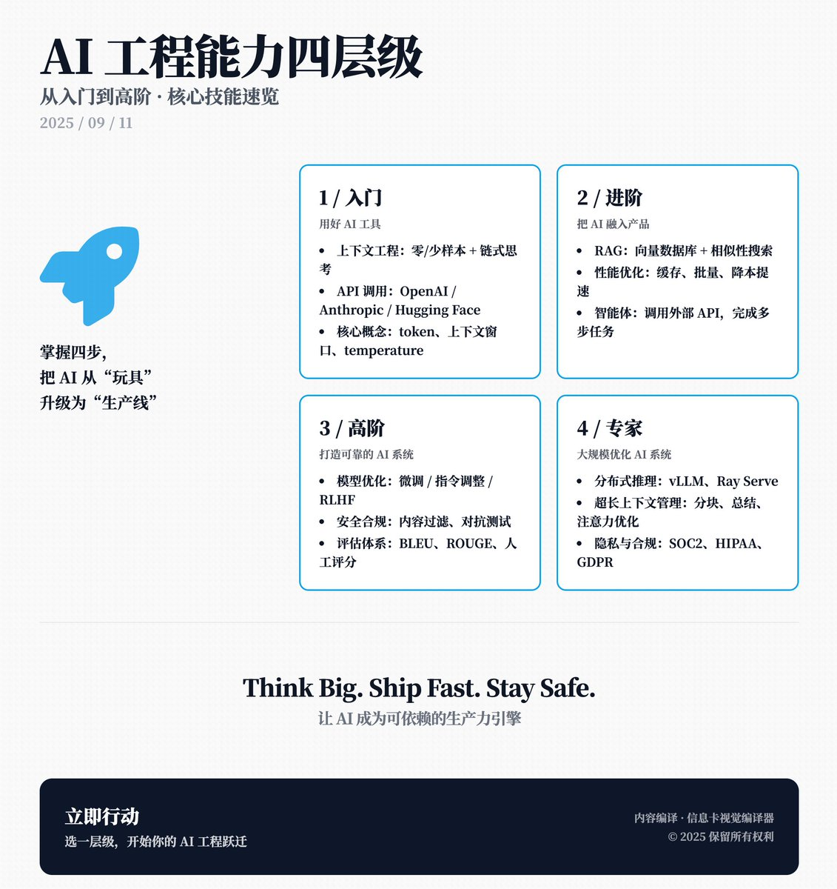

AI 工程能力的四个层级：从入门到高阶，逐步讲解了每个阶段需要掌握的核心技能，感谢 @zachly 分享！

1\. 入门：用好 AI 工具
核心内容： 这一阶段是 AI 工程的起点，主要是学会如何使用现有的 AI 工具来解决问题。你需要掌握：
· 上下文工程：如何写出高效的提示，比如零样本（直接问 AI）、少样本（给几个例子）或链式思考（引导 AI 一步步推理）。
· 调用 API：学会用 OpenAI、Anthropic、Cohere 或 Hugging Face 等接口，让 AI 为你工作。
· 理解基本概念：知道什么是 “token”（AI 处理文本的单位）、“上下文窗口”（AI 能记住的对话长度）和“参数”（如 temperature 控制输出随机性，top-p 控制答案多样性）。

总结： 这个阶段就像学会用智能手机——你不需要造手机，但得会用 App。只要掌握这些基础，你就能用AI解决实际问题，比如写代码、生成文本或分析数据。

2\. 进阶：把 AI 融入产品
核心内容： 从“会用”到“会造”，这一阶段开始用AI构建实际应用。重点技能包括：
· RAG：结合向量数据库（像 Pinecone、FAISS）让 AI 从外部数据中找答案，增强回答准确性。
· 嵌入与相似性搜索：把文本转为数字（嵌入），用数学方法（余弦相似度、欧氏距离）找到相关内容。
· 优化性能：通过缓存（存常用结果）和批量处理（一次处理多条请求）降低成本、提高速度。
· 智能体与工具使用：让 AI 像助手一样调用外部 API 或工具，完成复杂任务，比如查天气、发邮件。

总结： 这一阶段就像从用手机 App 到开发自己的 App。你开始用 AI 打造产品，比如智能客服或推荐系统，这是很多现代 AI 产品的核心。

3\. 高阶：打造可靠的 AI 系统
核心内容： 这一阶段是从“能跑”到“跑得好”，让 AI 系统稳定可靠，适合生产环境。关键技能包括：
· 模型优化：了解微调（fine-tuning）、指令调整（instruction-tuning）和强化学习（RLHF）的区别，知道何时用哪种方法提升模型表现。
· 安全与合规：设置防护措施（比如过滤有害内容、验证输出）确保 AI 安全合规，还要测试系统对恶意输入的防御能力。
· 多模型架构：结合大模型和小型专用模型，提升效率和效果。
· 评估框架：用指标（BLEU、ROUGE、困惑度）或人工评估判断 AI 表现，确保输出质量。

总结： 这就像从开发 App 到打造一个大型、稳定的软件平台。你需要确保 AI 不仅能用，还能持续、可靠地工作，应对真实世界的挑战。

4\. 专家：大规模优化 AI 系统
核心内容： 到了这一阶段，你的目标是让AI系统高效、合规地运行在海量用户场景中。重点包括：
· 分布式推理：用 vLLM、Ray Serve 等工具，让AI在多台服务器上高效运行。
· 管理上下文与内存：通过分块、总结或优化注意力机制，处理超长对话或复杂任务。
· 成本与性能平衡：在开源模型和商业模型间权衡，选择性价比最高的方案。
· 隐私与合规：确保数据安全（比如去除个人隐私信息），符合 SOC2、HIPAA、GDPR 等法规。

总结： 这就像从开发软件到运营一个全球化的云服务平台。你不仅要让 AI 跑得快、成本低，还要确保它安全、合法，能服务数百万用户。

补充建议
Zach 的框架已经很全面，但如果要补充，我会加几点：
· 数据管理：AI 的效果离不开高质量数据。学会如何清洗、标注和维护数据，是贯穿所有阶段的关键。
· 用户体验：AI 系统最终是为用户服务的，设计时要考虑如何让交互更自然、友好，比如优化对话流或错误提示。
· 持续学习：AI 领域更新快，保持学习（关注新模型、论文、工具）是成为顶尖工程师的必备习惯。
· 跨领域协作：AI 工程常需要和产品经理、设计师、法律团队合作，沟通能力在高阶阶段尤其重要。

### 🖼️ Attached Media

## 💬 Replies

### 1 @10000xG (Jong)

*Thu Sep 11 04:56:33 +0000 2025*

@shao\_\_meng @zachly @grok 总结下推文内容

### 2 @Macro_Zyaire (Leesanity)

*Thu Sep 11 04:52:56 +0000 2025*

@shao\_\_meng @zachly @Bruce\_Lee1207

### 3 @qingfengluanwu (web3｜ Hayek)

*Thu Sep 11 18:04:25 +0000 2025*

@shao\_\_meng @zachly 确实很有用，谢谢分享！

### 4 @ArthurFan692529 (Arthur)

*Fri Sep 12 11:12:49 +0000 2025*

@shao\_\_meng @zachly 一般人到第二层级就够用了

