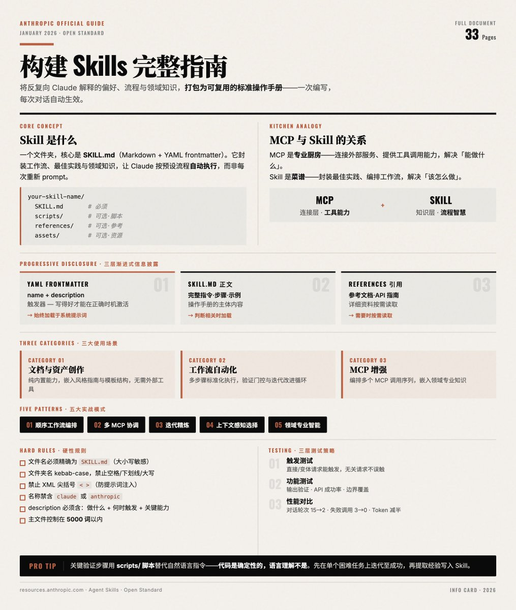

Anthropic 官方发布的 Skills 构建完整指南（33页）

Skill 是什么？为什么重要？
Skill 本质上是一个文件夹，核心是一个 SKILL. md 文件，用 Markdown + YAML frontmatter 编写。它的作用是：把你反复向 Claude 解释的偏好、流程、领域知识打包成一次性的"教学材料"，之后每次对话自动生效。

可以把它理解为 Claude 的"标准操作手册"——你不再需要每次都重新 prompt，而是让 Claude 按照预设的工作流自动执行。

Skill 文件夹的标准结构：
your-skill-name/
  SKILL. md     # 必须，主文件
  scripts/          # 可选，可执行脚本
  references/   # 可选，参考文档
  assets/           # 可选，模板、图标等资源

三层渐进式信息披露
第一层：YAML frontmatter，name + description，始终加载在系统提示词中，用于判断是否激活
第二层：SKILL. md，正文完整指令、步骤、示例，仅当 Claude 判断该 Skill 与当前任务相关时加载
第三层：引用文件，references/ 目录下的文档，仅在需要时按需读取

这意味着：即使你启用了几十个 Skill，Claude 并不会把所有内容都塞进上下文。第一层的 description 就像一个"触发器"——写得好，Skill 才能在正确的时机被激活。

Skill 与 MCP 的关系
指南用了一个非常好的比喻：
&gt; MCP 是专业厨房（工具、食材、设备），Skill 是菜谱（步骤指令）。

MCP（连接层）    \| Skill（知识层）
连接外部服务          \| 如何高效使用这些服务
提供工具调用能力 \| 封装最佳实践和工作流
解决"能做什么"       \| 解决"该怎么做"

没有 Skill 的 MCP，用户拿到了工具却不知道怎么用；有了 Skill，等于给工具配上了说明书和经验沉淀。这对 MCP 服务提供商来说是竞争力的差异化——有 Skill 的集成比纯 MCP 集成更容易上手。

三大使用场景分类
1\. 文档与资产创作（Category 1）
不依赖外部工具，纯靠 Claude 内置能力。典型：前端设计、文档生成、PPT/Excel 创建。核心技巧是内嵌风格指南、模板结构和质量检查清单。

2\. 工作流自动化（Category 2）
多步骤流程的标准化执行。典型：使用 skill-creator 引导用户一步步创建新 Skill。核心技巧是步骤间的验证门控和迭代改进循环。

3\. MCP 增强（Category 3）
为已有 MCP 连接提供工作流指导。典型：Sentry 的代码审查 Skill——自动从 Sentry 拉取错误数据，分析 GitHub PR，给出修复建议。核心技巧是编排多个 MCP 调用序列、嵌入领域专业知识。

YAML Frontmatter 的关键细节
硬性规则：
· 文件名必须精确为 SKILL. md（大小写敏感）
· 文件夹名必须用 kebab-case（如 my-cool-skill），禁止空格、下划线、大写
· 不允许在 Skill 文件夹内放 README. md
· 禁止使用 XML 尖括号 &lt; &gt;（防止系统提示词注入）
· 名称中不能包含 "claude" 或 "anthropic"（保留字）

description 字段的写法决定成败：
好的写法需要同时包含三个要素：做什么 + 何时触发 + 关键能力。

五大实战模式
模式 1：顺序工作流编排
适用于严格按步骤执行的流程（如客户入驻：创建账户 → 设置支付 → 创建订阅 → 发欢迎邮件），强调步骤间的依赖关系和失败回滚。

模式 2：多 MCP 协调
跨多个服务的联合工作流（如设计到开发交接：Figma 导出 → Google Drive 存储 → Linear 建任务 → Slack 通知），关键是阶段间的数据传递和集中式错误处理。

模式 3：迭代精炼
输出质量需要多轮改进的场景（如报告生成：初稿 → 质量检查 → 修正 → 再验证），核心是明确的质量标准和"何时停止迭代"的判断。

模式 4：上下文感知的工具选择
同一目标、根据条件选择不同工具（如文件存储：大文件走云存储、协作文档走 Notion、代码走 GitHub），需要清晰的决策树和备选方案。

模式 5：领域专业智能
嵌入专业知识而非仅仅调用工具（如支付合规：先做制裁名单检查和风险评估，通过后才处理交易），强调合规先于行动、完整的审计追踪。

测试策略
1\. 触发测试——Skill 是否在正确时机被激活？
· 直接请求能触发
· 换种说法也能触发
· 无关请求不会误触发
· 调试技巧：直接问 Claude "你什么时候会使用 \[skill name\] 这个 skill？"，它会引用 description 回答

2\. 功能测试——执行结果是否正确？
· 输出验证、API 调用成功率、边界情况覆盖

3\. 性能对比——有无 Skill 的差异
· 对话轮次从 15 轮降到 2 轮
· 失败 API 调用从 3 次降到 0 次
· Token 消耗减半

一个重要的实践建议：先在单个困难任务上反复迭代，直到成功，再提取经验写入 Skill，而非一开始就追求广覆盖。

分发与 API 使用
· 个人用户：下载 Skill 文件夹 → 压缩 → 上传到 Claude. ai 设置，或放入 Claude Code 的 skills 目录
· 组织级别：管理员可全工作区部署，集中管理和自动更新
· API 使用：通过 /v1/skills 端点管理，在 Messages API 中通过 container.skills 参数引入

Anthropic 将 Agent Skills 定位为开放标准——像 MCP 一样，希望它能跨平台使用，不局限于 Claude 生态。

常见问题排查
· Skill 不触发：description 太模糊或缺少触发短语，增加具体用户会说的话作为触发词
· Skill 过度触发：description 范围太宽，添加负向触发条件、缩小范围
· 指令不被遵循：指令太长/太含糊/关键内容被埋没，精简指令、关键信息放最前面、用脚本做确定性校验
· 上下文过大导致变慢：SKILL. md 过大或同时启用太多 Skill，主文件控制在 5000 词以内，详细文档移到 references/

一个高级技巧特别值得注意：对于关键验证步骤，用脚本（scripts/）替代自然语言指令。代码是确定性的，语言理解不是。

指南下载地址
[resources.anthropic.com/hubfs/The-Comp…](https://resources.anthropic.com/hubfs/The-Complete-Guide-to-Building-Skill-for-Claude.pdf?hsLang=en)

### 🖼️ Attached Media

## 💬 Replies

### 1 @shao__meng (meng shao) (Author)

*Mon Feb 09 00:56:57 +0000 2026*

信息卡提示词我放在这里了
[x.com/shao\_\_meng/sta…](https://x.com/shao__meng/status/2013773573706371129?s=20)

### 2 @linxiaobei888 (小北)

*Mon Feb 09 00:51:51 +0000 2026*

@shao\_\_meng 配图的提示词能分享吗？看着不错

### 3 @shao__meng (meng shao) (Author)

*Mon Feb 09 00:57:16 +0000 2026*

@linxiaobei888 有的，我放在评论里了 🤝

### 4 @xxxjzuo (Jason Zuo)

*Mon Feb 09 04:55:38 +0000 2026*

@shao\_\_meng 用了一阵子了。description 那块其实最容易踩坑，写太抽象就不触发，写太细又会误触发。

后来发现直接把用户可能说的话塞进去最管用，比如"帮我查一下天气"而不是"weather query functionality"。

references/ 那个设计挺聪明的，大文档不用全塞 context。

### 5 @yangqing_66 (杨清聊AI)

*Mon Feb 09 05:10:31 +0000 2026*

@shao\_\_meng 这种溯源解读官方文档的学习方法好！

### 6 @calmzeal1024 (老陈聊AI（AIChen）)

*Sun Feb 08 15:43:08 +0000 2026*

@shao\_\_meng 感谢分享

### 7 @truthdotphd (truth.phd)

*Mon Feb 09 07:01:54 +0000 2026*

@shao\_\_meng A Skill is like giving Claude a mini brain in a folder; once it learns your routine, it starts finishing your thoughts before you even hit enter.

### 8 @way666 (Way)

*Mon Feb 09 06:53:58 +0000 2026*

@shao\_\_meng @YLX9394 這圖好讚喔

### 9 @OiiDev (OSDev)

*Mon Feb 09 19:59:47 +0000 2026*

@shao\_\_meng rst @readwise save thread

### 10 @Lchn2024 (有来有去)

*Sun Feb 08 17:41:19 +0000 2026*

@shao\_\_meng @grok 拆解并解释后发给我

### 11 @Lchn2024 (有来有去)

*Sun Feb 08 17:39:08 +0000 2026*

@shao\_\_meng 感谢分享，我这个coding 小白准备试一下。

### 12 @sum19841 (sum1984)

*Sun Feb 08 23:36:58 +0000 2026*

@shao\_\_meng @grok 总结提炼以后给我

### 13 @AlanKLFeng (Alan Feng)

*Mon Feb 09 08:21:03 +0000 2026*

@shao\_\_meng Love this! Skills are such a game-changer for anyone working with Claude regularly. Finally, no more copy-pasting the same context every single time. The YAML + Markdown approach feels intuitive too. Can't wait to build some custom workflows! 🚀

### 14 @AuuuNya_ (aynzh)

*Sun Feb 08 14:13:52 +0000 2026*

@shao\_\_meng 中文版从哪里找？

### 15 @BeyondThe_Void (老莫)

*Fri Feb 20 12:31:29 +0000 2026*

@shao\_\_meng 试一下  [skills-refiner.com](http://skills-refiner.com) 重构➕翻译 不用谢

### 16 @LinBiann (Vint Lin)

*Thu Mar 26 01:40:40 +0000 2026*

@shao\_\_meng 官方指南讲的是「怎么写 Skill」，但「怎么管 Skill」是另一个问题。flow-skill（npm install -g skill-flow）解决：多 Agent 共用一个 Skill 库，skill update 一键同步所有 Agent 的 Skills

### 17 @lawgpts (vewin)

*Sun Feb 08 17:13:09 +0000 2026*

@shao\_\_meng anthropic 在 github 上开源了不少 skill 和 Agent 的例子，程序员和非程序员都看得懂，解释那么多干嘛，不如引导用户直接体验真实的 skill 案例。下一步就是让大模型听一个 skill 或者 mcp，看看代码，那区别一目了然。直接上手练才是了解的最好方法

### 18 @goodflife789 (Looking out)

*Sun Feb 08 15:44:59 +0000 2026*

@shao\_\_meng 拒绝Vibe Coding回归工程治理。本项目虽无法彻底根除LLM幻觉，但通过DCIP三明治注入锚定架构、8KB被动索引降噪、混合智能零成本执行等边界约束机制，显著抑制长上下文漂移。适配全系顶流工具栈。[github.com/wangjianjq/Ski…](https://github.com/wangjianjq/Skill)​ ​​​​
​#Cursor #Windsurf #Cline #ClaudeCode #OpenAICodex #KimiCode

