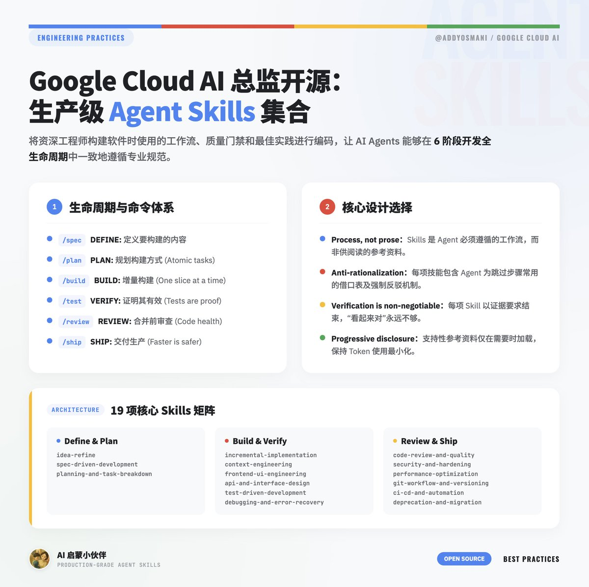

Google Cloud AI (Gemini \| Vertex) 总监 @addyosmani 开源「Agent Skills」：生产级工程 Skills 集合，覆盖 6 阶段开发全生命周期、19 项核心 Skills，真是宝藏 Skills 👍🏻

Agent Skills 把将资深工程师构建软件时使用的工作流、质量门禁和最佳实践进行编码，让 AI Agents 能够在开发的每个阶段一致地遵循这些规范，支持 Codex / Claude Code / Cursor / Copilot / Gemini 等
开源地[github.com/addyosmani/age…](https://github.com/addyosmani/agent-skills)EZ

六阶段开发生命周期，每个阶段对应特定的目录和 Skills：
DEFINE → PLAN → BUILD → VERIFY → REVIEW → SHIP
/spec    /plan   /build   /test    /review   /ship

命令体系 - 7 个斜杠命令（用途和原则）：
/spec：定义要构建的内容，Spec before code
/plan：规划构建方式，Small, atomic tasks
/build：增量构建，One slice at a time
/test：证明其有效，Tests are proof
/review：合并前审查，Improve code health
/code-simplify：简化代码，Clarity over cleverness
/ship：交付生产，Faster is safer

Skills 体系 - 19 项核心 Skills：
1\. Define
  · idea-refine：结构化发散/收敛思维，将模糊想法转化为具体提案
  · spec-driven-development：编写涵盖目标、命令、结构、代码风格、测试和边界的 PRD

2\. Plan
  · planning-and-task-breakdown：将规格分解为小的、可验证的任务，包含验收标准和依赖排序

3\. Build
  · incremental-implementation：薄垂直切片——实现、测试、验证、提交；功能标志、安全默认值、可回滚变更
  · context-engineering：在正确时间向 Agent 提供正确信息
  · frontend-ui-engineering：组件架构、设计系统、状态管理、响应式设计、WCAG 2.1 AA 无障碍
  · api-and-interface-design：契约优先设计、Hyrum 定律、单一版本规则、错误语义、边界验证

4\. Verify
  · test-driven-development：红-绿-重构、测试金字塔（80/15/5）、测试规模、DAMP 优于 DRY、Beyonce 规则、浏览器测试
  · browser-testing-with-devtools：Chrome DevTools MCP 实时运行时数据
  · debugging-and-error-recovery：五步分类：复现、定位、简化、修复、防护；停线规则、安全回退

5\. Review
  · code-review-and-quality：五轴审查、变更规模（约 100 行）、严重程度标签、审查速度规范、拆分策略
  · code-simplification：切斯特顿围栏、500 行规则、在保持精确行为的前提下降低复杂度
  · security-and-hardening：OWASP Top 10 防护、认证模式、密钥管理、依赖审计、三层边界系统
  · performance-optimization：测量优先方法、Core Web Vitals 目标、分析工作流、包分析、反模式检测

6\. Ship
  · git-workflow-and-versioning：主干开发、原子提交、变更规模、提交作为存档点模式
  · ci-cd-and-automation：左移、越快越安全、功能标志、质量门禁流水线、失败反馈循环
  · deprecation-and-migration：代码即负债心态、强制性与建议性弃用、迁移模式、僵尸代码清除
  · documentation-and-adrs：架构决策记录、API 文档、内联文档标准——记录"为什么"
  · shipping-and-launch：发布前检查清单、功能标志生命周期、分阶段推出、回滚程序、监控设置

Skills 的标准解剖结构
┌─ Frontmatter────────┐
 │ name: lowercase-hyphen-name   │
 │ description: Use when \[trigger\]      │
└───────────────┘
Overview         → Skills 作用
When to Use      → 触发条件
Process          → 分步工作流
Rationalizations → 借口与反驳
Red Flags        → 问题信号
Verification     → 证据要求

关键设计选择
· Process, not prose — Skills 是 Agent 遵循的工作流，而非供阅读的参考资料
· Anti-rationalization — 每项技能包含 Agent 为跳过步骤常用的借口表及反驳
· Verification is non-negotiable — 每项 Skill 以证据要求结束，"Seems right" 永远不足够
· Progressive disclosure — SKILL.md 为入口，支持性参考资料仅在需要时加载，保持 Token 使用最小化

Agent 角色（3 个预配置专家）
1\. code-reviewer：Senior Staff Engineer，"Staff engineer 会批准这个吗？"标准的五轴代码审查
2\. test-engineer：QA Specialist，测试策略、覆盖率分析和 Prove-It 模式
3\. security-auditor：Security Engineer，漏洞检测、威胁建模、OWASP 评估

参考检查清单（4 份）
1\. testing-patterns.md：测试结构、命名、Mock、React/API/E2E 示例、反模式
2\. security-checklist.md：提交前检查、认证、输入验证、Headers、CORS、OWASP Top 10
3\. performance-checklist.md：Core Web Vitals 目标、前端/后端检查清单、测量命令
4\. accessibility-checklist.md：键盘导航、屏幕阅读器、视觉设计、ARIA、测试工具

### 🖼️ Attached Media

## 💬 Replies

### 1 @kshern888 (Kevin Shern - e/acc)

*Sat Apr 04 12:49:18 +0000 2026*

@shao\_\_meng @addyosmani “claude-pilled”的教科书级案例😂

### 2 @iml1s (ImL1s)

*Sat Apr 04 15:29:29 +0000 2026*

@shao\_\_meng @addyosmani Agent Skills 这个思路非常扎实——把最佳实践直接编进 workflow，而不是靠文档传递，才能真正规模化。DEFINE→SHIP 这六阶段的设计让每个 Agent 都有清晰的边界感，特别喜欢"Verification is non-negotiable"这条原则，实际落地的时候确实最容易在这里妥协。感谢分享！

### 3 @AjMa697292 (AJ)

*Sat Apr 04 18:49:16 +0000 2026*

@shao\_\_meng @addyosmani Skills的核心价值是把工程经验编码成可复用的约束 模型换了skill还在 这才是真正的compound engineering

### 4 @Erwinminion (Erwin)

*Sat Apr 04 12:28:23 +0000 2026*

@shao\_\_meng @addyosmani 堆砌SOP只是及格线，生产级Agent的壁垒从来不是快乐路径，而是异常边界的状态回滚

### 5 @mylifcc (lifcc)

*Sat Apr 04 16:14:14 +0000 2026*

@shao\_\_meng @addyosmani 方向太对了，我们自己也在搞类似系统。提一个坑：skills 写好不难，难在跟代码同步迭代——过时的 skill 比没有更危险，agent 会认真执行错误指令。另外 anti-rationalization 是真正拉开差距的层，没它 agent 一定找借口绕过去

### 6 @AjMa697292 (AJ)

*Sun Apr 05 07:54:58 +0000 2026*

@shao\_\_meng @addyosmani Agent的核心竞争力不在模型 在于知识库和技能库的质量 这套Skills框架把资深工程师的隐性知识显性化 structured knowledge就是compound engineering的起点

