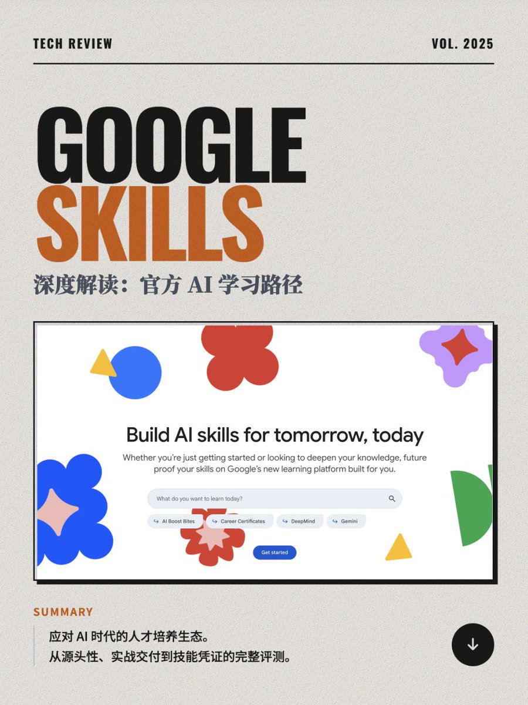

再次分享谷歌的 AI 学习平台「Google Skills」
—— Build AI skills for tomorrow, today!

Google Skills 是 Google 推出的一个整合型在线学习平台。帮助开发者、数据专家以及技术从业者“构建面向未来的技能（Build AI skills for tomorrow, today）”。
不同于以往分散的学习资源，Google Skills 似乎正在成为 Google 前沿技术教育的统一入口，目前主要聚焦于 AI、Cloud 以及 DeepMind 等高精尖技术领域的知识普及与实战训练。

核心内容板块
· 生成式 AI： 这是当前的重中之重。涵盖了从基础概念到 Gemini 模型应用、提示词工程、以及利用 Vertex AI 构建应用的全流程。
· Google Cloud 云计算： 提供基于 GCP 的架构、部署、数据分析等传统强项课程。
· 机器学习： 包括 TensorFlow、图像处理、NLP 等深度技术栈。

学习体系与认证机制
Google Skills 设计了阶梯式的学习路径，兼顾了从入门到专家级的不同需求：
· Learning Paths：将多门课程串联，针对特定岗位或技能（如“生成式 AI 应用开发”）提供系统化指导。
· Skill Badges：侧重实战，学员需在云端实验环境中完成具体操作挑战，通过后获得徽章。
· Certifications：行业认可度极高的职业资格认证。
· Certificates：面向入门者，帮助解锁新的职业路径，无需先修条件。 

平台特色与优势
· 实战导向： 平台不仅仅是视频教学，极度强调“动手做”。它集成了 Google Cloud 的实验环境，让学习者在真实的云控制台中练习，这对于掌握技术至关重要。
· 紧跟 Google 最新技术栈： 内容更新极快，例如针对 Gemini 多模态模型、Vertex AI Studio 等最新工具的课程都能第一时间在平台上找到。
· 面向个人与团队： 既服务于寻求自我提升的个人开发者，也为企业团队提供人才培养解决方案，强调通过动手实践提高员工留存率和技能水平。

Google Skills
[skills.google](https://www.skills.google/)

### 🖼️ Attached Media

## 💬 Replies

### 1 @microcn (microcn)

*Mon Dec 15 03:41:12 +0000 2025*

@shao\_\_meng 还以为是哪个skills一下激动了

### 2 @shao__meng (meng shao) (Author)

*Mon Dec 15 09:12:38 +0000 2025*

@microcn 以为是 Claude Skills 吗 😄

Google Skills 也很值得激动，学习技能的激动

### 3 @sodawhite_dev (苏打白.Dev)

*Mon Dec 15 07:52:10 +0000 2025*

@shao\_\_meng 关键还是免费的，谷歌上大分！！！

