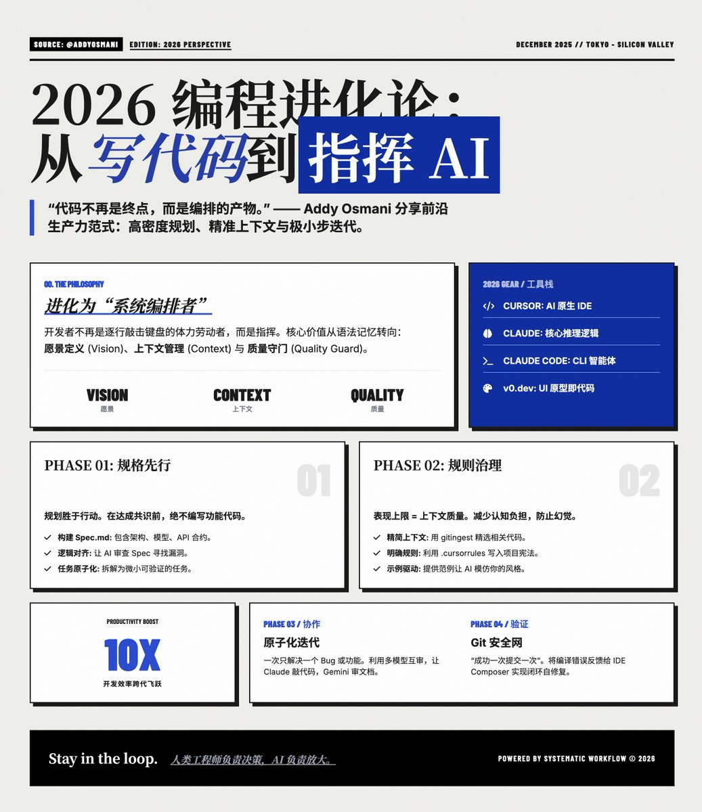

迈向 2026：构建以 LLM 为核心的系统化协作编程工作流

@addyosmani 分享他最新的工作流，也代表了当下最前沿的生产力范式：高密度的规划 + 精准的上下文提供 + 极小步长的迭代验证。

核心哲学：从“代码编撰者”进化为“系统编排者”
Addy Osmani 强调，2025 年的编程核心已经从“如何写代码”转向了“如何引导 AI 写代码”。开发者不再是逐行敲击键盘的体力劳动者，而是担任指挥或首席架构师的角色。

你的核心价值不再体现在对语法细节的记忆，而在于：
· 愿景定义：清晰地描述产品逻辑和架构。
· 上下文管理：为 AI 提供精确的信息边界。
· 质量守门员：对 AI 生成的内容进行严格的逻辑审查和责任共担。

第一阶段：规格先行，规划胜于行动
在动手编码之前，必须先与 AI 达成深度对齐。
· 构建 Spec 文档：创建一个 spec. md 文件。这不仅仅是需求，它应包含技术架构、数据模型、API 合约以及测试策略。
· 逻辑对齐：让 AI 审查你的 Spec，寻找逻辑矛盾或潜在的技术风险。在达成共识前，绝不开始编写功能代码。
· 任务原子化：将宏大的项目拆解为一系列微小的、可独立验证的“原子任务”。

第二阶段：精准的上下文与规则治理
AI 的表现上限取决于你提供信息的质量。
· 精简上下文：避免将整个项目盲目丢给 AI。使用工具（如 gitingest）精准挑选与当前任务相关的代码和文档，减少 AI 的“认知负担”和幻觉。
· 明确规则：通过 .cursorrules 或 CLAUDE. md 设置项目全局规则。例如：定义代码风格（如“始终使用 Tailwind”）、强制要求类型安全、或指定特定的目录结构。
· 示例驱动：给 AI 提供高质量的代码范例，它模仿你风格的能力远强于它凭空创造的能力。

第三阶段：原子化迭代与多模型协作
执行过程中遵循“小步快跑”的节奏。
· 一次一事：每次只让 AI 完成一个具体功能或修复一个 Bug。任务越小，AI 的准确度越高。
· UI 自动化：利用 v0. dev 等工具通过截图或描述直接生成前端原型，避免在布局细节上浪费时间。
· 多模型验证：利用不同模型的特长。例如，使用 Claude 进行逻辑编写，用 Gemini 处理超长文档理解，或者让一个模型 Review 另一个模型的代码。

第四阶段：强化验证与 Git 安全网
将 AI 的产出视为“待审核的初级开发人员输出”。
· Git 作为生命线：养成“成功一次就提交”的习惯。每完成一个小任务并验证通过后，立即提交。这样在 AI 逻辑跑偏时，你可以瞬间回滚到安全状态。
· 反馈闭环：利用 IDE 的 Composer 功能，将编译报错、Linter 警告或测试失败信息直接反馈给 AI，让其自我迭代修复。
· 严苛审查：开发者必须逐行阅读代码。关注安全性、性能边缘案例以及 AI 容易忽视的业务逻辑深度。

2026 核心工具栈建议 🛠️
· IDE：Cursor。目前公认的 AI 原生编辑器天花板，其 Composer 模式支持跨文件协同编辑。
· 核心模型：Claude。在编程逻辑推理和指令遵循方面目前处于领先地位。
· 命令行智能体：Claude Code 或 Copilot CLI。用于快速执行终端任务、运行测试或管理 Git。
· 原型生成：v0. dev。极大加速了从 UI 设计到 React 代码的转换过程。

原文地址[addyo.substack.com/p/my-llm-codin…](https://addyo.substack.com/p/my-llm-coding-workflow-going-into?triedRedirect=true)R

### 🖼️ Attached Media

