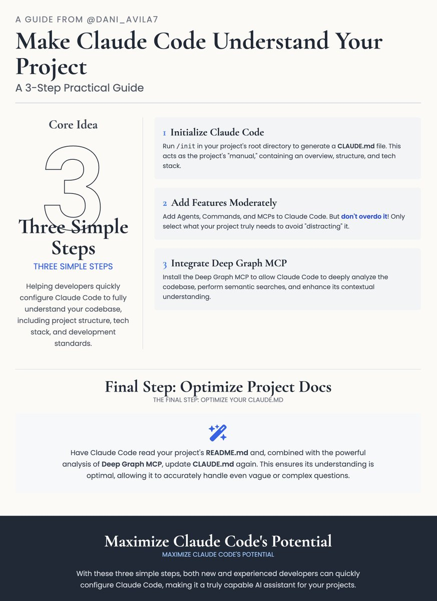

\[实战指南\] 三个步骤让 Claude Code 更好地理解和管理你的项目代码库 —— 来自 @dani\_avila7 的分享 —— 初始化配置、适度添加功能、集成 Deep Graph MCP，最后优化项目文档。

🧠 核心内容：让 Claude Code 高效理解你的项目
这篇指南的目标是帮助开发者快速配置 Claude Code，使其能全面理解你的代码库，包括项目结构、技术栈和开发规范。文章提供了三个简单步骤，既适合新手，也能让 Claude Code 发挥最大作用。

1⃣步骤一：初始化 Claude Code
做什么：在你的项目根目录运行 Claude Code 的初始化命令，生成一个 CLAUDE. md 文件。这个文件就像项目的“说明书”，包含项目概览、文件夹结构、技术栈和开发规范。

怎么做：
1\. 打开终端，进入项目根目录：
   cd your-project
2\. 初始化Claude Code并生成文档：
   claude
   /init

验证效果：初始化后，试着问 Claude Code 几个问题，确认它是否理解项目：
· 这个项目是做什么的？
· 文件夹结构是怎样的？
· 项目用了哪些技术？

如果回答得不够好，可以让 Claude Code 根据初步理解优化 CLAUDE. md 文件。

2⃣ 步骤二：适度添加功能（别贪多）
做什么：给 Claude Code 添加一些增强功能，比如 Agents、Commands 和 MCP。这些功能可以让 Claude Code 更灵活地处理你的项目。

怎么做：
· 访问推荐的网站，浏览并安装适合你项目的配置模板（支持100+种 Agent，覆盖不同语言和框架）。
· 注意：别一股脑儿装太多功能！只选项目真正需要的，避免让 Claude Code “分心”。

为什么：保持专注能让 Claude Code 更高效地理解和操作你的代码库。

3⃣ 步骤三：集成 Deep Graph MCP，提升代码洞察力
做什么：安装 Deep Graph MCP，让 Claude Code 能更深入地分析代码库，比如进行语义搜索、节点搜索，全面提升上下文理解能力。

怎么做：
1\. 注册 CodeGPT 账号，在 “API Connections” 页面获取：
   · API 密钥（\`YOUR\_CODEGPT\_API\_KEY\`）
   · 组织 ID（\`CODEGPT\_ORG\_ID\`）
2\. 将你的代码库上传到 CodeGPT 的 Code Graph，获取 CODEGPT\_GRAPH\_ID。
3\. 运行以下命令安装 Deep Graph MCP：
   claude mcp add "Deep Graph MCP" npx -- -y mcp-code-graph@latest YOUR\_CODEGPT\_API\_KEY CODEGPT\_ORG\_ID CODEGPT\_GRAPH\_ID
4\. 验证安装是否成功：
   claude mcp list
   claude mcp get "Deep Graph MCP"

用起来：安装后，你可以问一些高级问题，比如：
· 项目的认证逻辑在哪里？
· 错误处理模式有哪些？
· 修改用户服务会影响什么？
· 项目里有哪些API端点？

注意：如果你的代码库是私有的，参考 CodeGPT 的完整教程。

🔚 最后一步：优化 CLAUDE. md
做什么：让 Claude Code 读取项目的 README. md，结合 Deep Graph MCP 的强大功能，再次更新 CLAUDE. md。

为什么：这能确保 Claude Code 对项目的理解达到最佳状态，即使你提出模糊或复杂的问题，它也能准确应对。

### 🖼️ Attached Media

## 💬 Replies

### 1 @shao__meng (meng shao) (Author)

*Thu Aug 07 01:36:16 +0000 2025*

[medium.com/@dan.avila7/st…](https://medium.com/@dan.avila7/step-by-step-guide-prepare-your-codebase-for-claude-code-3e14262566e9)

### 2 @shao__meng (meng shao) (Author)

*Thu Aug 07 01:41:20 +0000 2025*

English Version 🔽n

### 3 @shao__meng (meng shao) (Author)

*Fri Aug 08 01:28:04 +0000 2025*

大家问的信息卡提示词，在这：
[x.com/shao\_\_meng/sta…](https://x.com/shao__meng/status/1953620942296592709)

### 4 @curtisyan123 (CurtisYan)

*Fri Aug 08 01:14:29 +0000 2025*

@shao\_\_meng @dani\_avila7 图片是咋生成的

### 5 @shao__meng (meng shao) (Author)

*Fri Aug 08 01:16:15 +0000 2025*

@curtisyan123 @dani\_avila7 提示词在这里：
[x.com/shao\_\_meng/sta…](https://x.com/shao__meng/status/1953620942296592709)

### 6 @S_N_W_E (南北西东)

*Thu Aug 07 05:32:18 +0000 2025*

@shao\_\_meng @dani\_avila7 感谢分享，这个对开发者来说太有用了

### 7 @bigdatabong (add)

*Fri Aug 08 00:26:21 +0000 2025*

@shao\_\_meng @dani\_avila7 @readwise save thread

### 8 @Stanley83784547 (Stanley)

*Thu Aug 07 11:14:21 +0000 2025*

@shao\_\_meng @dani\_avila7 这个应该适合已有仓库来使用吧？对于新建项目有没有更好的方案？

### 9 @voodoocjl (voodoo)

*Fri Aug 08 03:11:08 +0000 2025*

@shao\_\_meng @dani\_avila7 毫无技术可言

### 10 @otto_bulk (otto pan)

*Fri Aug 08 00:08:12 +0000 2025*

@shao\_\_meng @dani\_avila7 @@threadreaderapp unroll

### 11 @Dave3Mush (Dave)

*Thu Aug 07 16:45:16 +0000 2025*

@shao\_\_meng @dani\_avila7 多谢，解答看 Claude code documents一些疑问。 [Claude.me](http://Claude.me) 重要作用

### 12 @gymnofghj (yunoshima)

*Fri Aug 08 00:46:18 +0000 2025*

@shao\_\_meng @dani\_avila7 @readwise save thread

