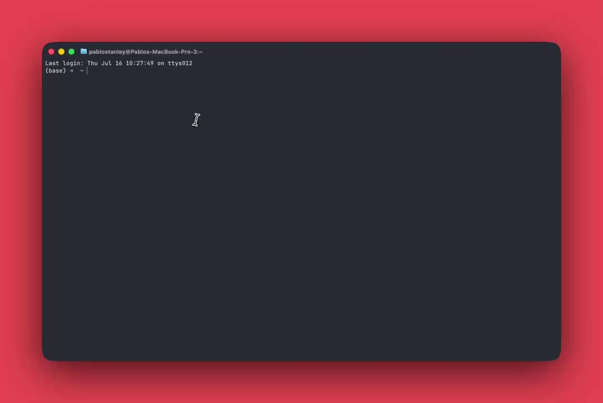

终端里下一个工具：Yoinks。

YouTube、X、TikTok，以及 1800+ 站点的视频，一条命令拉下来。
作者 @pablostanley，基于熟悉的下载生态，但包装成更好用的 terminal app。

经常存素材的人，会喜欢这种「少开浏览器」的路径。 

## 💬 Replies

### 1 @iluciddreaming (mousepotato) (Author)

*Sun Jul 19 03:58:07 +0000 2026*

[github.com/pablostanley/y…](https://github.com/pablostanley/yoinks)

### 2 @iluciddreaming (mousepotato) (Author)

*Sun Jul 19 08:40:16 +0000 2026*

@pablostanley 更多 AI 工具 + 一人公司实战干货 👉[t.me/tudouge\_ai\_not…](https://t.me/tudouge_ai_notes)k

### 3 @mrx819336343086 (Xander)

*Mon Jul 20 16:01:44 +0000 2026*

@iluciddreaming @pablostanley 有点像opencode的ui

### 4 @aiseomastery (AI Mastery Guide)

*Mon Jul 20 00:55:14 +0000 2026*

@iluciddreaming @pablostanley Nice to see a cleaner terminal-first UI for this kind of tool

### 5 @zou_chris (Chris Zou)

*Mon Jul 20 04:50:03 +0000 2026*

@iluciddreaming @pablostanley 没有看到意义在哪，这个是基于yt-dlp的，你直接把链接丢给ai agent，让他下载，ai会自己调用yt-dlp，你想要什么格式ai都会自己拼接各种参数，为什么还要包一层yoinks？还有自己选择用方向键选择格式？

