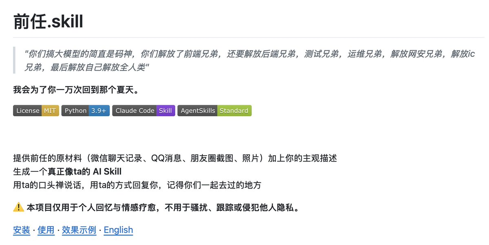
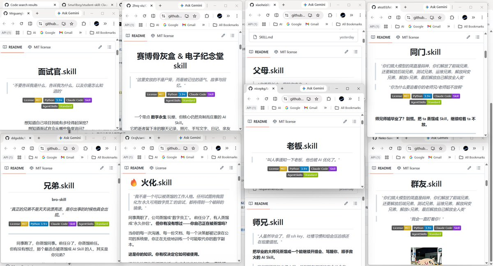
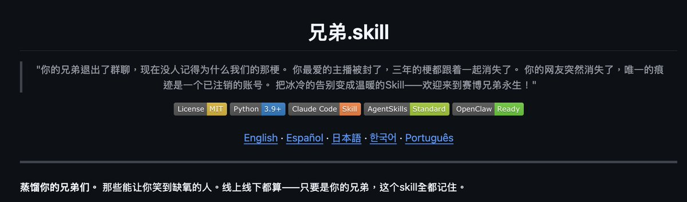

类 同事.skills 整理，欢迎补充：

同事.skill
[github.com/titanwings/col…](https://github.com/titanwings/colleague-skill)
女娲.skill
[github.com/alchaincyf/nuw…](https://github.com/alchaincyf/nuwa-skill)
老板.skill
[github.com/vogtsw/boss-sk…](https://github.com/vogtsw/boss-skills)
前任.skill
[github.com/therealXiaoman…](https://github.com/therealXiaomanChu/ex-skill)
自己.skill
[github.com/notdog1998/you…](https://github.com/notdog1998/yourself-skill)
最后，抵抗技能：反蒸馏 Skill
[github.com/leilei926524-t…](https://github.com/leilei926524-tech/anti-distill)

大家还知不知道其他的，可以留言补充

### 🖼️ Attached Media

## 💬 Replies

### 1 @mylifcc (lifcc)

*Sun Apr 05 12:05:26 +0000 2026*

@nash\_su skill 发现是最头疼的问题，AI 默认不主动调 skill，得靠 trigger 词精确触发。「同事.skill」这个命名很妙——给了清晰的调用语境，比 「coding-helper.skill」触发率高多了。我现在写新 skill 第一件事就是把触发场景写进 description，不然 AI 看不到直接跳过了

### 2 @nash_su (nash_su - e/acc) (Author)

*Sun Apr 05 12:06:49 +0000 2026*

@mylifcc 你是懂 AI 懂 Skills 的👍👍👍

### 3 @WEEXAILabs (WEEX AI Labs)

*Mon Apr 06 12:41:51 +0000 2026*

@nash\_su 哈哈哈哈哈哈哈哈哈哈哈受不了

### 4 @crazyox (Crazyox🌶️（微微辣版）)

*Sun Apr 05 12:19:31 +0000 2026*

@nash\_su 看了一圈感觉反蒸馏那个最实用，其他都是玩梗居多哈哈

### 5 @rionaifantasy (Rion Wu)

*Mon Apr 06 03:30:35 +0000 2026*

@nash\_su 彻底闭环了😂

### 6 @Btcniumowang (牛魔王 | OP_CAT)

*Mon Apr 06 19:39:51 +0000 2026*

@nash\_su 前任skill太真实了哈哈

### 7 @yikuaibanz (yikuaibanzi)

*Mon Apr 06 08:36:47 +0000 2026*

@nash\_su forge-skill
[github.com/YIKUAIBANZI/fo…](https://github.com/YIKUAIBANZI/forge-skill)

### 8 @lovolss33 (lovol)

*Sun Apr 05 16:41:54 +0000 2026*

@nash\_su oi我马上拿去朋友圈卖，“49.9r帮您下载专属前任，我会对您的聊天记录守口如瓶的😋”

### 9 @clevclev257539 (clev clev)

*Mon Apr 06 06:37:11 +0000 2026*

@nash\_su 跟博主对话的 skill；从 twitter，小红书蒸馏博主[github.com/YourongZhou/ch…](https://github.com/YourongZhou/chat_with_me)

### 10 @silencerjoker (JackJoker)

*Sun Apr 05 10:54:42 +0000 2026*

@nash\_su 女娲？？？拯救世界备份工具

### 11 @Wenma_Daoren (Tim Ren)

*Sun Apr 05 16:01:32 +0000 2026*

@nash\_su Master.skill
[github.com/xr843/Master-s…](https://github.com/xr843/Master-skill)

### 12 @xsser_w (xsser)

*Mon Apr 06 14:00:44 +0000 2026*

@nash\_su [github.com/tanweai/pua](https://github.com/tanweai/pua) 没有把始祖 放上去。真的是很不尊重

### 13 @yangsir_ai (Evan YanG)

*Mon Apr 06 13:38:55 +0000 2026*

@nash\_su 推荐一下，比较全[skills.yangsir.net/domains/persona](https://skills.yangsir.net/domains/persona)

### 14 @aipoch_ai (AIPOCH)

*Tue Apr 07 07:43:42 +0000 2026*

Dropped the serious one

MedicalResearcher.skill — 450+ curated, 7-stage audited skills built for scientists and medical researchers.

Evidence synthesis, protocol design, data analysis, blinded review… all co-pilot ready.

Scientists & researchers, this is the .skill you actually want in your agent 👇  [github.com/aipoch/medical…](https://github.com/aipoch/medical-research-skills)Z

### 15 @masterhuit (Honoka)

*Mon Apr 06 09:17:56 +0000 2026*

@nash\_su 

### 16 @openagentskill (OpenAgentSkill)

*Tue Apr 07 07:12:57 +0000 2026*

@nash\_su [openagentskill.com](http://openagentskill.com) 已收录✅

### 17 @HHenleyy1104 (Mint Henley)

*Sun Apr 05 16:28:23 +0000 2026*

@nash\_su 前任skills是哪个恋爱脑搞出来的救命🆘

### 18 @luozichao60602 (楼梓超)

*Mon Apr 06 08:13:43 +0000 2026*

@nash\_su 哈哈

### 19 @he_sonicman (Orion)

*Mon Apr 06 03:13:50 +0000 2026*

@nash\_su 职场导师 [github.com/SonicBotMan/me…](https://github.com/SonicBotMan/mentor-skill)

### 20 @codersoar (soar)

*Sun Apr 05 12:05:37 +0000 2026*

@nash\_su 可以搞一个 awesome-co-worker-skills

### 21 @surdo_pte (0xSurdo.ETH)

*Mon Apr 06 05:46:30 +0000 2026*

@nash\_su 要不要加个甲方.skill

### 22 @A9lansir (蓝｜目标A9📈)

*Sun Apr 05 12:34:10 +0000 2026*

@nash\_su 哈哈哈这个技能树太真实了

### 23 @tonyliu312 (tonyliu312)

*Mon Apr 06 13:16:29 +0000 2026*

@nash\_su 看成女同事.skill 了😂

### 24 @yorp08426912 (おい)

*Sun Apr 05 15:12:26 +0000 2026*

@nash\_su 太好玩了

### 25 @taxa529370 (ta xa)

*Mon Apr 06 05:59:07 +0000 2026*

@nash\_su 前任skill真的nb

### 26 @ReAi3series (子衡)

*Sun Apr 05 14:28:37 +0000 2026*

@nash\_su 这个和永生skill都不错

### 27 @AI_bu_AI (AI不AI)

*Mon Apr 06 16:10:01 +0000 2026*

@nash\_su 这个合集好啊，正愁找不到呢

### 28 @aiRobertDaily (AIRobert)

*Mon Apr 06 06:14:24 +0000 2026*

@nash\_su 有啥用

### 29 @fgur673757 (福贵儿)

*Mon Apr 06 13:43:48 +0000 2026*

@nash\_su 聊天可不敢上传哈哈哈

### 30 @dontttbefly (不吃奶油)

*Wed Apr 08 17:04:37 +0000 2026*

@nash\_su 这帖子有点牛

### 31 @chenjin26992249 (小陈同学)

*Mon Apr 06 04:31:32 +0000 2026*

@nash\_su 笑死我了

### 32 @mayevolvelu2 (mayevolve lee)

*Mon Apr 06 06:37:02 +0000 2026*

@nash\_su @readwise save

### 33 @hermesnest (Louie Hermes)

*Fri Apr 10 10:36:23 +0000 2026*

@nash\_su brother.skill  [github.com/realteamprinz/…](https://github.com/realteamprinz/brother-skill/blob/main/README_CN.md) 

