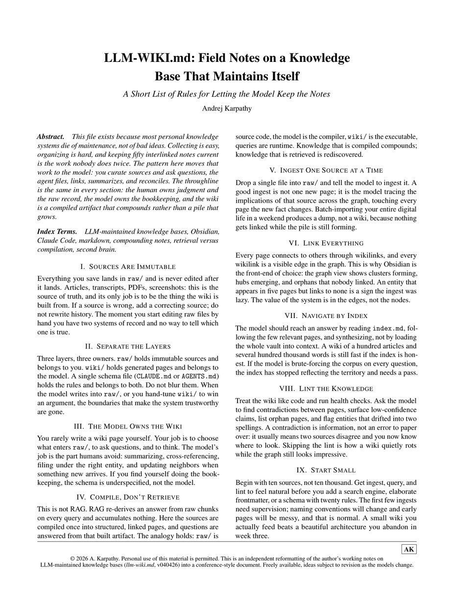
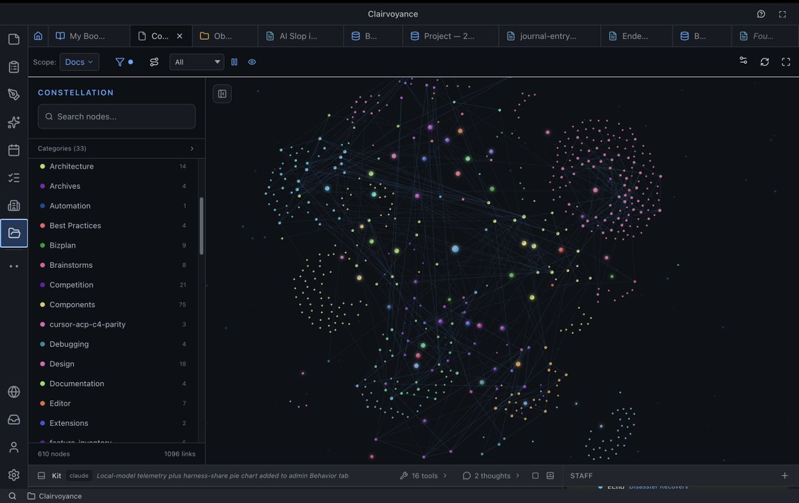

Andrej Karpathy: 

"The value of the system is in the edges, not the nodes."

In a short field note, he lays out 9 rules for a knowledge base that maintains itself. Claude keeps the notes. 

Obsidian shows the graph.

3 layers, 3 owners. raw belongs to you and never gets edited. wiki belongs to the model. 1 schema file holds the rules for both.

This isn't RAG. RAG re-derives the answer every query and keeps nothing. Here your sources compile once into linked pages and compound.

You feed 1 source at a time. The model files it, links it, updates every neighbor it touches.

Start with 10 sources, not 10,000.

More useful than a $500 PKM course. Save this.

Claude + Obsidian stops being a folder. It becomes a second brain.

### 🖼️ Attached Media

## 💬 Replies

### 1 @Nekt_0 (Nekt0)

*Sat Jun 27 01:44:05 +0000 2026*

@0xObssnnn there's real value here

### 2 @0xObssnnn (obssnnn) (Author)

*Sat Jun 27 01:48:35 +0000 2026*

@Nekt\_0 I hope this helps you

### 3 @draginol (Brad Wardell)

*Sun Jun 28 16:59:47 +0000 2026*

@0xObssnnn This is intrinsically part of @AiClairvoyance .  Which was built around this idea from the start.  No special setup required because it builds this on its own for the user. 

### 4 @HarryTandy (Harry Tandy)

*Sat Jun 27 09:20:50 +0000 2026*

@0xObssnnn building a second brain because my first is tired

### 5 @Dipanshu_AI (Dipanshu Kushwaha)

*Sat Jun 27 17:43:13 +0000 2026*

@0xObssnnn This is a pretty neat way to think about building and organizing knowledge. I like the idea of focusing on the connections.

### 6 @FarhadNawab (Farhad Nawab)

*Sat Jun 27 21:45:24 +0000 2026*

the edges thing is the part most people skip

they dump sources in and wonder why nothing connects. the graph looks impressive and does nothing because nothing was ever designed to link, just stored

one schema file controlling both layers is the move though. that part is underrated

### 7 @laura_bh4c03l (Laura)

*Sun Jun 28 00:49:34 +0000 2026*

@0xObssnnn Edges over nodes hits hard! This Claude wiki + raw notes + Obsidian graph setup for a compounding second brain is genius. Saving this.

### 8 @aiseomastery (AI Mastery Guide)

*Sat Jun 27 05:19:09 +0000 2026*

@0xObssnnn "the value is in the edges, not the nodes" is such a clean way to put it

### 9 @juancandela (𝙹𝚞𝚊𝚗 𝙲𝚊𝚗𝚍𝚎𝚕𝚊)

*Sat Jun 27 18:26:13 +0000 2026*

@0xObssnnn As Hegel would put it ;)

### 10 @thebutlerbrain (ButlerBrain)

*Sun Jun 28 03:06:28 +0000 2026*

@0xObssnnn ButlerBrain has the semantic layer + native Obsidian sync and soon will have the LLMWiki style layer.  Why not have both?

### 11 @sans_luv (Santhosh)

*Tue Jul 14 13:19:51 +0000 2026*

@0xObssnnn Exactly the right mental model — value compounds at the edges (links), not the nodes. For anyone starting an empty vault, this walkthrough shows the foundation those setups build on (vault → linking → graph view → AI with OpenAI/Ollama): [youtu.be/BensSFtrhrA](https://youtu.be/BensSFtrhrA)

### 12 @Laughter_lift (Laughter_lift)

*Sat Jun 27 15:03:46 +0000 2026*

@0xObssnnn .

